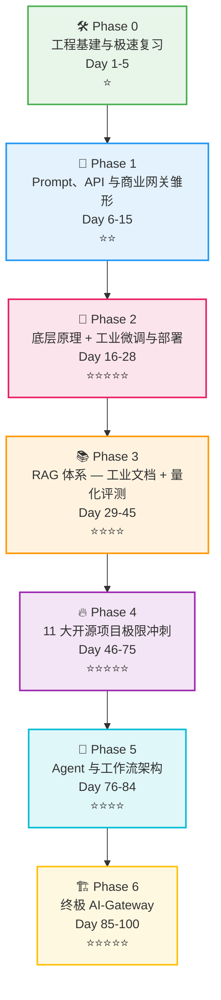
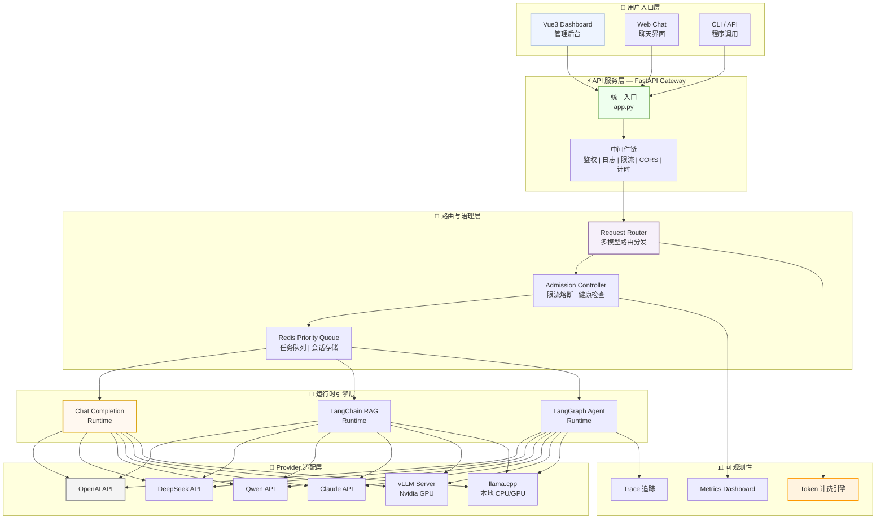

# 🚀 100-Day LLM Full-Stack Dev Roadmap

<div align="center">

**从底层原理手撕到企业级 AI-Gateway —— 面向中厂面试的大模型全栈工程路线**

[](.)
[](.)
[](.)
[](.)
[](.)
[](.)
[](./LICENSE)

</div>

---

> 🎯 **不只是调用 API，而是从零手搓一个企业级 AI-Gateway。**
>
> 这是一条面向 **想进中小厂 AI 大模型应用开发面试者** 的 100 天学习路线——从 Python/Prompt/API 入门，到 RAG、Agent、LLaMA-Factory/vLLM 工业微调部署，最终自研多模型容灾 AI-Gateway。

---

## 🧭 为什么选择这个路线？

<div align="center">

| 🔬 **拒绝无脑调包** | 🏭 **破除本地环境局限** |
|:---|:---|
| 深入 Transformer/Attention<br>KV Cache/RoPE/MoE/量化<br>**PyTorch 手写核心组件** | macOS + **Windows + Linux**<br>Nvidia GPU + CUDA 全平台<br>**LLaMA-Factory 工业微调 + vLLM 生产推理** |

| 💰 **API 商业化应用** | 📊 **效果量化评估** |
|:---|:---|
| OpenAI/DeepSeek/Qwen/Claude<br>**多厂商容灾路由 + 统一鉴权**<br>**Token 计费管控 + 预算预警** | RAGAS/TruLens 量化评测<br>**A/B 测试管道 + 改进闭环**<br>**用数据说话，面试不讲虚的** |

</div>

<div align="center">

| 🚀 **11 大开源项目冲刺** | 🏆 **企业级大收官** |
|:---|:---|
| MLX LM / llama.cpp / vLLM<br>LLaMA-Factory / Diffusers / SAM 2<br>Qwen-VL / LangGraph / LlamaIndex<br>GraphRAG / SWE-agent | 多模型统一路由 + 容灾降级<br>Redis 限流 + 熔断 + Token 计费<br>**监控 Dashboard + Docker 一键部署** |

</div>

---

## 👥 适合人群

- ✅ 有 Python 基础、想入门/转行大模型应用开发的程序员
- ✅ **目标中小厂 AI 大模型应用开发岗**的面试准备者
- ✅ 不想只停留在"调用 API"阶段，**想理解底层原理**的学习者
- ✅ 想做出一个**能写进简历和作品集**的完整 AI 工程项目

---

## 🗺️ 100 天路线总览



> 🟢 **核心叙事逻辑**：从底层手撕 → 工业微调部署 → 复杂文档 RAG → 量化评测 → Agent 编排 → 企业网关。**每一阶段都是上一阶段的工程化升级。**

---

| Phase | 🎯 主题 | ⏱️ 天数 | 📝 核心产出 | 📊 难度 |
|:-----:|:--------|:------:|:------------|:------:|
| **0** | 🛠️ 工程基建与极速复习 | Day 1-5 | Git/SSH/Docker/Redis/Python/PyTorch/跨平台环境 | ⭐ |
| **1** | 💬 Prompt、API 与商业网关雏形 | Day 6-15 | Prompt Cookbook → 多厂商 API 接入 → 统一客户端 → FastAPI 聊天服务 → 容灾路由 → Token 计费 | ⭐⭐ |
| **2** | 🧠 底层原理 + 工业微调与部署 | Day 16-28 | Transformer/Attention → RoPE/KV Cache → MoE/量化 → LoRA → **LLaMA-Factory** → **vLLM 生产部署** | ⭐⭐⭐⭐⭐ |
| **3** | 📚 RAG 体系 — 工业文档 + 量化评测 | Day 29-45 | **工业级文档解析(表格/OCR)** → Chunk 策略 → 混合检索 → LangGraph RAG → **RAGAS/TruLens 评测** → Web 应用 | ⭐⭐⭐⭐ |
| **4** | 🔥 11 大开源项目极限冲刺 | Day 46-75 | **LLaMA-Factory** / MLX LM / **vLLM** / llama.cpp / Diffusers / SAM 2 / Qwen-VL / LangGraph RAG / LlamaIndex / GraphRAG / SWE-agent | ⭐⭐⭐⭐⭐ |
| **5** | 🤖 Agent 与工作流架构 | Day 76-84 | ReAct → Tool Calling → LangGraph 多节点 Agent → HITL → Agent 安全评估 → 开源平台实战(Dify/RAGFlow/Coze) | ⭐⭐⭐⭐ |
| **6** | 🏗️ 终极 AI-Gateway | Day 85-100 | 多模型路由 → Redis 限流 → 熔断降级 → Token 计费 → RAG/Agent 接入 → Dashboard → Docker 一键部署 | ⭐⭐⭐⭐⭐ |

<details>
<summary><b>📖 展开查看每个 Phase 的详细节点（含 🆕 企业级新增模块）</b></summary>

<br>

### Phase 0 🛠️ 工程师基建与极速复习 (Day 1-5)

| 天数 | 主题 | 核心内容 |
|:---:|:-----|:--------|
| Day 1 | Python 高频特性复习 | 列表推导式/装饰器/上下文管理器/类型注解/async-await/异常处理/NumPy/Pandas/Matplotlib |
| Day 2 | ML/DL 基础复习 | AI/ML/DL/LLM 层级关系、梯度下降/Softmax/交叉熵/过拟合/归一化 |
| Day 3 | 神经网络架构地图 | MLP/CNN/RNN/LSTM/GRU/GNN — 各架构的归纳偏置与适用场景 |
| Day 4 | NLP/CV/LLM 全景 + 概念术语表 | NLP 演进脉络、CV 发展、ViT、**43 个 LLM 核心概念术语表** |
| Day 5 | 🆕 **跨平台工程环境搭建** | **macOS(Apple Silicon) / Windows(WSL2+CUDA) / Linux(Ubuntu+NVIDIA GPU)** 三套环境标准配置、Git/GitHub/SSH、Docker/Redis/PostgreSQL、Linux/Shell 基础、PyTorch 基础、项目脚手架、开发工具链 |

### Phase 1 💬 Prompt、API 与商业 LLM 网关雏形 (Day 6-15)

| 天数 | 主题 | 核心内容 |
|:---:|:-----|:--------|
| Day 6-7 | Prompt Cookbook | 25+ 可直接复制的 Prompt 模板（6 大类：文本处理/代码生成/分析推理/知识问答/结构化输出/角色扮演） |
| Day 7-8 | Prompt 进阶 | Zero/Few-shot/CoT/Tree-of-Thought、结构化输出约束（JSON Schema/Function Calling）、防幻觉模板、System Prompt 设计 |
| 🆕 Day 8-9 | **多厂商 API 深度接入** | **OpenAI / DeepSeek / Qwen(阿里云 DashScope) / Claude(Anthropic) / Gemini** — 各厂商 SDK 差异、鉴权方式对比(API Key / AK-SK / OAuth2)、**错误码映射表**、定价模型对比 |
| Day 9-10 | 统一 LLM 客户端 | 抽象基类 + 工厂模式、7 个 Provider 完整实现（含流式/非流式统一接口）、连接池与重试策略 |
| 🆕 Day 10-11 | **Token 计费管控** | 各厂商定价模型(输入/输出/缓存命中/图片/文件)、**实时计费引擎**、预算预警、用户配额管理、用量统计 Dashboard |
| 🆕 Day 11-12 | **多模型容灾路由** | 主模型不可用 → **自动 fallback 备选**、同厂商阶梯降级(gpt-4o→gpt-4o-mini)、**跨厂商 failover**(OpenAI→DeepSeek→本地模型)、健康检查与恢复机制 |
| 🆕 Day 12 | **统一鉴权网关** | 多租户 API Key 管理、`secrets.compare_digest` 防时序攻击、Key 轮换策略、**Rate Limit 按 Key 粒度** |
| Day 12-13 | FastAPI 聊天服务 | OpenAI 兼容 API 格式、SSE 流式输出、中间件栈(CORS/Request-ID/计时/日志/Limiter)、Pydantic 校验、完整 pytest 测试 |
| Day 14-15 | Web Chat Demo + 环境管理 | Vue3+TypeScript+SSE 前端（Markdown 渲染/代码高亮/多对话/持久化）、API Key 安全管理、LLM 调用测试指南 |

> 🎯 **Phase 1 核心产出**：一个能接入 **5+ 厂商、支持容灾切换、实时计费、统一鉴权** 的多模型 API 网关雏形

### Phase 2 🧠 大模型底层硬核拆解 + 工业级微调与部署 (Day 16-28)

| 天数 | 主题 | 核心内容 |
|:---:|:-----|:--------|
| Day 16 | Transformer 架构总览 | Decoder-only 完整数据流、**Shape 流动全景(7B 模型每层维度变化)**、Pre-LN vs Post-LN、Decoder-only vs Encoder-Decoder 选型 |
| Day 17 | Scaled Dot-Product Attention | QKᵀ/√dₖ 数学推导、为什么除以 √dₖ、Causal Mask、Softmax 饱和与梯度消失 |
| Day 18 | MHA / MQA / GQA | 三种注意力机制参数量对比、**KV Cache 带宽瓶颈分析**、为什么现代大模型转向 GQA |
| Day 19 | RoPE 旋转位置编码 | 复数空间旋转、相对位置内积、NTK-aware/YaRN **长上下文外推**技术 |
| Day 20 | KV Cache 与自回归生成 | Prefill/Decode 两阶段、**KV Cache 显存公式(精确到字节)**、OOM 排查与显存优化 |
| Day 21 | PagedAttention & Continuous Batching | vLLM 吞吐提升 3x 的秘密、静态 vs 动态 Batching、显存碎片化与分页解决方案 |
| Day 22 | MoE 混合专家模型 | Router/Top-K Expert/Shared Expert、负载均衡、**DeepSeekMoE 架构分析** |
| Day 23 | 量化技术详解 | GPTQ/AWQ/GGUF 原理对比、llama.cpp 量化实操、**量化级别决策树（4GB-24GB 显存）** |
| Day 24 | 手写 Multi-Head Attention | PyTorch 从零实现 MHA + GQA、与官方 `nn.MultiheadAttention` 精度对比(<1e-4) |
| Day 25 | LoRA/QLoRA 微调实战 | 低秩矩阵数学本质、完整训练循环(PEFT+Transformers Trainer)、超参数调优(r/alpha/target_modules)、merge/unmerge 策略 |
| 🆕 Day 26 | **LLaMA-Factory 工业级微调** | LLaMA-Factory 架构与设计理念、**Web UI 快速上手 + CLI 批量微调**、支持模型(Llama/Qwen/DeepSeek/Mistral)、LoRA vs Full Fine-tuning vs QLoRA **一键切换**、多轮对话数据格式化、微调后评估(Perplexity/BLEU/ROUGE/自建评测集) |
| 🆕 Day 27 | **vLLM 生产级推理部署** | **Nvidia GPU 环境完整部署**(Docker+vLLM vs 裸机安装)、关键参数调优(`max-model-len`/`gpu-memory-utilization`/`max-num-seqs`/`tensor-parallel-size`)、Prefix Caching、Multi-LoRA 动态切换、Speculative Decoding、**并发压测**(100/500/1000 并发下的 TTFT/TPOT/QPS) |
| 🆕 Day 28 | **工业方案三国杀** | **MLX LM(Apple Silicon) vs LLaMA-Factory(Nvidia 微调) vs vLLM(生产推理)** — 硬件/速度/成本/适用场景全维度对比矩阵 + SFT/RLHF/DPO/知识蒸馏 全景对比 |

> 🎯 **Phase 2 核心产出**：手写 Attention 通过官方验证 + LLaMA-Factory 完成一次完整微调 + vLLM 部署压测报告

### Phase 3 📚 RAG 检索增强体系 — 工业文档 + 量化评测 (Day 29-45)

| 天数 | 主题 | 核心内容 |
|:---:|:-----|:--------|
| Day 29-30 | 最简 RAG 实现 | 完整可运行：文档读取→Embedding→检索→**真实 LLM 调用**，5 步逐步拆解 |
| 🆕 Day 31-32 | **工业级文档解析深水区** | PDF 四大难题(双栏排版/扫描件无文字层/表格识别/页眉页脚)、**PyMuPDF + Camelot + Tesseract OCR** 组合方案、表格转 Markdown 保真策略、扫描件 OCR 管道(预处理→文字识别→后处理纠错)、Word/HTML/EPUB 全格式兼容 |
| Day 33-34 | Chunk 策略体系 | 固定大小/语义切分/递归切分/文档结构感知/**Small-to-Big 检索**/多粒度索引 |
| 🆕 Day 35 | **高级数据预处理管道** | 文档清洗(页眉页脚/乱码/空行)、**去重(MinHash/SimHash)**、低质量文档过滤、元数据提取与注入、多语言文档处理 |
| Day 36-37 | Embedding 与向量索引 | BGE/GTE/E5 模型选型、FAISS(FlatIP/IVFFlat/HNSW)+Chroma 进阶、**性能 benchmark**、增量更新 |
| Day 38-39 | 混合检索 | BM25 + 向量 + RRF/加权融合 + **Cross-Encoder Reranker** 精排、Query Rewrite、对比实验(纯向量 vs 纯BM25 vs 混合) |
| Day 40 | LangGraph RAG 状态机 | **8 节点完整实现**(分类→改写→检索→判断→重排→生成→验证→兜底)、条件边+循环路径、checkpoint 恢复 |
| 🆕 Day 41-42 | **RAG 量化评测体系** | **Ragas** 深入(Faithfulness/Answer Relevance/Context Precision/Context Recall)、**TruLens** 反馈函数(Groundedness/Relevance)、评测数据集构建(4 类问题+标注)、**A/B 测试管道**(chunk_size/embedding/retrieval 交叉对比)、评测雷达图可视化、**评测驱动的迭代闭环**(指标分析→定位瓶颈→改进→复评) |
| Day 43-44 | LlamaIndex 实战 | IngestionPipeline、QueryEngine、RouterQueryEngine、SubQuestionQueryEngine |
| Day 45 | RAG Web 应用 | FastAPI + Vue3 + Docker、文件上传→**异步索引**→流式问答→引用来源展示 |

> 🎯 **Phase 3 核心产出**：能处理复杂 PDF+表格的工业文档解析器 + RAGAS/TruLens 评测报告 + A/B 测试框架

### Phase 4 🔥 11 大开源项目极限冲刺 (Day 46-75)

| 天数 | 项目 | 核心产出 | 难度 |
|:---:|:-----|:--------|:---:|
| 🆕 Day 46-49 | **LLaMA-Factory 微调工厂** | 垂直领域模型微调(医疗/法律/代码三选一)，LoRA 适配器+评测报告 | ⭐⭐⭐ |
| Day 50-53 | MLX LM | Apple Silicon 本地推理+LoRA 微调+前端 Chat UI | ⭐⭐⭐ |
| 🆕 Day 54-56 | **vLLM 生产推理集群** | 多模型部署+Prefix Caching+Multi-LoRA+并发压测报告 | ⭐⭐⭐⭐ |
| Day 57-60 | llama.cpp | GGUF 量化+llama.cpp server+OpenAI 兼容 API+Gateway 封装 | ⭐⭐⭐ |
| Day 61-63 | Diffusers | Stable Diffusion/SDXL 图像生成 | ⭐⭐ |
| Day 64-66 | SAM 2 | 视觉分割 | ⭐⭐⭐ |
| Day 67-69 | Qwen-VL / LLaVA | 多模态理解 | ⭐⭐⭐ |
| Day 70-71 | LangGraph RAG | 企业级 RAG 状态机实战 | ⭐⭐⭐⭐ |
| Day 72-73 | LlamaIndex | 知识库框架 | ⭐⭐⭐ |
| Day 74 | GraphRAG | 图谱检索增强 | ⭐⭐⭐ |
| Day 75 | SWE-agent + 项目总结 | AI 代码修复 + 11 项目矩阵对比表 | ⭐⭐⭐ |

> 🎯 **Phase 4 核心产出**：11 个项目最小可运行 Demo + 对比评测矩阵表 + 项目总结报告

</details>

---

## 🎓 学完你可以得到什么？

<div align="center">

| 🧠 **大模型底层硬核能力** | 🔧 **工业级全栈工程能力** |
|:---|:---|
| 手写 Attention、精确计算 KV Cache 显存<br>懂量化(GPTQ/AWQ/GGUF)、懂 MoE 路由<br>面试能讲清楚 Transformer 的每一层 | Docker/Redis/PostgreSQL/Nginx<br>FastAPI/SSE/Pydantic 全链路<br>**跨平台(macOS+Windows+Linux)** 部署能力 |

| 🤖 **企业级微调与部署** | 📊 **量化评测体系** |
|:---|:---|
| **LLaMA-Factory 工业微调流水线**<br>**vLLM 生产推理集群**(Prefix Cache/Multi-LoRA)<br>MLX LM + llama.cpp 本地部署 | **RAGAS + TruLens** 自动化评测<br>A/B 测试管道 + 改进闭环<br>**用数据说话，面试不讲虚的** |

| 💰 **API 商业化能力** | 🎯 **面试差异化竞争力** |
|:---|:---|
| 5+ 厂商 API 深度接入<br>**Token 计费管控 + 预算预警**<br>多模型容灾路由 + 统一鉴权 | 不是"我会调 API"<br>而是"我手搓过 AI-Gateway"<br>能从底层原理解释为什么模型慢/为什么 OOM |

| 📝 **能写进简历的作品集** |
|:---|
| 11 个开源项目 + **1 个企业级 AI-Gateway**<br>完整的 GitHub 绿点墙<br>周记和踩坑记录随时可做面试素材 |

</div>

---

## 🎯 技能矩阵

| 🏷️ 技能域 | 🛠️ 具体能力 | 📍 阶段 |
|:----------|:-----------|:------:|
| **工程基建** | Git/GitHub · SSH · Linux/Shell · Conda/pip/uv · Docker/Compose · Nginx · **跨平台(Win/Mac/Linux+Nvidia GPU+CUDA)** · pyproject.toml · ruff | Phase 0, 6 |
| **后端与数据** | FastAPI · Pydantic · Redis · PostgreSQL · 向量数据库(FAISS/Chroma) · SSE 流式 · 任务队列 | Phase 1, 6 |
| **大模型使用** | Prompt Engineering(Zero/Few-shot/CoT/Tree-of-Thought) · **5+ 厂商 API 深度接入** · Token 计费 · Function Calling · 结构化输出 | Phase 1 |
| 🆕 **商业化网关** | **多厂商容灾路由 · Fallback 降级 · 统一鉴权 · Rate Limit · 预算预警 · 用量统计** | Phase 1, 6 |
| **底层原理** | Transformer · Attention(MHA/MQA/GQA) · RoPE · KV Cache · PagedAttention · MoE · FlashAttention | Phase 2 |
| 🆕 **工业微调** | LoRA/QLoRA · **LLaMA-Factory 微调流水线** · SFT · RLHF · DPO · 知识蒸馏 · PEFT | Phase 2 |
| 🆕 **推理部署** | **vLLM 生产集群** · llama.cpp · Ollama · MLX LM · GGUF 量化 · **Prefix Caching** · Multi-LoRA · Speculative Decoding · 并发压测 | Phase 2, 4 |
| 📚 **RAG 体系** | **工业文档解析(表格/OCR/扫描件)** · Chunk 策略(4种) · Embedding · 混合检索(BM25+Vector+Reranker) · LangGraph RAG · LlamaIndex · GraphRAG | Phase 3, 4 |
| 🆕 **RAG 评测** | **Ragas · TruLens** · A/B 测试管道 · 评测数据集构建 · 改进闭环 · 评测可视化 | Phase 3 |
| 🤖 **Agent** | ReAct · Tool Calling · LangGraph 状态机 · Human-in-the-loop · Agent 安全 · 多 Agent 协作 · Dify/RAGFlow/Coze | Phase 5 |
| 👁️ **多模态** | CLIP · Diffusers(SD/SDXL) · SAM 2 · Qwen-VL · LLaVA | Phase 4 |
| 🏗️ **企业级网关** | 统一模型路由 · Redis 限流 · 熔断降级 · Token 计费 · RAG/Agent 接入 · Dashboard · Docker Compose 一键部署 | Phase 6 |

---

## 🏗️ 终极项目：AI-Gateway 架构全景



> 🧠 **关键分层原则**：LangChain/LangGraph = 应用编排层，AI-Gateway = 模型服务治理层，vLLM/llama.cpp = 底层模型执行层。三层各司其职。

| # | ✨ 技术亮点 | 🏭 解决什么企业痛点 |
|:--:|:----------|:-------------------|
| 1 | 🔀 **多模型统一路由** | 一个 API 接入 5+ 厂商 + 本地模型，前端无感知切换 |
| 2 | 🛡️ **多模型容灾降级** | 主模型故障→自动 Fallback，**避免单点故障导致业务中断** |
| 3 | 💰 **Token 计费引擎** | 实时统计各模型用量与成本，**防止 API 费用黑洞** |
| 4 | 🔑 **多租户鉴权** | 按 API Key 粒度限流+计费，**SaaS 化运营基础** |
| 5 | ⚡ **Redis 滑动窗口限流** | 防止恶意调用 + 保护上游 API 额度 |
| 6 | 📊 **实时监控 Dashboard** | TTFT/TPOT/QPS/错误率 一目了然，**生产排障必备** |
| 7 | 🤖 **RAG/Agent 接入** | LangChain RAG + LangGraph Agent 通过 Gateway 统一治理 |
| 8 | 🐳 **Docker Compose 一键部署** | FastAPI + Redis + PostgreSQL + Nginx **全家桶** |

---

## 📂 仓库目录结构

```
llm-fullstack-dev-roadmap/              # 📦 仓库根目录
│
├── README.md                        # 项目首页
├── learning-journal.md              # 学习心得与踩坑汇总
├── LICENSE                          # MIT
├── .gitignore
├── requirements.txt                 # 基础依赖
│
├── docs/                            # 📚 通用文档
│   ├── 00_overview.md               #   项目总览与技能矩阵
│   ├── 01_environment_setup.md      #   三平台环境搭建（macOS/Win/Linux）
│   ├── 01_original_plan.md          #   原始计划
│   ├── 05_troubleshooting.md        #   常见问题与排障
│   ├── PORTFOLIO_GUIDE.md           #   作品集面试讲法指南
│   └── START_HERE.md                #   快速开始路径选择
│
├── phase0_foundation/               # 🛠️ Phase 0 — 基建与复习 (Day 1-5)
│   ├── 01_python_review.md          #   Python 高频特性 + NumPy/Pandas/Matplotlib
│   ├── 02_ml_dl_review.ipynb        #   ML/DL 基础复习
│   ├── 03_neural_network_map.ipynb  #   神经网络架构地图
│   ├── 04_nlp_cv_llm_overview.ipynb #   NLP/CV/LLM 全景总览
│   ├── 05_llm_concepts_glossary.md  #   43 个 LLM 核心概念术语表
│   ├── 06_git_github.md             #   Git 工作流 + SSH + Conventional Commits
│   ├── 07_docker_basics.md          #   Docker + Redis + PostgreSQL 快速上手
│   ├── 08_linux_shell_basics.md     #   Linux/Shell 命令行基础
│   ├── 09_pytorch_basics.ipynb      #   PyTorch 基础实战
│   ├── 10_project_scaffolding.md    #   项目工程化脚手架
│   ├── 11_developer_tools.md        #   开发工具链配置
│   ├── learning-issues.md           #   踩坑记录
│   └── README.md                    #   学习导航
│
├── phase1_prompt_api/               # 💬 Phase 1 — Prompt + API (Day 6-15)
│   ├── 01_prompt_cookbook.md        #   25+ Prompt 模板库（6 大类 26 模板）
│   ├── 02_llm_client.md             #   统一 LLM 客户端（7 个 Provider）
│   ├── 03_fastapi_chat.md           #   FastAPI 聊天服务（含测试）
│   ├── 04_web_chat_demo.md          #   Vue3 + TypeScript SSE 流式前端
│   ├── 05_prompt_advanced.md        #   Prompt 进阶（CoT/Reflexion/结构化/防幻觉）
│   ├── 06_doc_generation_prompts.md #   文档生成提示词
│   ├── 07_env_secrets_mgmt.md       #   API Key 管理与安全
│   ├── 08_testing_guide.md          #   LLM 调用测试指南
│   ├── learning-issues.md
│   ├── README.md
│   │
│   └── llm_chat_service/            # FastAPI 完整后端项目
│       ├── pyproject.toml           #   项目依赖
│       ├── Makefile                 #   一键命令
│       ├── .env.example
│       ├── app/
│       │   ├── main.py              #   FastAPI 入口
│       │   ├── config.py            #   配置加载
│       │   ├── auth.py              #   API Key 鉴权
│       │   ├── dependencies.py      #   依赖注入
│       │   ├── errors.py            #   统一错误处理
│       │   ├── middleware/          #   中间件
│       │   ├── routes/             #   Chat + Health + Models 路由
│       │   └── schemas/            #   Pydantic 请求/响应 Schema
│       └── tests/                   #   pytest 单元测试
│           ├── conftest.py
│           └── test_chat.py
│
├── phase2_llm_internals/            # 🧠 Phase 2 — LLM 底层 + 工业微调 (Day 16-28)
│   ├── 00_transformer.md            #   Transformer 架构 + Shape 流动 + 数学公式
│   ├── 01_attention.ipynb           #   Scaled Dot-Product Attention
│   ├── 02_mha_mqa_gqa.ipynb         #   MHA / MQA / GQA
│   ├── 03_rope.ipynb                #   RoPE 旋转位置编码
│   ├── 04_kv_cache.ipynb            #   KV Cache 与自回归生成
│   ├── 05_paged_attention.ipynb     #   PagedAttention
│   ├── 06_moe.ipynb                 #   MoE 混合专家模型
│   ├── 07_lora_rag_agent.ipynb      #   LoRA/QLoRA 基础
│   ├── 08_quantization.md           #   量化技术详解（GPTQ/AWQ/GGUF）
│   ├── 09_attention_from_scratch.md #   手写 MHA + GQA（PyTorch）
│   ├── 10_lora_demo.md              #   LoRA 微调实战（完整训练循环）
│   ├── 11_fine-tuning_techniques.md #   SFT/RLHF/DPO/蒸馏全景
│   ├── 12_deployment_vllm.md        #   vLLM 推理引擎与部署
│   ├── _00_7day_deep_dive_ref.md    #   面试拷问/排障场景/工程映射参考
│   ├── learning-issues.md
│   └── README.md
│
├── phase3_rag/                      # 📚 Phase 3 — RAG 体系 (Day 29-45)
│   ├── 01_naive_rag.md              #   最简 RAG 完整实现
│   ├── 02_document_loader.md        #   工业文档解析器（5格式+表格+OCR）
│   ├── 03_vector_index.md           #   向量索引（FAISS/Chroma+benchmark）
│   ├── 04_hybrid_search.md          #   混合检索（BM25+Vector+RRF+Reranker）
│   ├── 05_langgraph_rag.md          #   LangGraph RAG 状态机（8节点）
│   ├── 06_rag_evaluation.md         #   RAGAS/TruLens 量化评测
│   ├── 07_rag_web_app.md            #   RAG Web 应用（FastAPI+Vue3+Docker）
│   ├── 08_advanced_chunking.md      #   高级分块策略 + 参数计算实战
│   ├── 09_llamaindex_basics.md      #   LlamaIndex 入门
│   ├── learning-issues.md
│   └── README.md
│
├── phase4_projects/                 # 🔥 Phase 4 — 11 大项目 (Day 46-75)
│   ├── 01_mlx_lm/                   #   MLX LM — Apple Silicon 推理与微调
│   ├── 02_llama_cpp/                #   llama.cpp — GGUF Serving+Gateway
│   ├── 03_diffusers.md              #   Diffusers — 图像生成
│   ├── 04_sam2.md                   #   SAM 2 — 视觉分割
│   ├── 05_qwen_vl_llava.md          #   Qwen-VL/LLaVA — 多模态理解
│   ├── 06_langgraph_rag.md          #   LangGraph RAG — 企业级实战
│   ├── 07_llamaindex.md             #   LlamaIndex — 知识库框架
│   ├── 09_swe-agent-lab/            #   SWE-agent — AI 代码修复实战 lab
│   ├── PROJECTS_SUMMARY.md          #   项目矩阵总结
│   ├── learning-issues.md
│   └── README.md
│
├── phase5_agent/                    # 🤖 Phase 5 — Agent 架构 (Day 76-84)
│   ├── 01_react_agent.md            #   ReAct Agent 完整实现
│   ├── 02_tool_calling.md           #   工具定义/注册/并行调用
│   ├── 03_langgraph_agent.md        #   LangGraph 多节点 Agent + HITL
│   ├── 04_agent_api.md              #   Agent 服务化 API + 任务队列
│   ├── 05_open_source_agent_platforms.md # Dify/RAGFlow/Coze 实战
│   ├── 06_multi_agent_patterns.md   #   多 Agent 协作 + CrewAI
│   ├── 07_agent_evaluation.md       #   Agent 评估体系 + 可观测性
│   ├── 08_agent_security.md         #   Agent 安全（注入攻防）
│   ├── demo_README.md               #   Agent 演示说明
│   ├── learning-issues.md
│   └── README.md
│
├── final-ai-gateway/                # 🏗️ Phase 6 — AI-Gateway (Day 85-100)
│   ├── README.md                    #   独立 README 作品集
│   ├── design_doc.md                #   完整架构设计文档（23KB）
│   ├── INTERVIEW-QUESTIONS.md       #   Gateway 面试高频题
│   ├── PROGRESS.md                  #   迭代进度表
│   ├── TROUBLESHOOTING-*.md         #   5 篇排障指南
│   ├── Makefile                     #   一键命令
│   ├── .env.example                 #   环境变量模板
│   │
│   ├── backend/                     # 🐍 FastAPI 后端（DDD 四层架构）
│   │   ├── pyproject.toml
│   │   ├── scripts/                 #   工具脚本
│   │   ├── tests/
│   │   │   ├── unit/               #   单元测试（Mock 外部依赖）
│   │   │   │   ├── test_application.py
│   │   │   │   └── test_rag_agent.py
│   │   │   ├── integration/         #   集成测试（真实 Redis）
│   │   │   │   └── test_infrastructure.py
│   │   │   └── e2e/                 #   端到端测试
│   │   │
│   │   └── app/                     #   主应用
│   │       ├── main.py              #   FastAPI 入口 + lifespan 生命周期
│   │       ├── config.py            #   配置加载（YAML + 环境变量覆盖）
│   │       │
│   │       ├── domain/              #   🧠 领域层（零外部依赖）
│   │       │   ├── entities/        #     10 个领域实体
│   │       │   ├── value_objects/   #     9 个值对象
│   │       │   ├── services/        #     12 个领域服务
│   │       │   ├── policies/        #     6 条领域策略
│   │       │   └── ports/           #     12 个端口接口
│   │       │
│   │       ├── application/         #   🎬 应用层
│   │       │   ├── dto/             #     7 个数据传输对象
│   │       │   ├── use_cases/       #     5 个用例
│   │       │   └── orchestrators/   #     4 个编排器
│   │       │
│   │       ├── infrastructure/      #   🔌 基础设施层
│   │       │   ├── redis/           #     8 个 Redis 仓储
│   │       │   ├── llm_clients/     #     4 个 LLM 客户端
│   │       │   ├── retrieval/       #     6 个检索模块
│   │       │   ├── langchain_runtime/ #   LangChain RAG 运行时
│   │       │   ├── langgraph_runtime/ #  LangGraph Agent 运行时
│   │       │   ├── benchmark/       #     压测引擎
│   │       │   ├── sse/             #     SSE 事件存储
│   │       │   ├── tokenizer/       #     Tokenizer 封装
│   │       │   ├── prompt_cache/    #     Prompt Cache
│   │       │   └── probes/          #     系统探针
│   │       │
│   │       └── interface/           #   🌐 接口层
│   │           ├── http/            #     8 个路由模块
│   │           ├── middlewares/     #     Request-ID + ErrorBoundary
│   │           ├── sse/             #     SSE 端点
│   │           └── websocket/       #     WebSocket 端点
│   │
│   ├── frontend/                    # 🎨 Vue3 + Vite Dashboard
│   │   ├── src/
│   │   │   ├── App.vue
│   │   │   ├── main.js
│   │   │   ├── api/index.js         #   API 客户端
│   │   │   ├── router/index.js       #   路由配置
│   │   │   ├── stores/metrics.js    #   Pinia 状态管理
│   │   │   └── components/
│   │   │       ├── OverviewPanel.vue #   QPS/TTFT/错误率大屏
│   │   │       ├── ChatMonitor.vue  #   聊天请求追踪
│   │   │       ├── RagMonitor.vue   #   RAG 检索质量监控
│   │   │       ├── AgentMonitor.vue #   Agent 运行追踪
│   │   │       ├── BenchmarkPanel.vue # 并发压测面板
│   │   │       └── TraceDetail.vue  #   全链路 Trace 详情
│   │   ├── index.html
│   │   ├── package.json
│   │   └── vite.config.js
│   │
│   ├── configs/                     # ⚙️ 配置中心
│   │   ├── app.yaml                 #   应用配置（Redis/限流/日志）
│   │   ├── model.yaml               #   模型定义与路由策略
│   │   ├── logging.yaml             #   日志级别与输出
│   │   └── rag.yaml                 #   RAG 检索参数
│   │
│   ├── docker/                      # 🐳 Docker 部署
│   │   ├── docker-compose.yml       #   全家桶编排
│   │   ├── Dockerfile.gateway       #   FastAPI 镜像
│   │   ├── nginx.conf               #   反向代理 + SSL
│   │   └── redis.conf               #   Redis 配置
│   │
│   ├── scripts/                     # 📜 工具脚本
│   ├── docs/                        # 📖 架构设计文档
│   │   ├── router_architecture.md   #   路由引擎设计
│   │   ├── rate_limiter_design.md   #   限流器设计
│   │   └── circuit_breaker_design.md #  熔断器设计
│   │
│   └── .claude/                     #   Claude Code 配置
│
└── weekly_logs/                     # 📝 每周学习周记
    └── week01.md
```

> 📌 文件统计（不含 `.git` / `node_modules` / 缓存目录）：**~180+ 源文件**，涵盖 Python、Vue、YAML、Docker、Markdown。Phase 6 单后端即有 **80+ Python 源文件**（DDD 四层 50+ 模块 + 边界层 20+ 路由/中间件）。

> 💡 `.ipynb` 适合边看边跑代码，`.md` 适合纯文本/公式/理论。🆕 标注为新增或大幅扩写的企业级模块。

---

## 🆕 企业级新增模块速查

| 🆕 新增模块 | 📍 Phase | 🏭 解决什么企业真实痛点 |
|:-----------|:-------:|:-----------------------|
| 跨平台环境搭建 (Win/Linux+Nvidia GPU) | Phase 0 | 只写 Mac → 企业里 90% 是 Linux + Nvidia GPU |
| 多厂商 API 深度接入 + 容灾路由 | Phase 1 | 单一 API 不可用 → **业务中断**，多厂商+容灾=高可用 |
| Token 计费管控 + 预算预警 | Phase 1 | 无计费 → **API 费用黑洞**，精细化成本控制是 SaaS 基础 |
| 统一鉴权 + 多租户 API Key 管理 | Phase 1 | 无鉴权 → 安全风险，多租户隔离是商业化的前提 |
| LLaMA-Factory 工业微调 | Phase 2 | 手写 LoRA → 不适合快速迭代，**LLaMA-Factory 是工业标配** |
| vLLM 生产级推理集群 | Phase 2 | Ollama 只能单人用，**vLLM 支持高并发 + Prefix Cache + Multi-LoRA** |
| 工业级文档解析(表格+OCR+扫描件) | Phase 3 | PyMuPDF 只能读文字层，**表格/扫描件/OCR 才是企业真实文档** |
| 高级数据预处理管道(MinHash去重) | Phase 3 | 低质量数据→检索效果差，**数据清洗决定 RAG 效果上限** |
| RAGAS/TruLens 量化评测体系 | Phase 3 | 没有量化指标→**不知道改完变好了还是变差了**，面试讲不出效果 |

---

## 🚀 快速开始

```bash
# 1. 克隆仓库
git clone https://github.com/gyc-chenxi/llm-fullstack-dev-roadmap.git
cd llm-fullstack-dev-roadmap

# 2. 创建虚拟环境
conda create -n llm-dev python=3.11
conda activate llm-dev

# 3. 安装核心依赖（按需选择）
pip install -r requirements.txt              # 核心依赖，所有平台
# 有 Nvidia GPU：额外装 vllm、bitsandbytes
# 有 Apple Silicon：额外装 mlx、mlx-lm

# 4. 从 Phase 0 开始，按天推进
# 每个 Phase 目录下有独立的学习内容、代码和踩坑记录
```

> 🔗 **仓库地址**：[https://github.com/gyc-chenxi/llm-fullstack-dev-roadmap](https://github.com/gyc-chenxi/llm-fullstack-dev-roadmap)
>
> 📖 **不知道怎么开始？** 看 [START_HERE.md](./docs/START_HERE.md) — 根据你的时间选择路径

---

## 📖 学习建议

| # | 建议 | 说明 |
|:--:|:-----|:----|
| 1 | **🔢 按顺序推进** | Phase 0→6 严格递进，不要跳 Phase。前面跳了后面一定卡 |
| 2 | **📝 每天记录踩坑** | 每个 Phase 目录下有 `learning-issues.md`，这是面试时最好的素材 |
| 3 | **🏃 先跑通再深入** | Phase 4 的项目只要求最小可运行 Demo，不要追求完美 |
| 4 | **✍️ 写周记** | `weekly_logs/` 下每周一篇，面试前翻一遍 |
| 5 | **🏗️ Phase 6 是核心** | 前面所有技能最终都汇聚到 AI-Gateway，这是简历上最有分量的项目 |
| 6 | 🆕 **不要只在 Mac 上跑** | 有条件的话在 Linux+Nvidia GPU 上跑一遍 vLLM 和 LLaMA-Factory |

---

## 💻 环境要求

| 组件 | 要求 | 说明 |
|:------|:------|:-----|
| 💻 硬件 | 🆕 **macOS(Apple Silicon) / Windows(WSL2) / Linux(Ubuntu)** | M 系列体验最佳（统一内存），**Nvidia GPU 跑 vLLM 和 LLaMA-Factory** |
| 🐍 Python | 3.10 / 3.11 | 推荐 conda 管理环境 |
| 🆕 CUDA | 12.1+ (Nvidia GPU) | vLLM + LLaMA-Factory 需要 |
| 📦 Node.js | 18+ | 前端 Demo 需要 |
| 🐳 Docker | 最新版 | Phase 0 和 Phase 6 需要 |

---

## 📚 学习资源推荐

### 🎥 免费在线资源

| 资源 | 说明 |
|:------|:-----|
| **李宏毅 2024 生成式 AI** | B 站有搬运，讲解接地气，入门首选 |
| **Hugging Face Daily Papers** | 每天扫一眼标题，了解前沿动态 |
| **Datawhale 开源教程** | 国内最大 AI 开源学习社区，有组队学习 |
| **Jay Alammar 的 Illustrated 系列** | Transformer/Stable Diffusion 图解，有中文版 |
| **Andrej Karpathy 视频** | "Let's build GPT from scratch"，必看 |

### 📖 参考书（当字典查，不必通读）

| 书 | 说明 |
|:---|:-----|
| 《Natural Language Processing with Transformers》 | Hugging Face 官方出品，工程向 |
| 《大模型应用开发极简入门》 | 中文，贴合国内场景 |
| 《Attention is All You Need》原论文 | 经典中的经典，建议反复读 |

### 🛠️ 开发工具链

| 工具 | 用途 | 优先级 |
|:------|:-----|:------:|
| **LangChain** | LLM 编排核心：Prompt/模型调用/数据加载 | ⭐⭐⭐⭐⭐ |
| **LangGraph** | Agent 状态机编排 | ⭐⭐⭐⭐ |
| **FastAPI** | 轻量后端框架，API 封装 | ⭐⭐⭐⭐⭐ |
| 🆕 **LLaMA-Factory** | 工业级微调流水线，告别手写训练循环 | ⭐⭐⭐⭐⭐ |
| 🆕 **vLLM** | 生产级推理引擎，高并发+低延迟 | ⭐⭐⭐⭐⭐ |
| 🆕 **RAGAS / TruLens** | RAG 量化评测，用数据说话 | ⭐⭐⭐⭐ |
| **Streamlit** | Python 快速搭建前端界面 | ⭐⭐⭐ |
| **Dify / RAGFlow / Coze** | 低代码/开源平台，快速验证想法 | ⭐⭐⭐ |
| **Claude Code / Cursor** | AI 辅助编程，提升效率 | ⭐⭐⭐⭐ |

---

## 💼 能写到简历上的实战项目

| 项目 | 涉及技能 | 难度 |
|:------|:---------|:---:|
| **个人知识库助手** | RAG + Embedding + 向量数据库 + FastAPI | ⭐⭐ |
| **智能客服系统** | RAG + 企业文档 + LangGraph + SSE 流式 | ⭐⭐⭐ |
| **内容生成工具** | Prompt 模板 + Function Calling + Streamlit | ⭐⭐ |
| 🆕 **垂直领域微调模型** | **LLaMA-Factory + LoRA/QLoRA + 评测报告** | ⭐⭐⭐⭐ |
| 🆕 **vLLM 推理集群** | **vLLM + Prefix Cache + Multi-LoRA + 并发压测** | ⭐⭐⭐⭐ |
| **AI 销售助手 Agent** | ReAct + Tool Calling + 数据库查询 + API 封装 | ⭐⭐⭐⭐ |
| 🏆 **多模型 AI-Gateway** | **路由/容灾/限流/熔断/计费 + Docker 部署** | ⭐⭐⭐⭐⭐ |

---

## 📊 项目当前状态

> 🟢 Done · 🟡 Doing · 🔴 TODO · ⚪ Planned

| Phase | 文档 | 可运行代码 | 核心 Demo | 总体 |
|:-----:|:---:|:--------:|:--------:|:---:|
| 0 — 工程基建 | 🟢 11/11 | 🟢 3 Notebook | — | 🟢 |
| 1 — Prompt & API | 🟢 8/8 | 🔴 空壳项目 | 🔴 | 🟡 |
| 2 — 底层原理 | 🟢 13/13 | 🟢 7 Notebook | 🟢 手写 Attention | 🟢 |
| 3 — RAG 体系 | 🟡 5/9 充分 | 🔴 | 🔴 | 🟡 |
| 4 — 11 大项目 | 🟡 2 完整 + 7 骨架 | 🟢 2 可运行 | 🟢 MLX/llama.cpp | 🟡 |
| 5 — Agent | 🟡 3/8 充分 | 🔴 | 🔴 | 🟡 |
| 6 — AI-Gateway | 🟢 设计文档 | 🔴 空目录 | 🔴 | 🔴 |

> 📋 详细审计：[PROJECT_AUDIT.md](./PROJECT_AUDIT.md) · 路线图：[ROADMAP.md](./ROADMAP.md)

---

## 💼 作品集证据矩阵

> 🎤 面试时每个项目的一句话讲法 → 详见 [docs/PORTFOLIO_GUIDE.md](./docs/PORTFOLIO_GUIDE.md)

| Phase | 可展示项目 | 面试讲法 | 状态 |
|:---:|:---------|:--------|:---:|
| 1 | Unified LLM Client | 我封装了 5+ 厂商的统一调用层，支持容灾切换和计费 | 🟡 |
| 2 | 手写 Attention | 手写 MHA+GQA，与 PyTorch 官方误差 < 1e-4 | 🟢 |
| 2 | KV Cache 显存计算 | 能精确计算任意模型在任意上下文下的显存占用 | 🟢 |
| 2 | LoRA 微调实战 | 用 LoRA/QLoRA 完成模型微调，参数仅训练 1% | 🟢 |
| 3 | RAG 知识库系统 | 混合检索(BM25+向量+Reranker)+SSE 流式输出 | 🟡 |
| 4 | MLX LM 本地推理 | Apple Silicon 上跑通模型推理+微调+前端 Chat UI | 🟢 |
| 4 | llama.cpp Gateway | 封装 GGUF Serving + OpenAI 兼容 API + 健康检查 | 🟢 |
| 5 | ReAct Agent | 实现 ReAct 范式 Agent，支持多轮工具调用 | 🟡 |
| 6 | AI-Gateway | 多模型路由/Redis限流/熔断/计费，Docker 一键部署 | 🔴 |

---

## ⭐ Star History

如果这个路线对你有帮助，请给一个 Star ⭐ 支持一下！

[](https://star-history.com/#gyc-chenxi/llm-fullstack-dev-roadmap&Date)

---

## 📄 License

本项目代码采用 [MIT License](LICENSE)。

使用的开源项目与模型遵循各自的原版 License（详见各项目 README）。

---

## ✍️ Author

**晨熙** — 本科毕业，大模型应用开发工程学习实践。

> 这个仓库记录了我从零开始学习大模型全栈工程的完整路径。
> 如果你也是本科生、也在入门大模型、也在准备中厂 AI大模型 面试——希望这个路线能帮你少走一些弯路。

---

<div align="center">

**🌟 如果这个项目对你有帮助，请给一个 Star！**

[](https://github.com/gyc-chenxi/llm-fullstack-dev-roadmap)
[](https://github.com/gyc-chenxi/llm-fullstack-dev-roadmap)

</div>
