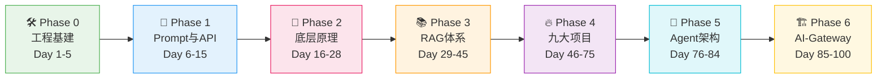
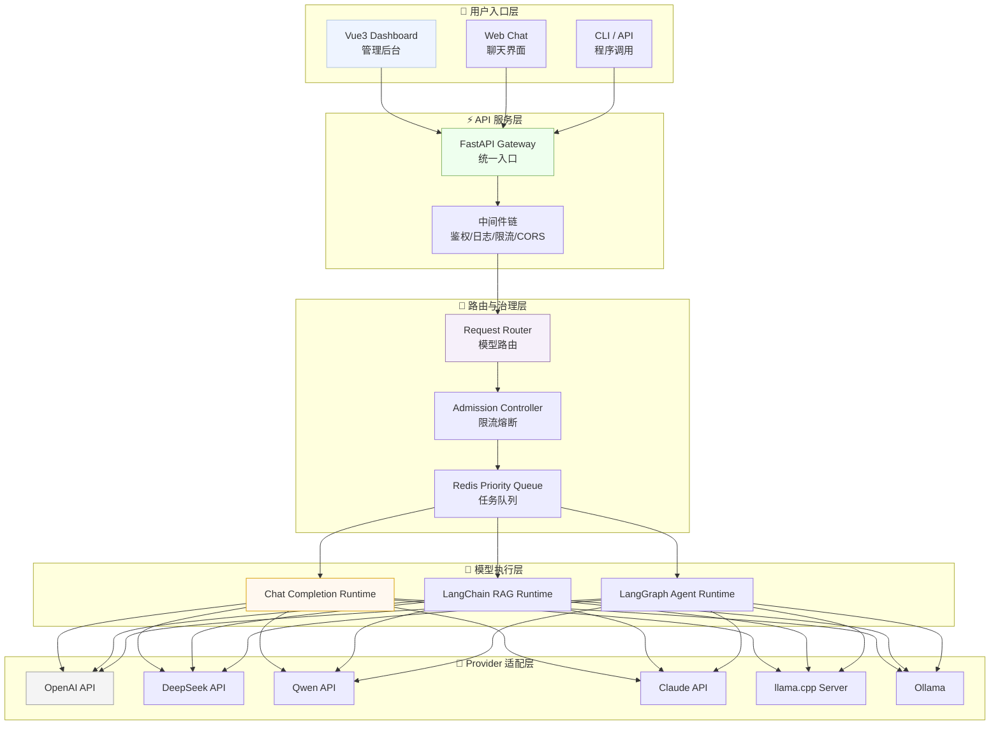

# 🚀 100-Day LLM Full-Stack Engineering Roadmap

<div align="center">

**从 Prompt 入门到手搓企业级 AI-Gateway —— 本科生的大模型全栈工程实战路线**

[](.)
[](.)
[](.)
[](.)
[](.)
[](./LICENSE)

</div>

---

> 🎯 **不只是调用 API，而是从零手搓一个企业级 AI-Gateway。**

---

## 🧭 路线特色

<div align="center">

| 🔬 **拒绝无脑调包** | 🏭 **贴近工业界** | 🚀 **九大项目冲刺** | 🏆 **企业级大收官** |
|:---:|:---:|:---:|:---:|
| 深入 Transformer<br>Attention/KV Cache<br>RoPE/MoE/量化<br>**手写核心组件** | Docker/Redis/PG<br>FastAPI/SSE/Nginx<br>Conda/pip/pytest<br>**全链路工程基建** | MLX LM / llama.cpp<br>Diffusers / SAM 2<br>Qwen-VL / LangGraph<br>LlamaIndex / GraphRAG<br>**30天极限复现** | 多模型统一路由<br>限流/熔断/计费<br>Dashboard 监控<br>**Docker 一键部署** |

</div>

---

## 👥 适合人群

- ✅ 有 Python 基础、想入门大模型应用开发的本科生
- ✅ 不想只停留在"调用 API"阶段的学习者
- ✅ 想做出一个能放进简历和作品集的完整 AI 工程项目
- ✅ 准备找 AI 工程/后端开发方向实习或工作的同学

---

## 🗺️ 100 天路线总览



| Phase | 🎯 主题 | ⏱️ 天数 | 📝 核心产出 | 📊 难度 |
|:-----:|:--------|:------:|:------------|:------:|
| **0** | 🛠️ 工程基建与极速复习 | Day 1-5 | Git/SSH/Linux/Docker/Redis/Python/PyTorch 复习 | ⭐ |
| **1** | 💬 Prompt 工程与 API | Day 6-15 | Prompt Cookbook → 统一 LLM 客户端 → FastAPI 聊天服务 → SSE 流式 → Web Chat Demo | ⭐⭐ |
| **2** | 🧠 大模型底层硬核拆解 | Day 16-28 | Transformer → Attention(MHA/MQA/GQA) → RoPE → KV Cache → PagedAttention → MoE → 量化 → LoRA → vLLM | ⭐⭐⭐⭐⭐ |
| **3** | 📚 RAG 检索增强体系 | Day 29-45 | 文档解析 → Chunk 策略 → Embedding → 向量索引 → 混合检索 → LangGraph RAG → RAG 评估 → Web 应用 | ⭐⭐⭐⭐ |
| **4** | 🔥 九大开源项目极限冲刺 | Day 46-75 | MLX LM / llama.cpp / Diffusers / SAM 2 / Qwen-VL / LangGraph RAG / LlamaIndex / GraphRAG / SWE-agent | ⭐⭐⭐⭐⭐ |
| **5** | 🤖 Agent 与工作流架构 | Day 76-84 | ReAct → Tool Calling → LangGraph 多节点 Agent → Human-in-the-loop → Agent 安全 → 服务化 | ⭐⭐⭐⭐ |
| **6** | 🏗️ 终极 AI-Gateway | Day 85-100 | 多模型路由 → Redis 限流 → 熔断降级 → Token 计费 → Dashboard → Docker 一键部署 | ⭐⭐⭐⭐⭐ |

<details>
<summary><b>📖 展开查看每个 Phase 的详细日计划</b></summary>

<br>

| Phase 0 🛠️ 工程基建 |
|:---|
| **Day 1**: Python 高频特性复习（装饰器/async/Pydantic/NumPy/Pandas/Matplotlib） |
| **Day 2**: ML/DL 基础复习（梯度下降/Softmax/交叉熵/过拟合/归一化） |
| **Day 3**: 神经网络架构地图（MLP/CNN/RNN/LSTM/GRU/GNN） |
| **Day 4**: NLP/CV/LLM 全景 + 43 个大模型核心概念术语表 |
| **Day 5**: Git/GitHub/SSH + Docker/Redis/PostgreSQL + Linux/Shell + PyTorch 基础 + 项目工程化脚手架 + 开发工具链配置 |

| Phase 1 💬 Prompt & API |
|:---|
| **Day 6-7**: Prompt Cookbook — 25+ 个可直接复制的 Prompt 模板（6 大类） |
| **Day 8-9**: 统一 LLM 客户端 — 7 个 Provider 完整实现（OpenAI/DeepSeek/Qwen/Claude/Ollama/llama.cpp/vLLM） |
| **Day 10-11**: FastAPI 聊天服务 — 完整可运行项目（含流式 SSE/中间件/鉴权/限流/测试） |
| **Day 12-13**: Web Chat Demo — Vue3 + TypeScript + SSE 流式前端（Markdown 渲染/多对话/持久化） |
| **Day 14-15**: Prompt 进阶 + 文档生成提示词 + API Key 管理 + LLM 调用测试指南 |

| Phase 2 🧠 底层原理 |
|:---|
| **Day 16**: Transformer 架构总览 — Shape 流动全景 + Pre-LN/Post-LN + 面试追问 |
| **Day 17**: Scaled Dot-Product Attention — QKᵀ/√dₖ/Softmax 手写 + 矩阵维度流动 |
| **Day 18**: MHA/MQA/GQA — KV Cache 带宽瓶颈 + 三者参数量与显存对比 |
| **Day 19**: RoPE 旋转位置编码 — 复数旋转/相对位置内积/长上下文外推 |
| **Day 20**: KV Cache 与自回归生成 — Prefill/Decode + KV Cache 显存公式 |
| **Day 21**: PagedAttention/Continuous Batching — vLLM 吞吐提升 3x 的秘密 |
| **Day 22**: MoE 混合专家 — Router/Top-K Expert/Shared Expert/负载均衡 |
| **Day 23**: 量化技术 — GPTQ/AWQ/GGUF + llama.cpp 量化实操 + 决策树 |
| **Day 24**: 手写 Multi-Head Attention + GQA — PyTorch 完整实现 + 官方验证 |
| **Day 25**: LoRA/QLoRA 微调实战 — 完整训练循环 + MLX/PEFT + 超参数调优 |
| **Day 26**: SFT/RLHF/DPO/蒸馏 — 四种微调对齐技术全景对比 + 训练代码 |
| **Day 27**: 模型部署 — vLLM/Ollama/llama.cpp/MLX LM 四方案对比 + 压测 |
| **Day 28**: 7 天参考总纲 — 面试拷问/排障场景/工程映射 |

| Phase 3 📚 RAG 体系 |
|:---|
| **Day 29-30**: 最简 RAG 实现 — 完整可运行：文档读取→Embedding→检索→真实 LLM 调用 |
| **Day 31-33**: 文档解析器 — 5 种格式（PDF/MD/TXT/Word/HTML）+ 3 种分块策略 + 预处理管道 |
| **Day 34-36**: 向量索引 — FAISS(FlatIP/IVFFlat/HNSW) + Chroma 进阶 + 性能 benchmark |
| **Day 37-39**: 混合检索 — BM25 + 向量 + RRF 融合 + Reranker 精排 + 对比实验 |
| **Day 40-41**: 高级分块策略 — 语义分块/递归分块/文档结构感知/Small-to-Big |
| **Day 42-43**: LangGraph RAG 状态机 — 8 节点全部完整实现 + checkpoint 恢复 |
| **Day 43-44**: RAG 评估 — Ragas 框架 + 改进闭环 + A/B 测试 + 可视化 |
| **Day 44-45**: RAG Web 应用 + LlamaIndex 入门 |

| Phase 4 🔥 九大项目 |
|:---|
| **Day 46-50**: MLX LM — Apple Silicon 原生推理与微调 |
| **Day 51-55**: llama.cpp — GGUF 模型本地 Serving |
| **Day 56-58**: Diffusers — Stable Diffusion 图像生成 |
| **Day 59-61**: SAM 2 — 视觉分割 |
| **Day 62-64**: Qwen-VL / LLaVA — 多模态理解 |
| **Day 65-67**: LangGraph RAG — 企业级 RAG 实战 |
| **Day 68-70**: LlamaIndex — 知识库框架 |
| **Day 71-73**: GraphRAG — 图谱检索增强 |
| **Day 74-75**: SWE-agent — AI 代码修复 |

| Phase 5 🤖 Agent |
|:---|
| **Day 76-77**: ReAct Agent — 完整实现 + 3 个真实工具 + 跑通案例 |
| **Day 78-79**: Tool Calling — 5 个真实工具 + 并行调用 + 注册中心 |
| **Day 80-81**: LangGraph 多节点 Agent — Human-in-the-loop + Memory + Checkpoint |
| **Day 82**: Agent 安全深度专题 — Prompt Injection 攻防实战 |
| **Day 82-83**: Agent 服务化 API + 任务队列 + 持久化 + 前端可视化 |
| **Day 83**: 开源 Agent 平台实战 — Dify/RAGFlow/Coze 三平台 |
| **Day 83-84**: 多 Agent 协作 + Agent 评估体系 + 可观测性 |

| Phase 6 🏗️ AI-Gateway |
|:---|
| **Day 85-88**: 需求设计 + 统一路由层（多 Provider 适配） |
| **Day 89-92**: 治理层 — Redis 限流 + 熔断降级 + API Key 管理 |
| **Day 93-96**: 计费系统 + Token 用量统计 + 监控 Dashboard |
| **Day 97-100**: RAG/Agent 接入 + Docker Compose 一键部署 + 压测 |

</details>

---

## 🎓 学完你可以得到什么？

<div align="center">

| 🧠 **大模型底层硬核能力** | 🔧 **全栈工程化能力** |
|:---|:---|
| 手写 Attention、理解 KV Cache<br>会算显存、懂量化<br>面试能讲清楚 Transformer 到底在做什么 | Docker/Redis/PostgreSQL/Nginx<br>FastAPI/SSE/Pydantic<br>全链路从搭建到部署 |

| 🤖 **Agent 设计与安全** | 📊 **RAG 体系完整闭环** |
|:---|:---|
| ReAct → LangGraph 多节点状态机<br>Human-in-the-loop<br>Prompt Injection 攻防<br>开源平台（Dify/RAGFlow/Coze）实战 | 文档解析 → 混合检索 → 评估<br>LangGraph 状态机编排<br>能做知识库问答产品 |

| 🎯 **面试差异化竞争力** | 📝 **能写进简历的作品集** |
|:---|:---|
| 不是"我会调 API"<br>而是"我手搓过 AI-Gateway"<br>能从底层原理解释为什么模型慢/为什么 OOM | 9 个开源项目 + 1 个企业级 AI-Gateway<br>完整的 GitHub 绿点墙<br>周记和踩坑记录随时可做面试素材 |

</div>

---

## 🎯 技能矩阵

| 🏷️ 技能域 | 🛠️ 具体能力 | 📍 阶段 |
|:----------|:-----------|:------:|
| **工程基建** | Git/GitHub · SSH · Linux/Shell · Conda/pip/uv · Docker/Compose · Nginx · CI/CD · pyproject.toml · ruff | Phase 0, 6 |
| **后端与数据** | FastAPI · Pydantic · Redis · PostgreSQL · 向量数据库(FAISS/Chroma) · SSE 流式 · 任务队列 | Phase 1, 6 |
| **大模型使用** | Prompt Engineering(Zero/Few-shot/CoT) · 7 个 Provider API · Token 计费 · Function Calling · 结构化输出 | Phase 1 |
| **底层原理** | Transformer · Attention(MHA/MQA/GQA) · RoPE · KV Cache · PagedAttention · MoE · FlashAttention | Phase 2 |
| **微调与对齐** | LoRA/QLoRA · SFT · RLHF · DPO · 知识蒸馏 · PEFT · 数据准备与清洗 | Phase 2 |
| **模型部署** | vLLM · llama.cpp · Ollama · MLX LM · GGUF 量化 · OpenAI 兼容 API · Docker 部署 | Phase 2, 4 |
| **RAG 体系** | 文档解析(5格式) · Chunk 策略(4种) · Embedding · 混合检索(BM25+Vector+Reranker) · LangGraph RAG · LlamaIndex · GraphRAG · RAG 评估(Ragas) | Phase 3, 4 |
| **Agent** | ReAct · Tool Calling · LangGraph 状态机 · Human-in-the-loop · Agent 安全 · 多 Agent 协作 · Dify/RAGFlow/Coze | Phase 5 |
| **多模态** | CLIP · Diffusers(SD/SDXL) · SAM 2 · Qwen-VL · LLaVA | Phase 4 |
| **企业级网关** | 统一模型路由 · Fallback 降级 · Redis 限流 · 熔断 · Token 计费 · 监控 Dashboard · Docker Compose 一键部署 | Phase 6 |

---

## 🏗️ 终极项目：AI-Gateway 架构



| # | ✨ 技术亮点 |
|:--:|:----------|
| 1 | 🔀 **多模型统一路由** — 一个 API 地址接入 OpenAI/DeepSeek/Qwen/Claude/本地模型 |
| 2 | 🛡️ **Redis 滑动窗口限流** — 按用户/按 API Key 的精细化流量控制 |
| 3 | ⚡ **熔断降级** — 主模型不可用时自动 Fallback 到备选模型 |
| 4 | 💰 **Token 计费引擎** — 实时统计各模型 Token 用量与成本 |
| 5 | 📊 **实时监控 Dashboard** — Vue3 可视化后台，TTFT/TPOT/QPS 一目了然 |
| 6 | 🤖 **RAG/Agent 接入** — LangChain RAG + LangGraph Agent 通过 Gateway 统一治理 |
| 7 | 🔑 **API Key 管理** — 多租户鉴权 + 常量时间比较防时序攻击 |
| 8 | 🐳 **Docker Compose 一键部署** — FastAPI + Redis + PostgreSQL + Nginx 全家桶 |

---

## 📂 仓库目录结构

```
llm-fullstack-roadmap/
├── README.md                          # 📖 项目首页
├── learning-journal.md                # ✍️ 总学习心得与踩坑汇总
├── LICENSE                            # MIT
├── .gitignore
├── requirements.txt
│
├── docs/                              # 📚 环境搭建、FAQ 等通用文档
│   ├── 00_overview.md
│   ├── 01_environment_setup.md
│   ├── 01_original_plan.md
│   └── 05_troubleshooting.md
│
├── phase0_foundation/                 # 🛠️ Phase 0 — 基建与复习 (Day 1-5)
│   ├── 01_python_review.md            #   Python 高频特性 + NumPy/Pandas/Matplotlib
│   ├── 02_ml_dl_review.ipynb          #   ML/DL 基础复习（梯度下降/Softmax/交叉熵/过拟合）
│   ├── 03_neural_network_map.ipynb    #   神经网络架构地图（MLP/CNN/RNN/LSTM/GNN）
│   ├── 04_nlp_cv_llm_overview.ipynb   #   NLP/CV/LLM 全景总览
│   ├── 05_llm_concepts_glossary.md    #   🌟 43 个 LLM 核心概念术语表
│   ├── 06_git_github.md               #   Git 工作流 + SSH + Conventional Commits
│   ├── 07_docker_basics.md            #   Docker + Redis + PostgreSQL 快速上手
│   ├── 08_linux_shell_basics.md       #   Linux/Shell 命令行基础
│   ├── 09_pytorch_basics.ipynb        #   PyTorch 基础实战
│   ├── 10_project_scaffolding.md      #   项目工程化脚手架
│   └── 11_developer_tools.md          #   开发工具链配置
│
├── phase1_prompt_api/                 # 💬 Phase 1 — Prompt + API (Day 6-15)
│   ├── 01_prompt_cookbook.md          #   25+ Prompt 模板库（6 大类）
│   ├── 02_llm_client.md               #   统一 LLM 客户端（7 个 Provider）
│   ├── 03_fastapi_chat.md             #   FastAPI 聊天服务（流式/鉴权/限流/测试）
│   ├── 04_web_chat_demo.md            #   Vue3 + TypeScript SSE 流式前端
│   ├── 05_prompt_advanced.md          #   Prompt 进阶（CoT/结构化输出/Few-shot）
│   ├── 06_doc_generation_prompts.md   #   文档生成提示词（README/Runbook/架构图）
│   ├── 07_env_secrets_mgmt.md         #   API Key 管理与安全
│   └── 08_testing_guide.md            #   LLM 调用测试指南
│
├── phase2_llm_internals/              # 🧠 Phase 2 — LLM 底层原理 (Day 16-28)
│   ├── 00_transformer.md              #   Transformer 架构总览 + Shape 流动
│   ├── 01_attention.ipynb             #   Scaled Dot-Product Attention
│   ├── 02_mha_mqa_gqa.ipynb           #   MHA / MQA / GQA
│   ├── 03_rope.ipynb                  #   RoPE 旋转位置编码
│   ├── 04_kv_cache.ipynb              #   KV Cache 与自回归生成
│   ├── 05_paged_attention.ipynb       #   PagedAttention
│   ├── 06_moe.ipynb                   #   MoE 混合专家模型
│   ├── 07_lora_rag_agent.ipynb        #   LoRA/QLoRA/RAG/Agent
│   ├── 08_quantization.md             #   量化技术详解（GPTQ/AWQ/GGUF）
│   ├── 09_attention_from_scratch.md   #   手写 MHA + GQA（PyTorch 完整实现）
│   ├── 10_lora_demo.md                #   LoRA 微调实战（完整训练循环）
│   ├── 11_fine-tuning_techniques.md   #   🌟 SFT/RLHF/DPO/蒸馏全景
│   ├── 12_deployment_vllm.md          #   vLLM 推理引擎与部署
│   └── _00_7day_deep_dive_reference.md # 面试拷问/排障场景/工程映射参考
│
├── phase3_rag/                        # 📚 Phase 3 — RAG 体系 (Day 29-45)
│   ├── 01_naive_rag.md                #   最简 RAG 完整实现（真实 LLM 调用）
│   ├── 02_document_loader.md          #   文档解析器（5 格式 + 3 分块策略）
│   ├── 03_vector_index.md             #   向量索引（FAISS/Chroma + 性能对比）
│   ├── 04_hybrid_search.md            #   混合检索（BM25+Vector+RRF+Reranker）
│   ├── 05_langgraph_rag.md            #   LangGraph RAG 状态机（8 节点完整实现）
│   ├── 06_rag_evaluation.md           #   RAG 评估（Ragas + 改进闭环）
│   ├── 07_rag_web_app.md              #   RAG Web 应用（FastAPI + Vue3 + Docker）
│   ├── 08_advanced_chunking.md        #   高级分块策略（语义/递归/多粒度）
│   └── 09_llamaindex_basics.md        #   LlamaIndex 入门
│
├── phase4_projects/                   # 🔥 Phase 4 — 九大项目 (Day 46-75)
│   ├── 01_mlx_lm/                     #   MLX LM — Apple Silicon 推理与微调
│   ├── 02_llama_cpp/                  #   llama.cpp — GGUF 模型本地 Serving
│   ├── 03_diffusers.md                #   Diffusers — 图像生成
│   ├── 04_sam2.md                     #   SAM 2 — 视觉分割
│   ├── 05_qwen_vl_llava.md            #   Qwen-VL / LLaVA — 多模态理解
│   ├── 06_langgraph_rag.md            #   LangGraph RAG — 企业级实战
│   ├── 07_llamaindex.md               #   LlamaIndex — 知识库框架
│   ├── 08_graphrag.md                 #   GraphRAG — 图谱检索增强
│   ├── 09_swe_agent.md                #   SWE-agent — AI 代码修复
│   └── PROJECTS_SUMMARY.md            #   项目矩阵总结
│
├── phase5_agent/                      # 🤖 Phase 5 — Agent 架构 (Day 76-84)
│   ├── 01_react_agent.md              #   ReAct Agent 完整实现
│   ├── 02_tool_calling.md             #   工具定义/注册/并行调用
│   ├── 03_langgraph_agent.md          #   LangGraph 多节点 Agent + HITL
│   ├── 04_agent_api.md                #   Agent 服务化 API + 任务队列
│   ├── 05_open_source_agent_platforms.md # Dify/RAGFlow/Coze 实战
│   ├── 06_multi_agent_patterns.md     #   多 Agent 协作 + CrewAI
│   ├── 07_agent_evaluation.md         #   Agent 评估体系 + 可观测性
│   └── 08_agent_security.md           #   Agent 安全（Prompt Injection 攻防）
│
├── final_ai_gateway/                  # 🏗️ Phase 6 — AI-Gateway (Day 85-100)
│   ├── design_doc.md                  #   设计文档
│   ├── backend/                       #   FastAPI 网关后端
│   ├── frontend/                      #   Vue3 Dashboard
│   ├── configs/                       #   路由/模型配置
│   ├── scripts/                       #   部署/压测脚本
│   └── docker/                        #   Docker 部署文件
│
└── weekly_logs/                       # 📝 每周学习周记
```

> 💡 `.ipynb` 适合边看边跑代码的学习，`.md` 适合纯文本/公式/理论阅读。

---

## 🚀 快速开始

```bash
# 1. 克隆仓库
git clone https://github.com/<your-username>/llm-fullstack-roadmap.git
cd llm-fullstack-roadmap

# 2. 创建虚拟环境
conda create -n llm-roadmap python=3.11
conda activate llm-roadmap

# 3. 安装基础依赖
pip install -r requirements.txt

# 4. 从 Phase 0 开始，按天推进
# 每个 Phase 目录下有独立的学习内容、代码和踩坑记录
```

---

## 📖 学习建议

1. **🔢 按顺序推进** — Phase 0→6 严格递进，不要跳 Phase。前面跳了后面一定卡
2. **📝 每天记录踩坑** — 每个 Phase 目录下有 `learning-issues.md`，遇到问题就记下来
3. **🏃 先跑通再深入** — Phase 4 的 9 个项目只要求最小可运行 Demo，不要追求完美
4. **✍️ 写周记** — `weekly_logs/` 下每周一篇，这是面试时最好的素材
5. **🏗️ Phase 6 是核心** — 前面所有 Phase 的技能最终都汇聚到 AI-Gateway

---

## 💻 环境要求

| 组件 | 要求 | 说明 |
|:------|:------|:-----|
| 💻 硬件 | MacBook M 系列 / NVIDIA GPU / CPU only | M 系列体验最佳（统一内存） |
| 🐍 Python | 3.10 / 3.11 | 推荐 conda 管理环境 |
| 📦 Node.js | 18+ | 前端 Demo 需要 |
| 🐳 Docker | 最新版 | Phase 0 Day 5 和 Phase 6 需要 |

---

## 📚 学习资源推荐

### 🎥 免费在线资源

| 资源 | 说明 |
|:------|:-----|
| **李宏毅 2024 生成式 AI** | B 站有搬运，讲解接地气，入门首选 |
| **Hugging Face Daily Papers** | 每天扫一眼标题，了解前沿动态 |
| **Datawhale 开源教程** | 国内最大 AI 开源学习社区，有组队学习 |
| **Jay Alammar 的 Illustrated 系列** | Transformer/Stable Diffusion 图解，有中文版 |
| **Andrej Karpathy 视频** | "Let's build GPT from scratch"，必看 |

### 📖 参考书（当字典查，不必通读）

| 书 | 说明 |
|:---|:-----|
| 《Natural Language Processing with Transformers》 | Hugging Face 官方出品，工程向 |
| 《大模型应用开发极简入门》 | 中文，贴合国内场景 |
| 《Attention is All You Need》原论文 | 经典中的经典，建议反复读 |

### 🛠️ 开发工具链

| 工具 | 用途 | 优先级 |
|:------|:-----|:------:|
| **LangChain** | LLM 编排核心：Prompt/模型调用/数据加载 | ⭐⭐⭐⭐⭐ |
| **LangGraph** | Agent 状态机编排 | ⭐⭐⭐⭐ |
| **FastAPI** | 轻量后端框架，API 封装 | ⭐⭐⭐⭐⭐ |
| **Streamlit** | Python 快速搭建前端界面 | ⭐⭐⭐ |
| **Dify / RAGFlow / Coze** | 低代码/开源平台，快速验证想法 | ⭐⭐⭐ |
| **Claude Code / Cursor** | AI 辅助编程，提升效率 | ⭐⭐⭐⭐ |

---

## 💼 能写到简历上的实战项目

| 项目 | 涉及技能 | 难度 |
|:------|:---------|:---:|
| **个人知识库助手** | RAG + Embedding + 向量数据库 + FastAPI | ⭐⭐ |
| **智能客服系统** | RAG + 企业文档 + LangGraph + SSE 流式 | ⭐⭐⭐ |
| **内容生成工具** | Prompt 模板 + Function Calling + Streamlit | ⭐⭐ |
| **AI 销售助手 Agent** | ReAct + Tool Calling + 数据库查询 + API 封装 | ⭐⭐⭐⭐ |
| **多模型 AI-Gateway** | 路由/限流/熔断/计费 + Docker 部署 | ⭐⭐⭐⭐⭐ |

---

## ⭐ Star History

如果这个路线对你有帮助，请给一个 Star ⭐ 支持一下！

[](https://star-history.com/#你的用户名/llm-fullstack-roadmap&Date)

---

## 📄 License

本项目代码采用 [MIT License](LICENSE)。

使用的开源项目与模型遵循各自的原版 License（详见各项目 README）。

---

## ✍️ Author

**晨熙** — 本科毕业，大模型应用工程学习实践。

> 这个仓库记录了我从零开始学习大模型全栈工程的完整路径。如果你也是本科生、也在入门大模型，希望这个路线能帮你少走一些弯路。

---

<div align="center">

**🌟 如果这个项目对你有帮助，请给一个 Star！**

[](https://github.com/你的用户名/llm-fullstack-roadmap)

</div>
