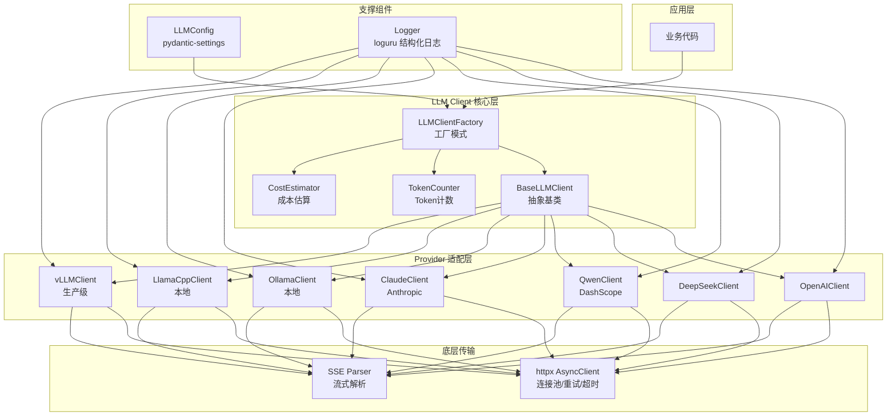
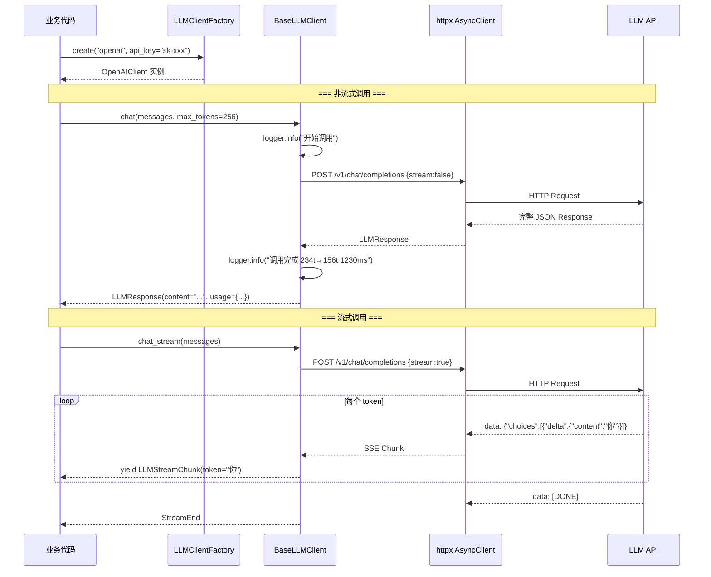

# 🤖 02 — 统一 LLM 客户端：多 Provider 抽象层

> 🎯 **目标**：封装一个支持 7 种 Provider 的生产级 LLM 调用客户端，统一流式/非流式接口、Token 计费、日志和配置管理。
> ⏱️ 预计时间：2 天

---

## 📋 为什么需要统一客户端？

| 痛点 | 不用统一客户端 | 用统一客户端 |
|------|-------------|-----------|
| 换模型 | 改几百行调用代码 | 改一行 `provider="qwen"` |
| 流式 vs 非流式 | 两套完全不同的处理逻辑 | `stream=True/False` 一个参数 |
| Token 计费 | 每个模型单独计算 | 统一 `TokenCounter` |
| 日志追踪 | 分散在各处 print | loguru 统一格式 |
| 配置管理 | 环境变量散落各处 | pydantic-settings 集中管理 |
| 错误处理 | 各模型返回格式不一样 | 统一 try/except + ProviderError |

---

## 🏗 客户端架构图



---

## 📦 Provider 概览

| Provider | 类型 | 代表模型 | API 地址 | 费用参考（2025） | 实现优先级 |
|----------|------|---------|---------|-----------------|----------|
| **OpenAI** | 云端 | GPT-4o, GPT-4o-mini | `api.openai.com` | $2.5-15/1M tokens | ⭐ 必学 |
| **DeepSeek** | 云端 | V3, R1 | `api.deepseek.com` | ¥1-4/1M tokens | ⭐ 性价比之王 |
| **Qwen** | 云端 | Qwen-Max, Qwen-Plus | `dashscope.aliyuncs.com` | ¥2-8/1M tokens | ⭐ 国内首选 |
| **Claude** | 云端 | Claude 3.5 Sonnet | `api.anthropic.com` | $3-15/1M tokens | ⭐ 长上下文 |
| **Ollama** | 本地 | llama3, qwen2.5 | `localhost:11434` | 免费 💚 | ⭐ 本地快速 |
| **llama.cpp** | 本地 | 任何 GGUF | `localhost:8081` | 免费 💚 | ⭐ 本地部署 |
| **vLLM** | 本地/云端 | 任何 HF 模型 | `localhost:8000` | GPU成本 | ⭐ 生产并发 |

---

## 1️⃣ 统一抽象基类

```python
from abc import ABC, abstractmethod
from typing import AsyncGenerator
from dataclasses import dataclass, field
from datetime import datetime

@dataclass
class LLMResponse:
    """所有 Provider 返回的统一响应格式"""
    content: str
    model: str
    usage: dict = field(default_factory=dict)  # {"prompt_tokens": N, "completion_tokens": M}
    finish_reason: str = "stop"
    provider: str = ""
    latency_ms: float = 0.0

@dataclass
class LLMStreamChunk:
    """流式响应的单个 chunk"""
    token: str
    index: int = 0
    finish_reason: str | None = None

class ProviderError(Exception):
    """统一 Provider 错误"""
    def __init__(self, provider: str, status_code: int, message: str, raw: str = ""):
        self.provider = provider
        self.status_code = status_code
        self.message = message
        self.raw = raw
        super().__init__(f"[{provider}] {status_code}: {message}")

class BaseLLMClient(ABC):
    """所有 Provider 必须实现的接口"""

    def __init__(self, model: str, **kwargs):
        self.model = model
        self.provider_name = self.__class__.__name__

    @abstractmethod
    async def chat(
        self,
        messages: list[dict],
        max_tokens: int = 256,
        temperature: float = 0.7,
        **kwargs,
    ) -> LLMResponse:
        """非流式调用"""
        ...

    @abstractmethod
    async def chat_stream(
        self,
        messages: list[dict],
        max_tokens: int = 256,
        temperature: float = 0.7,
        **kwargs,
    ) -> AsyncGenerator[LLMStreamChunk, None]:
        """流式调用，逐 token yield"""
        ...
```

---

## 2️⃣ OpenAI Provider

```python
from openai import AsyncOpenAI

class OpenAIClient(BaseLLMClient):
    def __init__(self, api_key: str, model: str = "gpt-4o-mini", base_url: str | None = None):
        super().__init__(model)
        self.client = AsyncOpenAI(api_key=api_key, base_url=base_url)

    async def chat(self, messages, max_tokens=256, temperature=0.7, **kwargs):
        t0 = time.time()
        response = await self.client.chat.completions.create(
            model=self.model,
            messages=messages,
            max_tokens=max_tokens,
            temperature=temperature,
            stream=False,
            **kwargs,
        )
        choice = response.choices[0]
        return LLMResponse(
            content=choice.message.content or "",
            model=self.model,
            usage=response.usage.model_dump() if response.usage else {},
            finish_reason=choice.finish_reason or "stop",
            provider="openai",
            latency_ms=(time.time() - t0) * 1000,
        )

    async def chat_stream(self, messages, max_tokens=256, temperature=0.7, **kwargs):
        stream = await self.client.chat.completions.create(
            model=self.model, messages=messages,
            max_tokens=max_tokens, temperature=temperature, stream=True, **kwargs,
        )
        idx = 0
        async for chunk in stream:
            delta = chunk.choices[0].delta
            if delta.content:
                yield LLMStreamChunk(token=delta.content, index=idx)
                idx += 1
```

<details>
<summary>📨 OpenAI 真实 API 响应 JSON</summary>

**请求**：
```json
{
  "model": "gpt-4o-mini",
  "messages": [{"role": "user", "content": "你好"}],
  "max_tokens": 256,
  "temperature": 0.7,
  "stream": false
}
```

**响应**：
```json
{
  "id": "chatcmpl-Abc123Xyz789",
  "object": "chat.completion",
  "created": 1718000000,
  "model": "gpt-4o-mini-2024-07-18",
  "choices": [{
    "index": 0,
    "message": {"role": "assistant", "content": "你好！有什么我可以帮助你的吗？"},
    "finish_reason": "stop"
  }],
  "usage": {"prompt_tokens": 8, "completion_tokens": 12, "total_tokens": 20}
}
```
</details>

---

## 3️⃣ DeepSeek Provider

> 💡 DeepSeek 兼容 OpenAI 格式，只需改 `base_url`。**Token 计费极低**，是小项目首选云端模型。

```python
class DeepSeekClient(OpenAIClient):
    """DeepSeek 完全兼容 OpenAI 格式，继承 OpenAI 实现"""

    def __init__(self, api_key: str, model: str = "deepseek-chat"):
        super().__init__(
            api_key=api_key,
            model=model,
            base_url="https://api.deepseek.com/v1",
        )

# 🔥 使用
# client = DeepSeekClient(api_key="sk-xxx")
# response = await client.chat([{"role": "user", "content": "你好"}])
```

### 📌 DeepSeek 特有注意事项

| 项目 | OpenAI | DeepSeek |
|------|--------|----------|
| API 格式 | OpenAI | ✅ 完全兼容 |
| Base URL | `api.openai.com` | `api.deepseek.com` |
| 最强模型 | GPT-4o | DeepSeek-V3 |
| 价格 (1M input) | $2.50 | ¥1.00 (~$0.14) |
| Context Window | 128K | 128K |
| Function Calling | ✅ | ✅（部分版本） |
| Tokenizer | tiktoken (o200k) | 自研（tiktoken 不兼容！） |

> ⚠️ **DeepSeek 的 tokenizer 和 OpenAI 不同**：用 `tiktoken` 算 DeepSeek 的 token 数不准确，估算时多留 20% 余量。

<details>
<summary>📨 DeepSeek API 响应示例</summary>

```json
{
  "id": "a1b2c3d4-1234-5678-9abc-def012345678",
  "object": "chat.completion",
  "created": 1718000000,
  "model": "deepseek-chat",
  "choices": [{
    "index": 0,
    "message": {"role": "assistant", "content": "你好！有什么可以帮你的？"},
    "finish_reason": "stop"
  }],
  "usage": {"prompt_tokens": 8, "completion_tokens": 10, "total_tokens": 18}
}
```
</details>

---

## 4️⃣ Qwen / 通义千问（阿里云 DashScope）

> ⚠️ Qwen 用阿里云 DashScope SDK，**不是** OpenAI 兼容格式。API Key = 阿里云 ACCESS_KEY。

### 📌 API Key 申请流程

```
1. 打开 https://dashscope.console.aliyun.com/
2. 阿里云账号登录（支付宝/淘宝扫码即可）
3. 左侧「API-KEY 管理」→ 创建新的 API Key
4. 复制 Key（只显示一次！）
5. 设置环境变量：export DASHSCOPE_API_KEY=sk-xxx
```

```python
import dashscope
from http import HTTPStatus

class QwenClient(BaseLLMClient):
    """阿里云 DashScope (Qwen/通义千问)"""

    def __init__(self, api_key: str, model: str = "qwen-max"):
        super().__init__(model)
        dashscope.api_key = api_key

    async def chat(self, messages, max_tokens=256, temperature=0.7, **kwargs):
        t0 = time.time()
        loop = asyncio.get_event_loop()
        # dashscope 是同步 SDK，用 run_in_executor 异步化
        response = await loop.run_in_executor(
            None,
            lambda: dashscope.Generation.call(
                model=self.model,
                messages=messages,
                max_tokens=max_tokens,
                temperature=temperature,
                result_format="message",
                **kwargs,
            ),
        )
        if response.status_code != HTTPStatus.OK:
            raise ProviderError("qwen", response.status_code, response.message)

        return LLMResponse(
            content=response.output.choices[0].message.content,
            model=self.model,
            usage=response.usage.__dict__ if response.usage else {},
            finish_reason=response.output.choices[0].finish_reason or "stop",
            provider="qwen",
            latency_ms=(time.time() - t0) * 1000,
        )

    async def chat_stream(self, messages, max_tokens=256, temperature=0.7, **kwargs):
        loop = asyncio.get_event_loop()
        responses = dashscope.Generation.call(
            model=self.model,
            messages=messages,
            max_tokens=max_tokens,
            temperature=temperature,
            result_format="message",
            stream=True,
            incremental_output=True,
            **kwargs,
        )
        idx = 0
        for resp in responses:
            if resp.status_code == HTTPStatus.OK and resp.output.choices:
                token = resp.output.choices[0].message.content
                if token:
                    yield LLMStreamChunk(token=token, index=idx)
                    idx += 1
```

> ⚠️ **Qwen 的价格单位是 Token 而非 1K Tokens**：`qwen-max` 输入 ¥0.04/1K tokens，不要和 OpenAI 的 /1M 单位搞混。

---

## 5️⃣ Claude Provider（Anthropic SDK）

> ⚠️ **Claude Messages API 的 system 参数是独立字段，不作为 message！**

```python
from anthropic import AsyncAnthropic

class ClaudeClient(BaseLLMClient):
    def __init__(self, api_key: str, model: str = "claude-3-5-sonnet-20241022"):
        super().__init__(model)
        self.client = AsyncAnthropic(api_key=api_key)

    async def chat(self, messages, max_tokens=256, temperature=0.7, **kwargs):
        t0 = time.time()
        # 🔑 Claude 的 system 是独立参数
        system_msgs = [m["content"] for m in messages if m["role"] == "system"]
        chat_msgs = [m for m in messages if m["role"] != "system"]

        response = await self.client.messages.create(
            model=self.model,
            system=system_msgs[0] if system_msgs else "You are a helpful assistant.",
            messages=chat_msgs,
            max_tokens=max_tokens,
            temperature=temperature,
        )
        return LLMResponse(
            content=response.content[0].text,
            model=self.model,
            usage={"input_tokens": response.usage.input_tokens if response.usage else 0,
                   "output_tokens": response.usage.output_tokens if response.usage else 0},
            finish_reason=response.stop_reason or "stop",
            provider="claude",
            latency_ms=(time.time() - t0) * 1000,
        )

    async def chat_stream(self, messages, max_tokens=256, temperature=0.7, **kwargs):
        system_msgs = [m["content"] for m in messages if m["role"] == "system"]
        chat_msgs = [m for m in messages if m["role"] != "system"]

        async with self.client.messages.stream(
            model=self.model,
            system=system_msgs[0] if system_msgs else "You are a helpful assistant.",
            messages=chat_msgs,
            max_tokens=max_tokens,
            temperature=temperature,
        ) as stream:
            idx = 0
            async for text in stream.text_stream:
                yield LLMStreamChunk(token=text, index=idx)
                idx += 1
```

<details>
<summary>📨 Claude Messages API 请求/响应</summary>

```json
// 请求
{
  "model": "claude-3-5-sonnet-20241022",
  "system": "You are a helpful assistant.",
  "messages": [{"role": "user", "content": "你好"}],
  "max_tokens": 256
}

// 响应
{
  "id": "msg_abc123",
  "model": "claude-3-5-sonnet-20241022",
  "role": "assistant",
  "content": [{"type": "text", "text": "你好！有什么可以帮你的？"}],
  "stop_reason": "end_turn",
  "usage": {"input_tokens": 10, "output_tokens": 8}
}
```
</details>

---

## 6️⃣ Ollama Provider（本地）

```python
class OllamaClient(BaseLLMClient):
    """本地 Ollama HTTP API"""

    def __init__(self, model: str = "qwen2.5:7b", base_url: str = "http://localhost:11434"):
        super().__init__(model)
        self.base_url = base_url
        self.client = httpx.AsyncClient(timeout=120)

    async def chat(self, messages, max_tokens=256, temperature=0.7, **kwargs):
        t0 = time.time()
        resp = await self.client.post(
            f"{self.base_url}/api/chat",
            json={
                "model": self.model, "messages": messages,
                "stream": False,
                "options": {"num_predict": max_tokens, "temperature": temperature},
            },
        )
        resp.raise_for_status()
        data = resp.json()
        return LLMResponse(
            content=data["message"]["content"],
            model=self.model,
            usage={"prompt_tokens": data.get("prompt_eval_count", 0),
                   "completion_tokens": data.get("eval_count", 0)},
            finish_reason="stop" if data.get("done") else "length",
            provider="ollama",
            latency_ms=(time.time() - t0) * 1000,
        )

    async def chat_stream(self, messages, max_tokens=256, temperature=0.7, **kwargs):
        idx = 0
        async with self.client.stream(
            "POST", f"{self.base_url}/api/chat",
            json={"model": self.model, "messages": messages, "stream": True,
                  "options": {"num_predict": max_tokens, "temperature": temperature}},
        ) as resp:
            async for line in resp.aiter_lines():
                if line.strip():
                    data = json.loads(line)
                    if data.get("message", {}).get("content"):
                        yield LLMStreamChunk(token=data["message"]["content"], index=idx)
                        idx += 1
```

---

## 7️⃣ vLLM Provider（生产级）

```python
class VLLMClient(OpenAIClient):
    """vLLM 完全兼容 OpenAI 格式，继承 OpenAI 实现"""

    def __init__(self, model: str = "Qwen/Qwen2.5-7B-Instruct", base_url: str = "http://localhost:8000"):
        super().__init__(
            api_key="not-needed",  # vLLM 默认不校验
            model=model,
            base_url=f"{base_url}/v1",
        )

    async def chat(self, messages, max_tokens=256, temperature=0.7, **kwargs):
        # vLLM 支持的额外参数
        vllm_kwargs = {
            "top_p": kwargs.get("top_p", 1.0),
            "frequency_penalty": kwargs.get("frequency_penalty", 0.0),
            "presence_penalty": kwargs.get("presence_penalty", 0.0),
        }
        return await super().chat(messages, max_tokens, temperature, **vllm_kwargs)
```

---

## 8️⃣ 工厂模式：一行切换 Provider

```python
import os

class LLMClientFactory:
    """一行代码切换任意 Provider"""

    @staticmethod
    def create(provider: str, **kwargs) -> BaseLLMClient:
        providers = {
            "openai":   lambda: OpenAIClient(kwargs.get("api_key", os.getenv("OPENAI_API_KEY")), kwargs.get("model", "gpt-4o-mini")),
            "deepseek": lambda: DeepSeekClient(kwargs.get("api_key", os.getenv("DEEPSEEK_API_KEY")), kwargs.get("model", "deepseek-chat")),
            "qwen":     lambda: QwenClient(kwargs.get("api_key", os.getenv("DASHSCOPE_API_KEY")), kwargs.get("model", "qwen-max")),
            "claude":   lambda: ClaudeClient(kwargs.get("api_key", os.getenv("ANTHROPIC_API_KEY")), kwargs.get("model", "claude-3-5-sonnet-20241022")),
            "ollama":   lambda: OllamaClient(kwargs.get("model", "qwen2.5:7b"), kwargs.get("base_url", "http://localhost:11434")),
            "llama.cpp":lambda: LlamaCppClient(kwargs.get("base_url", "http://localhost:8081")),
            "vllm":     lambda: VLLMClient(kwargs.get("model", "Qwen/Qwen2.5-7B-Instruct"), kwargs.get("base_url", "http://localhost:8000")),
        }
        if provider not in providers:
            raise ValueError(f"不支持的 Provider: {provider}。可选: {list(providers)}")
        return providers[provider]()
```

---

## 9️⃣ 同步客户端（调试用）

```python
import asyncio

class SyncLLMClient:
    """同步版本，内部用 asyncio.run() 包装"""

    def __init__(self, provider: str, **kwargs):
        self._async_client = LLMClientFactory.create(provider, **kwargs)

    def chat(self, messages: list[dict], max_tokens: int = 256, temperature: float = 0.7) -> LLMResponse:
        return asyncio.run(self._async_client.chat(messages, max_tokens, temperature))

    def chat_stream(self, messages: list[dict], max_tokens: int = 256, temperature: float = 0.7) -> list[str]:
        """同步流式：收集所有 token 后返回列表"""
        async def _collect():
            tokens = []
            async for chunk in self._async_client.chat_stream(messages, max_tokens, temperature):
                tokens.append(chunk.token)
            return tokens
        return asyncio.run(_collect())

# 🔥 快速调试
# client = SyncLLMClient("openai", api_key="sk-xxx")
# print(client.chat([{"role": "user", "content": "你好"}]).content)
```

---

## 🔟 配置管理（pydantic-settings）

```python
# config.py
from pydantic_settings import BaseSettings

class LLMConfig(BaseSettings):
    """集中管理所有 LLM 相关配置"""

    # OpenAI
    openai_api_key: str = ""
    openai_default_model: str = "gpt-4o-mini"

    # DeepSeek
    deepseek_api_key: str = ""
    deepseek_default_model: str = "deepseek-chat"

    # Qwen / DashScope
    dashscope_api_key: str = ""
    qwen_default_model: str = "qwen-plus"

    # Anthropic
    anthropic_api_key: str = ""
    claude_default_model: str = "claude-3-5-sonnet-20241022"

    # 本地服务
    ollama_base_url: str = "http://localhost:11434"
    ollama_default_model: str = "qwen2.5:7b"
    llamacpp_base_url: str = "http://localhost:8081"
    vllm_base_url: str = "http://localhost:8000"
    vllm_default_model: str = "Qwen/Qwen2.5-7B-Instruct"

    # 通用配置
    default_provider: str = "openai"
    request_timeout: int = 60
    max_retries: int = 3
    log_level: str = "INFO"

    model_config = {"env_file": ".env", "env_file_encoding": "utf-8"}

# 全局单例
config = LLMConfig()
```

---

## ⓫ 请求日志系统（loguru）

```python
# logger_config.py
import sys
from loguru import logger

# 移除默认 handler
logger.remove()

# 控制台输出（彩色）
logger.add(
    sys.stderr,
    format="<green>{time:YYYY-MM-DD HH:mm:ss}</green> | <level>{level: <8}</level> | <level>{message}</level>",
    level="INFO",
    colorize=True,
)

# 文件输出（结构化，自动轮转）
logger.add(
    "logs/llm_client_{time:YYYY-MM-DD}.log",
    format="{time} | {level} | {message}",
    level="DEBUG",
    rotation="10 MB",          # 超过 10MB 自动轮转
    retention="30 days",       # 保留 30 天
    compression="gz",          # 轮转后压缩
)

# ===== 在 Provider 中集成 =====
async def _log_and_call(provider: str, model: str, messages: list, call_fn):
    """统一日志包装器"""
    t0 = time.time()
    try:
        response = await call_fn()
        elapsed = (time.time() - t0) * 1000
        logger.info(
            f"✅ {provider} | model={model} | "
            f"input={response.usage.get('prompt_tokens', '?')}t "
            f"output={response.usage.get('completion_tokens', '?')}t | "
            f"latency={elapsed:.0f}ms"
        )
        return response
    except Exception as e:
        elapsed = (time.time() - t0) * 1000
        logger.error(f"❌ {provider} | model={model} | {type(e).__name__}: {e} | latency={elapsed:.0f}ms")
        raise
```

**日志输出示例**：
```
2026-06-08 14:32:01 | INFO     | ✅ openai | model=gpt-4o-mini | input=234t output=156t | latency=1230ms
2026-06-08 14:32:05 | INFO     | ✅ deepseek | model=deepseek-chat | input=234t output=148t | latency=890ms
2026-06-08 14:33:10 | ERROR    | ❌ qwen | model=qwen-max | RateLimitError: QPS limit exceeded | latency=50ms
```

---

## ⓬ Token 计数与成本估算

```python
import tiktoken

class TokenCounter:
    ENCODINGS = {"gpt-4o": "o200k_base", "gpt-4": "cl100k_base", "gpt-3.5": "cl100k_base"}

    @classmethod
    def count(cls, text: str, model: str = "gpt-4o") -> int:
        enc = tiktoken.get_encoding(cls.ENCODINGS.get(model, "cl100k_base"))
        return len(enc.encode(text))

    @classmethod
    def count_messages(cls, messages: list[dict], model: str = "gpt-4o") -> int:
        enc = tiktoken.get_encoding(cls.ENCODINGS.get(model, "cl100k_base"))
        total = 0
        for msg in messages:
            total += 4
            for _, value in msg.items():
                total += len(enc.encode(str(value)))
        total += 2
        return total

# 各模型定价（$/1M tokens，2025 年）
PRICING = {
    "gpt-4o":              {"input": 2.50,  "output": 10.00},
    "gpt-4o-mini":         {"input": 0.15,  "output": 0.60},
    "deepseek-chat":       {"input": 0.14,  "output": 0.28},
    "qwen-max":            {"input": 0.57,  "output": 1.71},
    "claude-3-5-sonnet":   {"input": 3.00,  "output": 15.00},
}

def estimate_cost(model: str, input_tokens: int, output_tokens: int) -> float:
    p = PRICING.get(model)
    if not p:
        return 0.0
    return (input_tokens / 1_000_000) * p["input"] + (output_tokens / 1_000_000) * p["output"]
```

---

## ⓭ Provider 调用时序图



---

## 🚨 翻车现场

| 现象 | 原因 | 解决 |
|------|------|------|
| DeepSeek 返回 401 | API Key 格式不是 `sk-` 开头 | 确认 DeepSeek 控制台复制完整 Key |
| Qwen 报 `InvalidApiKey` | 阿里云 ACCESS_KEY 体系与 OpenAI 不同 | 用 DashScope 控制台生成的 Key，不是 RAM 的 AK |
| Claude `system` 参数报错 | 把 system prompt 放在 messages 里了 | Claude 的 system 是独立参数，不是 message role |
| Ollama 连接超时 | Ollama 没启动 | `ollama serve` 或用 `brew services start ollama` |
| vLLM 采样参数报错 | 某种参数 vLLM 不支持 | 查 vLLM 文档，精简到 temperature/max_tokens/top_p |
| loguru 日志不轮转 | 文件权限问题 | 检查 `logs/` 目录是否存在且有写权限 |
| `asyncio.run()` 报错 | 在已有 event loop 中调用 | Jupyter 里不要用 SyncLLMClient，直接用 async |
| MPS GPU 内存不足 | vLLM 需要 NVIDIA GPU | Mac 用 llama.cpp 或 Ollama 替代 vLLM |

---

## ✅ 产出物 Checklist

- [ ] 实现 7 种 Provider 中的至少 4 种（OpenAI + DeepSeek + 本地 + 任选）
- [ ] 配置 pydantic-settings，从 `.env` 读取所有 Key
- [ ] 集成 loguru，所有 API 调用有结构化日志
- [ ] 用同一个 Prompt 测试 3 种不同 Provider，对比速度/费用/质量
- [ ] 实现 TokenCounter + 成本估算，每次调用后能看到花费
- [ ] 写一个对比脚本：同一问题发给 3 个模型，打印对比表格
