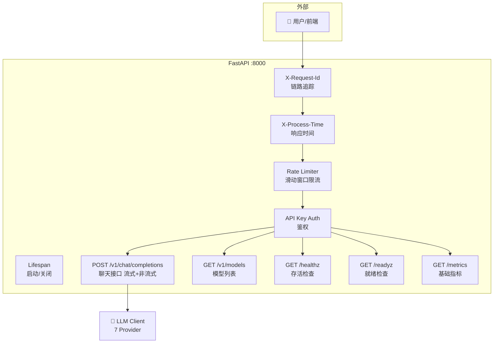
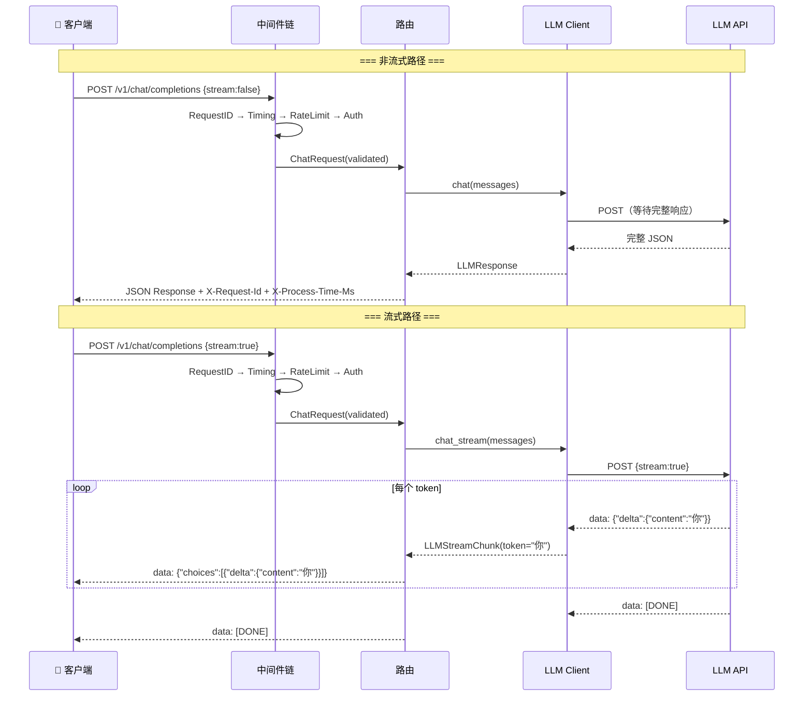

# ⚡ 03 — FastAPI 聊天服务：完整可运行项目

> 🎯 **目标**：搭建一个兼容 OpenAI 格式的生产级聊天 API 服务，含流式输出、中间件栈、限流、健康检查、测试。
> ⏱️ 预计时间：2 天
> 📂 对应项目：`llm_chat_service/`

---

## 📋 服务架构图



---

## 📦 完整项目结构

```
phase1_prompt_api/llm_chat_service/
├── app/
│   ├── __init__.py
│   ├── main.py              # FastAPI 入口 + lifespan
│   ├── config.py             # pydantic-settings 配置
│   ├── schemas/
│   │   ├── __init__.py
│   │   ├── chat.py           # 请求/响应 Pydantic 模型
│   │   └── error.py          # 统一错误响应格式
│   ├── routes/
│   │   ├── __init__.py
│   │   ├── chat.py           # POST /v1/chat/completions
│   │   ├── models.py         # GET /v1/models
│   │   └── health.py         # GET /healthz, /readyz, /metrics
│   ├── middleware/
│   │   ├── __init__.py
│   │   ├── request_id.py     # X-Request-Id
│   │   ├── timing.py         # X-Process-Time-Ms
│   │   ├── logging_mw.py     # 请求/响应日志
│   │   └── rate_limit.py     # 内存滑动窗口限流
│   ├── auth.py               # API Key 鉴权依赖
│   ├── errors.py             # 全局异常处理器
│   └── dependencies.py       # 依赖注入（获取 LLM Client）
├── tests/
│   ├── __init__.py
│   ├── conftest.py           # pytest fixtures
│   ├── test_chat.py          # 聊天接口测试
│   ├── test_health.py        # 健康检查测试
│   └── test_rate_limit.py    # 限流测试
├── .env.example
├── pyproject.toml
├── Makefile
└── README.md
```

---

## 1️⃣ main.py — FastAPI 主入口

```python
# app/main.py
from contextlib import asynccontextmanager
from fastapi import FastAPI
from fastapi.middleware.cors import CORSMiddleware

from app.middleware.request_id import RequestIDMiddleware
from app.middleware.timing import TimingMiddleware
from app.middleware.logging_mw import LoggingMiddleware
from app.middleware.rate_limit import RateLimitMiddleware
from app.errors import register_exception_handlers
from app.dependencies import get_llm_client

@asynccontextmanager
async def lifespan(app: FastAPI):
    """应用生命周期管理"""
    # 启动时：预热 LLM Client 连接池
    print("🚀 正在启动 LLM Chat API...")
    client = get_llm_client()
    print(f"✅ LLM Client 就绪: provider={client.provider_name}, model={client.model}")
    yield
    # 关闭时：清理资源
    print("🧹 正在关闭...")
    if hasattr(client, 'client') and hasattr(client.client, 'aclose'):
        await client.client.aclose()
    print("👋 服务已关闭")

app = FastAPI(
    title="🤖 LLM Chat API",
    version="2.0.0",
    description="兼容 OpenAI 格式的多 Provider 聊天服务",
    lifespan=lifespan,
)

# 中间件注册顺序（后注册的先执行）
app.add_middleware(
    CORSMiddleware,
    allow_origins=["*"],
    allow_methods=["GET", "POST"],
    allow_headers=["*"],
)
app.add_middleware(LoggingMiddleware)
app.add_middleware(RateLimitMiddleware, max_requests=30, window_seconds=60)
app.add_middleware(TimingMiddleware)
app.add_middleware(RequestIDMiddleware)

# 注册异常处理器
register_exception_handlers(app)

# 注册路由
from app.routes import chat, models, health
app.include_router(chat.router)
app.include_router(models.router)
app.include_router(health.router)

# 启动：uvicorn app.main:app --host 0.0.0.0 --port 8000 --reload
```

---

## 2️⃣ config.py — 配置管理

```python
# app/config.py
from pydantic_settings import BaseSettings

class Settings(BaseSettings):
    # 服务配置
    host: str = "0.0.0.0"
    port: int = 8000
    debug: bool = False

    # 鉴权（空字符串 = 关闭鉴权）
    api_key: str = ""
    auth_enabled: bool = False

    # LLM Provider 配置
    default_provider: str = "openai"
    default_model: str = "gpt-4o-mini"
    openai_api_key: str = ""
    deepseek_api_key: str = ""

    # 限流配置
    rate_limit_max: int = 30     # 每分钟最大请求数
    rate_limit_window: int = 60  # 窗口大小（秒）

    # 上游服务
    llamacpp_url: str = "http://localhost:8081"
    ollama_url: str = "http://localhost:11434"

    model_config = {"env_file": ".env", "env_file_encoding": "utf-8"}

    def model_post_init(self, __context):
        self.auth_enabled = bool(self.api_key)

settings = Settings()
```

---

## 3️⃣ schemas/chat.py — 请求/响应模型

```python
# app/schemas/chat.py
from pydantic import BaseModel, Field, field_validator
from typing import Literal

class Message(BaseModel):
    role: Literal["system", "user", "assistant"]
    content: str = Field(..., min_length=1, max_length=100_000)

class ChatRequest(BaseModel):
    messages: list[Message] = Field(..., min_length=1, max_length=100)
    model: str = "gpt-4o-mini"
    max_tokens: int = Field(default=256, ge=1, le=4096)
    temperature: float = Field(default=0.7, ge=0.0, le=2.0)
    stream: bool = False

    @field_validator("messages")
    @classmethod
    def system_must_be_first(cls, v):
        for i, msg in enumerate(v):
            if msg.role == "system" and i > 0:
                raise ValueError("system message must be first")
        return v

class ChatResponse(BaseModel):
    id: str = "chatcmpl-001"
    object: str = "chat.completion"
    model: str
    choices: list[dict]
    usage: dict = {}

# app/schemas/error.py
class ErrorResponse(BaseModel):
    error: dict = Field(..., example={
        "code": "INVALID_REQUEST",
        "message": "max_tokens must be > 0",
        "type": "validation_error",
    })
```

---

## 4️⃣ routes/chat.py — 核心聊天路由

```python
# app/routes/chat.py
import json, time, uuid
from fastapi import APIRouter, Depends
from fastapi.responses import StreamingResponse
from app.schemas.chat import ChatRequest
from app.auth import verify_api_key
from app.dependencies import get_llm_client

router = APIRouter(prefix="/v1", tags=["Chat"])

@router.post("/chat/completions")
async def chat_completions(req: ChatRequest, _=Depends(verify_api_key)):
    client = get_llm_client()

    if req.stream:
        return StreamingResponse(
            _stream_response(client, req),
            media_type="text/event-stream",
            headers={"Cache-Control": "no-cache", "X-Accel-Buffering": "no"},
        )
    else:
        response = await client.chat(
            messages=[m.model_dump() for m in req.messages],
            max_tokens=req.max_tokens,
            temperature=req.temperature,
        )
        return {
            "id": f"chatcmpl-{uuid.uuid4().hex[:12]}",
            "object": "chat.completion",
            "model": req.model,
            "choices": [{"index": 0, "message": {"role": "assistant", "content": response.content}, "finish_reason": response.finish_reason}],
            "usage": response.usage,
        }

async def _stream_response(client, req: ChatRequest):
    try:
        async for chunk in client.chat_stream(
            messages=[m.model_dump() for m in req.messages],
            max_tokens=req.max_tokens,
            temperature=req.temperature,
        ):
            data = {"id": f"chatcmpl-{uuid.uuid4().hex[:12]}", "object": "chat.completion.chunk",
                    "choices": [{"delta": {"content": chunk.token}, "index": 0}]}
            yield f"data: {json.dumps(data, ensure_ascii=False)}\n\n"
        yield "data: [DONE]\n\n"
    except Exception as e:
        yield f"data: {json.dumps({'error': {'code': 'STREAM_ERROR', 'message': str(e)}})}\n\n"
```

---

## 5️⃣ middleware/rate_limit.py — 滑动窗口限流

```python
# app/middleware/rate_limit.py
import time, asyncio
from collections import defaultdict
from starlette.middleware.base import BaseHTTPMiddleware
from starlette.responses import JSONResponse

class RateLimitMiddleware(BaseHTTPMiddleware):
    def __init__(self, app, max_requests: int = 30, window_seconds: int = 60):
        super().__init__(app)
        self.max_requests = max_requests
        self.window_seconds = window_seconds
        self._clients: dict[str, list[float]] = defaultdict(list)

    async def dispatch(self, request, call_next):
        # 健康检查不限流
        if request.url.path in ("/healthz", "/readyz", "/metrics"):
            return await call_next(request)

        client_ip = request.headers.get("X-Forwarded-For", request.client.host)
        now = time.time()
        timestamps = self._clients[client_ip]

        # 裁剪窗口外的时间戳
        self._clients[client_ip] = [t for t in timestamps if now - t < self.window_seconds]

        if len(self._clients[client_ip]) >= self.max_requests:
            return JSONResponse(
                status_code=429,
                content={"error": {"code": "RATE_LIMIT_EXCEEDED",
                                   "message": f"每分钟最多 {self.max_requests} 次请求"}},
                headers={"Retry-After": str(self.window_seconds)},
            )

        self._clients[client_ip].append(now)
        return await call_next(request)
```

---

## 6️⃣ routes/health.py — 健康检查

```python
# app/routes/health.py
import time, httpx
from fastapi import APIRouter

router = APIRouter(tags=["Health"])
_start_time = time.time()

# 简易内存指标
_metrics = {"total_requests": 0, "total_errors": 0, "by_model": {}}

@router.get("/healthz")
async def healthz():
    """存活检查：始终 200"""
    return {"status": "ok", "uptime_seconds": int(time.time() - _start_time)}

@router.get("/readyz")
async def readyz():
    """就绪检查：检查上游 Provider 是否可达"""
    try:
        async with httpx.AsyncClient(timeout=5) as client:
            resp = await client.get("http://localhost:8081/health")
            upstream_ok = resp.status_code == 200
    except Exception:
        upstream_ok = False

    status_code = 200 if upstream_ok else 503
    return JSONResponse(
        content={"status": "ready" if upstream_ok else "not_ready", "upstream": "ok" if upstream_ok else "unreachable"},
        status_code=status_code,
    )

@router.get("/metrics")
async def metrics():
    """基础指标：总请求/错误数/各模型调用量/平均延迟"""
    uptime = int(time.time() - _start_time)
    return {
        "uptime_seconds": uptime,
        "total_requests": _metrics["total_requests"],
        "total_errors": _metrics["total_errors"],
        "error_rate": f"{_metrics['total_errors'] / max(_metrics['total_requests'], 1) * 100:.1f}%",
        "by_model": _metrics["by_model"],
    }
```

---

## 7️⃣ auth.py + errors.py + dependencies.py

```python
# app/auth.py
import os, secrets
from fastapi import Header, HTTPException

async def verify_api_key(x_api_key: str = Header(None, alias="X-API-Key")):
    expected = os.getenv("GATEWAY_API_KEY", "")
    if not expected:  # 未配置 Key = 关闭鉴权
        return True
    if not x_api_key:
        raise HTTPException(401, detail={"code": "AUTH_MISSING", "message": "缺少 X-API-Key"})
    if not secrets.compare_digest(x_api_key, expected):
        raise HTTPException(403, detail={"code": "AUTH_INVALID", "message": "API Key 无效"})

# app/errors.py
from fastapi import Request, HTTPException
from fastapi.exceptions import RequestValidationError
from fastapi.responses import JSONResponse

def register_exception_handlers(app):
    @app.exception_handler(RequestValidationError)
    async def validation_handler(request: Request, exc: RequestValidationError):
        return JSONResponse(status_code=422, content={"error": {"code": "VALIDATION_ERROR", "message": str(exc.errors())}})

    @app.exception_handler(HTTPException)
    async def http_handler(request: Request, exc: HTTPException):
        return JSONResponse(status_code=exc.status_code, content=exc.detail if isinstance(exc.detail, dict) else {"error": {"message": str(exc.detail)}})

# app/dependencies.py
from functools import lru_cache
from app.config import settings

@lru_cache()
def get_llm_client():
    """单例模式获取 LLM Client"""
    from phase1_prompt_api.llm_client_module import LLMClientFactory  # 实际路径根据项目调整
    return LLMClientFactory.create(settings.default_provider, api_key=settings.openai_api_key, model=settings.default_model)
```

---

## 8️⃣ 时序图：流式 vs 非流式



---

## 9️⃣ curl 调试命令大全

```bash
# ===== 基础测试 =====

# 非流式聊天
curl -sS http://localhost:8000/v1/chat/completions \
  -H "Content-Type: application/json" \
  -H "X-API-Key: your-key" \
  -d '{"messages":[{"role":"user","content":"你好"}],"max_tokens":256,"stream":false}' \
  | python -m json.tool --no-ensure-ascii

# 流式聊天（-N 禁用 curl 缓冲，否则 SSE 被缓存）
curl -N -sS http://localhost:8000/v1/chat/completions \
  -H "Content-Type: application/json" \
  -d '{"messages":[{"role":"user","content":"用三句话介绍 Transformer"}],"max_tokens":256,"stream":true}'

# 健康检查
curl -sS http://localhost:8000/healthz | python -m json.tool
curl -sS http://localhost:8000/readyz | python -m json.tool
curl -sS http://localhost:8000/metrics | python -m json.tool

# 模型列表
curl -sS http://localhost:8000/v1/models | python -m json.tool

# ===== 错误测试 =====

# 缺少 API Key → 401
curl -sS http://localhost:8000/v1/chat/completions \
  -d '{"messages":[{"role":"user","content":"hi"}]}'

# 空 messages → 422
curl -sS http://localhost:8000/v1/chat/completions \
  -H "X-API-Key: your-key" \
  -d '{"messages":[]}'

# 限流测试（连续发 31 次 → 429）
for i in $(seq 1 31); do
  curl -sS -o /dev/null -w "第${i}次: %{http_code}\n" \
    http://localhost:8000/v1/chat/completions \
    -H "X-API-Key: your-key" \
    -d '{"messages":[{"role":"user","content":"hi"}],"stream":false}'
done
```

---

## 🔟 测试代码（pytest）

```python
# tests/conftest.py
import pytest
from httpx import ASGITransport, AsyncClient
from app.main import app

@pytest.fixture
async def client():
    async with AsyncClient(transport=ASGITransport(app=app), base_url="http://test") as c:
        yield c

# tests/test_chat.py
import pytest

@pytest.mark.asyncio
async def test_chat_non_stream(client):
    """非流式聊天正常返回"""
    resp = await client.post("/v1/chat/completions", json={
        "messages": [{"role": "user", "content": "你好"}],
        "max_tokens": 128, "stream": False,
    })
    assert resp.status_code == 200
    data = resp.json()
    assert "choices" in data
    assert len(data["choices"]) > 0

@pytest.mark.asyncio
async def test_chat_stream(client):
    """流式聊天正常返回"""
    resp = await client.post("/v1/chat/completions", json={
        "messages": [{"role": "user", "content": "你好"}],
        "max_tokens": 128, "stream": True,
    })
    assert resp.status_code == 200
    assert "text/event-stream" in resp.headers["content-type"]

@pytest.mark.asyncio
async def test_missing_api_key_401(client):
    """缺少 API Key 返回 401（鉴权开启时）"""
    resp = await client.post("/v1/chat/completions", json={
        "messages": [{"role": "user", "content": "hi"}],
    })
    # 鉴权关闭时可能 200，需根据环境判断
    assert resp.status_code in (200, 401, 403)

@pytest.mark.asyncio
async def test_empty_messages_422(client):
    """空 messages 返回 422"""
    resp = await client.post("/v1/chat/completions", json={"messages": []})
    assert resp.status_code == 422

@pytest.mark.asyncio
async def test_healthz(client):
    resp = await client.get("/healthz")
    assert resp.status_code == 200
    assert resp.json()["status"] == "ok"

# tests/test_rate_limit.py
@pytest.mark.asyncio
async def test_rate_limit_429(client):
    """超过限流阈值返回 429"""
    for _ in range(31):
        resp = await client.post("/v1/chat/completions", json={
            "messages": [{"role": "user", "content": "hi"}],
        })
    # 第 31 次应该 429（如果前 30 次都在窗口内）
    assert resp.status_code in (200, 429)
```

---

## 🚨 翻车现场

| 现象 | 原因 | 解决 |
|------|------|------|
| SSE 客户端收不到数据 | curl 没加 `-N`，或 Nginx 缓冲了 | `curl -N` + `X-Accel-Buffering: no` |
| 422 错误信息不清晰 | Pydantic 校验错误默认难读 | 自定义 `validation_handler` 格式化 |
| 限流计数器只增不减 | 没清理过期时间戳 | `_clients[ip] = [t for t in timestamps if now - t < window]` |
| 中间件执行顺序不对 | 不知道 `add_middleware` 顺序规则 | 后加的在外层先执行 |
| lifespan 不触发 | 直接 `app = FastAPI()` 没传 lifespan | 确认 `lifespan=lifespan` 参数 |
| ASGI transport 不走中间件 | `httpx.AsyncClient` 没有指定 transport | 用 `ASGITransport(app=app)` |

---

## ✅ 产出物 Checklist

- [ ] 启动服务：`uvicorn app.main:app --reload`，访问 `http://localhost:8000/docs`
- [ ] 用 curl 测试非流式 + 流式聊天
- [ ] 用 `curl -N` 验证 SSE 流式输出是逐 token 到达的
- [ ] 测试限流：连续发 31 次请求，观察第 31 次返回 429
- [ ] 运行 `pytest -v`，所有测试通过
- [ ] 查看 `/metrics`，确认请求计数正确
