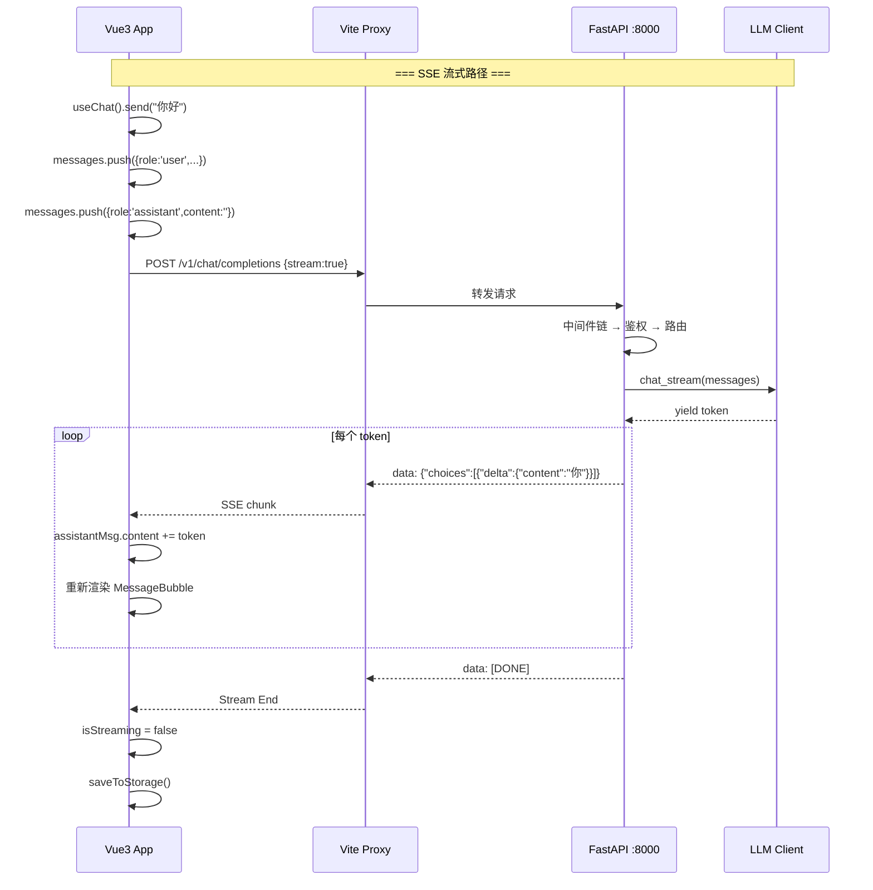

# 🌐 04 — Web Chat Demo：完整前端项目

> 🎯 **目标**：用 Vue 3 + TypeScript 搭建一个功能完整的聊天界面，SSE 流式 + Markdown 渲染 + 多对话管理 + localStorage 持久化。
> ⏱️ 预计时间：2 天
> 📂 对应项目：`web_chat/`

---

## 📋 前后端联调架构

```
┌─────────────────┐     SSE Stream       ┌──────────────────┐     HTTP/SSE      ┌─────────────────┐
│   Vue3 App      │ ◄══════════════════  │  Vite Proxy       │ ◄─────────────── │  FastAPI        │
│   :5173         │   text/event-stream  │  (dev only)       │                  │  :8000          │
│                 │                      │                   │                  │                 │
│  ChatPanel      │ ──── POST /v1/chat ─►│ ─────────────────►│  LLM Client      │ ────►  LLM API  │
│  Sidebar        │                      │                   │                  │                 │
│  useChat()      │                      │                   │                  │                 │
└─────────────────┘                      └──────────────────┘                  └─────────────────┘

生产环境：Vue3 → Nginx → FastAPI（去掉 Vite Proxy）
```

---

## 📦 完整项目结构

```
phase1_prompt_api/web_chat/
├── index.html
├── package.json
├── vite.config.ts
├── tsconfig.json
├── README.md
└── src/
    ├── main.ts
    ├── App.vue
    ├── api/
    │   └── llm.ts                 # SSE 流式 + 非流式请求
    ├── composables/
    │   ├── useChat.ts             # 聊天状态管理
    │   └── useTheme.ts            # 亮/暗主题切换
    ├── components/
    │   ├── ChatPanel.vue          # 主聊天面板
    │   ├── MessageBubble.vue      # 消息气泡（Markdown 渲染 + 代码高亮）
    │   ├── ChatInput.vue          # 输入框 + 发送/停止
    │   ├── Sidebar.vue            # 对话列表侧栏
    │   └── ErrorBanner.vue        # 错误提示横幅
    ├── stores/
    │   └── chatStore.ts           # Pinia 全局状态
    ├── types/
    │   └── index.ts               # TypeScript 类型定义
    └── styles/
        └── global.css             # 暗色主题 + 响应式
```

---

## 1️⃣ 项目初始化

```bash
npm create vite@latest web-chat -- --template vue-ts
cd web-chat
npm install
npm install marked highlight.js pinia
npm install -D @types/marked
npm run dev   # → http://localhost:5173
```

---

## 2️⃣ SSE 流式客户端（含非流式）

```typescript
// src/api/llm.ts
import type { Message, ChatResponse } from '../types'

const API_BASE = '/v1'  // Vite proxy 转发到 :8000

export async function* streamChat(
  messages: Message[],
  signal?: AbortSignal,
): AsyncGenerator<string> {
  const response = await fetch(`${API_BASE}/chat/completions`, {
    method: 'POST',
    headers: { 'Content-Type': 'application/json' },
    body: JSON.stringify({
      messages,
      max_tokens: 1024,
      temperature: 0.7,
      stream: true,
    }),
    signal,
  })

  if (!response.ok) {
    const err = await response.json().catch(() => ({}))
    throw new Error(err.error?.message || `HTTP ${response.status}`)
  }

  const reader = response.body!.getReader()
  const decoder = new TextDecoder()
  let buffer = ''

  while (true) {
    const { done, value } = await reader.read()
    if (done) break

    buffer += decoder.decode(value, { stream: true })
    const lines = buffer.split('\n')
    buffer = lines.pop() || ''

    for (const line of lines) {
      if (line === 'data: [DONE]') return
      if (!line.startsWith('data: ')) continue
      try {
        const chunk = JSON.parse(line.slice(6))
        const token = chunk.choices?.[0]?.delta?.content
        if (token) yield token
      } catch { /* skip non-JSON lines */ }
    }
  }
}

export async function chatNonStream(messages: Message[]): Promise<ChatResponse> {
  const resp = await fetch(`${API_BASE}/chat/completions`, {
    method: 'POST',
    headers: { 'Content-Type': 'application/json' },
    body: JSON.stringify({ messages, max_tokens: 1024, stream: false }),
  })
  if (!resp.ok) throw new Error(`HTTP ${resp.status}`)
  return resp.json()
}
```

---

## 3️⃣ TypeScript 类型定义

```typescript
// src/types/index.ts
export interface Message {
  id: string
  role: 'system' | 'user' | 'assistant'
  content: string
  timestamp: number
}

export interface Conversation {
  id: string
  title: string           // 自动截取首条用户消息
  messages: Message[]
  createdAt: number
  updatedAt: number
}

export interface ChatResponse {
  id: string
  choices: Array<{
    message: { role: string; content: string }
    finish_reason: string
  }>
  usage: Record<string, number>
}
```

---

## 4️⃣ useChat Composable（增强版）

```typescript
// src/composables/useChat.ts
import { ref, computed } from 'vue'
import { streamChat } from '../api/llm'
import type { Message, Conversation } from '../types'

export function useChat() {
  const conversations = ref<Conversation[]>(loadFromStorage())
  const activeId = ref<string>(conversations.value[0]?.id || '')
  const isStreaming = ref(false)
  const error = ref<string | null>(null)
  let abortController: AbortController | null = null

  const activeConversation = computed(() =>
    conversations.value.find(c => c.id === activeId.value)
  )

  // --- 对话管理 ---
  function newConversation() {
    const conv: Conversation = {
      id: Date.now().toString(36),
      title: '新对话',
      messages: [],
      createdAt: Date.now(),
      updatedAt: Date.now(),
    }
    conversations.value.unshift(conv)
    activeId.value = conv.id
    saveToStorage(conversations.value)
  }

  function switchConversation(id: string) {
    activeId.value = id
  }

  function deleteConversation(id: string) {
    conversations.value = conversations.value.filter(c => c.id !== id)
    if (activeId.value === id) {
      activeId.value = conversations.value[0]?.id || ''
      if (!activeId.value) newConversation()
    }
    saveToStorage(conversations.value)
  }

  // --- 发送消息 ---
  async function send(userInput: string) {
    if (!userInput.trim() || isStreaming.value) return
    error.value = null

    const conv = activeConversation.value
    if (!conv) return

    // 首条消息作为标题
    if (conv.messages.length === 0) {
      conv.title = userInput.slice(0, 20) + (userInput.length > 20 ? '...' : '')
    }

    conv.messages.push({ id: uid(), role: 'user', content: userInput, timestamp: Date.now() })
    const assistantMsg: Message = { id: uid(), role: 'assistant', content: '', timestamp: Date.now() }
    conv.messages.push(assistantMsg)

    abortController = new AbortController()
    isStreaming.value = true
    saveToStorage(conversations.value)

    try {
      const gen = streamChat(
        conv.messages.filter(m => m.content).map(m => ({ role: m.role, content: m.content })),
        abortController.signal,
      )
      for await (const token of gen) {
        assistantMsg.content += token
      }
    } catch (e: any) {
      if (e.name === 'AbortError') {
        assistantMsg.content += ' [已停止]'
      } else {
        error.value = e.message
      }
    } finally {
      isStreaming.value = false
      abortController = null
      conv.updatedAt = Date.now()
      saveToStorage(conversations.value)
    }
  }

  function stop() { abortController?.abort() }
  function clearError() { error.value = null }

  return {
    conversations, activeId, activeConversation, isStreaming, error,
    send, stop, clearError,
    newConversation, switchConversation, deleteConversation,
  }
}

// --- localStorage 持久化 ---
function saveToStorage(convs: Conversation[]) {
  try { localStorage.setItem('web-chat-conversations', JSON.stringify(convs)) }
  catch { /* quota exceeded */ }
}

function loadFromStorage(): Conversation[] {
  try {
    const data = localStorage.getItem('web-chat-conversations')
    return data ? JSON.parse(data) : []
  } catch { return [] }
}

function uid() { return Date.now().toString(36) + Math.random().toString(36).slice(2, 8) }
```

---

## 5️⃣ MessageBubble — Markdown 渲染 + 代码高亮

```vue
<!-- src/components/MessageBubble.vue -->
<script setup lang="ts">
import { computed } from 'vue'
import { marked } from 'marked'
import hljs from 'highlight.js'
import type { Message } from '../types'

const props = defineProps<{ message: Message }>()

// 配置 marked
marked.setOptions({
  highlight(code, lang) {
    if (lang && hljs.getLanguage(lang)) {
      return hljs.highlight(code, { language: lang }).value
    }
    return hljs.highlightAuto(code).value
  },
})

const renderedContent = computed(() => {
  if (props.message.role === 'user') return escapeHtml(props.message.content)
  return marked.parse(props.message.content) as string
})

// 代码块复制功能
function copyCode(event: Event) {
  const btn = event.target as HTMLElement
  const code = btn.closest('.code-block')?.querySelector('code')?.textContent
  if (code) navigator.clipboard.writeText(code)
  btn.textContent = '✅ 已复制'
  setTimeout(() => { btn.textContent = '📋 复制' }, 2000)
}
</script>

<template>
  <div :class="['message-bubble', message.role]">
    <div class="role-icon">{{ message.role === 'user' ? '👤' : '🤖' }}</div>
    <div class="content" v-html="renderedContent" @click="copyCode" />
    <div class="time">{{ new Date(message.timestamp).toLocaleTimeString() }}</div>
  </div>
</template>
```

---

## 6️⃣ Sidebar — 多对话列表

```vue
<!-- src/components/Sidebar.vue -->
<script setup lang="ts">
defineProps<{
  conversations: Conversation[]
  activeId: string
}>()
const emit = defineEmits(['switch', 'delete', 'new'])
</script>

<template>
  <aside class="sidebar">
    <button class="new-chat-btn" @click="emit('new')">＋ 新建对话</button>
    <div class="conversation-list">
      <div
        v-for="conv in conversations" :key="conv.id"
        :class="['conv-item', { active: conv.id === activeId }]"
        @click="emit('switch', conv.id)"
      >
        <span class="conv-title">{{ conv.title }}</span>
        <span class="conv-date">{{ new Date(conv.updatedAt).toLocaleDateString() }}</span>
        <button class="delete-btn" @click.stop="emit('delete', conv.id)">🗑️</button>
      </div>
    </div>
  </aside>
</template>
```

---

## 7️⃣ 前后端联调时序图



---

## 8️⃣ 响应式设计

```css
/* src/styles/global.css 关键部分 */
:root {
  --sidebar-width: 260px;
  --bg: #1a1a2e;
  --surface: #16213e;
  --accent: #e94560;
}

/* 桌面端 */
.layout { display: flex; height: 100vh; }
.sidebar { width: var(--sidebar-width); flex-shrink: 0; }
.chat-area { flex: 1; }

/* 移动端 < 768px */
@media (max-width: 768px) {
  .sidebar { position: fixed; bottom: 0; width: 100%; height: 60px;
             flex-direction: row; overflow-x: auto; z-index: 100; }
  .chat-area { padding-bottom: 60px; }
  .message-bubble .content { max-width: 90%; }
}
```

---

## 🚨 翻车现场

| 现象 | 原因 | 解决 |
|------|------|------|
| SSE 数据不渲染 | 缓冲区拼接 bug | 确认 `buffer = lines.pop()` 逻辑 |
| 停止按钮不生效 | 没传 `AbortSignal` | fetch 第二个参数传 `{ signal }` |
| Markdown 表格不显示 | marked 默认不渲染表格 | `marked.setOptions({ gfm: true })` |
| localStorage 满了 | 对话太多 | 限制最大对话数（如 50 个） |
| 切换对话后消息闪烁 | key 没绑定好 | Vue `:key="conv.id"` 确保正确 |
| 代码块复制不了 | 动态内容事件丢失 | 用事件委托 `@click="copyCode"` |
| 移动端侧栏挤占空间 | 没做响应式 | `@media (max-width: 768px)` 侧栏改底部 Tab |

---

## ✅ 产出物 Checklist

- [ ] `npm create vite` 初始化项目，`npm run dev` 看到页面
- [ ] 配置 Vite proxy，前端能调通本地 FastAPI
- [ ] SSE 流式 token 逐字渲染（不是等全部完成才显示）
- [ ] Markdown 渲染：标题/列表/粗体/代码块/表格
- [ ] 代码块语法高亮 + 复制按钮
- [ ] 刷新页面后对话历史还在（localStorage）
- [ ] 支持新建/切换/删除对话
- [ ] 移动端浏览器打开，布局自适应
