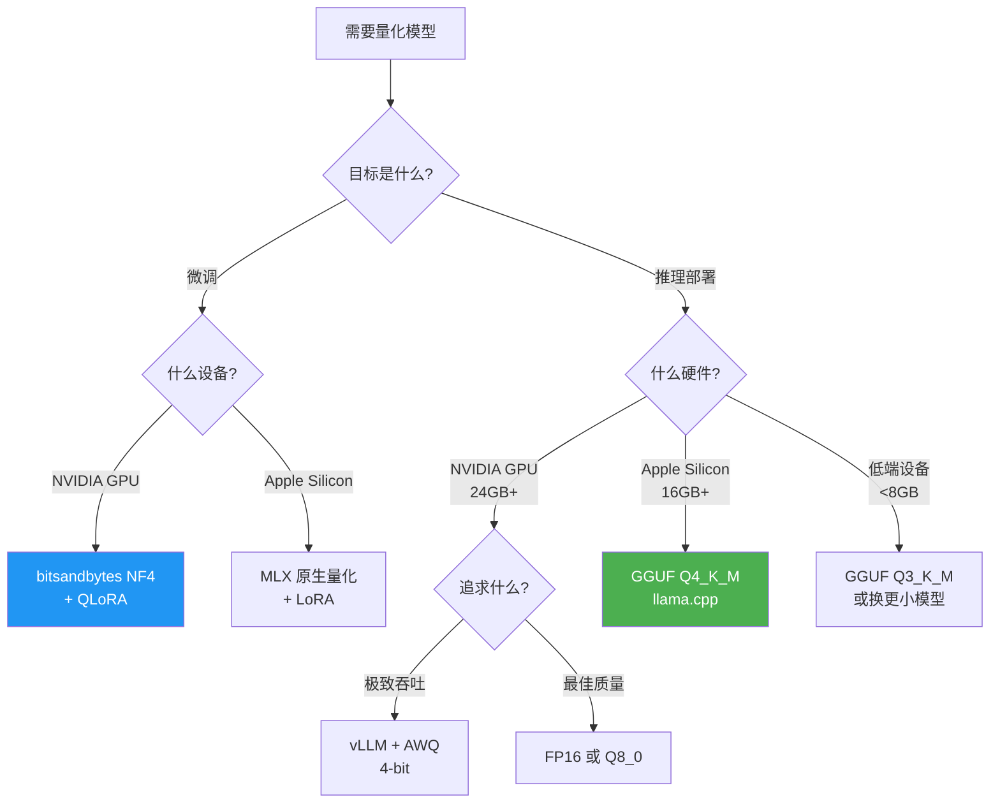

# ⚖️ 08 — 量化技术：让你的 7B 模型塞进 8GB 内存

> 🎯 **目标**：理解量化的原理、主流方法和 GGUF 生态，能根据显存预算选择量化级别。
> ⏱️ 预计时间：1 天

---

## 📋 为什么量化是大模型入门的必修课？

你 Mac 只有 16GB 统一内存，7B 模型 FP16 格式占 14GB，系统还要吃 2-3GB——不量化根本跑不动。

| 场景 | 不加量化 | 加量化 |
|------|---------|--------|
| 7B 模型 + 16GB Mac | 💀 OOM | ✅ Q4_K_M = 4.7GB，轻松跑 |
| 70B 模型 + 24GB 显卡 | 💀 不可能 | ✅ Q4 = 40GB 需要双卡…还是难 😅 |
| 推理速度 | 基准 | Q4 可能反而更快（数据量小，HBM 带宽瓶颈） |

---

## 1️⃣ 数值精度速查

| 精度 | 位数 | 范围 | 7B 模型大小 | 用途 |
|------|------|------|-----------|------|
| **FP32** | 32 bit | ±3.4×10³⁸ | 28 GB | 原始训练权重 |
| **FP16** | 16 bit | ±65504 | 14 GB | 推理基准 |
| **BF16** | 16 bit | ±3.4×10³⁸ | 14 GB | 训练（范围大不怕溢出） |
| **INT8** | 8 bit | ±127 | 7 GB | 量化推理 |
| **INT4** | 4 bit | -8~7 | 3.5 GB | 极限压缩 |

> 💡 BF16 vs FP16：BF16 指数位多（8 vs 5），和 FP32 范围一样大，训练时不会溢出。FP16 尾数位多，推理精度略高。Apple Silicon 用 FP16。

---

## 2️⃣ 量化本质（10 分钟搞懂）

### 📌 对称量化

```
原始值（FP16）:   W = [0.5, -1.2, 3.4, -0.8]

Step 1: 找最大绝对值  scale = max(|W|) = 3.4

Step 2: 计算缩放因子   scale = 3.4 / 127 ≈ 0.0268

Step 3: 量化            W_int8 = round(W / scale) = [19, -45, 127, -30]

Step 4: 反量化（使用时） W_approx = W_int8 × scale ≈ [0.509, -1.206, 3.404, -0.804]
                                                         ↑
                                                   量化误差 ≈ 0.009
```

### 📌 量化误差来源

```
量化误差 = W_approx - W_original

误差大小取决于：
1. 离群值（outlier）：一个特别大的值会让 scale 变大 → 其他值的精度被"挤掉"
2. 量化级别：4-bit 只有 16 个值，8-bit 有 256 个值 → 4-bit 误差更大
```

---

## 3️⃣ 4-bit 对称量化：8 个权重的完整数值示例

> 用实际数字走一遍量化全过程，理解每一步的数值变化。

```
假设一个权重矩阵的某一行（FP16）:
W = [0.32, -0.85, 1.47, -2.10, 0.06, -0.43, 3.01, -1.58]

Step 1 — 找最大绝对值:
  max(|W|) = 3.01

Step 2 — 计算缩放因子（4-bit 范围 = [-8, 7]，共 16 个值）:
  scale = 3.01 / 7 ≈ 0.4300

Step 3 — 量化 (round to nearest integer):
  W_int4 = round(W / scale)
         = round([0.74, -1.98, 3.42, -4.88, 0.14, -1.00, 7.00, -3.67])
         = [1, -2, 3, -5, 0, -1, 7, -4]

Step 4 — 反量化（推理时）:
  W_approx = W_int4 × scale
           = [0.43, -0.86, 1.29, -2.15, 0.00, -0.43, 3.01, -1.72]

Step 5 — 误差分析:
  原始:    [ 0.32, -0.85,  1.47, -2.10,  0.06, -0.43,  3.01, -1.58]
  还原:    [ 0.43, -0.86,  1.29, -2.15,  0.00, -0.43,  3.01, -1.72]
  绝对误差: [ 0.11, -0.01, -0.18, -0.05, -0.06,  0.00,  0.00, -0.14]
                                        ↑              ↑          ↑
                                    0.06→0.00      3.01→3.01  -1.58→-1.72
                                    被"挤掉"！      最大值完美     偏差 0.14

关键观察:
  - 最大值 3.01 量化后完美还原（它定义了 scale）
  - 小值 0.06 被量化到 0 → 完全丢失
  - 离群值决定了精度天花板：如果有一个值是 100，scale=14.3，其他值全是 0
```

---

## 4️⃣ GPTQ 算法流程

> GPTQ = 逐列量化 + 贪心补偿。比"一刀切"量化更精细。

```
输入: FP16 权重矩阵 W，校准数据集 D
输出: INT4 量化权重

Step 1 — 用校准数据跑一遍前向传播
  收集每一层的激活值，构建 Hessian 矩阵 H（二阶导数近似）
  H 反映了每个权重对最终 loss 的敏感度

Step 2 — 逐列量化（从第一列到最后一列）
  for 每一列 j:
    a) 将该列权重量化到 INT4
    b) 计算量化误差 Δ = W_quant[j] - W[j]
    c) 🔑 贪心补偿: 把误差 Δ 按照 H 的逆矩阵分配到剩余未量化的列
       这样后续列的量化会"吸收"前面列的误差

Step 3 — 重复 Step 2，直到所有列量化完成

为什么需要校准数据？
  - 没有校准数据 → 无法计算 Hessian → 不知道哪些权重重要
  - GPTQ 用 Hessian 信息补偿误差 → 比"一刀切"量化质量高 10-20%
```

---

## 5️⃣ AWQ 的"重要通道"检测方法

> 核心发现：不是所有权重都一样重要。激活值大的 channel 权重敏感度更高。

```
检测流程:

1. 用校准数据跑一次前向传播，记录每层输入 X

2. 对每个线性层 W，计算每个输入 channel 的平均激活值:
   s_j = mean(|X[:, j]|)   # channel j 的平均激活幅度

3. 根据 s_j 计算每个 channel 的缩放因子:
   # 激活值大的 channel → 缩小权重值 → 量化误差影响小
   scale_j = s_j^α        # α 通常取 0.5

4. 应用缩放:
   W'[j, :] = W[j, :] / scale_j    # 权重缩放
   X'[:, j] = X[:, j] * scale_j    # 激活反缩放（等价变换）

5. 对 W' 进行标准 4-bit 量化

伪代码:
```python
# AWQ 核心逻辑（简化版）
X = collect_activations(model, calibration_data)

for layer in model.layers:
    s = X[layer].abs().mean(dim=0)  # [in_features]
    scale = s ** 0.5
    layer.weight.data /= scale.view(-1, 1)
    layer.weight_quant = quantize(layer.weight.data, bits=4)
    # 推理时: output = dequant(weight_quant) @ (input * scale)
```

效果: 比 GPTQ 更快（不需要 Hessian），同等 4-bit 质量更高
```

---

## 6️⃣ llama.cpp 量化实操：从 F16 到 Q4_K_M

```bash
# ===== 完整量化流程 =====

# 1. 下载或转换出 FP16 GGUF 文件
#    如果已有 HuggingFace 模型，先转 GGUF:
python convert_hf_to_gguf.py Qwen/Qwen2.5-7B-Instruct \
  --outfile qwen2.5-7b-f16.gguf \
  --outtype f16

# 2. 查看可用的量化类型
./llama-quantize --help
# 输出: Q4_0, Q4_1, Q5_0, Q5_1, Q8_0, Q2_K, Q3_K_S, Q3_K_M, Q3_K_L,
#        Q4_K_S, Q4_K_M, Q5_K_S, Q5_K_M, Q6_K, IQ4_XS, IQ3_XXS...

# 3. 量化到 Q4_K_M（最常用）
./llama-quantize \
  qwen2.5-7b-f16.gguf \
  qwen2.5-7b-Q4_K_M.gguf \
  Q4_K_M
# 耗时: ~2-5 分钟（MacBook M5）
# 输出: 14GB → 4.7GB

# 4. 验证量化后的模型能正常推理
./llama-cli \
  -m qwen2.5-7b-Q4_K_M.gguf \
  -p "你好，请用三句话介绍你自己" \
  -n 128

# 5. 批量对比不同量化级别的推理速度
for q in Q8_0 Q6_K Q5_K_M Q4_K_M Q3_K_M Q2_K; do
    echo "=== $q ==="
    ./llama-quantize qwen2.5-7b-f16.gguf test-$q.gguf $q
    ./llama-perplexity -m test-$q.gguf -f wiki.test.raw --num-chunks 10
done
```

---

## 7️⃣ 量化质量评估：Perplexity 对比

```python
# perplexity_eval.py — 评估不同量化级别的质量损失
import subprocess, json

models = {
    "F16":     "qwen2.5-7b-f16.gguf",
    "Q8_0":    "qwen2.5-7b-Q8_0.gguf",
    "Q4_K_M":  "qwen2.5-7b-Q4_K_M.gguf",
    "Q3_K_M":  "qwen2.5-7b-Q3_K_M.gguf",
    "Q2_K":    "qwen2.5-7b-Q2_K.gguf",
}

results = {}
for name, path in models.items():
    # llama-perplexity 是 llama.cpp 自带的评估工具
    output = subprocess.run(
        ["./llama-perplexity", "-m", path, "-f", "wiki.test.raw", "--num-chunks", "20"],
        capture_output=True, text=True,
    )
    # 提取 PPL 值（正则匹配）
    import re
    match = re.search(r"Final.*?perplexity.*?([\d.]+)", output.stderr)
    ppl = float(match.group(1)) if match else float('inf')
    size_mb = __import__('os').path.getsize(path) / 1024 / 1024
    results[name] = {"ppl": ppl, "size_mb": size_mb}

# 输出对比表
print(f"{'格式':<10} {'文件大小':<10} {'PPL':<10} {'PPL 损失':<10}")
print("-" * 40)
base_ppl = results["F16"]["ppl"]
for name, data in results.items():
    loss = data["ppl"] - base_ppl
    print(f"{name:<10} {data['size_mb']:>6.0f} MB  {data['ppl']:>8.2f}  {loss:>+8.2f}")
```

**预期输出示例**：
```
格式        文件大小     PPL        PPL 损失
----------------------------------------
F16         14000 MB     8.12      +0.00
Q8_0         7200 MB     8.15      +0.03
Q4_K_M       4700 MB     8.45      +0.33
Q3_K_M       3500 MB     9.12      +1.00
Q2_K         2800 MB    11.80      +3.68
```

> 💡 PPL 增加 < 0.5 基本无感知差异；增加 1-2 有轻微质量下降；增加 > 3 明显变差。

---

## 8️⃣ 主流量化方法对比

| 方法 | 原理 | 校准数据 | 速度 | 质量 | 生态 |
|------|------|---------|------|------|------|
| **GPTQ** | 逐列量化 + 贪心误差补偿 | ✅ 需要 | 中 | ⭐⭐⭐⭐ | NVIDIA 为主 |
| **AWQ** | 保护重要通道（高激活通道不量化） | ✅ 需要 | 快 | ⭐⭐⭐⭐ | vLLM 集成 |
| **GGUF** | llama.cpp 格式，离线量化 | ❌ 不需要 | 最快 | ⭐⭐⭐⭐ | 本地推理首选 |
| **bitsandbytes** | QLoRA 训练量化 | ❌ | 中 | ⭐⭐⭐ | 微调标配 |

---

## 4️⃣ GGUF 量化级别速查表

```
Qwen2.5-7B 不同量化格式实测（MacBook M5, 32GB）：

| 格式 | 文件大小 | 加载后显存 | Token/s | 质量 | 适用 |
|------|---------|-----------|---------|------|------|
| F16  | 14  GB | ~16 GB    | 12 t/s | ⭐⭐⭐⭐⭐ | 基准对比 |
| Q8_0 | 7.2 GB | ~9  GB    | 18 t/s | ⭐⭐⭐⭐⭐ | 几乎无损 |
| Q6_K | 5.9 GB | ~7.5 GB   | 20 t/s | ⭐⭐⭐⭐ | 高质量 |
| Q5_K_M|5.2 GB | ~7  GB    | 23 t/s | ⭐⭐⭐⭐ | 高性价比 |
| Q4_K_M|4.7 GB | ~6  GB    | 26 t/s | ⭐⭐⭐⭐ | 🔥 推荐默认 |
| Q3_K_M|3.5 GB | ~5  GB    | 30 t/s | ⭐⭐⭐ | 低端设备 |
| Q2_K | 2.8 GB | ~4  GB    | 34 t/s | ⭐⭐   | 极限压缩 |
```

> 🔥 Q4_K_M 是"甜点级"——质量和速度的完美平衡，绝大多数场景首选。

### 📌 GGUF 命名解析

```
Q4_K_M
│  │ └── M = Medium（还有 S=Small, L=Large）
│  └──── K = K-quant（新算法，比旧 Q4_0 好）
└─────── Q4 = 4-bit 量化
```

---

## 5️⃣ 量化对回答质量的影响

```
问题: "巴黎有哪些著名景点？请详细介绍"

F16 原始:
"巴黎是法国的首都，拥有众多世界闻名的景点。埃菲尔铁塔是巴黎的象征，
高达324米。卢浮宫是世界上最大的艺术博物馆之一...凯旋门、巴黎圣母院、
塞纳河游船、蒙马特高地等都是必游之地。"

Q4_K_M:
"巴黎是法国的首都，以众多著名景点闻名。埃菲尔铁塔高达324米，
是巴黎的标志。卢浮宫是世界上最大的艺术博物馆之一。此外还有
凯旋门、巴黎圣母院、塞纳河等热门景点。"

Q2_K:
"巴黎有埃菲尔铁塔、卢浮宫等景点，是法国首都，每年吸引很多游客。"
                                  ↑ "有很多景点" → 丢失细节
```

> Q4 几乎无差别，Q2 丢失细节和表达多样性。

---

## 6️⃣ AWQ 的核心洞察："重要通道保护"

不是所有权重都一样重要。有些 channel 的激活值特别大（"salient channels"），它们承担了更多信息——对这些通道的量化误差影响更大。

```
传统量化：所有权重一视同仁 → 都量化到 4-bit
AWQ：     检测重要通道 → 这些通道保留更高精度，其他量化到 4-bit

效果：同等 4-bit，AWQ 比 GPTQ 更好；同等质量，AWQ 更快
```

---

## 🔟 量化方法选型决策流程图



### 📌 快速选型速查

| 你的情况 | 推荐方案 | 一句话原因 |
|----------|----------|-----------|
| Mac 16GB + 想跑 7B | GGUF Q4_K_M | 4.7GB 模型 + KV Cache ≈ 8-10GB |
| Mac 16GB + 微调 | MLX LoRA (FP16 base) | MLX 原生支持更好 |
| NVIDIA 24GB + 生产 | vLLM + AWQ 4-bit | 吞吐最高 |
| 云端 A100 + 追求质量 | FP16 | 不差钱 |
| 8GB 低端设备 | GGUF Q3_K_M | 勉强能跑 |
| 需要微调 + 显存不够 | QLoRA (NF4 + LoRA) | ~6GB 搞定 7B 微调 |

> 💡 模型大小估算公式：FP16 ≈ 参数量 × 2 bytes，Q4 ≈ 参数量 × 0.5 bytes，运行时额外 = KV Cache。

---

## ✅ 产出物 Checklist

- [ ] 用 llama.cpp 下载并量化一个模型（或直接下载 Q4_K_M GGUF）
- [ ] 对比同一模型 FP16 / Q8 / Q4 / Q2 的文件大小和推理速度
- [ ] 用同一组问题测试不同量化级别的回答质量
- [ ] 理解为什么 Q4 推理反而比 FP16 快（HBM 带宽瓶颈）
