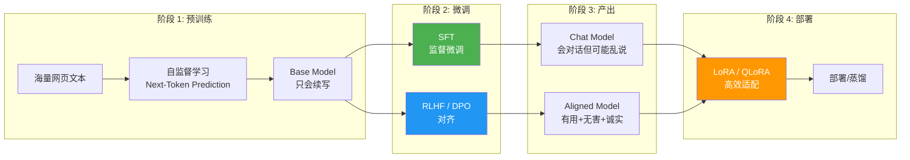
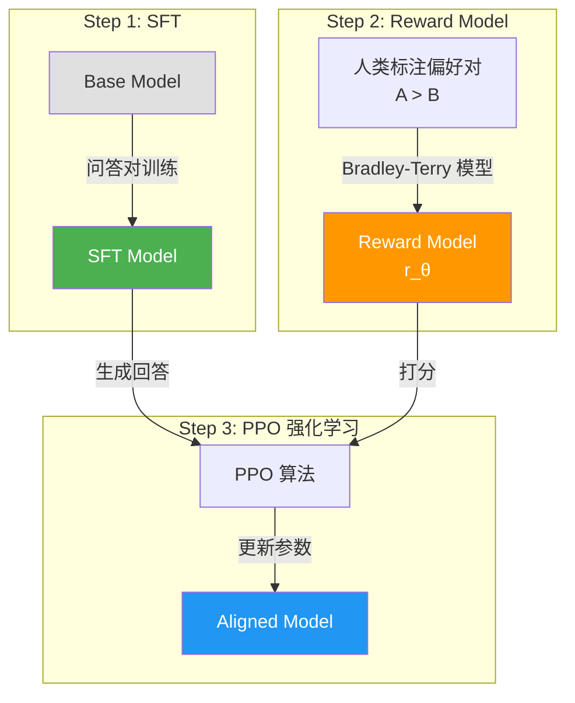

# 🎓 11 — 大模型微调技术全景：SFT / RLHF / DPO / 蒸馏

> 🎯 **目标**：理解四种主流微调与对齐技术的原理、区别和适用场景，知道什么时候用哪种。
> ⏱️ 预计时间：1 天

---

## 📋 大模型训练流水线全景



---

## 1️⃣ SFT（监督微调）

### 📌 核心思路

用"问题→标准答案"对训练模型，让模型学会按人类期望的方式回答。这是**所有对话模型的起点**——ChatGPT、Claude、Qwen-Chat 都经过 SFT。

### 📌 数据格式

```json
{
  "messages": [
    {"role": "system", "content": "你是一个有帮助的助手"},
    {"role": "user", "content": "将以下句子翻译成英文：今天天气真好"},
    {"role": "assistant", "content": "The weather is really nice today."}
  ]
}
```

### 📌 SFT 数据质量铁律

| # | 原则 | ❌ | ✅ |
|---|------|-----|-----|
| 1 | **多样性** | 1000 条"你好" | 覆盖翻译/总结/代码/问答/写作 |
| 2 | **一致性** | 有时"I'm an AI"，有时"咱是机器人" | 统一的助手人设和语气 |
| 3 | **正确性** | 错误答案（模型会学到错误） | 每条数据经过人工校验 |
| 4 | **长度适中** | 要么 3 字要么 3000 字 | 100-500 字为核心区间 |
| 5 | **去重去噪** | 重复/乱码/HTML 标签 | 纯文本 + 干净的格式 |

### 📌 SFT 数据格式：三种标准对比

| 格式 | 结构 | 适用框架 | 示例 |
|------|------|---------|------|
| **OpenAI Messages** | `{"messages":[{"role":"...","content":"..."}]}` | OpenAI/通用 | 多轮对话友好 |
| **ShareGPT** | `{"conversations":[{"from":"human","value":"..."},{"from":"gpt","value":"..."}]}` | Vicuna/FastChat | 开源社区主流 |
| **Alpaca** | `{"instruction":"...","input":"...","output":"..."}` | Alpaca/简单任务 | 单轮问答 |

```python
# 格式转换：Alpaca → OpenAI Messages
def alpaca_to_openai(example):
    return {
        "messages": [
            {"role": "system", "content": "你是一个有帮助的助手"},
            {"role": "user", "content": example["instruction"] + "\n" + example.get("input", "")},
            {"role": "assistant", "content": example["output"]},
        ]
    }
```

### 📌 SFT 超参数建议表

| 参数 | 小模型 (1-3B) | 中模型 (7-13B) | 大模型 (30B+) | 说明 |
|------|-------------|---------------|--------------|------|
| **learning_rate** | 2e-4 ~ 5e-4 | 1e-4 ~ 3e-4 | 5e-5 ~ 1e-4 | 越大模型 lr 应该越小 |
| **batch_size** | 8-16 | 4-8 | 1-4 | 显存不够用累积梯度补偿 |
| **epochs** | 3-5 | 2-3 | 1-2 | SFT 容易过拟合，少 epoch |
| **warmup_ratio** | 0.1 | 0.1 | 0.05 | 前 N% step 线性增加 lr |
| **max_seq_length** | 512-1024 | 1024-2048 | 2048-4096 | 截断策略影响上下文 |
| **weight_decay** | 0.01 | 0.01 | 0.1 | L2 正则化防过拟合 |

### 📌 完整 SFT 训练脚本骨架

```python
# train_sft.py
from transformers import (
    AutoModelForCausalLM, AutoTokenizer,
    TrainingArguments, Trainer, DataCollatorForSeq2Seq,
)
from datasets import load_dataset

# 1. 加载
model_name = "Qwen/Qwen2.5-7B-Instruct"
tokenizer = AutoTokenizer.from_pretrained(model_name, trust_remote_code=True)
tokenizer.pad_token = tokenizer.eos_token

model = AutoModelForCausalLM.from_pretrained(
    model_name, torch_dtype=torch.bfloat16, device_map="auto",
)

# 2. 数据格式化为 chat template
def format_fn(example):
    return {"text": tokenizer.apply_chat_template(
        example["messages"], tokenize=False, add_generation_prompt=False,
    )}

dataset = load_dataset("json", data_files="sft_data.json")["train"]
dataset = dataset.map(format_fn).map(
    lambda ex: tokenizer(ex["text"], truncation=True, max_length=1024),
)

# 3. 训练
trainer = Trainer(
    model=model,
    args=TrainingArguments(
        output_dir="./sft_output", num_train_epochs=3,
        per_device_train_batch_size=4, gradient_accumulation_steps=4,
        learning_rate=2e-4, warmup_ratio=0.1, fp16=False, bf16=True,
        logging_steps=10, save_steps=200,
    ),
    train_dataset=dataset,
    data_collator=DataCollatorForSeq2Seq(tokenizer, model=model, padding=True),
)
trainer.train()
model.save_pretrained("./sft_model")
```

```
✅ 学会：对话格式、遵循指令、基本回答风格
❌ 不会：判断"什么回答更好"、拒绝有害请求、承认不知道
```

> 💡 SFT 是"学会说话"，RLHF/DPO 是"学会说人话"。

---

## 2️⃣ RLHF（人类反馈强化学习）

### 📌 三步流程



### 📌 Reward Model 训练要点

```
偏好对格式:
  {
    "prompt": "请解释量子计算",
    "chosen": "量子计算利用量子比特（qubit）的叠加态...",    ← 人类更喜欢的回答
    "rejected": "量子计算就是用量子力学来算东西。"            ← 较差的回答
  }

损失函数（Bradley-Terry 模型）:
  L(θ) = -E[ log σ( r_θ(x, y_chosen) - r_θ(x, y_rejected) ) ]
          └── 期望 ──┘  └── sigmoid ──┘└──── reward 差值 ────┘

  直觉: 如果 chosen 的奖励 > rejected 的奖励，loss 小。
        如果 chosen 的奖励 < rejected 的奖励，loss 大 → 惩罚。

Reward Model 训练:
  1. 底座: 用 SFT Model 作为 Reward Model 的初始化
  2. 去掉 LM Head，换成标量输出头（输出一个分数）
  3. 用偏好对数据训练，最小化 Bradley-Terry loss
  4. 验证: 用留出的偏好对数据测准确率（猜对人类偏好 = 好）
```

### 📌 为什么 RLHF 是 ChatGPT 的秘密武器？

RLHF 让模型学会 SFT 教不了的"软技能"：

- "我不知道" — SFT 不敢说不知道（训练数据都是确定答案），RLHF 奖励诚实
- 礼貌拒绝 — "我不能帮你写病毒代码，但我可以教你网络安全知识"
- 追问澄清 — "你想表达的是 A 还是 B？"

### 📌 RLHF 的挑战

| 挑战 | 说明 |
|------|------|
| 💰 **成本高** | 人工标注偏好对 = 贵；PPO 需要同时加载 4 个模型 |
| 🎯 **Reward Hacking** | 模型学会"钻空子"：说得多≠说得好，但 Reward Model 可能被长度欺骗 |
| 🔄 **训练不稳定** | PPO + 大模型 = 容易崩溃，需要精心调参 |

---

## 3️⃣ DPO（直接偏好优化）

### 📌 一句话解释

**RLHF 讲不讲武德？太复杂了！直接把"好回答 vs 差回答"当分类任务训练。**

```
RLHF:  4 个模型，3 步流程，PPO 强化学习
DPO:   1 个模型，2 步流程，直接优化偏好对
```

### 📌 DPO 损失函数

```
L_DPO(π_θ; π_ref) = -E[ log σ( β × ( log(π_θ(y_chosen|x)/π_ref(y_chosen|x)) - log(π_θ(y_rejected|x)/π_ref(y_rejected|x)) ) ) ]

                      ↓ 逐项解释 ↓

π_θ:     正在训练的 Policy Model（我们要优化的模型）
π_ref:   参考模型（SFT 后的冻结模型，用来约束不要跑太远）
β:       温度参数（控制偏离 π_ref 的惩罚力度，通常 0.1-0.5）
σ:       sigmoid 函数（把差值映射到 0-1）
log(π_θ/π_ref): chosen 回答在当前模型 vs 参考模型下的 log 概率比值

直觉:
  - 让 chosen 回答的概率 ↑（相对参考模型）
  - 让 rejected 回答的概率 ↓（相对参考模型）
  - β 控制"可以偏离参考模型多远"——β 越大，偏离越自由
  - 不需要显式 Reward Model！损失函数直接优化 Policy
```

### 📌 偏好对数据格式

```json
{
  "prompt": "请用三句话解释 Transformer",
  "chosen": "Transformer 是一种基于自注意力机制的神经网络架构...",
  "rejected": "Transformer 是神经网络，它很好用。"
}
```

### 📌 DPO 训练脚本骨架（trl DPOTrainer）

```python
# train_dpo.py
from transformers import AutoModelForCausalLM, AutoTokenizer
from trl import DPOTrainer, DPOConfig
from datasets import load_dataset

# 1. 加载模型（需要 SFT 后的模型作为起点）
model = AutoModelForCausalLM.from_pretrained(
    "./sft_model", torch_dtype=torch.bfloat16, device_map="auto",
)
ref_model = AutoModelForCausalLM.from_pretrained(
    "./sft_model", torch_dtype=torch.bfloat16, device_map="auto",
)

tokenizer = AutoTokenizer.from_pretrained("./sft_model")
tokenizer.pad_token = tokenizer.eos_token

# 2. 加载偏好对数据
dataset = load_dataset("json", data_files="preference_pairs.json")["train"]

def format_dpo(example):
    return {
        "prompt": example["prompt"],
        "chosen": example["chosen"],
        "rejected": example["rejected"],
    }
dataset = dataset.map(format_dpo)

# 3. DPO 训练
trainer = DPOTrainer(
    model=model,
    ref_model=ref_model,
    args=DPOConfig(
        output_dir="./dpo_output",
        num_train_epochs=1,             # DPO 通常 1 epoch 就够了
        per_device_train_batch_size=2,
        learning_rate=5e-5,
        beta=0.1,                       # 🔑 温度参数
        logging_steps=10,
        bf16=True,
    ),
    train_dataset=dataset,
    tokenizer=tokenizer,
)
trainer.train()
model.save_pretrained("./dpo_model")
```

### 📌 DPO 原理直觉

RLHF 需要先训练 Reward Model，再让 Policy Model 去讨好 Reward Model——绕了一大圈。DPO 发现：Reward Model 的损失函数可以直接写成 Policy Model 的损失函数！所以**跳过 Reward Model，直接优化 Policy Model**。

### 📌 DPO 的优势

| 维度 | RLHF | DPO |
|------|------|-----|
| 模型数量 | 4 个 | 1 个 |
| 训练步数 | 3 步 | 2 步 |
| 稳定性 | ⚠️ PPO 不稳定 | ✅ 监督学习，稳定 |
| 效果 | ⭐⭐⭐⭐ | ⭐⭐⭐⭐（相当） |
| 2024 年使用率 | 下降中 | ↑ 主流 |

### 📌 DPO 代表模型

- **Qwen 2.5** 系列 — DPO 对齐
- **Llama 3** 系列 — DPO 对齐
- **DeepSeek-V2/V3** — DPO（Group Relative Policy Optimization 变体）

---

## 4️⃣ 知识蒸馏

### 📌 核心思路

大模型是"老师"，小模型是"学生"。老师不用手把手教，把"答题思路"告诉学生就行。

```
Teacher (671B)  →  生成推理过程 + 答案  →  Student (7B) 学习
```

### 📌 三种蒸馏方式

| 方式 | 做法 | 学习什么 | 代表 |
|------|------|---------|------|
| **Logit 蒸馏** | Student 学习 Teacher 的输出概率分布 | 软标签（"A 80%, B 15%, C 5%"） | Hinton 2015 |
| **数据蒸馏** | Teacher 生成高质量训练数据 | 推理过程 + 答案 | 🔥 最流行 |
| **Feature 蒸馏** | Student 学习 Teacher 中间层的特征 | 内部表示 | TinyBERT |

### 📌 DeepSeek-R1 蒸馏：教科书级案例

```
Step 1: DeepSeek-R1 (671B MoE) 推理 → 产出带思维链的高质量答案
Step 2: 用这些答案训练 Qwen-7B / Llama-8B
Step 3: 7B 模型也获得了推理能力！成本降低 100 倍
```

### 📌 数据蒸馏完整流程

```
Step 1: Teacher 推理
  Teacher (671B) + 10万条 prompt → 生成带 CoT 的回答（每条可能有几千 tokens）
  耗时: 数百 GPU 小时，但只需一次

Step 2: 数据清洗
  - 过滤掉推理过程有错误的（数学答案不对 / 逻辑矛盾）
  - 过滤掉 cut off / 截断的输出
  - 过滤掉格式不规范的
  - 保留 30-50% 的高质量数据

Step 3: Student 训练
  用清洗后的 {prompt, Teacher_output} 对，像 SFT 一样训练小模型
  小模型直接学到"大模型的推理模式"

Step 4: 评估
  用相同的测试集评估 Teacher vs Student 的准确率
  期望: Student 在特定任务上接近 Teacher 的表现
```

### 📌 Logit 蒸馏 vs 数据蒸馏

| 维度 | Logit 蒸馏 | 数据蒸馏 |
|------|-----------|----------|
| 学习目标 | Teacher 的**输出概率分布**（软标签） | Teacher 的**生成文本**（推理过程+答案） |
| 需要什么 | Teacher 对每个样本输出 logits | Teacher 对每个样本生成完整回答 |
| 信息量 | 丰富（每个类别的概率） | 结构化（CoT + 最终答案） |
| 训练复杂度 | 需要同时加载 Teacher 和 Student | 只需 Student（像普通 SFT） |
| 推理能力迁移 | ❌ 弱（只学最终分布，不学推理过程） | ✅ 强（学到推理链） |
| 代表案例 | Hinton 2015 经典蒸馏 | 🔥 DeepSeek-R1 → Qwen/Llama |
| 推荐度 | ⭐⭐ 特定任务 | ⭐⭐⭐⭐⭐ 推

---

## 5️⃣ 五种方法对比总结

| 方法 | 目标 | 需要什么 | 显存 | 复杂度 | 何时用 |
|------|------|----------|------|--------|--------|
| **SFT** | 学会对话 | 问答对 | 全量 | ⭐ | 基础能力 |
| **RLHF** | 对齐偏好 | 偏好数据+RM | 全量(×4) | ⭐⭐⭐⭐ | 追求极致质量 |
| **DPO** | 对齐偏好 | 偏好对 | 全量 | ⭐⭐ | 🔥 推荐首选 |
| **LoRA/QLoRA** | 省显存微调 | 同 SFT | ~6GB | ⭐⭐ | 个人/Mac |
| **蒸馏** | 能力转移 | Teacher+数据 | 全量 | ⭐⭐⭐ | 大→小 |

---

## 6️⃣ 面试高频追问

**Q1: "SFT 和 RLHF 的本质区别？"**
A: SFT 是"模仿"——模型学会复制训练数据中的回答模式。RLHF 是"判断"——模型学会区分好回答和差回答。前者教"怎么说话"，后者教"说什么话"。

**Q2: "为什么不直接用 SFT，还要 RLHF/DPO？"**
A: SFT 数据只有"标准答案"，没有"差答案对比"。模型不知道"我不知道"比"瞎编"更好。RLHF/DPO 用人类偏好数据教会模型这个判断力。

**Q3: "DPO 比 RLHF 好在哪里？"**
A: 不需要单独训练 Reward Model（省人力标注），不需要 PPO 强化学习（训练稳定），效果相当。2024 年后已经是开源模型的主流对齐方案。

**Q4: "LoRA 微调为什么不能替代 SFT？"**
A: LoRA 是"怎么微调"的方法（省显存），SFT 是"微调什么"的目标（学会对话）。LoRA 可以和 SFT 一起用——用 LoRA 方式做 SFT。

**Q5: "什么样的数据适合蒸馏？"**
A: 需要 Teacher 模型在该领域明显强于 Student 模型。最经典的是推理能力蒸馏（大模型会推理，小模型不会）——用大模型产出思维链 + 答案，让小模型学习推理过程。

**Q6: "DPO 的 β 参数起什么作用？设太大或太小会怎样？"**
A: β 控制"允许 Policy Model 偏离参考模型多远"。β 太小 → 太保守，模型不敢偏离参考，DPO 效果弱。β 太大 → 太激进，模型可能"讨好"偏好数据导致过拟合。通常 0.1-0.5，具体需要调参。

**Q7: "SFT 数据需要多少条？有没有 benchmark？"**
A: 质量远比数量重要。参考: LIMA 论文用 1000 条高质量 SFT 数据就让 65B 模型表现出色；Alpaca 用 52K GPT 生成数据。小模型 (1-3B) 建议 1000-5000 条；中模型 (7-13B) 建议 5000-20000 条。关键不是数量，是**多样性 + 正确性 + 一致性**。

**Q8: "为什么 RLHF 的 PPO 训练容易崩溃？"**
A: PPO 需要平衡 exploration（尝试新回答）和 exploitation（用已知好回答）。如果 KL 惩罚不够强，模型会迅速偏离原始分布（"reward hacking"）；如果 KL 太强，模型不敢尝试，效果不明显。四模型同跑（Policy + Reference + Reward + Value）也导致显存和训练复杂度激增。DPO 直接避免了这些问题。

---

## 📚 延伸阅读

- InstructGPT 论文（RLHF 开山作）
- DPO 论文：[Direct Preference Optimization](https://arxiv.org/abs/2305.18290)
- DeepSeek-R1 技术报告（蒸馏案例）
- HuggingFace PEFT 文档（LoRA 实现）
