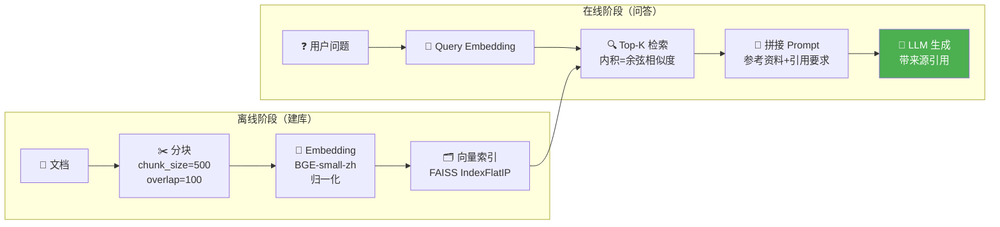

# 🔰 01 — 最简 RAG：从零跑通检索增强生成

> 🎯 **目标**：用完整可运行的代码跑通 RAG 全链路：文档→分块→Embedding→检索→LLM生成。
> ⏱️ 预计时间：1 天

---

## 📋 RAG 全链路数据流



---

## 1️⃣ 文档加载与分块

```python
import os

def load_markdown_files(directory: str) -> list[dict]:
    """加载目录下所有 .md 文件"""
    docs = []
    for root, _, files in os.walk(directory):
        for f in files:
            if f.endswith('.md'):
                path = os.path.join(root, f)
                with open(path, 'r', encoding='utf-8') as fh:
                    content = fh.read()
                    if len(content.strip()) > 100:
                        docs.append({'content': content, 'source': f, 'path': path})
    return docs

def chunk_text(text: str, chunk_size: int = 500, overlap: int = 100) -> list[dict]:
    """固定大小分块，尽量在换行处切分"""
    chunks = []
    start = 0
    text = text.strip()
    while start < len(text):
        end = min(start + chunk_size, len(text))
        if end < len(text):
            nl = text.rfind('\n', start, end)
            if nl > start + chunk_size // 2:
                end = nl
        chunk = text[start:end].strip()
        if chunk:
            chunks.append({'content': chunk, 'char_start': start, 'char_end': end})
        start = end - overlap
    return chunks

# 🔥 加载 Phase 2 笔记作为知识库
docs = load_markdown_files('../phase2_llm_internals/')
all_chunks = []
for doc in docs:
    for c in chunk_text(doc['content'], 500, 100):
        c['source'] = doc['source']
        all_chunks.append(c)
print(f"✅ {len(docs)} 个文档 → {len(all_chunks)} 个 chunk")
```

### 📌 chunk_size 怎么选？

| chunk_size | 优点 | 缺点 | 适用 |
|-----------|------|------|------|
| 200 | 检索精度高 | 丢失上下文 | FAQ / 问答对 |
| **500** | 🔥 平衡最优 | — | 通用推荐 |
| 1000 | 上下文完整 | 噪声多 | 长文档问答 |
| 2000 | 覆盖面大 | 精度下降 | 摘要任务 |

> overlap 通常取 chunk_size 的 10-20%。

---

## 2️⃣ Embedding 向量化

```python
from sentence_transformers import SentenceTransformer
import numpy as np

model = SentenceTransformer('BAAI/bge-small-zh-v1.5')  # 512维

chunk_texts = [c['content'] for c in all_chunks]
embeddings = model.encode(
    chunk_texts, normalize_embeddings=True,
    show_progress_bar=True, batch_size=32,
)
print(f"✅ Embedding shape: {embeddings.shape}")
```

### 📌 为什么 normalize 后内积=余弦相似度？

```
余弦相似度: cos(θ) = (A·B) / (|A|×|B|)
归一化后:   |A| = |B| = 1
          cos(θ) = A·B  ← 内积！

FAISS IndexFlatIP（内积检索）= 余弦相似度检索 ✅
```

| 度量 | 公式 | 归一化后 | 适用场景 |
|------|------|---------|----------|
| 内积 (IP) | A·B | 余弦 | 🔥 Embedding 检索首选 |
| 余弦 | A·B/(\|A\|\|B\|) | 内积 | 文本语义 |
| L2 欧氏 | \|A-B\|₂ | 与余弦单调相关 | 不推荐文本 |

---

## 3️⃣ 向量索引与检索

```python
import faiss

dim = embeddings.shape[1]
index = faiss.IndexFlatIP(dim)
index.add(embeddings.astype('float32'))
print(f"✅ FAISS 索引: {index.ntotal} 个向量")

def search(query: str, top_k: int = 5) -> list[dict]:
    q_emb = model.encode([query], normalize_embeddings=True).astype('float32')
    scores, indices = index.search(q_emb, top_k)
    results = []
    for score, idx in zip(scores[0], indices[0]):
        if 0 <= idx < len(all_chunks):
            results.append({
                'content': all_chunks[idx]['content'],
                'source': all_chunks[idx].get('source', 'unknown'),
                'score': float(score),
            })
    return results

# 测试
for r in search("什么是 KV Cache？", 3):
    print(f"  [{r['score']:.3f}] {r['source']}: {r['content'][:80]}...")
```

---

## 4️⃣ Prompt 模板 + LLM 生成

```python
RAG_SYSTEM = """你是一个基于知识库的问答助手。
规则：
1. 只使用「参考资料」中的信息回答
2. 每个观点标注引用来源 [来源: xxx]
3. 资料中没有答案时说明"超出知识库范围"
4. 不要编造信息"""

def build_prompt(query: str, retrieved: list[dict]) -> str:
    parts = [f"[来源{i+1}: {d['source']}]\n{d['content']}" for i, d in enumerate(retrieved)]
    return f"参考资料：\n\n{chr(10).join(parts)}\n\n用户问题：{query}\n\n请基于以上参考资料回答，标注引用来源。"

def ask(query: str, top_k: int = 5) -> dict:
    retrieved = search(query, top_k)
    prompt = build_prompt(query, retrieved)

    # 🔥 真实 LLM 调用 — 复用 Phase 1 客户端或直接用 OpenAI SDK
    try:
        from openai import OpenAI
        client = OpenAI(api_key=os.getenv("OPENAI_API_KEY"))
        resp = client.chat.completions.create(
            model="gpt-4o-mini", temperature=0.3, max_tokens=512,
            messages=[{"role": "system", "content": RAG_SYSTEM},
                      {"role": "user", "content": prompt}],
        )
        answer = resp.choices[0].message.content
    except Exception as e:
        answer = f"[LLM 调用失败: {e}]"

    return {"query": query, "answer": answer, "sources": [
        {"source": r['source'], "score": r['score']} for r in retrieved
    ]}

# 🔥 端到端
result = ask("Transformer 的核心组件有哪些？", 3)
print(f"🤖 {result['answer'][:300]}")
```

---

## 5️⃣ 对比实验：有 RAG vs 无 RAG

```python
def compare(query: str):
    rag = ask(query, 3)
    from openai import OpenAI
    c = OpenAI(api_key=os.getenv("OPENAI_API_KEY"))
    no_rag = c.chat.completions.create(
        model="gpt-4o-mini", temperature=0.3, max_tokens=512,
        messages=[{"role": "user", "content": query}],
    ).choices[0].message.content

    print(f"❓ {query}\n")
    print(f"📚 有 RAG（基于你的笔记）:\n{rag['answer'][:300]}\n")
    print(f"🧠 无 RAG（纯 LLM）:\n{no_rag[:300]}")

compare("晨熙的100天学习路线中，Phase 2 覆盖了哪些内容？")
```

> 预期：有 RAG 引用你真实笔记内容；无 RAG 是 LLM 猜的。

---

## 🚨 翻车现场

| 现象 | 原因 | 解决 |
|------|------|------|
| 检索全不相关 | embedding 模型语言不匹配 | 中文用 BGE-zh 系列 |
| LLM 引用来源是编的 | System Prompt 不够强硬 | 加"不要编造信息" |
| FAISS OOM | 暴力索引太大 | 换 IndexIVFFlat（03 讲） |
| 检索重复 chunk | overlap 太大 | 减到 10% |
| sentence_transformers 下载慢 | HF 连接问题 | `export HF_ENDPOINT=https://hf-mirror.com` |

---

## ✅ 产出物 Checklist

- [ ] 用本地 Markdown 文件跑通完整 RAG 流程
- [ ] 修改 chunk_size，对比检索结果
- [ ] 测试有 RAG vs 无 RAG 的回答差异
- [ ] 理解归一化后内积=余弦相似度
- [ ] 用 5 个问题测试 RAG 效果
