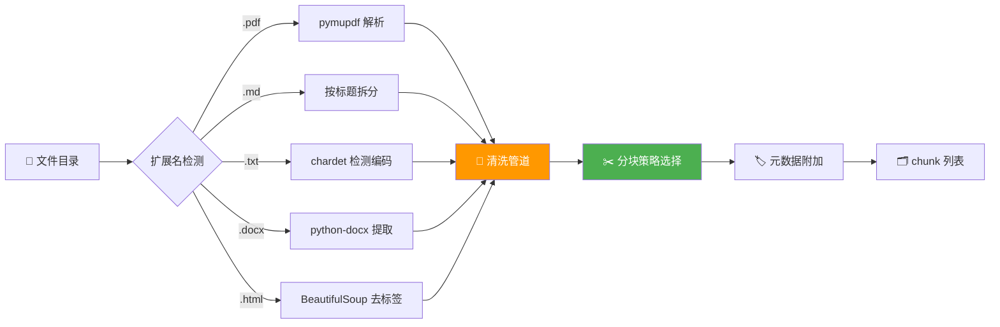

# 📄 02 — 文档解析器

> 🎯 **目标**：实现 5 种格式解析 + 3 种分块策略 + 预处理管道，把任意文档变成高质量的 chunk 列表。
> ⏱️ 预计时间：2 天

---

## 📋 文档处理管道



---

## 1️⃣ 五种格式解析器

### 📌 PDF 解析

```python
import fitz  # pymupdf

def parse_pdf(file_path: str) -> list[dict]:
    """解析 PDF，返回每页文本 + 元数据"""
    doc = fitz.open(file_path)
    pages = []
    for i, page in enumerate(doc):
        text = page.get_text(sort=True)  # sort=True 保证阅读顺序
        if text.strip():
            pages.append({
                'content': text,
                'metadata': {
                    'source': file_path,
                    'page': i + 1,
                    'total_pages': len(doc),
                    'format': 'pdf',
                }
            })
    doc.close()
    return pages
```

### 📌 Markdown 解析（按标题层级拆分）

```python
import re

def parse_markdown(file_path: str) -> list[dict]:
    """按 ## / ### 标题拆分 Markdown，保留层级信息"""
    with open(file_path, 'r', encoding='utf-8') as f:
        content = f.read()

    # 按 ## 标题拆分（保留标题作为 section 名）
    sections = re.split(r'\n(?=## )', content)
    result = []
    for sec in sections:
        if not sec.strip():
            continue
        # 提取第一个标题行
        title_match = re.match(r'^(#+)\s+(.+)', sec)
        level = len(title_match.group(1)) if title_match else 0
        title = title_match.group(2).strip() if title_match else 'Untitled'

        result.append({
            'content': sec.strip(),
            'metadata': {
                'source': file_path,
                'section': title,
                'level': level,
                'format': 'markdown',
            }
        })
    return result
```

### 📌 TXT 解析（编码自动检测）

```python
import chardet

def parse_txt(file_path: str) -> list[dict]:
    """自动检测编码，兼容 UTF-8/GBK"""
    with open(file_path, 'rb') as f:
        raw = f.read()

    detected = chardet.detect(raw)
    encoding = detected['encoding'] or 'utf-8'
    confidence = detected['confidence']

    try:
        text = raw.decode(encoding)
    except (UnicodeDecodeError, LookupError):
        text = raw.decode('utf-8', errors='replace')

    return [{
        'content': text,
        'metadata': {
            'source': file_path,
            'encoding': encoding,
            'confidence': confidence,
            'format': 'txt',
        }
    }]
```

### 📌 Word (.docx) 解析

```python
from docx import Document

def parse_docx(file_path: str) -> list[dict]:
    """提取段落 + 表格转 Markdown"""
    doc = Document(file_path)
    parts = []

    for para in doc.paragraphs:
        text = para.text.strip()
        if text:
            # 检测标题样式
            is_heading = para.style.name.startswith('Heading')
            prefix = '#' * int(para.style.name[-1]) + ' ' if is_heading else ''
            parts.append(prefix + text)

    # 表格转 Markdown
    for table in doc.tables:
        rows = []
        for row in table.rows:
            cells = [cell.text.strip() for cell in row.cells]
            rows.append('| ' + ' | '.join(cells) + ' |')
        if rows:
            rows.insert(1, '|' + '|'.join(['---'] * len(rows[0].split('|'))) + '|')
        parts.append('\n'.join(rows))

    content = '\n\n'.join(parts)
    return [{'content': content, 'metadata': {'source': file_path, 'format': 'docx'}}]
```

### 📌 HTML 解析

```python
from bs4 import BeautifulSoup

def parse_html(file_path: str) -> list[dict]:
    """去标签 + 正文提取"""
    with open(file_path, 'r', encoding='utf-8') as f:
        soup = BeautifulSoup(f.read(), 'html.parser')

    # 移除 script/style 标签
    for tag in soup(['script', 'style', 'nav', 'footer', 'header']):
        tag.decompose()

    # 提取正文
    text = soup.get_text(separator='\n', strip=True)

    # 简单压缩多余空行
    import re
    text = re.sub(r'\n{3,}', '\n\n', text)

    return [{'content': text, 'metadata': {'source': file_path, 'format': 'html'}}]
```

---

## 2️⃣ 三种分块策略

### 📌 固定大小分块（最简单）

```python
def chunk_fixed(text: str, size: int = 500, overlap: int = 100) -> list[str]:
    chunks = []
    start = 0
    while start < len(text):
        end = min(start + size, len(text))
        if end < len(text):
            nl = text.rfind('\n', start, end)
            if nl > start + size // 2:
                end = nl
        chunks.append(text[start:end].strip())
        start = end - overlap
    return [c for c in chunks if c]
```

### 📌 语义分块（按句子边界）

```python
import re

def chunk_semantic(text: str, min_len: int = 200, max_len: int = 800) -> list[str]:
    """按句子边界切分，保证语义完整"""
    sentences = re.split(r'(?<=[。！？.!?])\s*', text)
    chunks = []
    current = ""

    for sent in sentences:
        if len(current) + len(sent) <= max_len:
            current += sent
        else:
            if len(current) >= min_len:
                chunks.append(current.strip())
            current = sent

    if len(current) >= min_len:
        chunks.append(current.strip())
    return chunks
```

### 📌 递归分块（LangChain 风格）

```python
def chunk_recursive(text: str, chunk_size: int = 500,
                    separators: list[str] = None) -> list[str]:
    """先按大分隔符切，不够再按小分隔符"""
    if separators is None:
        separators = ["\n\n", "\n", "。", ".", " ", ""]

    if len(text) <= chunk_size:
        return [text] if text.strip() else []

    sep = separators[0]
    if sep:
        parts = text.split(sep)
    else:
        # 最后手段：按字符硬切
        return [text[i:i+chunk_size] for i in range(0, len(text), chunk_size)]

    chunks = []
    current = ""
    for part in parts:
        if len(current) + len(sep) + len(part) <= chunk_size:
            current = (current + sep + part) if current else part
        else:
            if current:
                chunks.extend(chunk_recursive(current, chunk_size, separators[1:]))
            current = part
    if current:
        chunks.extend(chunk_recursive(current, chunk_size, separators[1:]))
    return chunks
```

---

## 3️⃣ 文档预处理管道

```python
import hashlib
from datetime import datetime

class DocumentPipeline:
    """统一的文档预处理管道"""

    PARSERS = {
        '.pdf': parse_pdf,
        '.md': parse_markdown,
        '.txt': parse_txt,
        '.docx': parse_docx,
        '.html': parse_html,
    }

    def __init__(self, chunk_strategy='fixed', chunk_size=500, overlap=100):
        self.chunk_strategy = chunk_strategy
        self.chunk_size = chunk_size
        self.overlap = overlap
        self.seen_hashes = set()  # 去重用

    def process_file(self, file_path: str) -> list[dict]:
        ext = os.path.splitext(file_path)[1].lower()
        parser = self.PARSERS.get(ext)
        if not parser:
            print(f"⚠️ 不支持的格式: {ext}")
            return []

        sections = parser(file_path)
        all_chunks = []

        for sec in sections:
            # 选择分块策略
            if self.chunk_strategy == 'fixed':
                texts = chunk_fixed(sec['content'], self.chunk_size, self.overlap)
            elif self.chunk_strategy == 'semantic':
                texts = chunk_semantic(sec['content'])
            elif self.chunk_strategy == 'recursive':
                texts = chunk_recursive(sec['content'], self.chunk_size)
            else:
                texts = [sec['content']]

            for text in texts:
                # 去重
                h = hashlib.md5(text.encode()).hexdigest()
                if h in self.seen_hashes:
                    continue
                self.seen_hashes.add(h)

                # 质量过滤
                if len(text) < 50:  # 太短 > 跳过
                    continue

                # 附加元数据
                meta = dict(sec['metadata'])
                meta.update({
                    'chunk_hash': h[:8],
                    'processed_at': datetime.now().isoformat(),
                    'char_count': len(text),
                })
                all_chunks.append({'content': text, 'metadata': meta})

        return all_chunks

    def process_directory(self, directory: str) -> list[dict]:
        """批量处理目录下所有文件"""
        all_chunks = []
        for root, _, files in os.walk(directory):
            for f in files:
                path = os.path.join(root, f)
                chunks = self.process_file(path)
                all_chunks.extend(chunks)
                if chunks:
                    print(f"✅ {f}: {len(chunks)} chunks")
        print(f"\n📊 总计: {len(all_chunks)} chunks（已去重）")
        return all_chunks

# 🔥 使用
pipeline = DocumentPipeline(chunk_strategy='fixed', chunk_size=500, overlap=100)
chunks = pipeline.process_directory('../phase2_llm_internals/')
```

---

## 🚨 翻车现场

| 现象 | 原因 | 解决 |
|------|------|------|
| PDF 解析出乱码 | 扫描件需要 OCR | 用 pymupdf 的 OCR 模式或 PaddleOCR |
| Markdown 代码块被拆碎 | 按标题分块时没保护代码块 | 先提取代码块，分块后再放回 |
| TXT 中文乱码 | GBK 编码被当 UTF-8 读 | 用 chardet 检测编码 |
| .docx 表格丢失 | 只解析了段落 | `doc.tables` 提取表格 |
| HTML 一堆导航栏文字 | 没去掉 header/nav/footer | `tag.decompose()` |
| 去重后 chunk 太少 | 内容高度相似（如代码模板） | 放宽 hash 或按段落去重 |

---

## ✅ 产出物 Checklist

- [ ] 实现 5 种格式的解析器
- [ ] 对比 3 种分块策略在同一文档上的 chunk 质量
- [ ] 构建预处理管道，处理一个目录下所有文件
- [ ] 输出去重前后的 chunk 数量对比
- [ ] 每条 chunk 含完整元数据（来源/页码/章节/格式）
