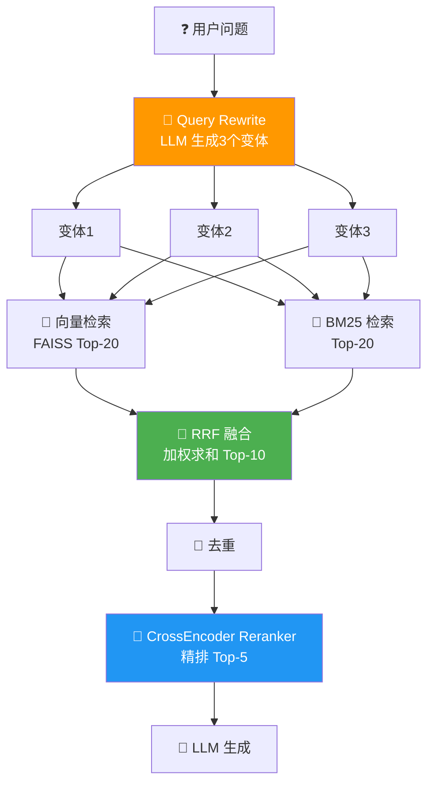

# 🔀 04 — 混合检索：BM25 + Vector + Reranker

> 🎯 **目标**：实现 BM25+向量+Query Rewrite 的三路混合检索，对比不同融合策略的效果。
> ⏱️ 预计时间：2 天

---

## 📋 三路检索 + 融合 + 精排 数据流



---

## 1️⃣ BM25 检索器

```python
import jieba
from rank_bm25 import BM25Okapi
import numpy as np

class BM25Retriever:
    def __init__(self, chunks: list[dict]):
        self.chunks = chunks
        self.corpus = [list(jieba.cut(c['content'])) for c in chunks]
        self.bm25 = BM25Okapi(self.corpus)

    def search(self, query: str, top_k: int = 20) -> list[dict]:
        tokenized = list(jieba.cut(query))
        scores = self.bm25.get_scores(tokenized)
        top_idx = np.argsort(scores)[-top_k:][::-1]
        return [
            {'content': self.chunks[i]['content'],
             'source': self.chunks[i].get('source', ''),
             'score': float(scores[i]),
             'method': 'bm25'}
            for i in top_idx
        ]
```

---

## 2️⃣ Query Rewrite 完整实现

```python
def rewrite_queries(original_query: str, n_variants: int = 3) -> list[str]:
    """用 LLM 生成多个检索变体"""
    from openai import OpenAI
    client = OpenAI(api_key=os.getenv("OPENAI_API_KEY"))

    prompt = f"""将以下用户问题改写为 {n_variants} 个更适合检索的关键词组合。
每个变体应该是关键词形式（不是完整句子），用空格分隔。

用户问题：{original_query}

请输出 {n_variants} 行，每行一个变体，不要编号。"""

    resp = client.chat.completions.create(
        model="gpt-4o-mini", temperature=0.3, max_tokens=200,
        messages=[{"role": "user", "content": prompt}],
    )
    variants = [line.strip() for line in resp.choices[0].message.content.split('\n') if line.strip()]
    return variants[:n_variants]

# 示例
# 输入: "Transformer 的 Attention 机制是如何工作的？"
# 输出: ["Transformer 自注意力 QKV 机制", "Scaled Dot-Product Attention 原理", "Multi-Head Attention 工作流程"]
```

---

## 3️⃣ RRF vs 加权求和：两种融合方法

```python
def reciprocal_rank_fusion(*result_lists: list[dict], k: int = 60) -> list[dict]:
    """RRF 融合：按排名加权，简单有效"""
    doc_scores = {}
    doc_map = {}

    for results in result_lists:
        for rank, doc in enumerate(results):
            key = doc['content'][:100]
            doc_scores[key] = doc_scores.get(key, 0) + 1 / (k + rank + 1)
            doc_map[key] = doc

    sorted_keys = sorted(doc_scores, key=doc_scores.get, reverse=True)
    return [
        {**doc_map[k], 'fusion_score': doc_scores[k]}
        for k in sorted_keys
    ]

def weighted_sum_fusion(vector_results: list[dict], bm25_results: list[dict],
                        vec_weight: float = 0.7) -> list[dict]:
    """加权求和融合：给向量检索和 BM25 不同权重"""
    doc_scores = {}
    doc_map = {}

    # 归一化分数
    vec_max = max(r['score'] for r in vector_results) if vector_results else 1
    bm25_max = max(r['score'] for r in bm25_results) if bm25_results else 1

    for r in vector_results:
        key = r['content'][:100]
        doc_scores[key] = doc_scores.get(key, 0) + vec_weight * (r['score'] / vec_max)
        doc_map[key] = r

    for r in bm25_results:
        key = r['content'][:100]
        doc_scores[key] = doc_scores.get(key, 0) + (1 - vec_weight) * (r['score'] / bm25_max)
        doc_map[key] = r

    sorted_keys = sorted(doc_scores, key=doc_scores.get, reverse=True)
    return [{**doc_map[k], 'fusion_score': doc_scores[k]} for k in sorted_keys]
```

---

## 4️⃣ 去重策略

```python
def deduplicate(results: list[dict], threshold: float = 0.9) -> list[dict]:
    """基于内容相似度去重"""
    from sentence_transformers import SentenceTransformer, util

    if len(results) <= 1:
        return results

    model = SentenceTransformer('BAAI/bge-small-zh-v1.5')
    texts = [r['content'] for r in results]
    embeddings = model.encode(texts, normalize_embeddings=True)

    keep = [results[0]]  # 保留分数最高的
    for i in range(1, len(results)):
        sims = util.cos_sim(embeddings[i], embeddings[[j for j in range(len(keep))]])
        if sims.max() < threshold:  # 和已保留的都不太像 → 保留
            keep.append(results[i])
    return keep
```

---

## 5️⃣ CrossEncoder Reranker 精排

```python
from sentence_transformers import CrossEncoder

reranker = CrossEncoder('BAAI/bge-reranker-v2-m3')

def rerank(query: str, candidates: list[dict], top_k: int = 5) -> list[dict]:
    """对候选文档精排"""
    pairs = [[query, c['content']] for c in candidates]
    scores = reranker.predict(pairs)

    ranked = sorted(zip(candidates, scores), key=lambda x: x[1], reverse=True)
    result = []
    for doc, score in ranked[:top_k]:
        doc['rerank_score'] = float(score)
        result.append(doc)
    return result
```

---

## 6️⃣ 完整混合检索管道

```python
class HybridSearcher:
    def __init__(self, vector_index, faiss_chunks, bm25_chunks, embed_model):
        self.vector_index = vector_index
        self.faiss_chunks = faiss_chunks
        self.bm25 = BM25Retriever(bm25_chunks)
        self.embed_model = embed_model
        self.reranker = CrossEncoder('BAAI/bge-reranker-v2-m3')

    def search(self, query: str, top_k: int = 5,
               use_rewrite: bool = True) -> list[dict]:
        """完整检索管道"""
        queries = [query]
        if use_rewrite:
            queries.extend(rewrite_queries(query))

        # 并行检索
        vec_results, bm25_results = [], []
        for q in queries:
            q_emb = self.embed_model.encode([q], normalize_embeddings=True)
            q_emb = q_emb.astype('float32')
            scores, ids = self.vector_index.search(q_emb, 20)
            for s, i in zip(scores[0], ids[0]):
                if 0 <= i < len(self.faiss_chunks):
                    vec_results.append({
                        'content': self.faiss_chunks[i]['content'],
                        'source': self.faiss_chunks[i].get('source', ''),
                        'score': float(s), 'method': 'vector',
                    })
            bm25_results.extend(self.bm25.search(q, 20))

        # 融合
        fused = reciprocal_rank_fusion(vec_results, bm25_results)
        # 或: fused = weighted_sum_fusion(vec_results, bm25_results, 0.7)

        # 去重
        fused = deduplicate(fused[:30])

        # 精排
        return rerank(query, fused, top_k)
```

---

## 7️⃣ 四组检索策略对比实验

```python
def compare_strategies(query: str, searcher: HybridSearcher):
    """并排对比 4 种检索策略"""
    # 1. 纯向量
    q_emb = searcher.embed_model.encode([query], normalize_embeddings=True).astype('float32')
    scores, ids = searcher.vector_index.search(q_emb, 5)
    vec_only = [searcher.faiss_chunks[i]['content'][:60] for i in ids[0]]

    # 2. 纯 BM25
    bm25_only = [r['content'][:60] for r in searcher.bm25.search(query, 5)]

    # 3. 加权融合
    ws = weighted_sum_fusion(
        [{'content': searcher.faiss_chunks[i]['content'], 'score': float(s)}
         for s, i in zip(scores[0], ids[0])],
        searcher.bm25.search(query, 5), 0.7,
    )[:5]
    ws_texts = [r['content'][:60] for r in ws]

    # 4. RRF
    rrf_results = searcher.search(query, 5, use_rewrite=False)

    # 并排展示
    for i in range(5):
        print(f"\n--- 排名 {i+1} ---")
        print(f"🔹 纯向量:  {vec_only[i] if i < len(vec_only) else '—'}")
        print(f"🔸 纯BM25:  {bm25_only[i] if i < len(bm25_only) else '—'}")
        print(f"🟠 加权融合: {ws_texts[i] if i < len(ws_texts) else '—'}")
        print(f"🟢 RRF:      {rrf_results[i]['content'][:60] if i < len(rrf_results) else '—'}")

# 🔥 运行对比
compare_strategies("Transformer 的 Self-Attention 原理", searcher)
```

---

## 🚨 翻车现场

| 现象 | 原因 | 解决 |
|------|------|------|
| BM25 对英文不友好 | jieba 是中文分词器 | 英文用 nltk.word_tokenize |
| RRF 分数都一样 | k 值太小 | k=60 是业界默认值 |
| Reranker 很慢 | 模型太大 | bge-reranker-base (0.3B) 够用 |
| Query Rewrite 生成重复变体 | temperature 太低 | temperature=0.5 |
| 融合后 Top-5 和纯向量一样 | BM25 权重太低 | 调 vec_weight 到 0.5 |

---

## ✅ 产出物 Checklist

- [ ] 实现 BM25Retriever 和向量检索
- [ ] 实现 Query Rewrite（LLM 生成 3 个变体）
- [ ] 对比 RRF 和加权求和两种融合
- [ ] 运行四组策略对比实验
- [ ] 集成 CrossEncoder Reranker 精排
