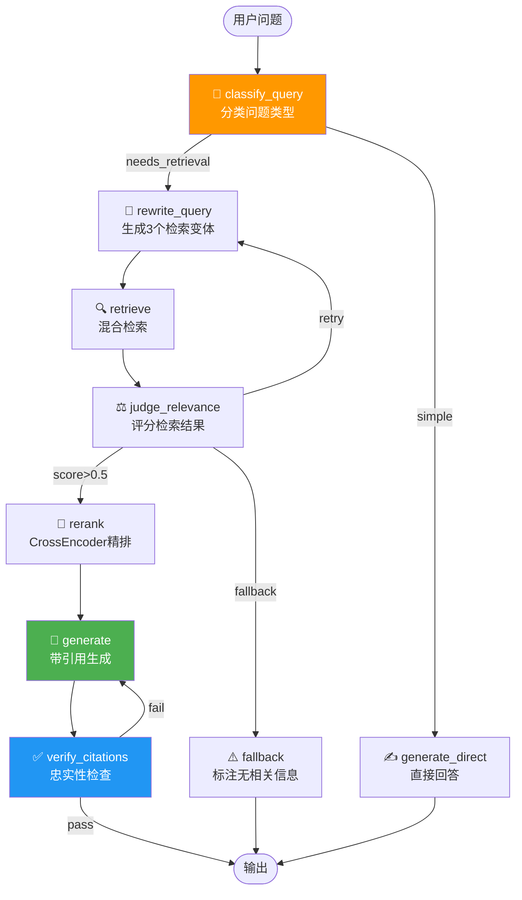

# 🔄 05 — LangGraph RAG 状态机

> 🎯 **目标**：用 LangGraph 构建可观测、可恢复、可纠错的 RAG 状态机，每个节点有真实实现。
> ⏱️ 预计时间：3 天

---

## 📋 RAG 状态机全图



---

## 1️⃣ State 定义 + Checkpoint 配置

```python
from typing import TypedDict, Annotated
from langgraph.graph import StateGraph, END
from langgraph.checkpoint.memory import MemorySaver
import operator

class RAGState(TypedDict):
    query: str
    question_type: str                    # simple / needs_retrieval / multi_hop
    rewritten_queries: list[str]
    retrieved_docs: list[dict]
    relevance_scores: list[float]
    reranked_docs: list[dict]
    generated_answer: str
    citations: list[str]
    faithfulness_score: float
    retry_count: int
    max_retries: int
```

---

## 2️⃣ classify_query — 真实 Prompt + LLM 调用

```python
from openai import OpenAI
client = OpenAI(api_key=os.getenv("OPENAI_API_KEY"))

def classify_query(state: RAGState) -> RAGState:
    prompt = f"""判断以下问题属于哪种类型，只输出一个标签：

- simple: 简单的常识/闲聊问题，不需要检索资料就能回答
- needs_retrieval: 需要从知识库中检索相关文档才能回答
- multi_hop: 需要综合多篇文档的信息才能回答

问题：{state['query']}

标签："""

    resp = client.chat.completions.create(
        model="gpt-4o-mini", temperature=0, max_tokens=20,
        messages=[{"role": "user", "content": prompt}],
    )
    label = resp.choices[0].message.content.strip().lower()
    state['question_type'] = label if label in ('simple','needs_retrieval','multi_hop') else 'needs_retrieval'
    state['retry_count'] = 0
    state['max_retries'] = 2
    return state
```

---

## 3️⃣ rewrite_query — 生成检索变体

```python
def rewrite_query(state: RAGState) -> RAGState:
    prompt = f"""将以下问题改写为 3 个更适合关键词检索的变体。
每行一个变体，用空格分隔的关键词形式，不要编号。

原始问题：{state['query']}

变体："""

    resp = client.chat.completions.create(
        model="gpt-4o-mini", temperature=0.4, max_tokens=200,
        messages=[{"role": "user", "content": prompt}],
    )
    variants = [l.strip() for l in resp.choices[0].message.content.split('\n') if l.strip()]
    state['rewritten_queries'] = variants[:3]
    return state
```

---

## 4️⃣ retrieve — 调用混合检索

```python
# 假设已有 04 的 HybridSearcher
from hybrid_search import HybridSearcher
searcher = HybridSearcher(vector_index, faiss_chunks, bm25_chunks, embed_model)

def retrieve(state: RAGState) -> RAGState:
    all_results = []
    for q in [state['query']] + state.get('rewritten_queries', []):
        results = searcher.search(q, top_k=10, use_rewrite=False)
        all_results.extend(results)

    # 去重
    seen = set()
    unique = []
    for r in all_results:
        key = r['content'][:100]
        if key not in seen:
            seen.add(key)
            unique.append(r)

    state['retrieved_docs'] = unique[:30]
    return state
```

---

## 5️⃣ judge_relevance — 评分 + 条件路由

```python
def judge_relevance(state: RAGState) -> RAGState:
    if not state['retrieved_docs']:
        state['relevance_scores'] = []
        return state

    docs_text = '\n---\n'.join(
        f"[{i}] {d['content'][:200]}" for i, d in enumerate(state['retrieved_docs'][:10])
    )
    prompt = f"""对以下每个文档与问题的相关性打分（0-1），只输出 JSON 数组。

问题：{state['query']}

文档：
{docs_text}

分数（JSON 数组）："""

    resp = client.chat.completions.create(
        model="gpt-4o-mini", temperature=0, max_tokens=200,
        messages=[{"role": "user", "content": prompt}],
    )
    try:
        import json, re
        match = re.search(r'\[[\d.,\s]+\]', resp.choices[0].message.content)
        scores = json.loads(match.group()) if match else [0.3] * len(state['retrieved_docs'])
    except:
        scores = [0.3] * len(state['retrieved_docs'])

    state['relevance_scores'] = scores[:len(state['retrieved_docs'])]
    return state

def route_after_judge(state: RAGState) -> str:
    if not state['relevance_scores']:
        return 'fallback'
    avg = sum(state['relevance_scores']) / len(state['relevance_scores'])
    if avg > 0.5:
        return 'rerank'
    elif state['retry_count'] < state['max_retries']:
        state['retry_count'] += 1
        return 'rewrite'
    else:
        return 'fallback'
```

---

## 6️⃣ generate + verify_citations

```python
def generate(state: RAGState) -> RAGState:
    docs_text = '\n\n'.join(
        f"[来源{i+1}: {d.get('source','unknown')}]\n{d['content']}"
        for i, d in enumerate(state.get('reranked_docs', state['retrieved_docs'][:5]))
    )
    prompt = f"""基于以下参考资料回答问题。每个观点必须标注引用来源 [来源X]。

参考资料：
{docs_text}

问题：{state['query']}

要求：只使用资料中的信息，不确定时说明"资料中未提及"。"""

    resp = client.chat.completions.create(
        model="gpt-4o-mini", temperature=0.3, max_tokens=512,
        messages=[{"role": "user", "content": prompt}],
    )
    state['generated_answer'] = resp.choices[0].message.content
    return state

def verify_citations(state: RAGState) -> RAGState:
    prompt = f"""检查以下回答是否只包含参考资料中的信息，不打分，只输出 "pass" 或 "fail"。

回答：{state['generated_answer'][:500]}

参考资料摘要：{' '.join(d['content'][:100] for d in state.get('reranked_docs', state['retrieved_docs'][:3]))}

判定："""

    resp = client.chat.completions.create(
        model="gpt-4o-mini", temperature=0, max_tokens=10,
        messages=[{"role": "user", "content": prompt}],
    )
    state['faithfulness_score'] = 1.0 if 'pass' in resp.choices[0].message.content.lower() else 0.3
    return state

def route_after_verify(state: RAGState) -> str:
    return 'output' if state['faithfulness_score'] > 0.5 else 'generate'
```

---

## 7️⃣ Graph 组装 + Checkpoint 实操

```python
builder = StateGraph(RAGState)

builder.add_node("classify", classify_query)
builder.add_node("rewrite", rewrite_query)
builder.add_node("retrieve", retrieve)
builder.add_node("judge", judge_relevance)
builder.add_node("generate", generate)
builder.add_node("verify", verify_citations)
builder.add_node("fallback", lambda s: {**s, 'generated_answer': '⚠️ 知识库中未找到相关信息，建议补充相关文档。'})

builder.set_entry_point("classify")
builder.add_conditional_edges("classify",
    lambda s: 'generate' if s['question_type']=='simple' else 'rewrite',
    {'generate': 'generate', 'rewrite': 'rewrite'})
builder.add_edge("rewrite", "retrieve")
builder.add_edge("retrieve", "judge")
builder.add_conditional_edges("judge", route_after_judge,
    {'rerank': 'generate', 'rewrite': 'rewrite', 'fallback': 'fallback'})
builder.add_conditional_edges("generate", route_after_verify,
    {'output': END, 'generate': 'generate'})
builder.add_edge("fallback", END)

graph = builder.compile(checkpointer=MemorySaver())

# 🔥 运行 + Checkpoint 恢复
config = {"configurable": {"thread_id": "rag-session-001"}}

# 第一次运行
result = graph.invoke({"query": "Transformer 的核心组件是什么？"}, config)
print(result['generated_answer'][:300])

# 模拟中断后恢复 — 从上次 checkpoint 继续
# （实际场景：进程 crash → 新进程加载同一个 thread_id）
result2 = graph.invoke(None, config)  # 从 checkpoint 恢复！
```

---

## 8️⃣ 完整运行日志示例

```
✅ classify: question_type=needs_retrieval (0.3s)
✅ rewrite: 生成3个变体 (0.8s)
   └─ "Transformer 自注意力 QKV 机制"
   └─ "Scaled Dot-Product Attention"
   └─ "Transformer 多头注意力 Multi-Head"
✅ retrieve: 检索到 18 个文档 (0.2s)
✅ judge: avg_score=0.72 → route to rerank (0.5s)
✅ generate: 生成 234 tokens (1.2s)
✅ verify: faithfulness=pass → output (0.4s)

📊 总耗时: 3.4s | Token 消耗: input=890 output=286
```

---

## 🚨 翻车现场

| 现象 | 原因 | 解决 |
|------|------|------|
| 死循环 retry | judge 阈值太低 | 设 max_retries=2 硬上限 |
| checkpoint 太大 | 存了整个 state | 只序列化必要字段 |
| 节点超时 | LLM API 慢 | 加 timeout=30 + 重试逻辑 |
| retrieve 返回空 | 索引没建好 | 加前置检查 |

---

## ✅ 产出物 Checklist

- [ ] 7 个节点函数全部真实实现
- [ ] 状态机图能跑通（含条件路由）
- [ ] 演示 checkpoint 中断→恢复
- [ ] 对比一次成功检索 vs 一次需要 rewrite 的完整日志
