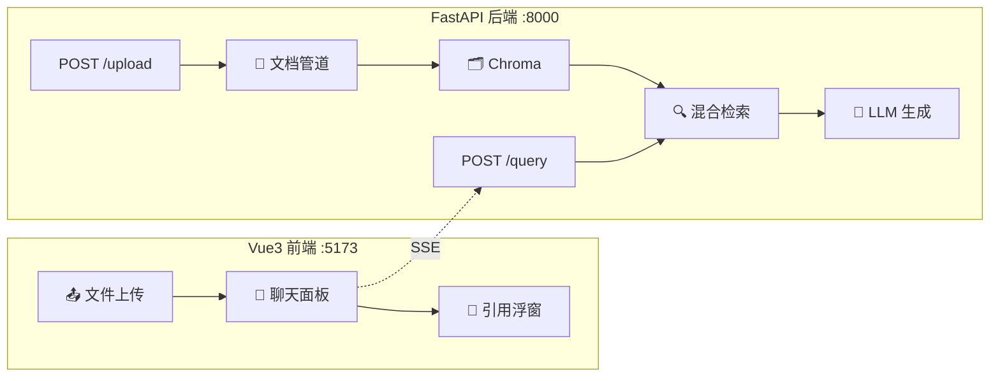

# 🌐 07 — RAG Web 应用

> 🎯 **目标**：把 Phase 3 所有模块拼装为完整 Web 应用：上传→索引→问答→引用。
> ⏱️ 预计时间：3 天

---

## 📋 系统架构



---

## 1️⃣ 后端核心 API

```python
from fastapi import FastAPI, UploadFile, File
from fastapi.responses import StreamingResponse
import json, uuid

app = FastAPI(title="📚 RAG Web API")
knowledge_bases: dict = {}  # kb_id → {name, pipeline, searcher, chroma_collection}

@app.post("/api/kb")
async def create_kb(name: str):
    kb_id = uuid.uuid4().hex[:8]
    knowledge_bases[kb_id] = {"name": name}
    return {"kb_id": kb_id, "name": name}

@app.post("/api/kb/{kb_id}/upload")
async def upload_file(kb_id: str, file: UploadFile = File(...)):
    kb = knowledge_bases.get(kb_id)
    if not kb: raise HTTPException(404)

    content = await file.read()
    ext = os.path.splitext(file.filename)[1]
    os.makedirs(f"/tmp/rag_uploads/{kb_id}", exist_ok=True)
    path = f"/tmp/rag_uploads/{kb_id}/{file.filename}"
    with open(path, 'wb') as f: f.write(content)

    chunks = kb['pipeline'].process_file(path)
    kb['searcher'].add_chunks(chunks)  # 同步更新索引
    return {"filename": file.filename, "chunks": len(chunks)}

@app.post("/api/kb/{kb_id}/query")
async def query(kb_id: str, q: str):
    kb = knowledge_bases.get(kb_id)
    async def stream():
        retrieved = kb['searcher'].search(q, top_k=5)
        prompt = build_rag_prompt(q, retrieved)
        async for token in llm_stream(prompt):
            yield f"data: {json.dumps({'token': token})}\n\n"
        yield f"data: {json.dumps({'citations': [{'source': r['source']} for r in retrieved]})}\n\n"
        yield "data: [DONE]\n\n"
    return StreamingResponse(stream(), media_type="text/event-stream")
```

---

## 🚨 翻车现场

| 现象 | 原因 | 解决 |
|------|------|------|
| 上传后检索不到 | 索引未异步更新 | 确保 add_chunks 在 return 前完成 |
| 大文件上传超时 | 同步处理太慢 | 改为后台任务 + 状态 API |
| 前端 SSE 卡住 | 后端未设 X-Accel-Buffering | 加 `X-Accel-Buffering: no` 头 |

---

## ✅ 产出物 Checklist

- [ ] FastAPI 后端跑通（上传→索引→流式问答）
- [ ] Vue3 前端展示带引用的回答
- [ ] Docker Compose 一键启动
