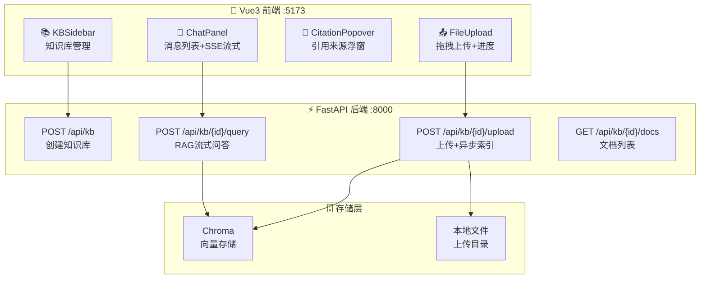

# 🌐 07 — RAG Web 应用：完整知识库问答系统

> 🎯 **目标**：把 Phase 3 所有模块拼装为完整 Web 应用：上传 PDF→自动索引→流式问答→引用展示。
> ⏱️ 预计时间：3 天

---

## 📋 系统架构



---

## 1️⃣ 后端项目结构

```
rag_web_app/
├── backend/
│   ├── main.py            # FastAPI 入口
│   ├── config.py           # 配置
│   ├── kb_manager.py       # 知识库管理
│   ├── pipeline.py         # 文档处理管道
│   ├── searcher.py         # 混合检索
│   └── requirements.txt
├── frontend/               # Vue3 项目
├── docker-compose.yml
└── README.md
```

---

## 2️⃣ 后端核心实现

### kb_manager.py — 知识库 CRUD

```python
import uuid, os, shutil
from dataclasses import dataclass, field

@dataclass
class KnowledgeBase:
    kb_id: str
    name: str
    docs: list[dict] = field(default_factory=list)
    
class KBManager:
    def __init__(self):
        self._kbs: dict[str, KnowledgeBase] = {}
    
    def create(self, name: str) -> KnowledgeBase:
        kb_id = uuid.uuid4().hex[:8]
        kb = KnowledgeBase(kb_id=kb_id, name=name)
        self._kbs[kb_id] = kb
        return kb
    
    def get(self, kb_id: str) -> KnowledgeBase | None:
        return self._kbs.get(kb_id)
    
    def list_all(self) -> list[KnowledgeBase]:
        return list(self._kbs.values())
    
    def delete(self, kb_id: str) -> bool:
        if kb_id in self._kbs:
            del self._kbs[kb_id]
            shutil.rmtree(f"/tmp/rag_uploads/{kb_id}", ignore_errors=True)
            return True
        return False

kb_manager = KBManager()
```

### pipeline.py — 文档处理管道

```python
import os, fitz
from sentence_transformers import SentenceTransformer
import chromadb

class DocumentPipeline:
    def __init__(self, embedding_model: str = "BAAI/bge-small-zh-v1.5"):
        self.encoder = SentenceTransformer(embedding_model)
        self.chroma_client = chromadb.PersistentClient(path="./chroma_db")
    
    def process_file(self, file_path: str, kb_id: str) -> list[dict]:
        """解析文件 → 分块 → Embedding → 存入 Chroma"""
        ext = os.path.splitext(file_path)[1].lower()
        
        # 解析
        if ext == '.pdf':
            text = self._parse_pdf(file_path)
        elif ext in ('.md', '.txt'):
            with open(file_path, encoding='utf-8') as f:
                text = f.read()
        else:
            raise ValueError(f"不支持的文件格式: {ext}")
        
        # 分块
        chunks = self._chunk_text(text, chunk_size=500, overlap=100)
        
        # Embedding + 存入 Chroma
        collection = self.chroma_client.get_or_create_collection(kb_id)
        embeddings = self.encoder.encode(chunks).tolist()
        ids = [f"{kb_id}_{i}" for i in range(len(chunks))]
        
        collection.add(
            documents=chunks,
            embeddings=embeddings,
            ids=ids,
            metadatas=[{"source": os.path.basename(file_path)}] * len(chunks),
        )
        
        return [{"id": ids[i], "content": chunks[i][:100]} for i in range(len(chunks))]
    
    def _parse_pdf(self, path: str) -> str:
        doc = fitz.open(path)
        return "\n\n".join(page.get_text() for page in doc if page.get_text().strip())
    
    def _chunk_text(self, text: str, chunk_size=500, overlap=100) -> list[str]:
        chunks = []
        start = 0
        while start < len(text):
            end = min(start + chunk_size, len(text))
            chunks.append(text[start:end])
            start = end - overlap
        return chunks
```

### main.py — FastAPI 入口

```python
from fastapi import FastAPI, UploadFile, File, HTTPException
from fastapi.responses import StreamingResponse
from fastapi.middleware.cors import CORSMiddleware
import json

from kb_manager import kb_manager
from pipeline import DocumentPipeline
from searcher import HybridSearcher

app = FastAPI(title="📚 RAG Web API")
app.add_middleware(CORSMiddleware, allow_origins=["*"], allow_methods=["*"], allow_headers=["*"])

pipeline = DocumentPipeline()
searcher = HybridSearcher()

# --- 知识库 API ---
@app.post("/api/kb")
async def create_kb(name: str):
    kb = kb_manager.create(name)
    return {"kb_id": kb.kb_id, "name": kb.name}

@app.get("/api/kb")
async def list_kbs():
    return [{"kb_id": kb.kb_id, "name": kb.name} for kb in kb_manager.list_all()]

@app.delete("/api/kb/{kb_id}")
async def delete_kb(kb_id: str):
    if not kb_manager.delete(kb_id):
        raise HTTPException(404, "知识库不存在")
    return {"status": "deleted"}

# --- 文档上传 API ---
@app.post("/api/kb/{kb_id}/upload")
async def upload_file(kb_id: str, file: UploadFile = File(...)):
    kb = kb_manager.get(kb_id)
    if not kb: raise HTTPException(404, "知识库不存在")
    
    os.makedirs(f"/tmp/rag_uploads/{kb_id}", exist_ok=True)
    path = f"/tmp/rag_uploads/{kb_id}/{file.filename}"
    content = await file.read()
    with open(path, 'wb') as f: f.write(content)
    
    chunks = pipeline.process_file(path, kb_id)
    kb.docs.append({"filename": file.filename, "chunks": len(chunks)})
    return {"filename": file.filename, "chunks": len(chunks)}

# --- RAG 问答 API ---
@app.post("/api/kb/{kb_id}/query")
async def query(kb_id: str, q: str):
    kb = kb_manager.get(kb_id)
    if not kb: raise HTTPException(404, "知识库不存在")
    
    async def stream():
        # 检索
        retrieved = searcher.search(q, collection_name=kb_id, top_k=5)
        
        # 构建 Prompt
        context = "\n\n".join(
            f"[来源 {i+1}] {r['content']}" for i, r in enumerate(retrieved)
        )
        prompt = f"基于以下资料回答问题，必须标注引用来源：\n\n{context}\n\n问题：{q}\n回答："
        
        # 流式生成
        async for token in llm_stream(prompt):
            yield f"data: {json.dumps({'token': token}, ensure_ascii=False)}\n\n"
        
        # 返回引用
        citations = [
            {"index": i+1, "source": r.get('metadata', {}).get('source', '未知')}
            for i, r in enumerate(retrieved)
        ]
        yield f"data: {json.dumps({'type': 'citations', 'data': citations}, ensure_ascii=False)}\n\n"
        yield "data: [DONE]\n\n"
    
    return StreamingResponse(stream(), media_type="text/event-stream",
        headers={"Cache-Control": "no-cache", "X-Accel-Buffering": "no"})
```

---

## 3️⃣ 前端核心组件

### ChatPanel.vue

```vue
<script setup lang="ts">
import { ref, nextTick, watch } from 'vue';
import { streamRAGQuery } from '../api/rag';

const messages = ref<Array<{role: string; content: string; citations?: any[]}>>([]);
const inputText = ref('');
const isStreaming = ref(false);
const chatContainer = ref<HTMLElement>();
const selectedKB = ref('');

async function send() {
  const text = inputText.value.trim();
  if (!text || !selectedKB.value) return;
  
  messages.value.push({ role: 'user', content: text });
  messages.value.push({ role: 'assistant', content: '' });
  isStreaming.value = true;
  inputText.value = '';
  
  const assistantMsg = messages.value[messages.value.length - 1];
  for await (const event of streamRAGQuery(selectedKB.value, text)) {
    if (event.type === 'token') {
      assistantMsg.content += event.token;
      await nextTick();
      chatContainer.value?.scrollTo({ top: chatContainer.value.scrollHeight, behavior: 'smooth' });
    } else if (event.type === 'citations') {
      assistantMsg.citations = event.data;
    }
  }
  isStreaming.value = false;
}
</script>
```

### CitationPopover.vue

```vue
<script setup lang="ts">
defineProps<{ index: number; source: string }>();
const show = ref(false);
</script>

<template>
  <span class="citation" @mouseenter="show = true" @mouseleave="show = false">
    <sup>[{{ index }}]</sup>
    <Transition name="fade">
      <div v-if="show" class="citation-popover">
        <strong>{{ source }}</strong>
      </div>
    </Transition>
  </span>
</template>

<style scoped>
.citation { color: var(--accent); cursor: pointer; position: relative; }
.citation-popover {
  position: absolute; bottom: 100%; left: 50%; transform: translateX(-50%);
  background: var(--surface); padding: 8px 12px; border-radius: 8px;
  box-shadow: 0 4px 12px rgba(0,0,0,0.3); white-space: nowrap; z-index: 100;
}
</style>
```

### 前端 API 封装 (rag.ts)

```typescript
export async function* streamRAGQuery(kbId: string, question: string) {
  const resp = await fetch(`/api/kb/${kbId}/query`, {
    method: 'POST',
    headers: { 'Content-Type': 'application/json' },
    body: JSON.stringify({ q: question }),
  });
  
  const reader = resp.body!.getReader();
  const decoder = new TextDecoder();
  let buffer = '';
  
  while (true) {
    const { done, value } = await reader.read();
    if (done) break;
    buffer += decoder.decode(value, { stream: true });
    const lines = buffer.split('\n');
    buffer = lines.pop() || '';
    
    for (const line of lines) {
      if (line === 'data: [DONE]') return;
      if (line.startsWith('data: ')) {
        try { yield JSON.parse(line.slice(6)); }
        catch {}
      }
    }
  }
}
```

---

## 4️⃣ Docker Compose 部署

```yaml
version: "3.9"
services:
  rag-api:
    build: ./backend
    ports: ["8000:8000"]
    environment:
      - OPENAI_API_KEY=${OPENAI_API_KEY}
    volumes:
      - rag_uploads:/tmp/rag_uploads
      - chroma_data:/app/chroma_db
  rag-frontend:
    build: ./frontend
    ports: ["5173:5173"]
    depends_on: [rag-api]
volumes:
  rag_uploads:
  chroma_data:
```

---

## 🚨 翻车现场

| 现象 | 原因 | 解决 |
|:-----|:-----|:-----|
| 上传后检索不到 | Chroma collection 没有重新加载 | 每次 search 前 `client.get_collection(kb_id)` |
| 大文件上传超时 | 同步处理 PDF 太慢 | 改为后台任务 + WebSocket 推送进度 |
| 前端 SSE 卡住不显示 | 后端没设 `X-Accel-Buffering` | 加 `X-Accel-Buffering: no` |
| 引用浮窗位置不对 | z-index 被遮挡 | 设 `z-index: 100` |

---

## ✅ 产出物 Checklist

- [ ] FastAPI 后端跑通（上传→索引→流式问答→引用）
- [ ] Vue3 前端展示带引用来源的回答
- [ ] 支持多知识库切换
- [ ] Docker Compose 一键启动
