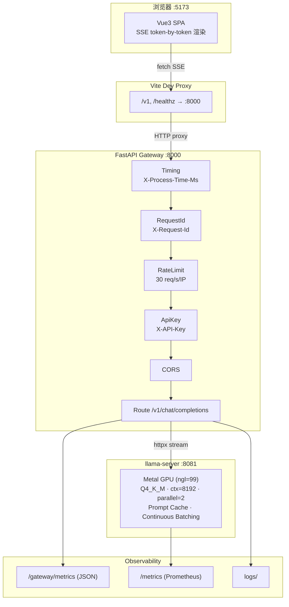

# 🧠 晨熙 AI Gateway — llama.cpp Serving Lab

<p align="center">
  
  
  
  
  
  
  
  
  
  
</p>

<p align="center">
  <strong>本地 AI Gateway serving 底座 — 从模型推理到企业级 API 网关的一站式实战项目</strong><br/>
  一键启动 · Metal GPU 加速 · SSE 流式响应 · 中间件栈 · 并发压测 · Prompt Cache · 23 个自动化测试
</p>

---

## 📖 项目简介

**晨熙 AI Gateway** 是一个面向大模型应用工程师 / AI Infra 工程师学习路线的实战项目，完整实现了一条从浏览器到 GPU 推理的本地 AI serving 全链路：

```
浏览器 (Vue3) → FastAPI Gateway (鉴权/限流/追踪) → llama-server (Metal/Q4_K_M) → GGUF 模型
```

你不仅要"跑起来一个模型"，还要理解企业级 AI serving 的工程结构：为什么要加 API 网关？中间件栈怎么设计？流式 SSE 如何实现？TTFT/TPS 怎么测量？Prompt Cache 如何复用？这些问题在面试中高频出现，本项目给你可落地的答案。

**适合场景**：本地 LLM 推理 | AI Gateway 架构学习 | 并发压测实验 | Prompt Cache 研究 | 前端 SSE 流式联调 | 简历项目

**在学习路线中的位置**：Week 2 — llama.cpp GGUF 本地 serving（Week 1 是 MLX 模型实验，后续 Week 3+ 衔接 LangGraph Agent / SWE-agent / 智能路由网关）

---

## 🎯 学习目标

完成本项目后，你将掌握：

| 能力域 | 具体技能 |
|--------|----------|
| **本地推理** | GGUF 模型下载/合并、llama.cpp Metal 编译、`llama-server` 参数调优 |
| **API 网关设计** | FastAPI lifespan、中间件栈（鉴权/限流/追踪/计时/CORS）、统一错误码 |
| **流式响应** | SSE (Server-Sent Events) 协议、httpx stream mode vs aread()、ReadableStream 解析 |
| **前端联调** | Vue3 Composition API、fetch + AbortController、token-by-token 增量渲染 |
| **并发压测** | TTFT (Time to First Token)、TPS (Tokens Per Second)、P95 latency、asyncio + Semaphore |
| **可观测性** | X-Request-Id 链路追踪、X-Process-Time-Ms 耗时、`/gateway/metrics`、llama.cpp `/metrics` |
| **Prompt Cache** | slot save/restore、固定 system prompt 复用、TTFT 对比实验 |
| **工程实践** | Conda 环境管理、Makefile 编排、进程 trap cleanup、.env 配置驱动 |
| **测试** | pytest + pytest-asyncio、ASGI in-process transport、AsyncMock |

---

## ✨ 功能亮点

### 核心链路
- ✅ **一键启动** — `make start` 启动 llama-server + Gateway + 前端，Ctrl+C 全部停止
- ✅ **OpenAI-compatible API** — `/v1/chat/completions` 支持 stream / non-stream，LangChain 直接可用
- ✅ **SSE 流式前端** — Vue3 + TypeScript，token 逐字渲染，AbortController 中断生成
- ✅ **Metal GPU 推理** — llama.cpp ngl=99，全部 28 层 offload 到 Apple Silicon GPU

### 企业级中间件栈
- ✅ **API Key 鉴权** — `secrets.compare_digest` 防时序攻击，配置驱动（dev 环境自动关闭）
- ✅ **滑动窗口限流** — 30 req/s/IP，X-Forwarded-For 兼容，429 + Retry-After 头
- ✅ **统一错误码** — `VALIDATION_ERROR` / `AUTH_MISSING` / `RATE_LIMIT_EXCEEDED` / `UPSTREAM_TIMEOUT` 等
- ✅ **请求追踪** — X-Request-Id 注入/传播，X-Process-Time-Ms 每请求耗时

### 性能与实验
- ✅ **并发压测工具** — httpx + asyncio，TTFT P50/P95、TPS、JSONL 结果输出
- ✅ **Prompt Cache 实验** — slot save/restore，实测 326 tokens / 18.7MB / 恢复仅 2.3ms
- ✅ **Metrics 采集** — llama.cpp `/metrics` (Prometheus 格式) + Gateway `/gateway/metrics` (JSON)

### 质量保障
- ✅ **23 个自动化测试** — pytest + pytest-asyncio，ASGI in-process transport
- ✅ **10 项环境检查** — `make setup` 自动检测 conda/依赖/模型/npm
- 🟡 **CI/CD** — 待添加 GitHub Actions（test + lint pipeline）
- 🚧 **前端测试** — 待添加 vitest + Playwright E2E

---

## 🛠 技术栈

| 层 | 技术 | 版本 |
|---|---|---|
| **AI 推理引擎** | llama.cpp (C++ + Metal) | main @ 2026-06-06 |
| **模型** | Qwen2.5-7B-Instruct-GGUF Q4_K_M | 4.68GB / 339 tensors |
| **API 网关** | FastAPI + uvicorn | 0.136.3 / 0.49.0 |
| **HTTP 客户端** | httpx (AsyncClient + stream) | 0.28.1 |
| **数据校验** | pydantic + pydantic-settings | 2.13.4 / 2.14.1 |
| **JSON 序列化** | orjson | 3.11.9 |
| **前端框架** | Vue 3 + TypeScript + Vite | 3.5.13 / 5.7 / 6.2.4 |
| **CSS** | CSS Custom Properties（暗色主题） | — |
| **测试** | pytest + pytest-asyncio | 9.0.3 / 1.4.0 |
| **Python 环境** | Conda (cxllm) | Python 3.11 |
| **包管理** | pip + npm | — |
| **进程编排** | Bash (trap cleanup + PID 追踪) | — |

> **为什么不用 Docker？** Docker Desktop for macOS **无法访问 Metal GPU**。容器化后 llama.cpp 退化为纯 CPU 推理，7B 模型生成速度慢 10 倍以上，失去演示价值。本项目用 Bash trap cleanup 实现了一键启停的同等体验。

---

## 🏗 系统架构



### 模块职责

| 模块 | 路径 | 职责 |
|------|------|------|
| **Gateway 工厂** | `gateway/app.py` | FastAPI 实例化、lifespan 管理、5 层中间件注册、3 个异常处理器、3 条路由 |
| **配置中心** | `gateway/config.py` | 18 个 pydantic-settings 配置项，从 `.env` 读取，含鉴权/限流/超时 |
| **上游客户端** | `gateway/llamacpp_client.py` | httpx AsyncClient 封装，流式/非流式双模式，4 种异常→HTTP 错误映射 |
| **鉴权** | `gateway/auth.py` | API Key 中间件，`secrets.compare_digest` 防时序攻击，dev 自动关闭 |
| **限流** | `gateway/middleware.py` | 滑动窗口（30 req/s/IP），X-Forwarded-For 兼容，429 + Retry-After |
| **错误处理** | `gateway/errors.py` | 统一 error code 体系，3 个全局异常处理器（Pydantic/HTTP/通用） |
| **聊天状态机** | `frontend/.../useChat.ts` | 消息历史管理、send/abort/clear、buildApiMessages() |
| **SSE 客户端** | `frontend/.../api/llm.ts` | ReadableStream + TextDecoder + AbortController、缓冲区跨 chunk 管理 |
| **启动编排** | `scripts/start_all.sh` | 前置检查→后台 llama-server→轮询等待→后台 Gateway→前台 Vite→trap 清理 |

---

## 📁 项目目录结构

```
llamacpp-serving-lab/
├── gateway/                  # FastAPI 网关：路由 · 中间件 · 鉴权 · 错误映射 (9 个 .py)
│   ├── app.py                #   应用工厂 + lifespan + 5 中间件 + 3 异常处理器
│   ├── config.py             #   pydantic-settings：18 个配置项
│   ├── schemas.py            #   OpenAI-compatible 请求/响应 Pydantic 模型
│   ├── llamacpp_client.py    #   httpx AsyncClient 上游代理
│   ├── routes_chat.py        #   POST /v1/chat/completions
│   ├── routes_health.py      #   GET /healthz, /readyz
│   ├── routes_metrics.py     #   GET /gateway/metrics
│   ├── auth.py               #   API Key 鉴权中间件
│   ├── middleware.py          #   Timing · RequestId · RateLimit
│   └── errors.py             #   统一错误码 + 3 个全局异常处理器
│
├── frontend/vue3-sse-demo/   # Vue3 + TypeScript + Vite 前端
│   └── src/
│       ├── api/llm.ts        #   SSE 流式 fetch 客户端
│       ├── api/health.ts     #   Health check API
│       ├── composables/       #   useChat (聊天状态机) · useHealth (健康轮询)
│       ├── components/        #   MessageItem · ChatInput · SettingsPanel · HealthBadge
│       ├── types/index.ts    #   全局 TS 类型定义 + 默认参数
│       └── styles/           #   CSS 设计令牌（暗色主题）
│
├── scripts/                  # 工具脚本 (9 个)
│   ├── start_all.sh          #   🚀 一键启动编排（trap + PID + 轮询等待）
│   ├── stop_all.sh           #   一键停止（PID 文件 + pkill 双保险）
│   ├── setup_check.sh        #   10 项环境就绪检查
│   ├── build_llamacpp.sh     #   cmake Metal Release 编译
│   ├── serve_q4.sh           #   llama-server 启动参数
│   ├── bench_concurrency.py  #   httpx 并发压测（TTFT/TPS/P95）
│   ├── scrape_metrics.py     #   /metrics 文本快照采集
│   ├── smoke_openai.sh       #   curl smoke test
│   └── test_prompt_cache.sh  #   Prompt Cache slot save/restore
│
├── tests/                    # 自动化测试 (23 tests)
│   ├── test_gateway_schema.py  # 14 tests：Schema 边界值 + 校验逻辑
│   ├── test_gateway_health.py  # 9 tests：Health / Metrics / Validation / Middleware
│   └── conftest.py           #   ASGI transport + AsyncMock fixture
│
├── models/                   # 模型权重（⛔ 不进 Git）
├── docs/                     # 文档
│   ├── PROJECT_AUDIT_MASTERY.md  # 《项目架构与源码掌控白皮书》
│   └── Week2_llamacpp_serving_lab_actual_runbook.md
├── .env / .env.example       # 环境变量（含鉴权/限流/超时配置）
├── Makefile                  # 13 个 make target
├── pyproject.toml            # pytest 配置
└── README.md                 # 本文件
```

---

## 🚀 快速开始

### 1. 环境要求

| 组件 | 要求 | 检查方式 |
|------|------|----------|
| 硬件 | MacBook M 系列 (M1–M5)，16GB+ 统一内存 | 关于本机 |
| macOS | 14.0+ (Sonoma) | `sw_vers` |
| Xcode CLI | 已安装（提供 cmake/clang） | `xcode-select -p` |
| Conda | Miniconda/Anaconda | `which conda` |
| Node.js | 18+ | `node -v` |

### 2. 克隆项目

```bash
git clone https://github.com/<your-username>/llamacpp-serving-lab.git
cd llamacpp-serving-lab
```

### 3. 环境检查

```bash
make setup
```

这会自动检测 conda 环境、Python 包、llama-server 二进制、模型文件、node_modules。缺失项会提示修复命令。

### 4. 编译 llama.cpp（仅首次）

```bash
make build
# 等价于: ./scripts/build_llamacpp.sh
# 耗时约 3–5 分钟，输出: build/bin/llama-server, llama-cli, llama-gguf-split
```

### 5. 下载模型（仅首次，约 4.7GB）

> ⚠️ `huggingface-cli` 已废弃，请使用 `hf` 命令（安装 `huggingface_hub` 后自带）。

```bash
# 登录 Hugging Face（可选，未登录会限速）
hf auth login

# 分片下载 Q4_K_M
hf download Qwen/Qwen2.5-7B-Instruct-GGUF \
  qwen2.5-7b-instruct-q4_k_m-00001-of-00002.gguf --local-dir models
hf download Qwen/Qwen2.5-7B-Instruct-GGUF \
  qwen2.5-7b-instruct-q4_k_m-00002-of-00002.gguf --local-dir models

# 合并分片
./third_party/llama.cpp/build/bin/llama-gguf-split \
  --merge \
  models/qwen2.5-7b-instruct-q4_k_m-00001-of-00002.gguf \
  models/qwen2.5-7b-instruct-q4_k_m.gguf
```

模型来源：[Qwen/Qwen2.5-7B-Instruct-GGUF](https://huggingface.co/Qwen/Qwen2.5-7B-Instruct-GGUF)，License：Apache 2.0（模型权重）+ Qwen License。

### 6. 配置环境变量

```bash
cp .env.example .env
# 默认配置即可运行。如需启用鉴权，取消注释 GATEWAY_API_KEY 并设置值。
```

### 7. 一键启动 🚀

```bash
make start
```

等待约 20–40 秒（模型加载），看到：
```
[INFO]  All services are running!
        Frontend:  http://127.0.0.1:5173
        Gateway:   http://127.0.0.1:8000
        Press Ctrl+C to stop all services.
```

### 8. 打开浏览器

**http://127.0.0.1:5173** → 开始聊天，观察 token 逐字流式渲染。

### 9. 停止服务

在 `make start` 的终端按 **Ctrl+C**，或从另一终端执行：

```bash
make stop
```

### 自测命令

```bash
# Health check
curl -s http://127.0.0.1:8000/healthz | python -m json.tool --no-ensure-ascii

# Gateway metrics
curl -s http://127.0.0.1:8000/gateway/metrics | python -m json.tool

# 非流式聊天
curl -s http://127.0.0.1:8000/v1/chat/completions \
  -H "Content-Type: application/json" \
  -d '{"messages":[{"role":"user","content":"用三句话解释 llama.cpp 的 serving 价值"}],"max_tokens":256,"stream":false}' \
  | python -m json.tool --no-ensure-ascii

# 运行测试
make test
```

---

## 📡 核心使用方式

### API 调用示例

```bash
# 直接调 llama-server（跳过 Gateway）
curl -s http://127.0.0.1:8081/v1/chat/completions \
  -H "Content-Type: application/json" \
  -d '{
    "model": "local-qwen2.5-7b-q4",
    "messages": [{"role": "user", "content": "你好"}],
    "temperature": 0.2,
    "max_tokens": 256,
    "stream": false
  }' | python -m json.tool --no-ensure-ascii

# 通过 Gateway（推荐，带鉴权/限流/追踪）
curl -s http://127.0.0.1:8000/v1/chat/completions \
  -H "Content-Type: application/json" \
  -d '{
    "messages": [{"role": "user", "content": "你好"}],
    "max_tokens": 256,
    "stream": false
  }' | python -m json.tool --no-ensure-ascii

# Gateway 响应头验证（中间件栈）
curl -sI http://127.0.0.1:8000/healthz | grep -E 'x-request-id|x-process-time'
```

### 并发压测

```bash
# 默认：concurrency=2, 10 requests
make bench

# 自定义参数
python scripts/bench_concurrency.py \
  --concurrency 1 --requests 5 --max-tokens 256

# 结果示例
# {
#   "ttft_ms_p50": 236.82,
#   "ttft_ms_p95": 250.91,
#   "total_ms_p50": 11024.52,
#   "approx_tps_avg": 22.95
# }
```

### Prompt Cache 实验

```bash
./scripts/test_prompt_cache.sh
# 输出：n_saved=326 tokens, n_written=18.7MB, save_ms=5.5, restore_ms=2.3
# 第二次相同 system prompt 的请求 TTFT 显著降低（cached_tokens > 0）
```

### 启用 API Key 鉴权

```bash
# .env 中设置
GATEWAY_API_KEY=my-secret-key-123

# 请求时携带
curl -H "X-API-Key: my-secret-key-123" http://127.0.0.1:8000/v1/chat/completions ...

# 不携带 → 401 {"code":"AUTH_MISSING"}
# 携带错误 → 403 {"code":"AUTH_INVALID"}
```

---

## 🔬 关键实现说明

### 1. 为什么 SSE 流式不能 `await r.aread()`？

[gateway/llamacpp_client.py:76-97]

`httpx.AsyncClient.stream()` 返回的是一个流式上下文管理器，`r.aiter_bytes()` 按 chunk 迭代器读取，每个 chunk 即刻 yield 给上层。如果调用 `r.aread()`，httpx 会把整个响应体读入内存再返回——流式响应变成了阻塞式。Gateway 层直接透传 bytes chunk，不做缓冲，保证 token 级延迟。

### 2. ReadableStream 缓冲区管理

[frontend/vue3-sse-demo/src/api/llm.ts:59-69]

SSE 协议以 `\n` 分隔事件，但 TCP 是字节流——一个 `reader.read()` 返回的 chunk 可能包含多行（含不完整的末行）。处理方式：每次 read 后追加到 buffer → `split('\n')` → 完整的行拿去解析 → 最后一个元素（可能不完整）保留回 buffer，等下一个 chunk 拼接。这个细节决定了 token 渲染会不会"卡顿"。

### 3. 滑动窗口限流算法

[gateway/middleware.py:52-113]

每个 IP 维护一个时间戳列表。每次请求时：
1. 裁剪：删除窗口外的时间戳
2. 检查：`count >= max_requests` → 429 + `Retry-After`
3. 放行：追加当前时间戳

时间复杂度 O(n) per request（n=窗口内请求数），对于本地 dev 场景完全够用。生产环境需替换为 Redis Lua script（O(1) sorted set）。

### 4. Prompt Cache 的复用机制

[scripts/test_prompt_cache.sh]

llama.cpp 的 `--cache-prompt` 让 server 自动检测并复用相同 prompt 前缀的 KV 状态。实验验证：固定 326 token system prompt → save 18.7MB → restore 仅 2.3ms。Cache 命中的请求只计算 1 个新 token 的 prompt 处理（而非 326+），TTFT 显著降低。

### 5. 鉴权的 `secrets.compare_digest` 选择

[gateway/auth.py:46]

普通的 `if a == b` 比较在字符串不匹配时会提前退出，攻击者通过精确测量响应时间可以逐字符推断 Key。`secrets.compare_digest` 保证常量时间比较——面试中这就是"你考虑过时序攻击吗"的标准答案。

---

## 🩺 复现与排错指南

| 问题 | 可能原因 | 解决方式 |
|------|----------|----------|
| `make setup` 报 conda 缺失 | 未安装 Miniconda | `brew install miniconda` 后 `conda create -n cxllm python=3.11` |
| `make start` 报 model not found | 模型未下载/未合并 | `ls models/*.gguf` 确认，按步骤 4 下载合并 |
| `make start` 报 port 8081 in use | 残留 llama-server 进程 | `make stop` 后重试，或 `lsof -i :8081 \| xargs kill` |
| Gateway 返回 502 | llama-server 未启动或 Crash | `tail -f logs/llama-server.log` 排查 |
| llama-server 报端口绑定失败 | 8080 被 AirPlay 等占用 | 改为 8081（本项目默认已用 8081） |
| 中文 JSON 输出为 `\uXXXX` | `json.tool` 默认转义 | 加 `--no-ensure-ascii` 或改用 `jq` |
| `hf download` 报 File not found | 单文件不存在（GGUF 已拆成分片） | 按步骤 4 分别下载 00001-of-00002 和 00002-of-00002 |
| `huggingface-cli` 不工作 | CLI 已废弃 | 使用 `hf` 命令（`pip install -U huggingface_hub`） |
| 前端 SSE 流式不显示 | Vite proxy 未转发 | 确认 `vite.config.ts` proxy 指向 `:8000` |
| `make test` 报 No module named pytest | 未在 cxllm 环境下 | `conda activate cxllm` 后安装 pytest |
| 模型加载 OOM | ctx/parallel 过大 | Activity Monitor 查看内存，降低 `-c 4096` 或 `--parallel 1` |

---

## 🗺 学习路线中的位置

```
大模型应用工程师学习路线 (3 个月)

Week 1: MLX 本地模型实验          ← 前置：Python 基础、模型推理概念
Week 2: llama.cpp GGUF serving  ← 📍 你在这里（本项目）
Week 3: LangChain / LangGraph     ← 后续：Agent 编排框架
Week 4: RAG 检索增强生成          ← 后续：向量数据库 + 文档检索
Week 5: 智能路由网关              ← 后续：多模型路由 / fallback / 负载均衡
...
```

**前置知识**：Python 基础、命令行操作、HTTP 基本概念、了解 LLM 推理基本概念。

**后续可衔接**：
- 接入 LangGraph 做 Agent 工具调用（直接复用本项目的 Gateway `/v1/chat/completions`）
- 扩展为多模型路由网关（Q4 + Q5 对照、MLX + llama.cpp 混合 serving）
- 接入 SWE-agent 做代码修复自动化

---

## 🗺 Roadmap

### 短期优化
- [ ] 前端添加 Stream 开关（当前硬编码 `stream:true`）
- [ ] 区分 `/healthz` (liveness) 与 `/readyz` (readiness) 行为
- [ ] 前端添加非流式模式（一次性返回完整结果）
- [ ] `make all` 一键编译+检查+启动

### 中期增强
- [ ] GitHub Actions CI（test + lint pipeline）
- [ ] 前端 vitest 单元测试 + Playwright E2E
- [ ] Q5_K_M 模型质量对照实验
- [ ] 长上下文阶梯测试（4k→8k→16k 的 TTFT/TPS/memory 矩阵）
- [ ] 使用 `prometheus-client` 导出 Gateway 侧标准 Prometheus metrics

### 长期演进
- [ ] 多 Provider 抽象（MLX / Ollama / vLLM），支持模型别名 + fallback 路由
- [ ] 分布式限流（Redis Token Bucket）
- [ ] JWT/OAuth2 鉴权替换 API Key
- [ ] 多模态推理（接入 llama.cpp mtmd 模块，支持图片/音频）
- [ ] Kubernetes Helm Chart 部署（需解决 GPU 直通，当前仅 Apple Silicon 本地运行）

---

## ⚖️ License

本项目代码采用 [MIT License](https://opensource.org/licenses/MIT)。

使用的开源项目与模型：

| 项目 | License | 用途 |
|------|---------|------|
| [llama.cpp](https://github.com/ggml-org/llama.cpp) | MIT | AI 推理引擎 |
| [Qwen2.5-7B-Instruct](https://huggingface.co/Qwen/Qwen2.5-7B-Instruct-GGUF) | Apache 2.0 + Qwen License | 基座模型（GGUF 格式） |
| [FastAPI](https://github.com/fastapi/fastapi) | MIT | API 网关框架 |
| [Vue.js](https://github.com/vuejs/core) | MIT | 前端框架 |
| [Vite](https://github.com/vitejs/vite) | MIT | 前端构建工具 |
| [httpx](https://github.com/encode/httpx) | BSD | 异步 HTTP 客户端 |
| [pydantic](https://github.com/pydantic/pydantic) | MIT | 数据校验 |

## 👤 Author

**晨熙** — 大模型应用工程师学习实践。

---

> 💡 这个项目的目标是帮你建立"本地 AI serving 的源码级心智模型"。不要只跑一遍 `make start` 就停下——去改参数看 TTFT 变化，去注释掉限流中间件看 Gateway 行为差异，去用 `tail -f logs/llama-server.log` 观察 slot 调度。工程师和"跑过 demo"的区别，就在你按下 Ctrl+C 之前多问的那几个"为什么"。
