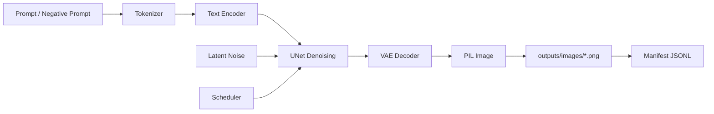
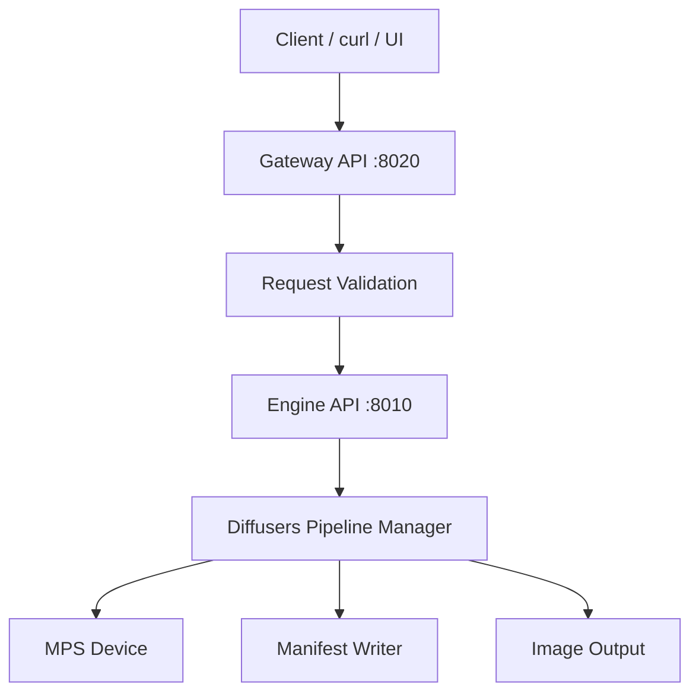

# Week 8 / P3 Runbook — Diffusers 图像生成工程底座

> Day 51–53
> Theme: Diffusers 图像生成工程：txt
> Python Env: Conda only, env name `cxllm`, Python 3.11
> Goal: 构建一个可开源、可复现、可面试讲解的 Diffusers 本地图像生成工程底座。

------

## 0. 项目定位

这个项目不是一个玩具 notebook，而是一个面向 GitHub 作品集的 **Diffusers Inference Lab**。

它要证明三件事：

1. 我理解 Stable Diffusion 的核心数据流：Prompt → Text Encoder → Latent Denoising → VAE Decode → Image。
2. 我能把 txt2img / img2img / inpaint / LoRA / ControlNet 组织成可复用工程，而不是散落的脚本。
3. 我能在 Apple Silicon 32GB 统一内存约束下做模型选择、内存控制、服务化封装与可复现记录。

------

## 1. 工程化目录架构

### 1.1 推荐目录树

```bash
diffusers-vision-lab/
├── Makefile
├── README.md
├── Week8_P3_runbook.md
├── requirements.txt
├── .gitignore
│
├── configs/
│   ├── sd15_txt2img.yaml
│   ├── sd15_img2img.yaml
│   ├── sd15_inpaint.yaml
│   ├── sdxl_txt2img.yaml
│   ├── controlnet_canny.yaml
│   └── lora_txt2img.yaml
│
├── scripts/
│   ├── check_env.py
│   ├── download_models.sh
│   ├── make_mask.py
│   ├── make_canny.py
│   ├── smoke_txt2img.sh
│   └── bench_latency.py
│
├── src/
│   └── diffusers_lab/
│       ├── __init__.py
│       ├── config.py
│       ├── device.py
│       ├── manifest.py
│       ├── pipelines.py
│       ├── generate.py
│       ├── api.py
│       ├── gateway.py
│       └── utils.py
│
├── tests/
│   ├── test_config.py
│   ├── test_manifest.py
│   └── test_device.py
│
├── docs/
│   ├── architecture.md
│   ├── memory_budget.md
│   ├── prompts.md
│   └── interview_notes.md
│
├── assets/
│   ├── input/
│   │   ├── sample_img2img.png
│   │   ├── sample_inpaint.png
│   │   └── sample_mask.png
│   └── control/
│       └── sample_canny.png
│
├── outputs/
│   ├── images/
│   ├── manifests/
│   └── logs/
│
└── models/
    ├── sd15/
    ├── sdxl-base/
    ├── controlnet-canny/
    └── lora/
```

### 1.2 目录职责说明

| 目录                 | 作用                                                         |
| -------------------- | ------------------------------------------------------------ |
| `configs/`           | 保存每个实验的模型、分辨率、seed、steps、scheduler、LoRA、ControlNet 参数。 |
| `scripts/`           | 放置环境检测、模型下载、mask/canny 预处理、压测脚本。        |
| `src/diffusers_lab/` | 核心源码，负责设备选择、Pipeline 构建、生成调用、Manifest 记录和服务封装。 |
| `tests/`             | 放置不依赖大模型的轻量单元测试，保证配置解析、manifest、设备选择逻辑稳定。 |
| `docs/`              | 存放架构图、内存预算、Prompt 实验记录和面试复盘。            |
| `assets/`            | 存放输入图片、mask、ControlNet 控制图。                      |
| `outputs/`           | 存放生成图片、manifest、日志。                               |
| `models/`            | 本地模型目录，默认不提交 GitHub。                            |
| `Makefile`           | 项目工程入口，统一安装、下载、运行、压测、清理。             |

------

## 2. 依赖安装与最新工具链配置

### 2.1 Conda 环境

本项目只使用 Conda 环境，不使用 `venv`。

```bash
conda create -n cxllm python=3.11 -y
conda activate cxllm

python -V
which python
```

预期：

```bash
Python 3.11.x
.../miniconda3/envs/cxllm/bin/python
```

### 2.2 requirements.txt

```txt
# Core
torch
torchvision
torchaudio

# Diffusion stack
diffusers
transformers
accelerate
safetensors
peft
sentencepiece
protobuf

# Hugging Face Hub
huggingface_hub[hf_transfer]

# Image processing
Pillow
opencv-python
numpy

# API service
fastapi
uvicorn[standard]
pydantic
pydantic-settings

# CLI / logs / config
typer
rich
PyYAML
python-dotenv

# Test / quality
pytest
httpx
ruff
```

### 2.3 极速安装命令

```bash
conda activate cxllm

python -m pip install --upgrade pip setuptools wheel

python -m pip install -r requirements.txt
```

如果国内网络较慢，可以临时使用镜像源：

```bash
python -m pip install -r requirements.txt \
  -i https://pypi.tuna.tsinghua.edu.cn/simple
```

### 2.4 Hugging Face CLI 配置

现在使用 `hf`，不要使用旧的 `huggingface-cli`。

```bash
hf --help
hf auth login
```

建议把 Hugging Face 缓存固定到项目局部，避免污染全局缓存：

```bash
export HF_HOME="$PWD/.cache/huggingface"
export HF_HUB_ENABLE_HF_TRANSFER=1
```

可写入 `.env`：

```bash
HF_HOME=.cache/huggingface
HF_HUB_ENABLE_HF_TRANSFER=1
PYTORCH_ENABLE_MPS_FALLBACK=1
```

### 2.5 Apple Silicon MPS 检测

创建 `scripts/check_env.py`：

```python
import platform
import torch

print("Python:", platform.python_version())
print("Platform:", platform.platform())
print("Torch:", torch.__version__)
print("MPS built:", torch.backends.mps.is_built())
print("MPS available:", torch.backends.mps.is_available())

if torch.backends.mps.is_available():
    print("✅ Using Apple Silicon MPS backend")
else:
    print("⚠️ MPS unavailable, fallback to CPU")
```

执行：

```bash
python scripts/check_env.py
```

预期：

```bash
MPS built: True
MPS available: True
✅ Using Apple Silicon MPS backend
```

### 2.6 Apple Metal / MPS 避坑

Apple Silicon 上不要使用 CUDA 相关包，不要安装 `xformers`。本项目默认走 PyTorch MPS。

推荐环境变量：

```bash
export PYTORCH_ENABLE_MPS_FALLBACK=1
```

说明：

| 配置                                       | 作用                                                         |
| ------------------------------------------ | ------------------------------------------------------------ |
| `PYTORCH_ENABLE_MPS_FALLBACK=1`            | MPS 不支持的少量算子回退到 CPU，减少运行中断。               |
| 不安装 `xformers`                          | `xformers` 主要服务 CUDA，Mac MPS 不需要。                   |
| 优先 `torch.float16`，异常时回退 `float32` | MPS 上 fp16 更省内存，但遇到黑图、NaN、算子错误时切换 float32。 |
| `enable_attention_slicing()`               | 降低峰值内存，牺牲少量速度。                                 |
| `enable_vae_slicing()`                     | 大图像解码时降低 VAE 峰值内存。                              |

------

## 3. 模型选择与 32GB 统一内存预算

### 3.1 推荐模型矩阵

| 任务             | 推荐模型                                   | 分辨率    | 32GB M5 建议                         |
| ---------------- | ------------------------------------------ | --------- | ------------------------------------ |
| txt2img 基础     | `runwayml/stable-diffusion-v1-5`           | 512×512   | 主力学习模型，速度和内存最稳。       |
| img2img          | `runwayml/stable-diffusion-v1-5`           | 512×512   | 与 txt2img 共享底座。                |
| inpaint          | `runwayml/stable-diffusion-inpainting`     | 512×512   | 单独 inpaint 权重。                  |
| SDXL txt2img     | `stabilityai/stable-diffusion-xl-base-1.0` | 1024×1024 | 可跑，但慢；建议 steps 20–30。       |
| ControlNet Canny | `lllyasviel/sd-controlnet-canny` + SD1.5   | 512×512   | 先跑 Canny，避免 OpenPose 依赖复杂。 |
| LoRA             | 本地 `.safetensors` 或 HF LoRA repo        | 512×512   | 建议先从 SD1.5 LoRA 做实验。         |

### 3.2 32GB 统一内存预算

| Pipeline            | 推荐 dtype | 粗略运行内存 | 建议                              |
| ------------------- | ---------- | ------------ | --------------------------------- |
| SD1.5 txt2img       | fp16       | 6–8GB        | 稳定主线。                        |
| SD1.5 img2img       | fp16       | 6–8GB        | 与 txt2img 类似。                 |
| SD1.5 inpaint       | fp16       | 7–10GB       | mask 和 init image 增加少量开销。 |
| SD1.5 + ControlNet  | fp16       | 10–14GB      | 32GB 可承载。                     |
| SDXL base           | fp16       | 14–20GB      | 可跑，速度慢，建议单任务。        |
| SDXL base + refiner | fp16       | 20GB+        | 不建议作为本周主线。              |

### 3.3 模型下载

创建 `scripts/download_models.sh`：

```bash
#!/usr/bin/env bash
set -euo pipefail

export HF_HOME="${HF_HOME:-$PWD/.cache/huggingface}"
export HF_HUB_ENABLE_HF_TRANSFER=1

mkdir -p models/sd15 models/sd15-inpaint models/sdxl-base models/controlnet-canny models/lora

echo "==> Download SD 1.5"
hf download runwayml/stable-diffusion-v1-5 \
  --local-dir models/sd15

echo "==> Download SD 1.5 Inpainting"
hf download runwayml/stable-diffusion-inpainting \
  --local-dir models/sd15-inpaint

echo "==> Download SDXL Base"
hf download stabilityai/stable-diffusion-xl-base-1.0 \
  --local-dir models/sdxl-base

echo "==> Download ControlNet Canny"
hf download lllyasviel/sd-controlnet-canny \
  --local-dir models/controlnet-canny

echo "✅ Model download complete"
```

执行：

```bash
chmod +x scripts/download_models.sh
./scripts/download_models.sh
```

如果模型需要授权，先在 Hugging Face 网页端接受模型 license，再执行：

```bash
hf auth login
```

------

## 4. 核心架构设计

### 4.1 Pipeline 数据流



### 4.2 服务化分层



### 4.3 模块职责

| 文件           | 职责                                                         |
| -------------- | ------------------------------------------------------------ |
| `device.py`    | 检测 `mps/cuda/cpu`，选择 dtype，设置 MPS fallback。         |
| `config.py`    | 读取 YAML 配置，转为 Pydantic 对象。                         |
| `pipelines.py` | 按任务构建 txt2img/img2img/inpaint/ControlNet/LoRA Pipeline。 |
| `generate.py`  | CLI 入口，加载 config，生成图片，写 manifest。               |
| `manifest.py`  | 记录 prompt、seed、steps、model、输出路径、耗时、硬件信息。  |
| `api.py`       | Diffusers 推理底座服务，负责实际生成。                       |
| `gateway.py`   | 对外网关，负责参数校验、任务封装、转发到底座服务。           |

------

## 5. 配置文件规范

### 5.1 `configs/sd15_txt2img.yaml`

```yaml
task: txt2img
model_id: models/sd15
output_dir: outputs/images
manifest_path: outputs/manifests/generation_manifest.jsonl

prompt: "a cat wearing a wizard hat, digital art, detailed, cinematic lighting"
negative_prompt: "blurry, low quality, distorted, watermark, text"

seed: 42
num_inference_steps: 25
guidance_scale: 7.5
width: 512
height: 512

device: auto
dtype: float16
scheduler: default

runtime:
  attention_slicing: true
  vae_slicing: true
  safety_checker: true
```

### 5.2 `configs/sdxl_txt2img.yaml`

```yaml
task: sdxl_txt2img
model_id: models/sdxl-base
output_dir: outputs/images
manifest_path: outputs/manifests/generation_manifest.jsonl

prompt: "a cyberpunk city at night, neon lights, rain, cinematic lighting, ultra detailed"
negative_prompt: "blurry, low quality, distorted, watermark, text"

seed: 2026
num_inference_steps: 25
guidance_scale: 7.0
width: 1024
height: 1024

device: auto
dtype: float16

runtime:
  attention_slicing: true
  vae_slicing: true
  safety_checker: true
```

### 5.3 `configs/controlnet_canny.yaml`

```yaml
task: controlnet_canny
base_model_id: models/sd15
controlnet_model_id: models/controlnet-canny

input_image: assets/input/sample_img2img.png
control_image: assets/control/sample_canny.png

output_dir: outputs/images
manifest_path: outputs/manifests/generation_manifest.jsonl

prompt: "a futuristic forest research station, cinematic, highly detailed"
negative_prompt: "blurry, low quality, distorted, watermark, text"

seed: 77
num_inference_steps: 25
guidance_scale: 7.5
width: 512
height: 512
controlnet_conditioning_scale: 1.0

device: auto
dtype: float16

runtime:
  attention_slicing: true
  vae_slicing: true
```

------

## 6. 分终端执行与测试流程

### 6.1 终端 0：环境检查

```bash
cd diffusers-vision-lab
conda activate cxllm

python scripts/check_env.py
```

预期：

```bash
Torch: 2.x.x
MPS built: True
MPS available: True
✅ Using Apple Silicon MPS backend
```

### 6.2 终端 1：下载模型

```bash
cd diffusers-vision-lab
conda activate cxllm

export HF_HOME="$PWD/.cache/huggingface"
export HF_HUB_ENABLE_HF_TRANSFER=1

./scripts/download_models.sh
```

预期：

```bash
==> Download SD 1.5
...
==> Download SD 1.5 Inpainting
...
==> Download SDXL Base
...
==> Download ControlNet Canny
...
✅ Model download complete
```

### 6.3 终端 2：启动 Diffusers 底座服务

```bash
cd diffusers-vision-lab
conda activate cxllm

export PYTORCH_ENABLE_MPS_FALLBACK=1

python -m src.diffusers_lab.api \
  --host 127.0.0.1 \
  --port 8010 \
  --default-config configs/sd15_txt2img.yaml
```

预期日志：

```bash
[device] selected=mps dtype=float16
[pipeline] loading model=models/sd15 task=txt2img
[pipeline] attention_slicing=enabled
[pipeline] vae_slicing=enabled
[server] Diffusers engine listening on http://127.0.0.1:8010
```

### 6.4 终端 3：启动业务网关

```bash
cd diffusers-vision-lab
conda activate cxllm

python -m src.diffusers_lab.gateway \
  --host 127.0.0.1 \
  --port 8020 \
  --engine-url http://127.0.0.1:8010
```

预期日志：

```bash
[gateway] upstream engine=http://127.0.0.1:8010
[gateway] listening on http://127.0.0.1:8020
```

### 6.5 终端 4：Curl 测试 txt2img

```bash
curl -X POST http://127.0.0.1:8020/v1/generate/txt2img \
  -H "Content-Type: application/json" \
  -d '{
    "prompt": "a cat wearing a wizard hat, cinematic lighting, detailed digital art",
    "negative_prompt": "blurry, low quality, watermark, text",
    "seed": 42,
    "steps": 25,
    "guidance_scale": 7.5,
    "width": 512,
    "height": 512
  }'
```

预期返回：

```json
{
  "ok": true,
  "task": "txt2img",
  "seed": 42,
  "output_path": "outputs/images/txt2img_20260610_....png",
  "manifest_path": "outputs/manifests/generation_manifest.jsonl",
  "latency_sec": 18.42,
  "device": "mps"
}
```

### 6.6 终端 4：CLI 直接生成

```bash
python -m src.diffusers_lab.generate \
  --config configs/sd15_txt2img.yaml
```

预期：

```bash
[config] loaded configs/sd15_txt2img.yaml
[device] mps
[generate] seed=42 steps=25 cfg=7.5 size=512x512
[output] outputs/images/txt2img_seed42.png
[manifest] appended outputs/manifests/generation_manifest.jsonl
✅ done
```

------

## 7. txt2img / img2img / inpaint / LoRA / ControlNet 工程要点

### 7.1 txt2img

txt2img 的输入只有文本和采样参数，核心瓶颈在 UNet 多步去噪。

工程注意点：

| 参数             | 建议                                       |
| ---------------- | ------------------------------------------ |
| `seed`           | 必须写入 manifest，否则无法复现实验。      |
| `steps`          | SD1.5 建议 20–30，SDXL 建议 20–30。        |
| `guidance_scale` | SD1.5 常用 7–9；过高会导致画面僵硬或过锐。 |
| `width/height`   | SD1.5 先用 512；SDXL 默认 1024。           |

### 7.2 img2img

img2img 的关键参数是 `strength`。

| strength | 效果                             |
| -------- | -------------------------------- |
| 0.2–0.4  | 保留原图结构，只做轻微风格迁移。 |
| 0.5–0.7  | 结构和风格都明显改变。           |
| 0.8–1.0  | 接近重新生成，原图约束很弱。     |

工程建议：

```bash
python -m src.diffusers_lab.generate \
  --config configs/sd15_img2img.yaml
```

### 7.3 inpaint

inpaint 需要两张图：

1. 原图。
2. mask 图：白色区域重绘，黑色区域保留。

创建简单 mask：

```bash
python scripts/make_mask.py \
  --input assets/input/sample_inpaint.png \
  --output assets/input/sample_mask.png \
  --box 180,180,340,340
```

运行：

```bash
python -m src.diffusers_lab.generate \
  --config configs/sd15_inpaint.yaml
```

### 7.4 LoRA

LoRA 不改变底座模型主体参数，而是加载额外低秩权重，适合风格、角色、材质、构图倾向实验。

建议目录：

```bash
models/lora/
└── my_style_lora.safetensors
```

运行：

```bash
python -m src.diffusers_lab.generate \
  --config configs/lora_txt2img.yaml
```

配置示例：

```yaml
task: lora_txt2img
model_id: models/sd15
lora:
  path: models/lora
  weight_name: my_style_lora.safetensors
  scale: 0.75
```

工程建议：

- LoRA 权重不要写死在 prompt 里，应该进入 config。
- `scale` 必须写入 manifest。
- 同一 seed 下对比 `scale=0.0 / 0.5 / 0.8 / 1.0`，才能说明 LoRA 是否真的生效。

### 7.5 ControlNet Canny

ControlNet 通过额外控制图约束空间结构。Canny 是最适合入门的控制方式，因为它只依赖边缘图。

生成 Canny 控制图：

```bash
python scripts/make_canny.py \
  --input assets/input/sample_img2img.png \
  --output assets/control/sample_canny.png \
  --low 100 \
  --high 200
```

运行 ControlNet：

```bash
python -m src.diffusers_lab.generate \
  --config configs/controlnet_canny.yaml
```

工程建议：

| 参数                                | 作用                     |
| ----------------------------------- | ------------------------ |
| `controlnet_conditioning_scale=0.5` | 控制较弱，更自由。       |
| `controlnet_conditioning_scale=1.0` | 默认强度，结构较稳。     |
| `controlnet_conditioning_scale=1.5` | 控制很强，画面可能僵硬。 |

------

## 8. Manifest：可复现记录

每次生成都必须写入 JSONL。

### 8.1 manifest 示例

```json
{
  "run_id": "txt2img_20260610_103501_seed42",
  "task": "txt2img",
  "model_id": "models/sd15",
  "prompt": "a cat wearing a wizard hat, cinematic lighting",
  "negative_prompt": "blurry, low quality, watermark",
  "seed": 42,
  "num_inference_steps": 25,
  "guidance_scale": 7.5,
  "width": 512,
  "height": 512,
  "dtype": "float16",
  "device": "mps",
  "scheduler": "default",
  "lora": null,
  "controlnet": null,
  "latency_sec": 18.42,
  "output_path": "outputs/images/txt2img_20260610_103501_seed42.png"
}
```

### 8.2 为什么 manifest 是工程核心

没有 manifest，图像生成就只是“玄学抽卡”；有 manifest，才是可复现实验。

Manifest 至少要记录：

- prompt
- negative_prompt
- model_id
- seed
- steps
- guidance_scale
- width / height
- dtype
- device
- scheduler
- LoRA path / scale
- ControlNet path / scale
- input image / mask / control image
- output path
- latency
- git commit，可选，不在自动脚本里强制执行

------

## 9. 终极一键运行：Makefile

### 9.1 Makefile 源码

```makefile
SHELL := /bin/bash

PROJECT_NAME := diffusers-vision-lab
CONDA_ENV ?= cxllm
SESSION ?= diffusers_lab

ENGINE_HOST ?= 127.0.0.1
ENGINE_PORT ?= 8010
GATEWAY_HOST ?= 127.0.0.1
GATEWAY_PORT ?= 8020

DEFAULT_CONFIG ?= configs/sd15_txt2img.yaml

HF_HOME ?= $(PWD)/.cache/huggingface
PYTORCH_ENABLE_MPS_FALLBACK ?= 1

.PHONY: help setup check-env download run-engine run-gateway run-all stop logs smoke test lint clean clean-models clean-outputs

help:
	@echo ""
	@echo "Diffusers Vision Lab"
	@echo "===================="
	@echo "make setup          Install Python dependencies into Conda env cxllm"
	@echo "make check-env      Check Python/Torch/MPS environment"
	@echo "make download       Download SD1.5/SDXL/ControlNet models with hf"
	@echo "make run-engine     Run Diffusers engine service on $(ENGINE_PORT)"
	@echo "make run-gateway    Run Gateway service on $(GATEWAY_PORT)"
	@echo "make run-all        Run engine + gateway in tmux"
	@echo "make stop           Stop tmux services"
	@echo "make logs           Attach tmux session"
	@echo "make smoke          Run txt2img smoke test through gateway"
	@echo "make test           Run pytest"
	@echo "make lint           Run ruff check"
	@echo "make clean          Clean caches and outputs, keep models"
	@echo "make clean-models   Delete downloaded models"
	@echo ""

setup:
	@echo "==> Installing dependencies into Conda env: $(CONDA_ENV)"
	@eval "$$(conda shell.bash hook)" && \
	conda activate $(CONDA_ENV) && \
	python -m pip install --upgrade pip setuptools wheel && \
	python -m pip install -r requirements.txt

check-env:
	@eval "$$(conda shell.bash hook)" && \
	conda activate $(CONDA_ENV) && \
	python scripts/check_env.py

download:
	@eval "$$(conda shell.bash hook)" && \
	conda activate $(CONDA_ENV) && \
	export HF_HOME="$(HF_HOME)" && \
	export HF_HUB_ENABLE_HF_TRANSFER=1 && \
	chmod +x scripts/download_models.sh && \
	./scripts/download_models.sh

run-engine:
	@eval "$$(conda shell.bash hook)" && \
	conda activate $(CONDA_ENV) && \
	export HF_HOME="$(HF_HOME)" && \
	export PYTORCH_ENABLE_MPS_FALLBACK=$(PYTORCH_ENABLE_MPS_FALLBACK) && \
	python -m src.diffusers_lab.api \
		--host $(ENGINE_HOST) \
		--port $(ENGINE_PORT) \
		--default-config $(DEFAULT_CONFIG)

run-gateway:
	@eval "$$(conda shell.bash hook)" && \
	conda activate $(CONDA_ENV) && \
	python -m src.diffusers_lab.gateway \
		--host $(GATEWAY_HOST) \
		--port $(GATEWAY_PORT) \
		--engine-url http://$(ENGINE_HOST):$(ENGINE_PORT)

run-all:
	@echo "==> Starting services in tmux session: $(SESSION)"
	@tmux has-session -t $(SESSION) 2>/dev/null && tmux kill-session -t $(SESSION) || true
	@tmux new-session -d -s $(SESSION) -n engine \
		'cd $(PWD); eval "$$(conda shell.bash hook)"; conda activate $(CONDA_ENV); export HF_HOME="$(HF_HOME)"; export PYTORCH_ENABLE_MPS_FALLBACK=$(PYTORCH_ENABLE_MPS_FALLBACK); python -m src.diffusers_lab.api --host $(ENGINE_HOST) --port $(ENGINE_PORT) --default-config $(DEFAULT_CONFIG)'
	@tmux new-window -t $(SESSION):2 -n gateway \
		'cd $(PWD); eval "$$(conda shell.bash hook)"; conda activate $(CONDA_ENV); python -m src.diffusers_lab.gateway --host $(GATEWAY_HOST) --port $(GATEWAY_PORT) --engine-url http://$(ENGINE_HOST):$(ENGINE_PORT)'
	@echo "✅ Services started."
	@echo "Engine : http://$(ENGINE_HOST):$(ENGINE_PORT)"
	@echo "Gateway: http://$(GATEWAY_HOST):$(GATEWAY_PORT)"
	@echo "Attach : make logs"
	@echo "Stop   : make stop"

stop:
	@tmux has-session -t $(SESSION) 2>/dev/null && tmux kill-session -t $(SESSION) || true
	@echo "✅ stopped tmux session: $(SESSION)"

logs:
	@tmux attach -t $(SESSION)

smoke:
	@echo "==> Running txt2img smoke test"
	@curl -X POST http://$(GATEWAY_HOST):$(GATEWAY_PORT)/v1/generate/txt2img \
		-H "Content-Type: application/json" \
		-d '{"prompt":"a cat wearing a wizard hat, cinematic lighting, detailed digital art","negative_prompt":"blurry, low quality, watermark, text","seed":42,"steps":25,"guidance_scale":7.5,"width":512,"height":512}' | python -m json.tool

test:
	@eval "$$(conda shell.bash hook)" && \
	conda activate $(CONDA_ENV) && \
	pytest -q

lint:
	@eval "$$(conda shell.bash hook)" && \
	conda activate $(CONDA_ENV) && \
	ruff check src scripts tests

clean:
	@echo "==> Cleaning outputs and Python caches"
	@rm -rf .pytest_cache .ruff_cache
	@find . -type d -name "__pycache__" -prune -exec rm -rf {} +
	@rm -rf outputs/images/* outputs/logs/* outputs/manifests/*
	@echo "✅ cleaned outputs and caches; models are kept"

clean-models:
	@echo "⚠️ Removing all downloaded models"
	@rm -rf models/sd15 models/sd15-inpaint models/sdxl-base models/controlnet-canny models/lora/*
	@echo "✅ models removed"

clean-outputs:
	@rm -rf outputs/images/* outputs/logs/* outputs/manifests/*
	@echo "✅ outputs cleaned"
```

### 9.2 一键启动

```bash
make setup
make check-env
make download
make run-all
```

查看服务日志：

```bash
make logs
```

退出 tmux 但不停止服务：

```bash
Ctrl + B
D
```

停止所有服务：

```bash
make stop
```

------

## 10. 常见坑点与硬件降维打击方案

### 10.1 端口冲突

现象：

```bash
[Errno 48] Address already in use
```

排查：

```bash
lsof -i :8010
lsof -i :8020
```

解决：

```bash
kill -9 <PID>
```

或者换端口：

```bash
make run-all ENGINE_PORT=8110 GATEWAY_PORT=8120
```

### 10.2 MPS OOM / 系统内存压力过高

现象：

```bash
RuntimeError: MPS backend out of memory
```

优先级从高到低处理：

```yaml
1. SDXL 改 SD1.5
2. 1024x1024 改 768x768 或 512x512
3. steps 从 50 降到 25
4. 开启 attention_slicing
5. 开启 vae_slicing
6. dtype=float16
7. 单进程只加载一个 pipeline
8. 关闭浏览器、ComfyUI、IDE 大型索引进程
```

不要一上来调系统级 MPS 内存水位。32GB 统一内存不是 32GB 独立显存，macOS、浏览器、IDE、缓存都会抢内存。

### 10.3 Hugging Face 下载失败 / 代理劫持

现象：

```bash
Distant resource does not seem to be on huggingface.co
SSL certificate verify failed
Connection reset by peer
```

处理顺序：

```bash
hf auth login
hf whoami
```

确认网络：

```bash
python - <<'PY'
from huggingface_hub import HfApi
api = HfApi()
print(api.model_info("runwayml/stable-diffusion-v1-5").modelId)
PY
```

设置局部缓存：

```bash
export HF_HOME="$PWD/.cache/huggingface"
```

不要混用 ModelScope、HF cache、浏览器下载的半截模型。模型目录必须完整包含：

```bash
model_index.json
scheduler/
text_encoder/
tokenizer/
unet/
vae/
```

### 10.4 LoRA 不生效

常见原因：

| 原因                  | 解决                                             |
| --------------------- | ------------------------------------------------ |
| LoRA 和底座模型不匹配 | SD1.5 LoRA 必须配 SD1.5，SDXL LoRA 必须配 SDXL。 |
| scale 太低            | 尝试 `0.5 / 0.75 / 1.0` 对比。                   |
| prompt 没有触发词     | 查看 LoRA 作者说明，补充 trigger words。         |
| 没写 manifest         | 无法确认本轮是否加载了 LoRA。                    |

### 10.5 ControlNet 结构控制太弱或太僵

| 现象           | 解决                                              |
| -------------- | ------------------------------------------------- |
| 控制图几乎无效 | 提高 `controlnet_conditioning_scale` 到 1.0–1.3。 |
| 画面太僵硬     | 降到 0.5–0.8。                                    |
| Canny 边缘太乱 | 调高 Canny 阈值，减少碎边。                       |
| 图片变灰或奇怪 | 确认 control image 是 RGB 图，不是单通道异常图。  |

### 10.6 MPS 上黑图 / NaN / 奇怪色块

处理：

```yaml
1. dtype 从 float16 改 float32
2. steps 降到 20–25
3. 关闭自定义 scheduler
4. 更新 torch / diffusers / transformers
5. 确认模型不是半截下载
```

------

## 11. Debug 视角的三天学习路线

### Day 51：SD1.5 txt2img 工程骨架

目标：

- 跑通 Conda 环境。
- 下载 SD1.5。
- 完成 txt2img。
- 写入 manifest。
- 输出 3 张不同 seed 的图片。

命令：

```bash
make setup
make check-env
make download

python -m src.diffusers_lab.generate --config configs/sd15_txt2img.yaml
```

产出：

```bash
outputs/images/txt2img_seed42.png
outputs/manifests/generation_manifest.jsonl
```

### Day 52：img2img + inpaint

目标：

- 理解 `strength`。
- 理解 mask 白色重绘、黑色保留。
- 对比 `strength=0.3 / 0.6 / 0.9`。
- 记录 manifest。

命令：

```bash
python -m src.diffusers_lab.generate --config configs/sd15_img2img.yaml
python scripts/make_mask.py --input assets/input/sample_inpaint.png --output assets/input/sample_mask.png --box 180,180,340,340
python -m src.diffusers_lab.generate --config configs/sd15_inpaint.yaml
```

### Day 53：LoRA + ControlNet + 服务化

目标：

- 加载一个 LoRA。
- 运行 ControlNet Canny。
- 启动 engine + gateway。
- curl 生成图片。
- 完成 Makefile 一键启动。

命令：

```bash
python scripts/make_canny.py \
  --input assets/input/sample_img2img.png \
  --output assets/control/sample_canny.png

python -m src.diffusers_lab.generate --config configs/controlnet_canny.yaml

make run-all
make smoke
make stop
```

------

## 12. GitHub 开源质量要求

### 12.1 `.gitignore`

```gitignore
# Python
__pycache__/
*.pyc
.pytest_cache/
.ruff_cache/

# Env
.env
.venv/
venv/

# Hugging Face cache
.cache/

# Model weights
models/sd15/
models/sd15-inpaint/
models/sdxl-base/
models/controlnet-canny/
models/**/*.safetensors
models/**/*.ckpt
models/**/*.bin

# Outputs
outputs/images/
outputs/logs/
outputs/manifests/

# macOS
.DS_Store
```

### 12.2 README 必须展示

README 首页建议包含：

```md
## Features

- SD1.5 txt2img / img2img / inpaint
- SDXL txt2img
- LoRA loading
- ControlNet Canny
- Apple Silicon MPS support
- Manifest-based reproducibility
- FastAPI engine + gateway
- One-command tmux launch via Makefile
```

### 12.3 作品集截图

建议提交：

```bash
docs/screenshots/
├── txt2img_grid.png
├── img2img_strength_compare.png
├── inpaint_before_after.png
├── controlnet_canny_compare.png
└── terminal_make_run_all.png
```

------

## 13. 面试深度解析

### Q1：Stable Diffusion 的推理数据流是什么？为什么 UNet 是性能瓶颈？

核心答题思路：

Stable Diffusion 不是直接在像素空间生成图像，而是在 latent space 中逐步去噪。Prompt 先经过 tokenizer 和 text encoder 得到文本条件 embedding，然后 scheduler 给出每一步的噪声时间步，UNet 在每个时间步预测噪声残差，最终 VAE decoder 把 latent 解码成 RGB 图像。

UNet 是瓶颈，因为它在每个 inference step 都要执行一次完整前向传播。假设 steps=30，就意味着 UNet 至少运行 30 次；Text Encoder 通常只运行一次，VAE Decoder 通常只在最后运行一次。所以 steps、分辨率、batch size、ControlNet 都会显著影响 UNet 的计算量和内存峰值。

硬件视角：

- 文本编码是一次性开销。
- UNet 是循环开销。
- VAE 是末端解码开销。
- MPS 上的性能瓶颈通常来自 UNet attention、tensor layout、部分算子 fallback 和统一内存带宽。

### Q2：为什么 SDXL 比 SD1.5 更吃内存？32GB Apple Silicon 如何做取舍？

核心答题思路：

SDXL 相比 SD1.5 主要差异包括更大的 UNet、更高默认分辨率 1024×1024、双 text encoder、更复杂的 conditioning。分辨率从 512×512 到 1024×1024，看似边长翻倍，但像素数量是 4 倍，latent feature map 和 attention 中间状态都会明显增加。

32GB Apple Silicon 是统一内存，不等同于 32GB 独立显存。macOS、浏览器、IDE、Python 进程、HF cache 都共享这块内存。工程上应该先用 SD1.5 建立 pipeline、manifest、API 服务、ControlNet 流程，再把 SDXL 作为高质量慢速路径。SDXL base 可以跑，但不建议同时加载 refiner、ControlNet 和多个 LoRA。

降维方案：

- 默认 SD1.5 512×512。
- SDXL 单独进程加载。
- 关闭多 pipeline 常驻。
- 开启 attention slicing / VAE slicing。
- 把 steps 控制在 20–30。
- OOM 时先降分辨率，不先调系统内存变量。

### Q3：LoRA 和 ControlNet 的工程本质有什么不同？

核心答题思路：

LoRA 是参数增量，它改变模型的权重行为。它通过低秩矩阵注入到注意力层或相关模块中，让底座模型获得特定风格、角色、材质或构图倾向。它影响的是模型“怎么画”。

ControlNet 是结构条件分支，它给扩散过程增加额外空间条件，例如 canny、depth、pose、segmentation。它影响的是模型“按什么结构画”。

工程差异：

| 维度       | LoRA                   | ControlNet                              |
| ---------- | ---------------------- | --------------------------------------- |
| 输入       | 权重文件 + scale       | 控制图 + conditioning scale             |
| 改变对象   | 模型参数路径           | 条件控制路径                            |
| 主要用途   | 风格/角色/画风         | 姿态/边缘/深度/布局                     |
| 内存开销   | 较小                   | 明显增加                                |
| 调参核心   | LoRA scale             | controlnet_conditioning_scale           |
| 可复现关键 | LoRA 文件 hash + scale | control image + scale + preprocess 参数 |

优秀回答要强调：LoRA 和 ControlNet 可以叠加，但在 32GB Mac 上不建议一开始就 SDXL + ControlNet + 多 LoRA 同时跑，因为这会把调试问题从“模型效果”变成“内存和算子稳定性”。

------

## 14. 最终产出 Checklist

-  `configs/sd15_txt2img.yaml`
-  `configs/sd15_img2img.yaml`
-  `configs/sd15_inpaint.yaml`
-  `configs/sdxl_txt2img.yaml`
-  `configs/controlnet_canny.yaml`
-  `configs/lora_txt2img.yaml`
-  `src/diffusers_lab/device.py`
-  `src/diffusers_lab/pipelines.py`
-  `src/diffusers_lab/generate.py`
-  `src/diffusers_lab/api.py`
-  `src/diffusers_lab/gateway.py`
-  `outputs/manifests/generation_manifest.jsonl` 至少 5 条记录
-  txt2img 3 张不同 seed 图片
-  img2img strength 对比图
-  inpaint before/after 对比图
-  LoRA scale 对比图
-  ControlNet Canny 对比图
-  `make run-all` 可一键启动
-  `make smoke` 可通过网关生成图片
-  README 展示架构图、运行命令和结果截图

------

## 15. 最小执行闭环

```bash
conda activate cxllm

make setup
make check-env
make download
make run-all

make smoke

make logs
make stop
```

成功标准：

```bash
1. MPS available=True
2. 模型下载到 models/
3. engine 服务启动在 8010
4. gateway 服务启动在 8020
5. make smoke 返回 ok=true
6. outputs/images/ 出现 png
7. outputs/manifests/generation_manifest.jsonl 出现本次生成记录
```

至此，本周项目可以作为一个完整的 Diffusers 图像生成工程底座提交到 GitHub。