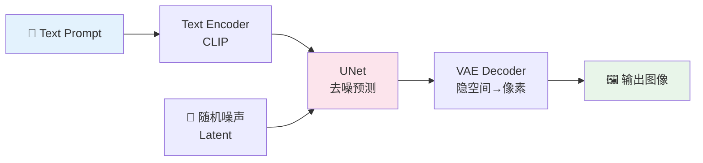

# P3: Diffusers 图像生成（Day 51-53，3天）

> 🎯 **核心价值**：理解扩散模型 Pipeline 工程 — txt2img → img2img → inpaint → LoRA/ControlNet
> ⏱️ 3 天 | 📊 难度 ⭐⭐

---

## 📋 你将学到什么

- ✅ Stable Diffusion 四组件：Text Encoder / UNet / VAE / Scheduler
- ✅ txt2img / img2img / inpaint 三种 Pipeline 完整代码
- ✅ SDXL 与 SD 1.5/2.1 的差异（分辨率/双 Text Encoder）
- ✅ LoRA 插件加载 + ControlNet 边缘/深度/姿态控制
- ✅ 生成参数调优：seed/steps/cfg_scale/scheduler

---

## 1️⃣ 环境搭建

```bash
pip install diffusers transformers accelerate torch Pillow
# Apple Silicon 用 MPS，Nvidia GPU 用 CUDA
```

```python
import torch
from diffusers import StableDiffusionPipeline, StableDiffusionXLPipeline
from PIL import Image
import os

# 检测设备
device = "mps" if torch.backends.mps.is_available() else "cuda" if torch.cuda.is_available() else "cpu"
print(f"Using device: {device}")
```

---

## 2️⃣ SD 架构速览



| 组件 | 作用 | 显存占用 |
|:-----|:-----|:------|
| **Text Encoder (CLIP)** | 把 Prompt 转为语义向量 | ~1.5GB |
| **UNet** | 核心去噪网络，逐步预测噪声 | ~3.5GB |
| **VAE** | 像素↔隐空间互转 | ~0.5GB |
| **Scheduler** | 控制去噪步数和噪声调度 | 可忽略 |

---

## 3️⃣ SD 1.5 txt2img 完整 Demo

```python
from diffusers import StableDiffusionPipeline
import torch

# 加载模型（首次运行会自动下载 ~5GB）
model_id = "runwayml/stable-diffusion-v1-5"
pipe = StableDiffusionPipeline.from_pretrained(
    model_id,
    torch_dtype=torch.float16 if device != "mps" else torch.float32,
    safety_checker=None,  # 学习用可关闭
)
pipe = pipe.to(device)

# 生成图片
prompt = "a cat wearing a wizard hat, digital art, detailed, 8k"
negative_prompt = "blurry, low quality, distorted, watermark"

result = pipe(
    prompt=prompt,
    negative_prompt=negative_prompt,
    num_inference_steps=25,   # 去噪步数（越多越精细，20-50 常用）
    guidance_scale=7.5,       # CFG 引导强度（7-9 常用）
    width=512, height=512,
    seed=42,                  # 固定 seed 可复现
)

image = result.images[0]
image.save("cat_wizard.png")
print(f"✅ 生成完成: cat_wizard.png")
```

### 关键参数解释

| 参数 | 含义 | 推荐值 | 效果 |
|:-----|:-----|:-----|:-----|
| `num_inference_steps` | 去噪迭代步数 | 20-50 | 越多质量越高但越慢 |
| `guidance_scale` | CFG（分类器自由引导） | 7.0-9.0 | 越高越贴近 Prompt，但可能过度锐化 |
| `seed` | 随机种子 | 固定值 | 相同 seed+相同参数 = 完全相同输出 |
| `negative_prompt` | 负面提示词 | 必填 | 排除不想要的特征 |

---

## 4️⃣ img2img 图生图

```python
from diffusers import StableDiffusionImg2ImgPipeline
from PIL import Image

pipe_img2img = StableDiffusionImg2ImgPipeline.from_pretrained(
    "runwayml/stable-diffusion-v1-5",
    torch_dtype=torch.float16 if device != "mps" else torch.float32,
).to(device)

# 加载原始图片
init_image = Image.open("input_photo.jpg").resize((512, 512))

result = pipe_img2img(
    prompt="oil painting style, van gogh style",
    image=init_image,
    strength=0.6,  # 0=完全保留原图, 1=完全变成新图
    num_inference_steps=30,
    guidance_scale=7.5,
)

result.images[0].save("output_painting.png")
```

> 💡 `strength=0.6` 是关键参数——决定了原图保留多少信息。

---

## 5️⃣ Inpaint 局部重绘

```python
from diffusers import StableDiffusionInpaintPipeline

pipe_inpaint = StableDiffusionInpaintPipeline.from_pretrained(
    "runwayml/stable-diffusion-inpainting",
    torch_dtype=torch.float16 if device != "mps" else torch.float32,
).to(device)

# 准备：原图 + 遮罩（白色区域=需要重绘）
image = Image.open("photo.jpg").resize((512, 512))
mask = Image.open("mask.png").resize((512, 512)).convert("L")  # 灰度图

result = pipe_inpaint(
    prompt="a cute dog sitting on grass",
    image=image,
    mask_image=mask,
    num_inference_steps=25,
    guidance_scale=7.5,
)

result.images[0].save("inpainted.png")
```

---

## 6️⃣ SDXL：更高分辨率的文生图

```python
from diffusers import StableDiffusionXLPipeline

pipe_sdxl = StableDiffusionXLPipeline.from_pretrained(
    "stabilityai/stable-diffusion-xl-base-1.0",
    torch_dtype=torch.float16 if device == "cuda" else torch.float32,
    variant="fp16" if device == "cuda" else None,
).to(device)

result = pipe_sdxl(
    prompt="a cyberpunk city at night, neon lights, rain, cinematic lighting",
    negative_prompt="blurry, low quality",
    num_inference_steps=30,
    guidance_scale=7.5,
    width=1024, height=1024,  # SDXL 默认 1024x1024
)

result.images[0].save("cyberpunk_sdxl.png")
```

### SD 1.5 vs SDXL 对比

| 维度 | SD 1.5 | SDXL |
|:-----|:------|:-----|
| 默认分辨率 | 512×512 | 1024×1024 |
| Text Encoder | 1×CLIP | 2×CLIP（更好的文本理解） |
| 显存需求 | ~5GB | ~10GB |
| 速度 | 快 | 慢（约 2-3x） |
| LoRA 生态 | 超级丰富 | 快速增长 |

---

## 7️⃣ LoRA 插件加载

```python
pipe = StableDiffusionPipeline.from_pretrained(
    "runwayml/stable-diffusion-v1-5",
    torch_dtype=torch.float16 if device != "mps" else torch.float32,
).to(device)

# 加载 LoRA（从 CivitAI 或 HuggingFace 下载 .safetensors）
pipe.load_lora_weights("path/to/lora", weight_name="my_style.safetensors")
pipe.fuse_lora()  # 融合到基础模型，推理更快

# 用 LoRA 生成
result = pipe(prompt="a girl in <lora:my_style:0.8>", num_inference_steps=25)
# 0.8 = LoRA 权重，1.0=完全生效，越低越淡
```

---

## 8️⃣ 生成任务 Manifest（可复现记录）

```python
manifest = {
    "prompt": "a cat wearing a wizard hat",
    "negative_prompt": "blurry, low quality",
    "model": "runwayml/stable-diffusion-v1-5",
    "seed": 42,
    "steps": 25,
    "guidance_scale": 7.5,
    "width": 512, "height": 512,
    "output": "cat_wizard.png",
    "lora": None,
    "controlnet": None,
}
import json
with open("generation_manifest.jsonl", "a") as f:
    f.write(json.dumps(manifest) + "\n")
```

---

## 🚨 翻车现场

| 现象 | 原因 | 解决 |
|:-----|:-----|:-----|
| CUDA out of memory | SDXL 显存不够 | 换 SD 1.5 或 `enable_attention_slicing()` |
| MPS 上速度极慢 | Apple Silicon 对扩散模型优化差 | 接受慢速，或换 `mps`+`float32` |
| 生成的人脸扭曲 | SD 1.5 对小人脸处理差 | 用 SDXL 或加 face restoration |
| LoRA 不生效 | weight 路径错误或未 `fuse_lora()` | 确认 `.safetensors` 文件存在 |

---

## ✅ 产出物 Checklist

- [ ] `diffusers_demo.ipynb`：txt2img + img2img + inpaint 完整 Demo
- [ ] 生成任务 manifest JSON（至少 5 条记录，不同 seed/steps）
- [ ] LoRA 实验：加载一个风格 LoRA 并对比效果
- [ ] （可选）ControlNet 实验：Canny 边缘控制或 OpenPose 姿态控制
