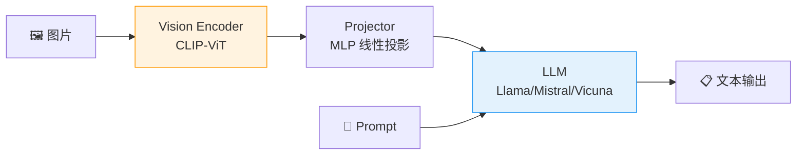

# P5: Qwen-VL / LLaVA 多模态理解（Day 57-60，4天）

> 🎯 **核心价值**：打通图文理解与文档智能 — OCR/图表/空间关系/图像反推 Prompt
> ⏱️ 4 天 | 📊 难度 ⭐⭐⭐

---

## 📋 你将学到什么

- ✅ Qwen-VL：中文 OCR/文档解析/图表问答/图像描述
- ✅ LLaVA 架构：Vision Encoder → Projector → LLM
- ✅ 多模态 Prompt 设计（图像+文本联合输入）
- ✅ 图像反推 Prompt：给图→输出 SD 生成用的 tag

---

## 1️⃣ Qwen-VL 环境搭建

```bash
pip install transformers accelerate torch Pillow qwen-vl-utils
# 需要 >=16GB 显存（GPU）或 >=16GB 统一内存（Mac）
```

```python
from transformers import Qwen2VLForConditionalGeneration, AutoProcessor
from qwen_vl_utils import process_vision_info
import torch

model_name = "Qwen/Qwen2-VL-2B-Instruct"  # 入门用 2B 版

model = Qwen2VLForConditionalGeneration.from_pretrained(
    model_name,
    torch_dtype=torch.bfloat16,
    device_map="auto",
)
processor = AutoProcessor.from_pretrained(model_name)

def ask_qwen_vl(image_path: str, question: str) -> str:
    """向 Qwen-VL 提问"""
    messages = [
        {
            "role": "user",
            "content": [
                {"type": "image", "image": image_path},
                {"type": "text", "text": question},
            ],
        }
    ]
    
    text = processor.apply_chat_template(messages, tokenize=False, add_generation_prompt=True)
    image_inputs, video_inputs = process_vision_info(messages)
    
    inputs = processor(
        text=[text], images=image_inputs, videos=video_inputs,
        padding=True, return_tensors="pt",
    ).to(model.device)
    
    generated_ids = model.generate(**inputs, max_new_tokens=512)
    generated_ids_trimmed = [
        out_ids[len(in_ids):] for in_ids, out_ids in zip(inputs.input_ids, generated_ids)
    ]
    return processor.batch_decode(generated_ids_trimmed, skip_special_tokens=True)[0]
```

---

## 2️⃣ Qwen-VL 四大能力演示

### OCR 文字识别

```python
# 截图/扫描件/手写文字
answer = ask_qwen_vl("screenshot.png", "请提取图片中的所有文字，保持格式")
print(answer)
```

### 文档解析

```python
# PDF 截图、表格图片
answer = ask_qwen_vl("table.png", 
    "这张表格的内容是什么？请转成 Markdown 表格格式"
)
```

### 图表问答

```python
# 折线图/柱状图/饼图
answer = ask_qwen_vl("chart.png",
    "分析这个图表：X轴和Y轴分别代表什么？趋势是什么？最大值出现在哪里？"
)
```

### 图像描述

```python
# 照片/插画/截图
answer = ask_qwen_vl("photo.jpg",
    "请用 3-5 句中文详细描述这张图片的内容、色彩和氛围"
)
```

---

## 3️⃣ LLaVA 架构理解



> 🔑 **关键理解**：VLM = 把图片变成 LLM 能读懂的 token 序列。Vision Encoder 负责"看"，Projector 负责"翻译"，LLM 负责"理解+回答"。

### LLaVA 快速体验

```python
from transformers import LlavaNextProcessor, LlavaNextForConditionalGeneration

model = LlavaNextForConditionalGeneration.from_pretrained(
    "llava-hf/llava-v1.6-mistral-7b-hf",
    torch_dtype=torch.float16, device_map="auto",
)
processor = LlavaNextProcessor.from_pretrained("llava-hf/llava-v1.6-mistral-7b-hf")

def ask_llava(image_path: str, prompt: str) -> str:
    conversation = [
        {"role": "user", "content": [
            {"type": "image"}, {"type": "text", "text": prompt}
        ]},
    ]
    text = processor.apply_chat_template(conversation, add_generation_prompt=True)
    image = Image.open(image_path)
    inputs = processor(images=image, text=text, return_tensors="pt").to("cuda")
    
    output = model.generate(**inputs, max_new_tokens=256)
    return processor.decode(output[0], skip_special_tokens=True)
```

---

## 4️⃣ 多模态 Prompt 设计技巧

| 技巧 | 示例 | 效果 |
|:-----|:-----|:-----|
| **逐步引导** | "先看左上角，再看右下角，然后总结" | 模型更有条理 |
| **格式约束** | "用 JSON 输出：{objects:[], colors:[], mood:''}" | 结构化返回 |
| **对比分析** | "图 A 和图 B 的区别是什么？" | 跨图片推理 |
| **角色设定** | "你是一个 UI 设计师，请审查这张截图的设计问题" | 专业视角 |

---

## 5️⃣ 图像反推 Prompt（Reverse Prompt Engineering）

```python
def reverse_prompt(image_path: str) -> str:
    """给一张图片 → 输出适合 SD 生成用的 Prompt"""
    prompt = """请分析这张图片，输出适合 Stable Diffusion 生成用的 Prompt。
    格式：
    Positive: <详细描述主体、风格、色彩、光线、构图>
    Negative: <不需要的元素>
    Style tags: <风格标签，如 digital art, oil painting, 8k>"""
    
    return ask_qwen_vl(image_path, prompt)

# 示例输出：
# Positive: a cozy reading nook with a large window, warm sunlight streaming in,
#           wooden bookshelves, a comfortable armchair, plants, soft carpet,
#           golden hour lighting, shallow depth of field
# Negative: people, clutter, harsh shadows, low quality
# Style tags: photorealistic, interior design, 8k, cozy atmosphere
```

---

## 🚨 翻车现场

| 现象 | 原因 | 解决 |
|:-----|:-----|:-----|
| Qwen-VL OOM | 7B/72B 太大 | 用 2B 版本入门 |
| OCR 中文识别差 | 图片分辨率太低 | 确保文字区域 ≥ 50px 高 |
| LLaVA 安装失败 | transformers 版本不对 | `pip install transformers>=4.45` |
| 图像反推不准确 | VLM 不擅长生成 SD tag | 加 Few-shot 示例引导 |

---

## ✅ 产出物 Checklist

- [ ] Qwen-VL 图片问答 Demo（OCR/文档/图表/描述各 1 例）
- [ ] LLaVA 跑通 + 理解架构三层
- [ ] 图像反推 Prompt 实验（至少 3 张不同风格图片）
- [ ] 输出多模态 Prompt 设计心得
