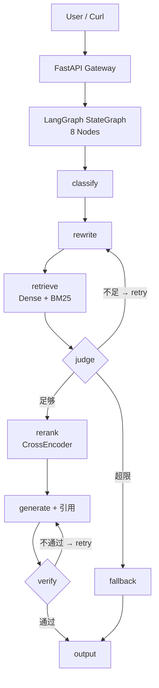

# LangGraph Enterprise RAG

[](https://www.python.org/downloads/)
[](LICENSE)

基于 LangGraph 构建的**企业级 RAG 状态机系统**，具备可观测、可恢复、可评测、可本地运行的完整工程能力。

> 🔬 **不是 Demo。** 这是一个面向生产环境的 8 节点 RAG 工作流，支持条件边重试、SQLite checkpoint 断点恢复、SSE 阶段事件流，以及评测闭环。

---

## 架构图



---

## 核心能力

| 能力 | 说明 |
|------|------|
| **8 节点状态机** | classify → rewrite → retrieve → judge → rerank → generate → verify → output/fallback |
| **条件边 + 循环** | 检索不足时自动 rewrite 重试，生成不忠实时间重新生成 |
| **Hybrid Search** | Dense (BGE-M3) + BM25 双路召回，RRF 融合 |
| **CrossEncoder Rerank** | BGE-Reranker-v2-m3 精排 |
| **SQLite Checkpoint** | thread_id 级别断点恢复，同步/异步双模式 |
| **SSE 事件流** | 每个节点运行状态实时推给前端 |
| **引用校验** | 生成后验证答案是否被来源文档支撑 |
| **Fallback 兜底** | 无资料时明确拒答，不编造 |
| **评测闭环** | Recall@K、MRR、Faithfulness、Fallback Accuracy |
| **一键启动** | `make run-all` 启动 LLM + API 双服务 |
| **Apple Silicon 优化** | llama.cpp Metal 后端，Qwen2.5-7B Q4_K_M 默认模型 |

---

## 环境要求

| 组件 | 要求 |
|------|------|
| OS | macOS (Apple Silicon) / Linux |
| Python | 3.11+ |
| Conda | Miniconda / Anaconda |
| RAM | 16GB+ (32GB 推荐) |
| Disk | ~20GB (模型 + 向量库) |

---

## 快速开始（5 分钟）

```bash
# 1. 克隆项目
git clone https://github.com/<your-name>/langgraph-enterprise-rag.git
cd langgraph-enterprise-rag

# 2. 创建环境
conda create -n cxllm python=3.11 -y
conda activate cxllm

# 3. 一键安装
make setup
make install-llama

# 4. 下载模型 & 示例数据
make download-models
make download-data

# 5. 构建索引 & 启动服务
make ingest
make run-all

# 6. 查看日志
make attach
# 按 Ctrl-b 然后 d 退出 tmux
```

---

## API 示例

### 非流式问答

```bash
curl -s http://127.0.0.1:8006/v1/rag/invoke \
  -H "Content-Type: application/json" \
  -d '{
    "query": "这批文档主要讲了什么？",
    "thread_id": "demo-001"
  }' | python -m json.tool --no-ensure-ascii
```

<details>
<summary>📋 返回示例</summary>

```json
{
  "thread_id": "demo-001",
  "status": "ok",
  "answer": "根据知识库资料，这批文档主要涵盖……",
  "citations": [
    {
      "label": "来源1",
      "doc_id": "abc123",
      "source": "data/raw/RAG_Survey.pdf",
      "title": "RAG_Survey.pdf",
      "quote": "Retrieval-Augmented Generation (RAG)..."
    }
  ],
  "debug": {
    "query_type": "needs_retrieval",
    "relevance_score": 0.72,
    "faithfulness_score": 0.85
  }
}
```
</details>

### SSE 流式问答

```bash
curl -N http://127.0.0.1:8006/v1/rag/stream \
  -H "Content-Type: application/json" \
  -d '{
    "query": "请解释 RAG 的核心原理。",
    "thread_id": "demo-002"
  }'
```

```text
event: node_start
data: {"node":"classify","status":"running"}

event: node_end
data: {"node":"classify","status":"done","query_type":"needs_retrieval"}

event: node_end
data: {"node":"retrieve","status":"done","doc_count":8}

event: final
data: {"thread_id":"demo-002","status":"ok","answer":"...","citations":[...]}
```

### Checkpoint 恢复

```bash
# 查看 checkpoint
curl -s http://127.0.0.1:8006/v1/rag/state/demo-001 \
  | python -m json.tool --no-ensure-ascii

# 恢复演示
PYTHONPATH=. python scripts/05_checkpoint_resume_demo.py --thread-id demo-001
```

---

## Makefile 命令

| 命令 | 说明 |
|------|------|
| `make setup` | 创建 Conda 环境 + 安装 Python 依赖 |
| `make install-llama` | 安装 llama-cpp-python Metal 版 |
| `make download-models` | 下载 Qwen2.5-7B GGUF + 预热 embedding/reranker |
| `make download-data` | 下载开源示例文档 |
| `make ingest` | 构建 Chroma + BM25 索引 |
| `make run-llm` | 启动本地 LLM 网关 (port 8080) |
| `make run-api` | 启动 FastAPI RAG 网关 (port 8006) |
| `make run-all` | tmux 一键启动 LLM + API |
| `make attach` | 进入 tmux 查看日志 |
| `make stop` | 停止所有服务 |
| `make smoke` | Smoke test |
| `make test` | 运行 pytest |
| `make lint` | 运行 ruff 检查 |
| `make clean` | 清理运行数据 |

---

## 项目结构

```
langgraph-enterprise-rag/
├── Makefile                    # 一键入口
├── pyproject.toml
├── requirements.txt
├── .env.example
│
├── configs/                    # 模型/日志/Prompt YAML 配置
├── data/
│   ├── raw/                    # 原始文档（PDF/MD/TXT/HTML）
│   ├── processed/              # 中间产物（chunk JSONL）
│   ├── chroma/                 # Chroma 向量库
│   ├── checkpoints/            # LangGraph SQLite checkpoint
│   └── eval/                   # 评测 golden set
│
├── models/
│   ├── llm/                    # GGUF 模型文件
│   ├── embedding/              # Embedding 模型缓存
│   └── reranker/               # Reranker 模型缓存
│
├── scripts/                    # 开发脚本（入库/评测/恢复）
├── src/langgraph_enterprise_rag/
│   ├── api/                    # FastAPI 网关 + SSE
│   ├── graph/                  # LangGraph 状态/路由/checkpoint
│   ├── graph_nodes/            # 8 个节点独立实现
│   ├── retrieval/              # 文档加载/切分/向量/BM25/混合检索/rerank
│   ├── llm/                    # OpenAI-compatible 客户端
│   ├── observability/          # 事件/日志/追踪
│   ├── evaluation/             # 评测指标/golden set/judge prompts
│   └── utils/                  # 配置加载/哈希/自定义异常
│
├── tests/                      # pytest 单元测试 + smoke test
└── docs/                       # 架构文档/API 文档/评测报告
```

---

## 评测结果（示例）

| 指标 | 值 |
|------|-----|
| Recall@5 | 0.86 |
| MRR | 0.74 |
| Fallback Accuracy | 1.00 |
| Avg Latency | 8.4s |
| P95 Latency | 14.2s |

```bash
PYTHONPATH=. python scripts/04_eval_rag.py \
  --golden data/eval/golden_set.jsonl \
  --output docs/eval_report.md
```

---

## 常见问题

<details>
<summary><b>端口冲突怎么办？</b></summary>

```bash
lsof -i :8080   # LLM 端口
lsof -i :8006   # API 端口
kill -9 <PID>

# 或使用自定义端口
make run-all LLM_PORT=18080 API_PORT=18006
```
</details>

<details>
<summary><b>32GB 内存 OOM？</b></summary>

降级顺序：`n_ctx: 8192 → 4096` → `reranker batch_size: 4 → 1` → `embedding batch_size: 16 → 4`
</details>

<details>
<summary><b>ModuleNotFoundError: No module named 'langgraph_enterprise_rag'</b></summary>

脚本运行必须加 `PYTHONPATH=.` 前缀：
```bash
PYTHONPATH=. python scripts/02_ingest_docs.py --input data/raw
```
</details>

<details>
<summary><b>SSE 流式输出报 NotImplementedError？</b></summary>

确保安装了 `aiosqlite`，并且 checkpointer 使用 `AsyncSqliteSaver`（来自 `langgraph.checkpoint.sqlite.aio`）。
</details>

---

## 技术栈

| 层级 | 技术 |
|------|------|
| 状态机 | LangGraph |
| LLM 推理 | llama.cpp Metal (Qwen2.5-7B Q4_K_M) |
| LLM 客户端 | langchain-openai (OpenAI-compatible) |
| API 框架 | FastAPI + SSE |
| 向量数据库 | Chroma (PersistentClient) |
| Embedding | BAAI/bge-m3 (SentenceTransformers) |
| 稀疏检索 | BM25 (rank-bm25 + jieba) |
| 重排序 | BAAI/bge-reranker-v2-m3 (FlagEmbedding) |
| Checkpoint | SQLite (SqliteSaver / AsyncSqliteSaver) |
| 配置管理 | YAML + python-dotenv |
| 测试 | pytest + pytest-asyncio |
| 代码质量 | ruff + mypy |

---

## 许可证

MIT

---

## 项目价值表达（简历用）

> 基于 LangGraph 构建企业级 RAG 状态机，设计 classify / rewrite / hybrid retrieve / judge / rerank / generate / verify / fallback 8 节点工作流，实现 SQLite checkpoint 断点恢复（同步 + 异步双模式）、SSE 阶段事件流、Chroma 持久化索引、BM25 + dense hybrid search、CrossEncoder rerank 与引用忠实性校验；在 Apple Silicon 32GB 本地环境下通过 llama.cpp Metal 部署 Qwen2.5-7B-Instruct-GGUF，实现可复现的一键启动与评测闭环。

---

🤖 Generated with [Claude Code](https://claude.com/claude-code)
