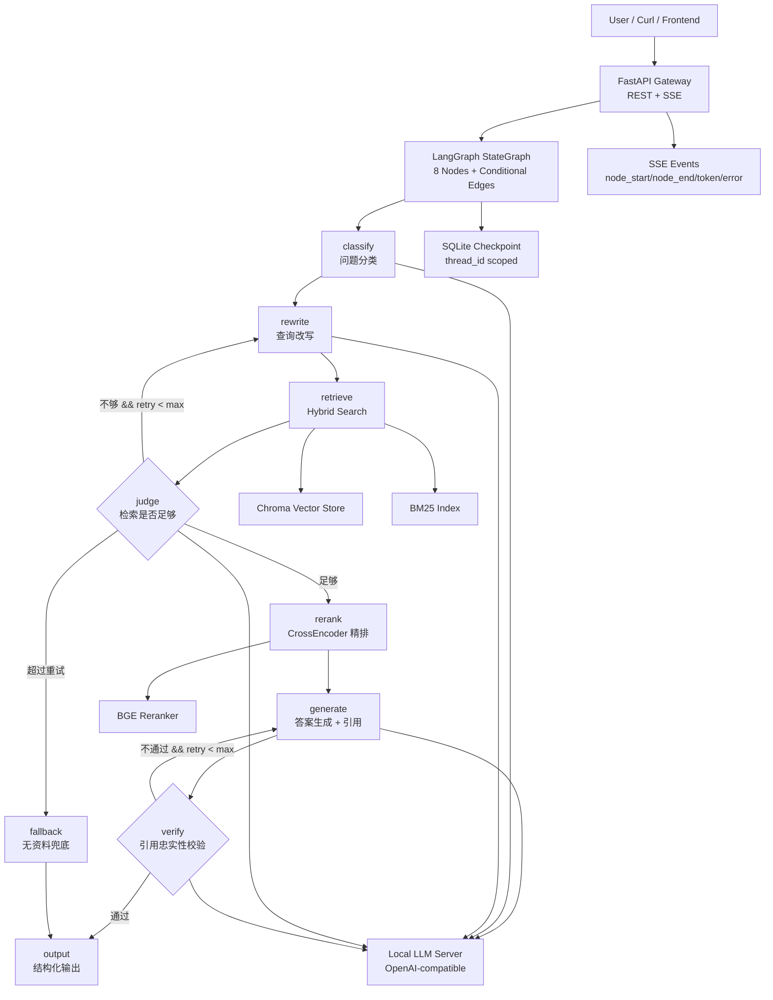
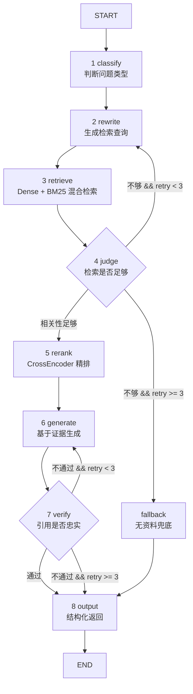

# P6: LangGraph 企业级 RAG Runbook

> **主题**：LangGraph 企业级 RAG
> **周期**：Day 61-64，4 天
> **目标**：构建一个可观测、可恢复、可评测、可本地运行的企业级 RAG 状态机
> **硬件基线**：MacBook Air M5，32GB 统一内存，macOS
> **环境基线**：Conda `cxllm`，Python 3.11
> **项目定位**：GitHub 个人作品集级别工程，而不是 notebook demo

> 💡 **关于本 Runbook**：这不是一份"概述文档"，而是一份**逐行可执行的工程操作手册**。每一个步骤都包含完整可运行的代码，每一处容易踩坑的地方都有对应的排坑说明。顺着做，就能跑通。

------

## 0. 项目总览

本项目不是"把 PDF 丢进向量库然后问答"的普通 RAG Demo，而是一个面向企业场景的 **LangGraph 状态机式 RAG 系统**。

核心能力：

- 8 节点 LangGraph 状态机：`classify → rewrite → retrieve → judge → rerank → generate → verify → output/fallback`
- 支持条件边、循环、失败恢复
- 支持 SQLite checkpoint 持久化（同步 `SqliteSaver` + 异步 `AsyncSqliteSaver` 双模式）
- 支持 SSE 事件流，前端可以实时看到每个阶段进度
- 支持本地 OpenAI-compatible LLM 网关
- 支持 Chroma 持久化向量库
- 支持 BM25 + Dense Hybrid Search（RRF 融合）
- 支持 CrossEncoder rerank
- 支持引用校验与低置信度 fallback
- 支持 `Makefile` 一键安装、一键启动、一键清理

推荐项目名：

```bash
06-langgraph-enterprise-rag-lab
```

------

## 1. 工程化目录架构

### 1.1 目录树

```
06-langgraph-enterprise-rag-lab/
├── Makefile
├── README.md
├── runbook.md
├── pyproject.toml
├── requirements.txt
├── .env.example
├── .gitignore
│
├── configs/
│   ├── app.yaml
│   ├── model.yaml
│   ├── rag.yaml
│   ├── prompts.yaml
│   └── logging.yaml
│
├── data/
│   ├── raw/
│   │   └── README.md
│   ├── processed/
│   │   └── .gitkeep
│   ├── chroma/
│   │   └── .gitkeep
│   ├── checkpoints/
│   │   └── .gitkeep
│   └── eval/
│       └── golden_set.jsonl
│
├── docs/
│   ├── architecture.md
│   ├── api.md
│   ├── eval_report.md
│   └── failure_recovery_demo.md
│
├── models/
│   ├── llm/
│   │   └── .gitkeep
│   ├── embedding/
│   │   └── .gitkeep
│   └── reranker/
│       └── .gitkeep
│
├── scripts/
│   ├── 00_check_env.py
│   ├── 01_download_models.sh
│   ├── 02_ingest_docs.py
│   ├── 03_run_smoke_test.sh
│   ├── 04_eval_rag.py
│   └── 05_checkpoint_resume_demo.py
│
├── src/
│   └── langgraph_enterprise_rag/
│       ├── __init__.py
│       │
│       ├── api/
│       │   ├── __init__.py
│       │   ├── main.py
│       │   ├── schemas.py
│       │   └── sse.py
│       │
│       ├── graph/
│       │   ├── __init__.py
│       │   ├── state.py
│       │   ├── builder.py
│       │   ├── routing.py
│       │   └── checkpoints.py
│       │
│       ├── graph_nodes/
│       │   ├── __init__.py
│       │   ├── classify.py
│       │   ├── rewrite.py
│       │   ├── retrieve.py
│       │   ├── judge.py
│       │   ├── rerank.py
│       │   ├── generate.py
│       │   ├── verify.py
│       │   ├── fallback.py
│       │   └── output.py
│       │
│       ├── retrieval/
│       │   ├── __init__.py
│       │   ├── chunking.py
│       │   ├── loaders.py
│       │   ├── embeddings.py
│       │   ├── chroma_store.py
│       │   ├── bm25.py
│       │   ├── hybrid_search.py
│       │   └── reranker.py
│       │
│       ├── llm/
│       │   ├── __init__.py
│       │   └── openai_compatible.py
│       │
│       ├── observability/
│       │   ├── __init__.py
│       │   ├── events.py
│       │   ├── logging.py
│       │   └── tracing.py
│       │
│       ├── evaluation/
│       │   ├── __init__.py
│       │   ├── metrics.py
│       │   ├── golden_set.py
│       │   └── judge_prompts.py
│       │
│       └── utils/
│           ├── __init__.py
│           ├── config.py
│           ├── hashing.py
│           └── errors.py
│
└── tests/
    ├── test_env.py
    ├── test_chunking.py
    ├── test_retrieval.py
    ├── test_graph_routing.py
    ├── test_checkpoint.py
    └── test_api_smoke.py
```

### 1.2 目录职责说明

| 目录 / 文件                                   | 作用                                                         |
| --------------------------------------------- | ------------------------------------------------------------ |
| `Makefile`                                    | 项目统一入口，封装安装、下载模型、索引构建、服务启动、测试、清理等命令。 |
| `configs/`                                    | 存放模型、RAG 参数、Prompt、日志等配置，避免把工程参数写死在代码里。 |
| `data/raw/`                                   | 原始知识库文档目录，例如 PDF、Markdown、TXT、HTML。          |
| `data/processed/`                             | 清洗切分后的中间数据，例如 chunk JSONL。                     |
| `data/chroma/`                                | Chroma 本地持久化向量库目录。                                |
| `data/checkpoints/`                           | LangGraph SQLite checkpoint 文件目录，用于断点恢复。         |
| `docs/`                                       | 架构图、接口文档、评测报告、失败恢复演示文档。               |
| `models/llm/`                                 | 本地 LLM GGUF 模型文件。                                     |
| `models/embedding/`                           | embedding 模型缓存说明或软链接。                             |
| `models/reranker/`                            | reranker 模型缓存说明或软链接。                              |
| `scripts/`                                    | 面向开发者的一次性脚本，例如环境检查、模型下载、文档入库、评测。 |
| `src/langgraph_enterprise_rag/api/`           | FastAPI 网关与 SSE 流式接口。                                |
| `src/langgraph_enterprise_rag/graph/`         | LangGraph 状态定义、图构建、条件路由、checkpoint。           |
| `src/langgraph_enterprise_rag/graph_nodes/`   | 每个 LangGraph 节点的独立实现，保证节点可单测。              |
| `src/langgraph_enterprise_rag/retrieval/`     | 文档加载、切分、embedding、Chroma、BM25、混合检索、rerank。  |
| `src/langgraph_enterprise_rag/llm/`           | OpenAI-compatible LLM 客户端封装，支持本地 llama.cpp 或远程 API 替换。 |
| `src/langgraph_enterprise_rag/observability/` | 事件、日志、追踪、阶段耗时统计。                             |
| `src/langgraph_enterprise_rag/evaluation/`    | RAG 评测集、检索指标、忠实性评估、引用验证。                 |
| `tests/`                                      | 单元测试与 smoke test，保证项目不是只能在作者机器上运行。    |

------

## 2. 系统架构设计

### 2.1 总体架构



### 2.2 企业级 RAG 的关键判断

普通 RAG 的数据流：

```text
query -> retrieve -> generate
```

企业级 RAG 的数据流：

```text
query
-> classify
-> rewrite
-> hybrid retrieve
-> relevance judge
-> retry or rerank
-> citation-grounded generation
-> citation verification
-> checkpointed output
-> event streaming
-> evaluation
```

工程差异不在"有没有向量库"，而在这 5 点：

1. **状态可控**：每个阶段写入 `RAGState`，不是一条不可观测的黑盒链。
2. **失败可恢复**：每个 thread 有 checkpoint，服务重启后可以继续。
3. **检索可重试**：检索不够时自动 rewrite，而不是直接胡答。
4. **引用可验证**：生成后检查答案是否被来源支撑。
5. **过程可观测**：SSE 把每个节点进度推给前端或日志系统。

------

## 3. 依赖安装与最新工具链配置

### 3.1 创建 / 复用 Conda 环境

只使用 Conda 环境，不使用 `venv`。

```bash
conda create -n cxllm python=3.11 -y
conda activate cxllm

python -V
which python
```

预期输出：

```text
Python 3.11.x
.../miniconda3/envs/cxllm/bin/python
```

已经存在 `cxllm` 时：

```bash
conda activate cxllm
python -m pip install -U pip setuptools wheel
```

---

### 3.2 安装系统构建工具

`llama-cpp-python` 在 Apple Silicon 上启用 Metal 时通常需要本地编译，因此先装构建工具。

推荐走 Conda：

```bash
conda install -n cxllm -c conda-forge cmake ninja pkg-config -y
```

验证：

```bash
cmake --version
ninja --version
```

---

### 3.3 安装 Python 依赖

创建 `requirements.txt`：

```txt
# Core graph runtime
langgraph
langchain
langchain-core
langchain-openai
langgraph-checkpoint-sqlite

# ⚠️ 关键：SSE 异步流式输出所需
aiosqlite

# API
fastapi
uvicorn[standard]
pydantic
pydantic-settings
python-dotenv
httpx

# Vector database and retrieval
chromadb
sentence-transformers
rank-bm25
jieba
numpy
pandas

# Reranker
FlagEmbedding

# Document loaders
pypdf
beautifulsoup4
markdown-it-py
python-multipart

# HF tooling
huggingface_hub

# Observability and dev
rich
loguru
orjson
tenacity
tqdm

# Tests and quality
pytest
pytest-asyncio
ruff
mypy
```

> ⚠️ **排坑说明 — 为什么必须安装 `aiosqlite`**
>
> 本项目的 FastAPI 网关使用 `astream_events` 实现 SSE 事件流。LangGraph 的 `astream_events` 是异步 API，它要求 checkpointer 也是异步的——必须使用 `AsyncSqliteSaver`（来自 `langgraph.checkpoint.sqlite.aio`），而 `AsyncSqliteSaver` 底层依赖 `aiosqlite`。
>
> 如果只装了 `langgraph-checkpoint-sqlite` 但没有装 `aiosqlite`，启动 API 服务时会报：
>
> ```text
> NotImplementedError: ...
> ```
>
> 或者在调用 `astream_events` 时出现 `NotImplementedError` 关于同步 checkpointer 不支持异步操作。

安装：

```bash
conda activate cxllm

python -m pip install -U pip setuptools wheel
python -m pip install -U -r requirements.txt
```

---

### 3.4 安装 llama-cpp-python Metal 版

Apple Silicon 关键点是启用 Metal 后端。

```bash
conda activate cxllm

CMAKE_ARGS="-DGGML_METAL=on" \
FORCE_CMAKE=1 \
python -m pip install -U --no-cache-dir "llama-cpp-python[server]"
```

验证是否安装成功：

```bash
python - <<'PY'
import llama_cpp
print("llama_cpp imported:", llama_cpp.__version__)
PY
```

预期输出：

```text
llama_cpp imported: x.x.x
```

#### Apple Silicon 避坑

不要安装 CUDA 相关包：

```bash
# 不要这样做
pip install faiss-gpu
pip install torch --index-url https://download.pytorch.org/whl/cuXXX
```

Mac 上推荐：

```bash
python - <<'PY'
import torch
print("torch:", torch.__version__)
print("mps available:", torch.backends.mps.is_available())
print("mps built:", torch.backends.mps.is_built())
PY
```

预期：

```text
mps available: True
mps built: True
```

如果 `mps available: False`，通常不是项目问题，而是 Python wheel、macOS 版本或 PyTorch 安装源问题。

------

## 4. 模型选择与 32GB 统一内存承载极限

### 4.1 本项目推荐模型组合

| 类型             | 模型                                   | 用途                                           | 32GB M5 建议            |
| ---------------- | -------------------------------------- | ---------------------------------------------- | ----------------------- |
| LLM              | `Qwen/Qwen2.5-7B-Instruct-GGUF:Q4_K_M` | classify / rewrite / judge / generate / verify | 默认推荐                |
| Embedding        | `BAAI/bge-m3`                          | 多语言 dense embedding                         | 推荐                    |
| Reranker         | `BAAI/bge-reranker-v2-m3`              | query-doc cross encoder 精排                   | 推荐，但注意 batch size |
| Vector DB        | Chroma PersistentClient                | 本地持久化向量库                               | 推荐                    |
| Sparse retrieval | BM25                                   | 关键词召回                                     | 推荐                    |

### 4.2 为什么不用 14B / 32B 作为默认模型

32GB 统一内存不是 32GB 独显显存。系统、浏览器、IDE、Python、embedding、reranker、Chroma、LLM KV cache 都在争同一块 unified memory。

工程估算：

| 模型级别 | 量化            | 是否建议             | 原因                                                         |
| -------- | --------------- | -------------------- | ------------------------------------------------------------ |
| 7B       | Q4_K_M          | 强烈推荐             | LLM、embedding、reranker、API 可以同时跑，调试体验稳定。     |
| 14B      | Q4_K_M / Q5_K_M | 可实验               | 生成质量提升，但 reranker + 长上下文 + 多并发时更容易内存紧张。 |
| 32B      | Q4              | 不建议作为本项目默认 | 能否加载是一回事，能否稳定跑企业级 RAG 服务是另一回事。      |

本项目默认追求：

```text
稳定可复现 > 极限大模型 > 单次问答质量
```

------

## 5. 模型下载

### 5.1 Hugging Face 登录

```bash
conda activate cxllm

hf auth login
hf auth whoami
```

如果你不想登录，也可以先直接下载公开模型；登录只是为了避免部分网络或限流问题。

---

### 5.2 下载 Qwen2.5 7B GGUF

```bash
mkdir -p models/llm/qwen2.5-7b-instruct-gguf

hf download Qwen/Qwen2.5-7B-Instruct-GGUF \
  --local-dir models/llm/qwen2.5-7b-instruct-gguf \
  --include "qwen2.5-7b-instruct-q4_k_m-*.gguf"
```

下载后检查：

```bash
ls -lh models/llm/qwen2.5-7b-instruct-gguf
```

预期看到类似：

```text
qwen2.5-7b-instruct-q4_k_m-00001-of-00002.gguf
qwen2.5-7b-instruct-q4_k_m-00002-of-00002.gguf
```

---

### 5.3 下载 embedding 与 reranker

`sentence-transformers` 和 `FlagEmbedding` 首次运行会自动从 HF 缓存模型。为了 GitHub 项目更可控，可以预热下载：

```bash
python - <<'PY'
from sentence_transformers import SentenceTransformer
print("Downloading embedding model...")
SentenceTransformer("BAAI/bge-m3")
print("Embedding model ready.")
PY
python - <<'PY'
from FlagEmbedding import FlagReranker
print("Downloading reranker model...")
FlagReranker("BAAI/bge-reranker-v2-m3", use_fp16=False)
print("Reranker model ready.")
PY
```

Apple Silicon 上 `use_fp16=True` 不一定总是更稳定；本项目默认 `False`，优先保证可复现。

------

## 6. 配置文件设计

### 6.1 `.env.example`

```bash
# Local OpenAI-compatible LLM server
OPENAI_API_BASE=http://127.0.0.1:8080/v1
OPENAI_API_KEY=local
OPENAI_MODEL=local-qwen2.5-7b-instruct

# App
APP_HOST=127.0.0.1
APP_PORT=8006
LOG_LEVEL=INFO

# RAG
CHROMA_DIR=data/chroma
CHECKPOINT_DB=data/checkpoints/langgraph.sqlite
MAX_RETRIES=3
TOP_K_DENSE=8
TOP_K_BM25=8
TOP_K_RERANK=5

# Models
EMBEDDING_MODEL=BAAI/bge-m3
RERANKER_MODEL=BAAI/bge-reranker-v2-m3
```

复制：

```bash
cp .env.example .env
```

---

### 6.2 `configs/rag.yaml`

```yaml
chunking:
  chunk_size: 700
  chunk_overlap: 120
  min_chunk_chars: 80

retrieval:
  dense_top_k: 8
  bm25_top_k: 8
  final_top_k: 10
  rerank_top_k: 5
  rrf_k: 60

judge:
  relevance_threshold: 0.45
  faithfulness_threshold: 0.70
  max_retries: 3

generation:
  max_context_docs: 5
  max_context_chars_per_doc: 1800
  temperature: 0.1
  max_tokens: 1024
```

---

### 6.3 `configs/model.yaml`

```yaml
llm:
  provider: openai_compatible
  base_url: http://127.0.0.1:8080/v1
  api_key: local
  model: local-qwen2.5-7b-instruct
  temperature: 0.1
  timeout: 120

embedding:
  provider: sentence_transformers
  model: BAAI/bge-m3
  device_preference:
    - mps
    - cpu
  batch_size: 16
  normalize_embeddings: true

reranker:
  provider: FlagEmbedding
  model: BAAI/bge-reranker-v2-m3
  batch_size: 4
  use_fp16: false
  max_length: 1024
```

------

## 7. LangGraph 状态机设计

### 7.1 节点图



### 7.2 `RAGState` 设计 — 创建状态定义模块

**步骤：创建 `src/langgraph_enterprise_rag/graph/state.py`，粘贴以下完整代码：**

```python
from __future__ import annotations

import operator
from typing import Annotated, Literal, TypedDict


class RetrievedDoc(TypedDict, total=False):
    doc_id: str
    source: str
    title: str
    content: str
    dense_score: float
    bm25_score: float
    rrf_score: float
    rerank_score: float
    metadata: dict


class RAGState(TypedDict, total=False):
    query: str
    thread_id: str

    query_type: Literal["simple", "needs_retrieval", "multi_hop"]
    rewritten_queries: list[str]

    retrieved_docs: list[RetrievedDoc]
    reranked_docs: list[RetrievedDoc]
    relevance_score: float

    generated_answer: str
    citations: list[dict]
    faithfulness_score: float

    retrieve_retry_count: int
    generate_retry_count: int
    max_retries: int

    final_answer: str
    status: Literal["ok", "fallback", "failed"]

    events: Annotated[list[dict], operator.add]
    errors: Annotated[list[str], operator.add]
```

关键点：

- `events` 用 `operator.add` reducer 累加，方便 SSE 和调试。每次节点返回的 `events` 列表会自动追加到已有列表末尾。
- `errors` 用 `operator.add` reducer 累加，不要覆盖错误现场。
- `retrieved_docs` 不建议无限追加，否则 checkpoint 体积会快速膨胀。每次检索直接替换整个列表。
- 每个节点只返回局部 update（`dict`），**不要**返回整个 `RAGState`。

------

## 8. 核心源码实现

> 📌 **阅读指引**：本节按照"从底层到上层"的顺序，逐步构建所有核心模块。每个模块都是完整可运行的代码，直接复制粘贴到对应文件即可。

### 8.1 工具模块

#### 8.1.1 内容哈希 — `src/langgraph_enterprise_rag/utils/hashing.py`

**步骤：创建工具模块。** 打开 `src/langgraph_enterprise_rag/utils/hashing.py`，粘贴以下完整代码：

```python
from __future__ import annotations

import hashlib


def stable_hash(text: str, length: int = 16) -> str:
    return hashlib.sha256(text.encode("utf-8")).hexdigest()[:length]
```

---

### 8.2 LLM 客户端模块

#### 8.2.1 OpenAI-compatible 客户端 — `src/langgraph_enterprise_rag/llm/openai_compatible.py`

**步骤：创建 LLM 客户端模块。** 打开 `src/langgraph_enterprise_rag/llm/openai_compatible.py`，粘贴以下完整代码：

```python
from __future__ import annotations

import os

from langchain_openai import ChatOpenAI


def build_llm(
    temperature: float = 0.1,
    timeout: int = 120,
) -> ChatOpenAI:
    return ChatOpenAI(
        model=os.getenv("OPENAI_MODEL", "local-qwen2.5-7b-instruct"),
        base_url=os.getenv("OPENAI_API_BASE", "http://127.0.0.1:8080/v1"),
        api_key=os.getenv("OPENAI_API_KEY", "local"),
        temperature=temperature,
        timeout=timeout,
    )
```

---

### 8.3 检索子系统模块

#### 8.3.1 文档加载器 — `src/langgraph_enterprise_rag/retrieval/loaders.py`

**步骤：创建文档加载器。** 打开 `src/langgraph_enterprise_rag/retrieval/loaders.py`，粘贴以下完整代码：

```python
from __future__ import annotations

from pathlib import Path

from bs4 import BeautifulSoup
from markdown_it import MarkdownIt
from pypdf import PdfReader


SUPPORTED_SUFFIXES = {".pdf", ".txt", ".md", ".markdown", ".html", ".htm"}


def load_documents(input_dir: str | Path) -> list[dict]:
    root = Path(input_dir)
    if not root.exists():
        return []

    docs: list[dict] = []

    for path in sorted(root.rglob("*")):
        if not path.is_file():
            continue

        if path.suffix.lower() not in SUPPORTED_SUFFIXES:
            continue

        try:
            text = load_one_file(path)
            if text.strip():
                docs.append(
                    {
                        "source": str(path),
                        "title": path.name,
                        "text": text,
                    }
                )
        except Exception as exc:
            print(f"[loader][warn] failed: {path} -> {exc!r}")

    return docs


def load_one_file(path: Path) -> str:
    suffix = path.suffix.lower()

    if suffix == ".pdf":
        return load_pdf(path)

    if suffix in {".md", ".markdown"}:
        return load_markdown(path)

    if suffix in {".html", ".htm"}:
        return load_html(path)

    return path.read_text(encoding="utf-8", errors="ignore")


def load_pdf(path: Path) -> str:
    reader = PdfReader(str(path))
    pages: list[str] = []

    for page_idx, page in enumerate(reader.pages):
        text = page.extract_text() or ""
        if text.strip():
            pages.append(f"\n\n[page {page_idx + 1}]\n{text}")

    return "\n".join(pages)


def load_markdown(path: Path) -> str:
    raw = path.read_text(encoding="utf-8", errors="ignore")
    MarkdownIt().parse(raw)
    return raw


def load_html(path: Path) -> str:
    raw = path.read_text(encoding="utf-8", errors="ignore")
    soup = BeautifulSoup(raw, "html.parser")

    for tag in soup(["script", "style", "noscript"]):
        tag.decompose()

    return soup.get_text("\n")
```

#### 8.3.2 文本切分 — `src/langgraph_enterprise_rag/retrieval/chunking.py`

**步骤：创建文本切分模块。** 打开 `src/langgraph_enterprise_rag/retrieval/chunking.py`，粘贴以下完整代码：

```python
from __future__ import annotations


def chunk_text(
    text: str,
    chunk_size: int = 700,
    chunk_overlap: int = 120,
) -> list[str]:
    text = normalize_text(text)

    if not text:
        return []

    if chunk_size <= 0:
        raise ValueError("chunk_size must be positive")

    if chunk_overlap >= chunk_size:
        raise ValueError("chunk_overlap must be smaller than chunk_size")

    chunks: list[str] = []
    start = 0

    while start < len(text):
        end = min(start + chunk_size, len(text))
        chunk = text[start:end].strip()

        if chunk:
            chunks.append(chunk)

        if end >= len(text):
            break

        start = end - chunk_overlap

    return chunks


def normalize_text(text: str) -> str:
    lines = [line.strip() for line in text.splitlines()]
    lines = [line for line in lines if line]
    return "\n".join(lines)
```

#### 8.3.3 Embedding 模型封装 — `src/langgraph_enterprise_rag/retrieval/embeddings.py`

**步骤：创建 Embedding 模块。** 打开 `src/langgraph_enterprise_rag/retrieval/embeddings.py`，粘贴以下完整代码：

```python
from __future__ import annotations

import os
from dataclasses import dataclass

import torch
from sentence_transformers import SentenceTransformer


@dataclass
class EmbeddingModel:
    model_name: str
    model: SentenceTransformer
    batch_size: int = 16

    def encode(self, texts: list[str]) -> list[list[float]]:
        if not texts:
            return []

        vectors = self.model.encode(
            texts,
            batch_size=self.batch_size,
            normalize_embeddings=True,
            show_progress_bar=False,
        )
        return vectors.tolist()


def choose_device() -> str:
    if torch.backends.mps.is_available():
        return "mps"
    return "cpu"


def build_embedding_model() -> EmbeddingModel:
    model_name = os.getenv("EMBEDDING_MODEL", "BAAI/bge-m3")
    batch_size = int(os.getenv("EMBEDDING_BATCH_SIZE", "16"))
    device = choose_device()

    model = SentenceTransformer(model_name, device=device)

    return EmbeddingModel(
        model_name=model_name,
        model=model,
        batch_size=batch_size,
    )
```

#### 8.3.4 Chroma 向量存储 — `src/langgraph_enterprise_rag/retrieval/chroma_store.py`

**步骤：创建 Chroma 存储模块。** 打开 `src/langgraph_enterprise_rag/retrieval/chroma_store.py`，粘贴以下完整代码：

```python
from __future__ import annotations

import os
from dataclasses import dataclass

import chromadb

from langgraph_enterprise_rag.retrieval.embeddings import build_embedding_model


@dataclass
class ChromaStore:
    chroma_dir: str
    collection_name: str = "enterprise_rag_docs"

    def __post_init__(self) -> None:
        self.client = chromadb.PersistentClient(path=self.chroma_dir)
        self.collection = self.client.get_or_create_collection(
            name=self.collection_name
        )
        self.embedder = build_embedding_model()

    def count(self) -> int:
        return self.collection.count()

    def all_docs(self, limit: int = 100_000) -> list[dict]:
        result = self.collection.get(
            limit=limit,
            include=["documents", "metadatas"],
        )

        docs: list[dict] = []

        ids = result.get("ids") or []
        documents = result.get("documents") or []
        metadatas = result.get("metadatas") or []

        for idx, doc_id in enumerate(ids):
            metadata = metadatas[idx] if idx < len(metadatas) else {}
            content = documents[idx] if idx < len(documents) else ""

            docs.append(
                {
                    "doc_id": doc_id,
                    "content": content,
                    "source": metadata.get("source", ""),
                    "title": metadata.get("title", ""),
                    "metadata": metadata,
                }
            )

        return docs

    def dense_search(self, query: str, top_k: int = 8) -> list[dict]:
        if self.count() == 0:
            return []

        query_embedding = self.embedder.encode([query])[0]

        result = self.collection.query(
            query_embeddings=[query_embedding],
            n_results=top_k,
            include=["documents", "metadatas", "distances"],
        )

        ids = result.get("ids", [[]])[0]
        documents = result.get("documents", [[]])[0]
        metadatas = result.get("metadatas", [[]])[0]
        distances = result.get("distances", [[]])[0]

        docs: list[dict] = []

        for i, doc_id in enumerate(ids):
            distance = float(distances[i]) if i < len(distances) else 999.0
            dense_score = 1.0 / (1.0 + max(distance, 0.0))
            metadata = metadatas[i] if i < len(metadatas) else {}

            docs.append(
                {
                    "doc_id": doc_id,
                    "content": documents[i] if i < len(documents) else "",
                    "source": metadata.get("source", ""),
                    "title": metadata.get("title", ""),
                    "metadata": metadata,
                    "dense_score": dense_score,
                }
            )

        return docs


def build_chroma_store() -> ChromaStore:
    return ChromaStore(
        chroma_dir=os.getenv("CHROMA_DIR", "data/chroma"),
        collection_name=os.getenv("CHROMA_COLLECTION", "enterprise_rag_docs"),
    )
```

#### 8.3.5 BM25 稀疏检索 — `src/langgraph_enterprise_rag/retrieval/bm25.py`

**步骤：创建 BM25 检索模块。** 打开 `src/langgraph_enterprise_rag/retrieval/bm25.py`，粘贴以下完整代码：

```python
from __future__ import annotations

import re
from dataclasses import dataclass

import jieba
from rank_bm25 import BM25Okapi


STOPWORDS = {
    "的", "了", "是", "在", "和", "与", "及",
    "请", "这个", "这些", "一下", "主要", "什么",
    "the", "is", "are", "a", "an", "of", "to", "and",
}


def tokenize(text: str) -> list[str]:
    chinese_tokens = list(jieba.cut(text))
    english_tokens = re.findall(r"[A-Za-z0-9_]+", text.lower())

    tokens = []
    for token in chinese_tokens + english_tokens:
        token = token.strip().lower()
        if not token:
            continue
        if token in STOPWORDS:
            continue
        if len(token) <= 1:
            continue
        tokens.append(token)

    return tokens


@dataclass
class BM25Index:
    docs: list[dict]

    def __post_init__(self) -> None:
        self.corpus_tokens = [tokenize(x.get("content", "")) for x in self.docs]
        self.model = BM25Okapi(self.corpus_tokens) if self.docs else None

    def search(self, query: str, top_k: int = 8) -> list[dict]:
        if not self.docs or self.model is None:
            return []

        q_tokens = tokenize(query)
        if not q_tokens:
            return []

        scores = self.model.get_scores(q_tokens)
        ranked = sorted(
            enumerate(scores),
            key=lambda x: float(x[1]),
            reverse=True,
        )[:top_k]

        results: list[dict] = []

        for idx, score in ranked:
            if float(score) <= 0:
                continue

            doc = dict(self.docs[idx])
            doc["bm25_score"] = float(score)
            results.append(doc)

        return results
```

#### 8.3.6 混合检索（RRF 融合）— `src/langgraph_enterprise_rag/retrieval/hybrid_search.py`

**步骤：创建混合检索模块。** 打开 `src/langgraph_enterprise_rag/retrieval/hybrid_search.py`，粘贴以下完整代码：

```python
from __future__ import annotations

from functools import lru_cache

from langgraph_enterprise_rag.retrieval.bm25 import BM25Index, tokenize
from langgraph_enterprise_rag.retrieval.chroma_store import build_chroma_store


def reciprocal_rank_fusion(
    ranked_lists: list[list[dict]],
    rrf_k: int = 60,
    final_top_k: int = 10,
) -> list[dict]:
    fused: dict[str, dict] = {}

    for ranked_docs in ranked_lists:
        for rank, doc in enumerate(ranked_docs, start=1):
            doc_id = doc["doc_id"]
            score = 1.0 / (rrf_k + rank)

            if doc_id not in fused:
                fused[doc_id] = dict(doc)
                fused[doc_id]["rrf_score"] = 0.0

            fused[doc_id]["rrf_score"] += score

            for key in ["dense_score", "bm25_score"]:
                if key in doc:
                    fused[doc_id][key] = doc[key]

    return sorted(
        fused.values(),
        key=lambda x: float(x.get("rrf_score", 0.0)),
        reverse=True,
    )[:final_top_k]


class HybridSearcher:
    def __init__(self) -> None:
        self.store = build_chroma_store()
        self._bm25: BM25Index | None = None

    @property
    def bm25(self) -> BM25Index:
        if self._bm25 is None:
            self._bm25 = BM25Index(self.store.all_docs())
        return self._bm25

    def search(
        self,
        query: str,
        dense_top_k: int = 8,
        bm25_top_k: int = 8,
        final_top_k: int = 10,
    ) -> list[dict]:
        dense_docs = self.store.dense_search(query, top_k=dense_top_k)
        bm25_docs = self.bm25.search(query, top_k=bm25_top_k)

        return reciprocal_rank_fusion(
            [dense_docs, bm25_docs],
            rrf_k=60,
            final_top_k=final_top_k,
        )

    def search_many(
        self,
        queries: list[str],
        dense_top_k: int = 8,
        bm25_top_k: int = 8,
        final_top_k: int = 10,
    ) -> list[dict]:
        ranked_lists = []

        for query in queries:
            ranked_lists.append(
                self.search(
                    query=query,
                    dense_top_k=dense_top_k,
                    bm25_top_k=bm25_top_k,
                    final_top_k=final_top_k,
                )
            )

        return reciprocal_rank_fusion(
            ranked_lists,
            rrf_k=60,
            final_top_k=final_top_k,
        )


def estimate_relevance(query: str, docs: list[dict]) -> float:
    if not docs:
        return 0.0

    q_terms = set(tokenize(query))
    if not q_terms:
        return 0.55 if docs else 0.0

    best_overlap = 0.0

    for doc in docs[:5]:
        d_terms = set(tokenize(doc.get("content", "")[:1500]))
        if not d_terms:
            continue

        overlap = len(q_terms & d_terms) / max(len(q_terms), 1)
        best_overlap = max(best_overlap, overlap)

    best_dense = max(float(x.get("dense_score", 0.0)) for x in docs[:5])
    best_bm25 = max(float(x.get("bm25_score", 0.0)) for x in docs[:5])

    broad_summary_words = ["总结", "主要", "讲了什么", "知识库", "文档"]
    if any(word in query for word in broad_summary_words) and docs:
        return 0.70

    score = 0.75 * best_overlap + 0.15 * min(best_dense, 1.0)

    if best_bm25 > 0:
        score += 0.10

    return max(0.0, min(score, 1.0))


@lru_cache(maxsize=1)
def get_hybrid_searcher() -> HybridSearcher:
    return HybridSearcher()
```

#### 8.3.7 CrossEncoder 重排序 — `src/langgraph_enterprise_rag/retrieval/reranker.py`

**步骤：创建 Reranker 模块。** 打开 `src/langgraph_enterprise_rag/retrieval/reranker.py`，粘贴以下完整代码：

```python
from __future__ import annotations

from functools import lru_cache


class SafeReranker:
    def __init__(self) -> None:
        self.model = None

        try:
            from FlagEmbedding import FlagReranker

            self.model = FlagReranker(
                "BAAI/bge-reranker-v2-m3",
                use_fp16=False,
            )
            print("[reranker] loaded: BAAI/bge-reranker-v2-m3")
        except Exception as exc:
            print(f"[reranker][warn] fallback to heuristic rerank: {exc!r}")

    def rerank(self, query: str, docs: list[dict], top_k: int = 5) -> list[dict]:
        if not docs:
            return []

        if self.model is None:
            ranked = sorted(
                docs,
                key=lambda x: float(x.get("rrf_score", 0.0)),
                reverse=True,
            )
            return ranked[:top_k]

        pairs = [[query, doc.get("content", "")] for doc in docs]

        try:
            scores = self.model.compute_score(pairs, normalize=True)
        except TypeError:
            scores = self.model.compute_score(pairs)
        except Exception as exc:
            print(f"[reranker][warn] compute failed: {exc!r}")
            return docs[:top_k]

        if isinstance(scores, float):
            scores = [scores]

        ranked_docs = []

        for doc, score in zip(docs, scores):
            item = dict(doc)
            item["rerank_score"] = float(score)
            ranked_docs.append(item)

        return sorted(
            ranked_docs,
            key=lambda x: float(x.get("rerank_score", 0.0)),
            reverse=True,
        )[:top_k]


@lru_cache(maxsize=1)
def get_reranker() -> SafeReranker:
    return SafeReranker()
```

---

### 8.4 LangGraph 节点模块

#### 8.4.1 classify 节点 — `src/langgraph_enterprise_rag/graph_nodes/classify.py`

**步骤：创建 classify 节点。** 打开 `src/langgraph_enterprise_rag/graph_nodes/classify.py`，粘贴以下完整代码：

```python
from __future__ import annotations

from langgraph_enterprise_rag.graph.state import RAGState


def classify_node(state: RAGState) -> dict:
    query = state.get("query", "").strip()

    if not query:
        return {
            "query_type": "simple",
            "errors": ["empty query"],
            "events": [{"node": "classify", "status": "failed"}],
        }

    retrieval_keywords = [
        "文档", "知识库", "资料", "引用", "根据",
        "总结", "解释", "对比", "来源", "报告",
    ]

    multi_hop_keywords = ["对比", "综合", "分别", "关系", "区别", "影响", "原因"]

    if any(word in query for word in multi_hop_keywords):
        query_type = "multi_hop"
    elif any(word in query for word in retrieval_keywords):
        query_type = "needs_retrieval"
    else:
        query_type = "needs_retrieval"

    return {
        "query_type": query_type,
        "events": [
            {
                "node": "classify",
                "status": "done",
                "query_type": query_type,
            }
        ],
    }
```

#### 8.4.2 rewrite 节点 — `src/langgraph_enterprise_rag/graph_nodes/rewrite.py`

**步骤：创建 rewrite 节点。** 打开 `src/langgraph_enterprise_rag/graph_nodes/rewrite.py`，粘贴以下完整代码：

```python
from __future__ import annotations

import json
import re

from langchain_core.messages import HumanMessage, SystemMessage

from langgraph_enterprise_rag.graph.state import RAGState
from langgraph_enterprise_rag.llm.openai_compatible import build_llm


def rewrite_node(state: RAGState) -> dict:
    query = state["query"]
    retry_count = int(state.get("retrieve_retry_count", 0))

    llm = build_llm(temperature=0.1)

    system = SystemMessage(
        content=(
            "你是企业级 RAG 检索查询改写器。"
            "你只能输出 JSON 数组，不要解释。"
        )
    )

    human = HumanMessage(
        content=(
            "请把用户问题改写成 3 个适合知识库检索的查询变体。\n"
            "要求：保留核心实体；一个偏关键词；一个偏语义；一个偏中文完整问句。\n\n"
            f"用户问题：{query}\n\n"
            '输出示例：["查询1", "查询2", "查询3"]'
        )
    )

    try:
        result = llm.invoke([system, human]).content
        rewritten = extract_json_array(result)
    except Exception as exc:
        rewritten = [query]
        return {
            "rewritten_queries": rewritten,
            "retrieve_retry_count": retry_count + 1,
            "errors": [f"rewrite failed: {exc!r}"],
            "events": [{"node": "rewrite", "status": "fallback"}],
        }

    if not rewritten:
        rewritten = [query]

    if query not in rewritten:
        rewritten.insert(0, query)

    return {
        "rewritten_queries": rewritten[:4],
        "retrieve_retry_count": retry_count + 1,
        "events": [
            {
                "node": "rewrite",
                "status": "done",
                "rewritten_queries": rewritten[:4],
            }
        ],
    }


def extract_json_array(text: str) -> list[str]:
    text = text.strip()

    try:
        obj = json.loads(text)
        if isinstance(obj, list):
            return [str(x).strip() for x in obj if str(x).strip()]
    except Exception:
        pass

    match = re.search(r"\[[\s\S]*\]", text)
    if not match:
        return []

    try:
        obj = json.loads(match.group(0))
        if isinstance(obj, list):
            return [str(x).strip() for x in obj if str(x).strip()]
    except Exception:
        return []

    return []
```

#### 8.4.3 retrieve 节点 — `src/langgraph_enterprise_rag/graph_nodes/retrieve.py`

**步骤：创建 retrieve 节点。** 打开 `src/langgraph_enterprise_rag/graph_nodes/retrieve.py`，粘贴以下完整代码：

```python
from __future__ import annotations

from langgraph_enterprise_rag.graph.state import RAGState
from langgraph_enterprise_rag.retrieval.hybrid_search import get_hybrid_searcher


def retrieve_node(state: RAGState) -> dict:
    queries = state.get("rewritten_queries") or [state["query"]]

    try:
        searcher = get_hybrid_searcher()
        docs = searcher.search_many(
            queries=queries,
            dense_top_k=8,
            bm25_top_k=8,
            final_top_k=10,
        )

        return {
            "retrieved_docs": docs,
            "events": [
                {
                    "node": "retrieve",
                    "status": "done",
                    "doc_count": len(docs),
                }
            ],
        }
    except Exception as exc:
        return {
            "retrieved_docs": [],
            "errors": [f"retrieve failed: {exc!r}"],
            "events": [{"node": "retrieve", "status": "failed"}],
        }
```

#### 8.4.4 judge 节点 — `src/langgraph_enterprise_rag/graph_nodes/judge.py`

**步骤：创建 judge 节点。** 打开 `src/langgraph_enterprise_rag/graph_nodes/judge.py`，粘贴以下完整代码：

```python
from __future__ import annotations

from langgraph_enterprise_rag.graph.state import RAGState
from langgraph_enterprise_rag.retrieval.hybrid_search import estimate_relevance


def judge_node(state: RAGState) -> dict:
    query = state["query"]
    docs = state.get("retrieved_docs", [])

    score = estimate_relevance(query, docs)

    return {
        "relevance_score": score,
        "events": [
            {
                "node": "judge",
                "status": "done",
                "relevance_score": score,
            }
        ],
    }
```

#### 8.4.5 rerank 节点 — `src/langgraph_enterprise_rag/graph_nodes/rerank.py`

**步骤：创建 rerank 节点。** 打开 `src/langgraph_enterprise_rag/graph_nodes/rerank.py`，粘贴以下完整代码：

```python
from __future__ import annotations

from langgraph_enterprise_rag.graph.state import RAGState
from langgraph_enterprise_rag.retrieval.reranker import get_reranker


def rerank_node(state: RAGState) -> dict:
    query = state["query"]
    docs = state.get("retrieved_docs", [])

    try:
        reranker = get_reranker()
        reranked_docs = reranker.rerank(query, docs, top_k=5)

        return {
            "reranked_docs": reranked_docs,
            "events": [
                {
                    "node": "rerank",
                    "status": "done",
                    "doc_count": len(reranked_docs),
                }
            ],
        }

    except Exception as exc:
        return {
            "reranked_docs": docs[:5],
            "errors": [f"rerank failed: {exc!r}"],
            "events": [{"node": "rerank", "status": "fallback"}],
        }
```

#### 8.4.6 generate 节点 — `src/langgraph_enterprise_rag/graph_nodes/generate.py`

**步骤：创建 generate 节点。** 打开 `src/langgraph_enterprise_rag/graph_nodes/generate.py`，粘贴以下完整代码：

```python
from __future__ import annotations

from langchain_core.messages import HumanMessage, SystemMessage

from langgraph_enterprise_rag.graph.state import RAGState
from langgraph_enterprise_rag.llm.openai_compatible import build_llm


def generate_node(state: RAGState) -> dict:
    query = state["query"]
    docs = state.get("reranked_docs") or state.get("retrieved_docs", [])[:5]
    retry_count = int(state.get("generate_retry_count", 0))

    if not docs:
        return {
            "generated_answer": "知识库中未找到足够证据回答该问题。",
            "citations": [],
            "generate_retry_count": retry_count + 1,
            "events": [{"node": "generate", "status": "no_context"}],
        }

    context = build_context(docs)

    llm = build_llm(temperature=0.1)

    system = SystemMessage(
        content=(
            "你是企业级 RAG 问答系统。"
            "必须只基于给定资料回答。"
            "如果资料不足，必须明确说"知识库中未找到足够证据"。"
            "每个关键结论后必须使用 [来源1]、[来源2] 这样的引用标记。"
        )
    )

    human = HumanMessage(
        content=(
            f"用户问题：{query}\n\n"
            f"资料：\n{context}\n\n"
            "请输出结构清晰、简洁、带引用的中文答案。"
        )
    )

    try:
        answer = llm.invoke([system, human]).content.strip()
    except Exception as exc:
        return {
            "generated_answer": "LLM 服务调用失败，无法生成答案。",
            "citations": [],
            "generate_retry_count": retry_count + 1,
            "errors": [f"generate failed: {exc!r}"],
            "events": [{"node": "generate", "status": "failed"}],
        }

    citations = []

    for idx, doc in enumerate(docs, start=1):
        citations.append(
            {
                "label": f"来源{idx}",
                "doc_id": doc.get("doc_id", ""),
                "source": doc.get("source", ""),
                "title": doc.get("title", ""),
                "quote": doc.get("content", "")[:220],
            }
        )

    return {
        "generated_answer": answer,
        "citations": citations,
        "generate_retry_count": retry_count + 1,
        "events": [
            {
                "node": "generate",
                "status": "done",
                "citation_count": len(citations),
            }
        ],
    }


def build_context(docs: list[dict]) -> str:
    parts = []

    for idx, doc in enumerate(docs[:5], start=1):
        content = doc.get("content", "")[:1800]
        source = doc.get("source", "")
        title = doc.get("title", "")

        parts.append(
            f"[来源{idx}]\n"
            f"title: {title}\n"
            f"source: {source}\n"
            f"content:\n{content}"
        )

    return "\n\n---\n\n".join(parts)
```

#### 8.4.7 verify 节点 — `src/langgraph_enterprise_rag/graph_nodes/verify.py`

**步骤：创建 verify 节点。** 打开 `src/langgraph_enterprise_rag/graph_nodes/verify.py`，粘贴以下完整代码：

```python
from __future__ import annotations

from langgraph_enterprise_rag.graph.state import RAGState


def verify_node(state: RAGState) -> dict:
    answer = state.get("generated_answer", "")
    citations = state.get("citations", [])
    docs = state.get("reranked_docs") or state.get("retrieved_docs", [])

    if "知识库中未找到足够证据" in answer:
        score = 1.0
    elif citations and docs and "来源" in answer:
        score = 0.85
    elif citations and docs:
        score = 0.72
    else:
        score = 0.30

    return {
        "faithfulness_score": score,
        "events": [
            {
                "node": "verify",
                "status": "done",
                "faithfulness_score": score,
            }
        ],
    }
```

#### 8.4.8 fallback 节点 — `src/langgraph_enterprise_rag/graph_nodes/fallback.py`

**步骤：创建 fallback 节点。** 打开 `src/langgraph_enterprise_rag/graph_nodes/fallback.py`，粘贴以下完整代码：

```python
from __future__ import annotations

from langgraph_enterprise_rag.graph.state import RAGState


def fallback_node(state: RAGState) -> dict:
    answer = (
        "知识库中未找到足够证据回答该问题。\n\n"
        "为了避免幻觉，本系统不会基于模型自身知识强行编造答案。"
    )

    return {
        "generated_answer": answer,
        "citations": [],
        "status": "fallback",
        "events": [{"node": "fallback", "status": "done"}],
    }
```

#### 8.4.9 output 节点 — `src/langgraph_enterprise_rag/graph_nodes/output.py`

**步骤：创建 output 节点。** 打开 `src/langgraph_enterprise_rag/graph_nodes/output.py`，粘贴以下完整代码：

```python
from __future__ import annotations

from langgraph_enterprise_rag.graph.state import RAGState


def output_node(state: RAGState) -> dict:
    status = state.get("status") or "ok"
    answer = state.get("generated_answer") or "未生成答案。"

    return {
        "final_answer": answer,
        "status": status,
        "events": [
            {
                "node": "output",
                "status": status,
            }
        ],
    }
```

---

### 8.5 条件路由模块

#### 8.5.1 路由函数 — `src/langgraph_enterprise_rag/graph/routing.py`

**步骤：创建条件路由模块。** 打开 `src/langgraph_enterprise_rag/graph/routing.py`，粘贴以下完整代码：

```python
from __future__ import annotations

from typing import Literal

from langgraph_enterprise_rag.graph.state import RAGState


def route_after_judge(state: RAGState) -> Literal["rewrite", "rerank", "fallback"]:
    score = float(state.get("relevance_score", 0.0))
    retry_count = int(state.get("retrieve_retry_count", 0))
    max_retries = int(state.get("max_retries", 3))

    if score >= 0.45:
        return "rerank"

    if retry_count < max_retries:
        return "rewrite"

    return "fallback"


def route_after_verify(state: RAGState) -> Literal["generate", "output"]:
    score = float(state.get("faithfulness_score", 0.0))
    retry_count = int(state.get("generate_retry_count", 0))
    max_retries = int(state.get("max_retries", 3))

    if score >= 0.70:
        return "output"

    if retry_count < max_retries:
        return "generate"

    return "output"
```

---

### 8.6 Checkpoint 模块

#### 8.6.1 同步 Checkpoint — `src/langgraph_enterprise_rag/graph/checkpoints.py`

> ⚠️ **重要区分**：本项目提供两种 checkpointer：
> - `SqliteSaver`（同步）— 用于 `graph.invoke()` / `graph.stream()` 等同步 API，以及脚本中使用
> - `AsyncSqliteSaver`（异步）— 用于 `graph.ainvoke()` / `graph.astream_events()` 等异步 API，FastAPI 网关中的 SSE 流式输出必须使用此版本

**步骤：创建同步 checkpoint 模块（脚本用）。** 打开 `src/langgraph_enterprise_rag/graph/checkpoints.py`，粘贴以下完整代码：

```python
from __future__ import annotations

import os
import sqlite3
from pathlib import Path

from langgraph.checkpoint.sqlite import SqliteSaver


_CONN: sqlite3.Connection | None = None


def build_sqlite_checkpointer() -> SqliteSaver:
    global _CONN

    os.environ.setdefault("LANGGRAPH_STRICT_MSGPACK", "true")

    db_path = Path(os.getenv("CHECKPOINT_DB", "data/checkpoints/langgraph.sqlite"))
    db_path.parent.mkdir(parents=True, exist_ok=True)

    _CONN = sqlite3.connect(
        str(db_path),
        check_same_thread=False,
    )

    saver = SqliteSaver(_CONN)

    try:
        saver.setup()
    except Exception:
        pass

    return saver
```

**核心原则：**

```text
没有 thread_id，就没有 checkpoint 隔离。
thread_id 变化，就等于新会话。
```

---

### 8.7 Graph Builder — 状态机组装

#### 8.7.1 图构建器 — `src/langgraph_enterprise_rag/graph/builder.py`

**步骤：创建 Graph Builder。** 打开 `src/langgraph_enterprise_rag/graph/builder.py`，粘贴以下完整代码：

```python
from __future__ import annotations

from langgraph.graph import END, START, StateGraph

from langgraph_enterprise_rag.graph.routing import (
    route_after_judge,
    route_after_verify,
)
from langgraph_enterprise_rag.graph.state import RAGState
from langgraph_enterprise_rag.graph_nodes.classify import classify_node
from langgraph_enterprise_rag.graph_nodes.fallback import fallback_node
from langgraph_enterprise_rag.graph_nodes.generate import generate_node
from langgraph_enterprise_rag.graph_nodes.judge import judge_node
from langgraph_enterprise_rag.graph_nodes.output import output_node
from langgraph_enterprise_rag.graph_nodes.rerank import rerank_node
from langgraph_enterprise_rag.graph_nodes.retrieve import retrieve_node
from langgraph_enterprise_rag.graph_nodes.rewrite import rewrite_node
from langgraph_enterprise_rag.graph_nodes.verify import verify_node


def build_graph(checkpointer=None):
    builder = StateGraph(RAGState)

    builder.add_node("classify", classify_node)
    builder.add_node("rewrite", rewrite_node)
    builder.add_node("retrieve", retrieve_node)
    builder.add_node("judge", judge_node)
    builder.add_node("rerank", rerank_node)
    builder.add_node("generate", generate_node)
    builder.add_node("verify", verify_node)
    builder.add_node("fallback", fallback_node)
    builder.add_node("output", output_node)

    builder.add_edge(START, "classify")
    builder.add_edge("classify", "rewrite")
    builder.add_edge("rewrite", "retrieve")
    builder.add_edge("retrieve", "judge")

    builder.add_conditional_edges(
        "judge",
        route_after_judge,
        {
            "rewrite": "rewrite",
            "rerank": "rerank",
            "fallback": "fallback",
        },
    )

    builder.add_edge("rerank", "generate")
    builder.add_edge("generate", "verify")

    builder.add_conditional_edges(
        "verify",
        route_after_verify,
        {
            "generate": "generate",
            "output": "output",
        },
    )

    builder.add_edge("fallback", "output")
    builder.add_edge("output", END)

    return builder.compile(checkpointer=checkpointer)
```

---

### 8.8 FastAPI 网关模块

#### 8.8.1 API Schema — `src/langgraph_enterprise_rag/api/schemas.py`

**步骤：创建 API Schema。** 打开 `src/langgraph_enterprise_rag/api/schemas.py`，粘贴以下完整代码：

```python
from __future__ import annotations

from pydantic import BaseModel, Field


class RAGRequest(BaseModel):
    query: str = Field(..., min_length=1)
    thread_id: str = Field(..., min_length=1)
    max_retries: int = Field(default=3, ge=0, le=5)


class RAGResponse(BaseModel):
    thread_id: str
    status: str
    answer: str
    citations: list[dict] = []
    debug: dict = {}
```

#### 8.8.2 SSE 事件工具 — `src/langgraph_enterprise_rag/api/sse.py`

**步骤：创建 SSE 工具模块。** 打开 `src/langgraph_enterprise_rag/api/sse.py`，粘贴以下完整代码：

```python
from __future__ import annotations

import json
from typing import Any


def sse_event(event: str, data: dict[str, Any]) -> str:
    payload = json.dumps(data, ensure_ascii=False, default=str)
    return f"event: {event}\ndata: {payload}\n\n"
```

#### 8.8.3 FastAPI 主入口 — `src/langgraph_enterprise_rag/api/main.py`

> ⚠️ **关键排坑说明 — 异步 Checkpointer**
>
> 本模块使用 `langgraph.checkpoint.sqlite.aio` 中的 `AsyncSqliteSaver`（**不是** `langgraph.checkpoint.sqlite.SqliteSaver`）。
>
> 原因：FastAPI 是异步框架，`/v1/rag/stream` 端点使用了 `graph.astream_events()`（异步流式 API）。LangGraph 的异步 API **必须**搭配异步 checkpointer。如果你使用了同步的 `SqliteSaver`，调用 `astream_events` 时会抛出 `NotImplementedError`。
>
> 同时，我们使用了 FastAPI 的 `lifespan` 上下文管理器来管理 `AsyncSqliteSaver` 的生命周期（`async with`），确保数据库连接在应用启动时建立、关闭时释放。
>
> 这也是为什么 `requirements.txt` 中必须包含 `aiosqlite` —— `AsyncSqliteSaver` 底层依赖它。

**步骤：创建 FastAPI 主入口。** 打开 `src/langgraph_enterprise_rag/api/main.py`，粘贴以下完整代码：

```python
from __future__ import annotations

import os
from contextlib import asynccontextmanager
from pathlib import Path

from fastapi import FastAPI, Request
from fastapi.responses import StreamingResponse
from langgraph.checkpoint.sqlite.aio import AsyncSqliteSaver

from langgraph_enterprise_rag.api.schemas import RAGRequest
from langgraph_enterprise_rag.api.sse import sse_event
from langgraph_enterprise_rag.graph.builder import build_graph
from langgraph_enterprise_rag.retrieval.chroma_store import build_chroma_store


NODE_NAMES = {
    "classify",
    "rewrite",
    "retrieve",
    "judge",
    "rerank",
    "generate",
    "verify",
    "fallback",
    "output",
}


@asynccontextmanager
async def lifespan(app: FastAPI):
    """
    FastAPI 生命周期内持有 AsyncSqliteSaver。

    关键点：
    1. astream_events / ainvoke 必须搭配 AsyncSqliteSaver。
    2. AsyncSqliteSaver 必须在 async context manager 生命周期内保持打开。
    3. 不要在模块顶层直接创建异步 checkpointer，否则连接生命周期容易错。
    """
    db_path = Path(os.getenv("CHECKPOINT_DB", "data/checkpoints/langgraph.sqlite"))
    db_path.parent.mkdir(parents=True, exist_ok=True)

    async with AsyncSqliteSaver.from_conn_string(str(db_path)) as checkpointer:
        try:
            await checkpointer.setup()
        except Exception:
            pass

        app.state.graph = build_graph(checkpointer=checkpointer)

        try:
            store = build_chroma_store()
            print("LangGraph compiled with Async SQLite checkpoint")
            print(f"Chroma collection ready: enterprise_rag_docs, count={store.count()}")
        except Exception as exc:
            print(f"[startup][warn] Chroma not ready: {exc!r}")

        yield


app = FastAPI(
    title="LangGraph Enterprise RAG",
    version="0.1.0",
    lifespan=lifespan,
)


@app.get("/health")
def health():
    return {"status": "ok"}


@app.post("/v1/rag/invoke")
async def invoke_rag(req: RAGRequest, request: Request):
    graph = request.app.state.graph
    config = {"configurable": {"thread_id": req.thread_id}}

    result = await graph.ainvoke(
        {
            "query": req.query,
            "thread_id": req.thread_id,
            "max_retries": req.max_retries,
            "retrieve_retry_count": 0,
            "generate_retry_count": 0,
            "events": [],
            "errors": [],
        },
        config=config,
    )

    return {
        "thread_id": req.thread_id,
        "status": result.get("status", "ok"),
        "answer": result.get("final_answer") or result.get("generated_answer", ""),
        "citations": result.get("citations", []),
        "debug": {
            "query_type": result.get("query_type"),
            "rewritten_queries": result.get("rewritten_queries", []),
            "relevance_score": result.get("relevance_score"),
            "faithfulness_score": result.get("faithfulness_score"),
            "retrieve_retry_count": result.get("retrieve_retry_count"),
            "generate_retry_count": result.get("generate_retry_count"),
            "errors": result.get("errors", []),
            "events": result.get("events", []),
        },
    }


@app.post("/v1/rag/stream")
async def stream_rag(req: RAGRequest, request: Request):
    graph = request.app.state.graph
    config = {"configurable": {"thread_id": req.thread_id}}

    inputs = {
        "query": req.query,
        "thread_id": req.thread_id,
        "max_retries": req.max_retries,
        "retrieve_retry_count": 0,
        "generate_retry_count": 0,
        "events": [],
        "errors": [],
    }

    async def event_generator():
        yield sse_event(
            "node_start",
            {
                "node": "graph",
                "status": "running",
                "thread_id": req.thread_id,
            },
        )

        try:
            async for event in graph.astream_events(
                inputs,
                config=config,
                version="v2",
            ):
                kind = event.get("event")
                name = event.get("name")

                if name not in NODE_NAMES:
                    continue

                if kind == "on_chain_start":
                    yield sse_event(
                        "node_start",
                        {
                            "node": name,
                            "status": "running",
                        },
                    )

                elif kind == "on_chain_end":
                    data = event.get("data", {})
                    output = data.get("output", {})

                    payload = {
                        "node": name,
                        "status": "done",
                    }

                    if isinstance(output, dict):
                        for key in [
                            "query_type",
                            "rewritten_queries",
                            "relevance_score",
                            "faithfulness_score",
                            "status",
                        ]:
                            if key in output:
                                payload[key] = output[key]

                        if "retrieved_docs" in output:
                            payload["doc_count"] = len(output["retrieved_docs"])

                        if "reranked_docs" in output:
                            payload["doc_count"] = len(output["reranked_docs"])

                    yield sse_event("node_end", payload)

            latest = await graph.aget_state(config)
            values = latest.values if latest else {}

            yield sse_event(
                "final",
                {
                    "thread_id": req.thread_id,
                    "status": values.get("status", "ok"),
                    "answer": values.get("final_answer")
                    or values.get("generated_answer", ""),
                    "citations": values.get("citations", []),
                },
            )

        except Exception as exc:
            yield sse_event(
                "error",
                {
                    "thread_id": req.thread_id,
                    "message": repr(exc),
                },
            )

    return StreamingResponse(
        event_generator(),
        media_type="text/event-stream",
    )


@app.get("/v1/rag/state/{thread_id}")
async def get_state(thread_id: str, request: Request):
    graph = request.app.state.graph
    config = {"configurable": {"thread_id": thread_id}}
    state = await graph.aget_state(config)

    values = state.values if state else {}

    return {
        "thread_id": thread_id,
        "checkpoint_exists": bool(values),
        "latest_node": values.get("events", [{}])[-1].get("node")
        if values.get("events")
        else None,
        "values": values,
    }
```

---

### 8.9 脚本模块

#### 8.9.1 环境检查脚本 — `scripts/00_check_env.py`

**步骤：创建环境检查脚本。** 打开 `scripts/00_check_env.py`，粘贴以下完整代码：

```python
from __future__ import annotations

import os
import platform
import shutil
import sys
from pathlib import Path


def main() -> None:
    print("=" * 80)
    print("[env] Python / Conda / Apple Silicon check")
    print("=" * 80)

    print("Python:", sys.version.replace("\n", " "))
    print("Executable:", sys.executable)
    print("Platform:", platform.platform())
    print("Machine:", platform.machine())
    print("Conda env:", os.environ.get("CONDA_DEFAULT_ENV"))
    print("Project root:", Path.cwd())

    assert os.environ.get("CONDA_DEFAULT_ENV") == "cxllm", (
        "必须在 cxllm 环境中运行：conda activate cxllm"
    )

    print("\n" + "=" * 80)
    print("[env] Tooling check")
    print("=" * 80)

    for name in ["cmake", "ninja", "hf"]:
        path = shutil.which(name)
        print(f"{name}:", path or "NOT FOUND")

    print("\n" + "=" * 80)
    print("[env] Python package check")
    print("=" * 80)

    try:
        import torch

        print("Torch:", torch.__version__)
        print("MPS available:", torch.backends.mps.is_available())
        print("MPS built:", torch.backends.mps.is_built())
    except Exception as exc:
        print("Torch check failed:", repr(exc))

    packages = [
        "langgraph",
        "langchain",
        "langchain_openai",
        "chromadb",
        "sentence_transformers",
        "rank_bm25",
        "fastapi",
        "uvicorn",
    ]

    for pkg in packages:
        try:
            __import__(pkg)
            print(f"{pkg}: OK")
        except Exception as exc:
            print(f"{pkg}: FAILED -> {exc!r}")

    print("\n[done] environment check completed")


if __name__ == "__main__":
    main()
```

#### 8.9.2 文档入库脚本 — `scripts/02_ingest_docs.py`

**步骤：创建入库脚本。** 打开 `scripts/02_ingest_docs.py`，粘贴以下完整代码：

```python
from __future__ import annotations

import argparse
import json
from pathlib import Path

import chromadb

from langgraph_enterprise_rag.retrieval.chunking import chunk_text
from langgraph_enterprise_rag.retrieval.embeddings import build_embedding_model
from langgraph_enterprise_rag.retrieval.loaders import load_documents
from langgraph_enterprise_rag.utils.hashing import stable_hash


def parse_args() -> argparse.Namespace:
    parser = argparse.ArgumentParser(description="Ingest local docs into Chroma.")
    parser.add_argument("--input", default="data/raw", help="Raw document directory.")
    parser.add_argument("--chroma-dir", default="data/chroma", help="Chroma persist dir.")
    parser.add_argument(
        "--collection",
        default="enterprise_rag_docs",
        help="Chroma collection name.",
    )
    parser.add_argument("--chunk-size", type=int, default=700)
    parser.add_argument("--chunk-overlap", type=int, default=120)
    parser.add_argument("--reset", action="store_true", help="Delete collection first.")
    return parser.parse_args()


def main() -> None:
    args = parse_args()

    input_dir = Path(args.input)
    chroma_dir = Path(args.chroma_dir)
    processed_dir = Path("data/processed")

    chroma_dir.mkdir(parents=True, exist_ok=True)
    processed_dir.mkdir(parents=True, exist_ok=True)

    docs = load_documents(input_dir)
    print(f"[ingest] loaded files: {len(docs)}")

    if not docs:
        print("[warn] no documents found. Put PDF/MD/TXT/HTML files into data/raw first.")
        return

    chunks: list[dict] = []

    for doc in docs:
        parts = chunk_text(
            doc["text"],
            chunk_size=args.chunk_size,
            chunk_overlap=args.chunk_overlap,
        )

        for idx, content in enumerate(parts):
            content = content.strip()
            if len(content) < 30:
                continue

            doc_id = stable_hash(doc["source"])
            chunk_id = f"{doc_id}-{idx:05d}"

            chunks.append(
                {
                    "id": chunk_id,
                    "content": content,
                    "metadata": {
                        "source": doc["source"],
                        "title": doc.get("title") or Path(doc["source"]).name,
                        "chunk_index": idx,
                        "doc_id": doc_id,
                        "content_hash": stable_hash(content),
                    },
                }
            )

    print(f"[chunking] total chunks: {len(chunks)}")

    if not chunks:
        print("[warn] no valid chunks generated.")
        return

    chunk_jsonl = processed_dir / "chunks.jsonl"
    with chunk_jsonl.open("w", encoding="utf-8") as f:
        for row in chunks:
            f.write(json.dumps(row, ensure_ascii=False) + "\n")

    print(f"[processed] chunks saved: {chunk_jsonl}")

    embedder = build_embedding_model()
    print(f"[embedding] model: {embedder.model_name}")

    texts = [x["content"] for x in chunks]
    embeddings = embedder.encode(texts)

    client = chromadb.PersistentClient(path=str(chroma_dir))

    if args.reset:
        try:
            client.delete_collection(args.collection)
            print(f"[chroma] deleted old collection: {args.collection}")
        except Exception:
            pass

    collection = client.get_or_create_collection(name=args.collection)

    ids = [x["id"] for x in chunks]
    documents = [x["content"] for x in chunks]
    metadatas = [x["metadata"] for x in chunks]

    collection.upsert(
        ids=ids,
        documents=documents,
        metadatas=metadatas,
        embeddings=embeddings,
    )

    print(f"[chroma] collection: {args.collection}")
    print(f"[chroma] count: {collection.count()}")
    print(f"[chroma] persisted dir: {chroma_dir}")
    print("[done] ingest completed")


if __name__ == "__main__":
    main()
```

#### 8.9.3 Checkpoint 恢复演示脚本 — `scripts/05_checkpoint_resume_demo.py`

**步骤：创建 checkpoint 演示脚本。** 打开 `scripts/05_checkpoint_resume_demo.py`，粘贴以下完整代码：

```python
from __future__ import annotations

import argparse
import json

from langgraph_enterprise_rag.graph.builder import build_graph
from langgraph_enterprise_rag.graph.checkpoints import build_sqlite_checkpointer


def parse_args() -> argparse.Namespace:
    parser = argparse.ArgumentParser(description="LangGraph checkpoint resume demo.")
    parser.add_argument("--thread-id", required=True)
    return parser.parse_args()


def main() -> None:
    args = parse_args()

    checkpointer = build_sqlite_checkpointer()
    graph = build_graph(checkpointer=checkpointer)

    config = {"configurable": {"thread_id": args.thread_id}}
    state = graph.get_state(config)

    if state is None or not state.values:
        print(f"[checkpoint] not found thread_id={args.thread_id}")
        print("[hint] call /v1/rag/invoke or /v1/rag/stream first.")
        return

    print(f"[checkpoint] found thread_id={args.thread_id}")
    print("[checkpoint] latest state loaded")
    print(json.dumps(state.values, ensure_ascii=False, indent=2, default=str))
    print("[resume] graph can continue from checkpoint")


if __name__ == "__main__":
    main()
```

---

## 9. 分终端执行与测试流程

本节按真实 Debug 顺序执行。每个终端对应一个独立的 tmux window 或终端标签页。

---

### 9.1 终端 0：环境检查

```bash
cd 06-langgraph-enterprise-rag-lab
conda activate cxllm

PYTHONPATH=. python scripts/00_check_env.py
```

> ⚠️ **避坑说明 — 为什么必须加 `PYTHONPATH=.`**
>
> 直接运行 `python scripts/00_check_env.py` 时，Python 默认只在 `scripts/` 目录及系统路径中搜索模块。由于 `scripts/00_check_env.py` 导入了 `langgraph_enterprise_rag.*`（即项目根目录下的 `src/` 包），Python 无法找到这个包，会报错：
>
> ```text
> ModuleNotFoundError: No module named 'langgraph_enterprise_rag'
> ```
>
> `PYTHONPATH=.` 将项目根目录加入 Python 的模块搜索路径，使 `src/langgraph_enterprise_rag/` 可以被正确识别为包。**本项目中所有 `scripts/` 下的脚本都需要加这个前缀。**

预期输出：

```text
Conda env: cxllm
MPS available: True
```

---

### 9.2 终端 1：启动本地 LLM 网关

```bash
cd 06-langgraph-enterprise-rag-lab
conda activate cxllm

python -m llama_cpp.server \
  --model models/llm/qwen2.5-7b-instruct-gguf/qwen2.5-7b-instruct-q4_k_m-00001-of-00002.gguf \
  --host 127.0.0.1 \
  --port 8080 \
  --n_ctx 8192 \
  --n_gpu_layers -1 \
  --n_batch 512 \
  --chat_format chatml
```

预期日志关键词：

```text
llama_model_loader
llama_new_context_with_model
server is listening on http://127.0.0.1:8080
```

测试 LLM 网关：

```bash
curl -s http://127.0.0.1:8080/v1/chat/completions \
  -H "Content-Type: application/json" \
  -d '{
    "model": "local-qwen2.5-7b-instruct",
    "messages": [
      {"role": "user", "content": "用一句话说明你是谁"}
    ],
    "temperature": 0.1,
    "max_tokens": 128
  }' | python -m json.tool --no-ensure-ascii
```

💡 **关于中文显示与 JSON 格式化**

`python -m json.tool` 默认会对非 ASCII 字符（如中文）进行转义，显示为 `\uXXXX` 格式，导致中文无法阅读。`--no-ensure-ascii` 参数可以保留原始中文字符。

**更推荐的方案**：macOS 用户安装 `jq` 工具，它原生支持中文、带语法高亮、体验更好：

```bash
brew install jq
```

安装后将 `| python -m json.tool --no-ensure-ascii` 替换为 `| jq .`：

```bash
curl -s http://127.0.0.1:8080/v1/chat/completions \
  -H "Content-Type: application/json" \
  -d '{
    "model": "local-qwen2.5-7b-instruct",
    "messages": [
      {"role": "user", "content": "用一句话说明你是谁"}
    ],
    "temperature": 0.1,
    "max_tokens": 128
  }' | jq .
```

两种方式的效果对比：

| 方式 | 中文显示 | 语法高亮 | 需要额外安装 |
| ---- | -------- | -------- | ------------ |
| `python -m json.tool --no-ensure-ascii` | ✅ 正常 | ❌ 无 | ❌ 内置 |
| `jq .` | ✅ 正常 | ✅ 有 | ✅ `brew install jq` |

预期返回：

```json
{
  "choices": [
    {
      "message": {
        "role": "assistant",
        "content": "..."
      }
    }
  ]
}
```

---

### 9.3 终端 2：数据准备 + 构建知识库索引

#### 9.3.1 下载开源高质量语料

> 📌 **为什么需要这一步**：之前的文档只写了 `cp ~/Downloads/*.pdf data/raw/`，但很多开发者机器上没有现成的 PDF/文档。为了让任何人 clone 项目后都能立刻跑通，这里提供自动下载开源文档的命令。

```bash
mkdir -p data/raw

# RAG Survey 综述论文 (PDF)
curl -L -o data/raw/RAG_Survey.pdf \
  https://arxiv.org/pdf/2312.10997.pdf

# Attention Is All You Need 经典论文 (PDF)
curl -L -o data/raw/Attention_Is_All_You_Need.pdf \
  https://arxiv.org/pdf/1706.03762.pdf

# Qwen2.5 中文 README (Markdown)
curl -L -o data/raw/qwen2.5_readme_zh.md \
  https://raw.githubusercontent.com/QwenLM/Qwen2.5/main/README_CN.md
```

下载后检查：

```bash
ls -lh data/raw/
```

预期看到 3 个文件：
- `RAG_Survey.pdf`（约 3MB）
- `Attention_Is_All_You_Need.pdf`（约 2MB）
- `qwen2.5_readme_zh.md`（约 50KB）

> 💡 如果你有自己的文档（PDF / Markdown / TXT / HTML），可以直接放到 `data/raw/` 目录下，入库脚本会一并处理。

#### 9.3.2 运行入库

```bash
cd 06-langgraph-enterprise-rag-lab
conda activate cxllm

PYTHONPATH=. python scripts/02_ingest_docs.py \
  --input data/raw \
  --chroma-dir data/chroma \
  --collection enterprise_rag_docs
```

> ⚠️ **避坑说明 — 再次强调 `PYTHONPATH=.`**：不加这个前缀会报 `ModuleNotFoundError: No module named 'langgraph_enterprise_rag'`。原因见 9.1 节的避坑说明。

预期日志：

```text
[ingest] loaded files: 3
[chunking] total chunks: 128
[embedding] model: BAAI/bge-m3
[chroma] collection: enterprise_rag_docs
[chroma] persisted dir: data/chroma
[done] ingest completed
```

检查 Chroma 目录：

```bash
find data/chroma -maxdepth 2 -type f | head
```

---

### 9.4 终端 3：启动 FastAPI RAG 网关

```bash
cd 06-langgraph-enterprise-rag-lab
conda activate cxllm

export OPENAI_API_BASE=http://127.0.0.1:8080/v1
export OPENAI_API_KEY=local
export OPENAI_MODEL=local-qwen2.5-7b-instruct

uvicorn src.langgraph_enterprise_rag.api.main:app \
  --host 127.0.0.1 \
  --port 8006 \
  --reload
```

预期日志：

```text
Uvicorn running on http://127.0.0.1:8006
Application startup complete
LangGraph compiled with Async SQLite checkpoint
Chroma collection ready: enterprise_rag_docs, count=...
```

打开 API 文档：

```bash
open http://127.0.0.1:8006/docs
```

---

### 9.5 终端 4：Curl 测试非流式问答

```bash
curl -s http://127.0.0.1:8006/v1/rag/invoke \
  -H "Content-Type: application/json" \
  -d '{
    "query": "这批文档主要讲了什么？请给出三点总结并附引用。",
    "thread_id": "demo-thread-001"
  }' | python -m json.tool --no-ensure-ascii
```

💡 推荐使用 `| jq .` 替代 `| python -m json.tool --no-ensure-ascii` 获得更好的格式化和高亮体验。

预期返回结构：

```json
{
  "thread_id": "demo-thread-001",
  "status": "ok",
  "answer": "...",
  "citations": [
    {
      "source": "...",
      "doc_id": "...",
      "quote": "..."
    }
  ],
  "debug": {
    "query_type": "needs_retrieval",
    "rewritten_queries": ["...", "..."],
    "relevance_score": 0.72,
    "faithfulness_score": 0.83
  }
}
```

---

### 9.6 终端 4：Curl 测试 SSE 流式问答

```bash
curl -N http://127.0.0.1:8006/v1/rag/stream \
  -H "Content-Type: application/json" \
  -d '{
    "query": "请基于知识库解释这个项目的核心技术路线。",
    "thread_id": "demo-thread-002"
  }'
```

预期 SSE 事件：

```text
event: node_start
data: {"node":"classify","status":"running"}

event: node_end
data: {"node":"classify","status":"done","query_type":"needs_retrieval"}

event: node_start
data: {"node":"rewrite","status":"running"}

event: node_end
data: {"node":"rewrite","status":"done","rewritten_queries":["..."]}

event: node_start
data: {"node":"retrieve","status":"running"}

event: node_end
data: {"node":"retrieve","status":"done","doc_count":10}

event: final
data: {"status":"ok","answer":"...","citations":[...]}
```

---

### 9.7 终端 4：模拟检索失败恢复

问一个明显不在资料里的问题：

```bash
curl -N http://127.0.0.1:8006/v1/rag/stream \
  -H "Content-Type: application/json" \
  -d '{
    "query": "这批文档里有没有提到火星地下城市的税收政策？",
    "thread_id": "failure-demo-001"
  }'
```

预期链路：

```text
classify -> rewrite -> retrieve -> judge
judge: relevance_score < threshold
rewrite -> retrieve -> judge
rewrite -> retrieve -> judge
fallback -> output
```

预期最终输出：

```text
知识库中未找到足够证据回答该问题。
```

企业级要求是：**没有资料就明确说没有资料**，而不是编答案。

---

### 9.8 终端 4：测试 checkpoint 恢复

查看 thread 状态：

```bash
curl -s http://127.0.0.1:8006/v1/rag/state/demo-thread-001 \
  | python -m json.tool --no-ensure-ascii
```

💡 推荐使用 `| jq .` 替代。

预期看到：

```json
{
  "thread_id": "demo-thread-001",
  "checkpoint_exists": true,
  "latest_node": "...",
  "values": {
    "query": "...",
    "generated_answer": "..."
  }
}
```

恢复演示：

```bash
PYTHONPATH=. python scripts/05_checkpoint_resume_demo.py \
  --thread-id demo-thread-001
```

预期日志：

```text
[checkpoint] found thread_id=demo-thread-001
[checkpoint] latest state loaded
[resume] graph can continue from checkpoint
```

---

## 10. Makefile 集成 — 终极一键运行

### 10.1 Makefile 源码

将以下内容保存为项目根目录 `Makefile`：

```makefile
SHELL := /bin/bash

PROJECT_NAME := langgraph-enterprise-rag
CONDA_ENV ?= cxllm

PY := PYTHONPATH=. conda run -n $(CONDA_ENV) python
PIP := conda run -n $(CONDA_ENV) python -m pip

LLM_HOST ?= 127.0.0.1
LLM_PORT ?= 8080
API_HOST ?= 127.0.0.1
API_PORT ?= 8006

TMUX_SESSION ?= p6-rag

MODEL_REPO ?= Qwen/Qwen2.5-7B-Instruct-GGUF
MODEL_DIR ?= models/llm/qwen2.5-7b-instruct-gguf
MODEL_FILE ?= $(MODEL_DIR)/qwen2.5-7b-instruct-q4_k_m-00001-of-00002.gguf

CHROMA_DIR ?= data/chroma
CHECKPOINT_DB ?= data/checkpoints/langgraph.sqlite

.PHONY: help
help:
	@echo ""
	@echo "P6 LangGraph Enterprise RAG"
	@echo ""
	@echo "Available commands:"
	@echo "  make setup             Create/update Conda env and install dependencies"
	@echo "  make install-llama     Install llama-cpp-python with Metal backend"
	@echo "  make download-models   Download local LLM and warm up embedding/reranker"
	@echo "  make check-env         Check Python, Conda, Torch MPS"
	@echo "  make download-data     Download sample open-source documents"
	@echo "  make ingest            Build Chroma + BM25 index from data/raw"
	@echo "  make run-llm           Start local OpenAI-compatible LLM server"
	@echo "  make run-api           Start FastAPI RAG gateway"
	@echo "  make run-all           Start LLM + API in tmux"
	@echo "  make attach            Attach tmux session"
	@echo "  make stop              Stop tmux session"
	@echo "  make smoke             Run smoke tests"
	@echo "  make test              Run pytest"
	@echo "  make lint              Run ruff"
	@echo "  make clean             Remove runtime data, checkpoints, cache, and models"
	@echo ""

.PHONY: setup
setup:
	@echo "[setup] checking conda env: $(CONDA_ENV)"
	@conda info --envs | awk '{print $$1}' | grep -qx "$(CONDA_ENV)" || conda create -n $(CONDA_ENV) python=3.11 -y
	@echo "[setup] installing build tools"
	@conda install -n $(CONDA_ENV) -c conda-forge cmake ninja pkg-config -y
	@echo "[setup] upgrading pip"
	@$(PIP) install -U pip setuptools wheel
	@echo "[setup] installing python requirements"
	@$(PIP) install -U -r requirements.txt
	@echo "[setup] done"

.PHONY: install-llama
install-llama:
	@echo "[llama] installing llama-cpp-python with Metal backend"
	@CMAKE_ARGS="-DGGML_METAL=on" FORCE_CMAKE=1 conda run -n $(CONDA_ENV) python -m pip install -U --no-cache-dir "llama-cpp-python[server]"
	@echo "[llama] done"

.PHONY: download-models
download-models:
	@echo "[models] downloading Qwen2.5 7B Instruct GGUF Q4_K_M"
	@mkdir -p $(MODEL_DIR)
	@conda run -n $(CONDA_ENV) hf download $(MODEL_REPO) \
		--local-dir $(MODEL_DIR) \
		--include "qwen2.5-7b-instruct-q4_k_m-*.gguf"
	@echo "[models] warming up embedding model"
	@$(PY) - <<'PY'
from sentence_transformers import SentenceTransformer
SentenceTransformer("BAAI/bge-m3")
print("embedding model ready")
PY
	@echo "[models] warming up reranker model"
	@$(PY) - <<'PY'
from FlagEmbedding import FlagReranker
FlagReranker("BAAI/bge-reranker-v2-m3", use_fp16=False)
print("reranker model ready")
PY
	@echo "[models] done"

.PHONY: download-data
download-data:
	@echo "[data] downloading sample open-source documents"
	@mkdir -p data/raw
	@curl -L -o data/raw/RAG_Survey.pdf https://arxiv.org/pdf/2312.10997.pdf
	@curl -L -o data/raw/Attention_Is_All_You_Need.pdf https://arxiv.org/pdf/1706.03762.pdf
	@curl -L -o data/raw/qwen2.5_readme_zh.md https://raw.githubusercontent.com/QwenLM/Qwen2.5/main/README_CN.md
	@ls -lh data/raw/
	@echo "[data] done"

.PHONY: check-env
check-env:
	@$(PY) scripts/00_check_env.py

.PHONY: ingest
ingest:
	@echo "[ingest] building local index"
	@mkdir -p data/raw data/processed data/chroma
	@$(PY) scripts/02_ingest_docs.py \
		--input data/raw \
		--chroma-dir $(CHROMA_DIR) \
		--collection enterprise_rag_docs
	@echo "[ingest] done"

.PHONY: run-llm
run-llm:
	@echo "[llm] starting llama.cpp OpenAI-compatible server"
	@$(PY) -m llama_cpp.server \
		--model $(MODEL_FILE) \
		--host $(LLM_HOST) \
		--port $(LLM_PORT) \
		--n_ctx 8192 \
		--n_gpu_layers -1 \
		--n_batch 512 \
		--chat_format chatml

.PHONY: run-api
run-api:
	@echo "[api] starting FastAPI gateway"
	@OPENAI_API_BASE=http://$(LLM_HOST):$(LLM_PORT)/v1 \
	OPENAI_API_KEY=local \
	OPENAI_MODEL=local-qwen2.5-7b-instruct \
	CHROMA_DIR=$(CHROMA_DIR) \
	CHECKPOINT_DB=$(CHECKPOINT_DB) \
	conda run -n $(CONDA_ENV) uvicorn src.langgraph_enterprise_rag.api.main:app \
		--host $(API_HOST) \
		--port $(API_PORT) \
		--reload

.PHONY: run-all
run-all:
	@echo "[run-all] starting services in tmux session: $(TMUX_SESSION)"
	@tmux has-session -t $(TMUX_SESSION) 2>/dev/null && tmux kill-session -t $(TMUX_SESSION) || true
	@tmux new-session -d -s $(TMUX_SESSION) -n llm "make run-llm"
	@tmux new-window -t $(TMUX_SESSION):1 -n api "sleep 8 && make run-api"
	@tmux new-window -t $(TMUX_SESSION):2 -n smoke "sleep 15 && make smoke; bash"
	@echo ""
	@echo "Services started."
	@echo "  LLM: http://$(LLM_HOST):$(LLM_PORT)"
	@echo "  API: http://$(API_HOST):$(API_PORT)"
	@echo ""
	@echo "Attach logs:"
	@echo "  make attach"
	@echo ""
	@echo "Stop services:"
	@echo "  make stop"
	@echo ""

.PHONY: attach
attach:
	@tmux attach -t $(TMUX_SESSION)

.PHONY: stop
stop:
	@echo "[stop] stopping tmux session: $(TMUX_SESSION)"
	@tmux kill-session -t $(TMUX_SESSION) 2>/dev/null || true

.PHONY: smoke
smoke:
	@echo "[smoke] checking API health"
	@curl -fsS http://$(API_HOST):$(API_PORT)/health | python -m json.tool --no-ensure-ascii
	@echo "[smoke] checking RAG invoke"
	@curl -fsS http://$(API_HOST):$(API_PORT)/v1/rag/invoke \
		-H "Content-Type: application/json" \
		-d '{"query":"请用一句话说明知识库主题","thread_id":"smoke-001"}' \
		| python -m json.tool --no-ensure-ascii

.PHONY: test
test:
	@$(PY) -m pytest -q

.PHONY: lint
lint:
	@$(PY) -m ruff check src tests scripts

.PHONY: clean
clean: stop
	@echo "[clean] removing runtime data, cache, checkpoints, and models"
	@rm -rf data/chroma data/processed data/checkpoints
	@rm -rf models/llm models/embedding models/reranker
	@rm -rf .pytest_cache .ruff_cache
	@find . -type d -name "__pycache__" -prune -exec rm -rf {} +
	@mkdir -p data/raw data/processed data/chroma data/checkpoints models/llm models/embedding models/reranker
	@touch data/processed/.gitkeep data/chroma/.gitkeep data/checkpoints/.gitkeep
	@touch models/llm/.gitkeep models/embedding/.gitkeep models/reranker/.gitkeep
	@echo "[clean] done"
```

### 10.2 一键启动顺序

完整启动（从零到跑通）：

```bash
make setup
make install-llama
make download-models
make download-data
make ingest
make run-all
```

查看服务：

```bash
make attach
```

退出 tmux 但不停止服务：

```text
Ctrl-b 然后按 d
```

停止所有服务：

```bash
make stop
```

清理缓存、索引、checkpoint、模型：

```bash
make clean
```

> 💡 Makefile 中的 `PY` 变量已经内置了 `PYTHONPATH=.`，所以 `make check-env`、`make ingest` 等命令不需要手动加前缀。

------

## 11. Debug 视角：真实开发顺序

### Day 61：环境与底座服务

目标：

- Conda 环境固定
- LLM 网关跑通
- embedding / reranker 预热
- FastAPI health 跑通

命令：

```bash
make setup
make install-llama
make download-models
make check-env
make run-llm
```

单独测试 LLM：

```bash
curl -s http://127.0.0.1:8080/v1/chat/completions \
  -H "Content-Type: application/json" \
  -d '{"model":"local-qwen2.5-7b-instruct","messages":[{"role":"user","content":"ping"}],"max_tokens":32}' \
  | python -m json.tool --no-ensure-ascii
```

验收标准：

```text
本地 LLM 能稳定返回。
没有 CUDA 报错。
没有 MPS fallback 异常。
```

---

### Day 62：文档入库与混合检索

目标：

- PDF / Markdown / TXT 文档加载
- chunking
- BGE-M3 embedding
- Chroma 持久化
- BM25 本地索引
- Hybrid RRF 融合

命令：

```bash
make download-data
make ingest
PYTHONPATH=. python -m pytest tests/test_chunking.py -q
PYTHONPATH=. python -m pytest tests/test_retrieval.py -q
```

验收标准：

```text
同一个 query 能同时返回 dense 和 BM25 结果。
结果中必须带 doc_id、source、chunk_id、score。
```

---

### Day 63：LangGraph 状态机

目标：

- 8 节点完整跑通
- 条件边可重试
- checkpoint 可恢复
- fallback 可触发

命令：

```bash
PYTHONPATH=. python -m pytest tests/test_graph_routing.py -q
PYTHONPATH=. python scripts/05_checkpoint_resume_demo.py --thread-id debug-001
```

验收标准：

```text
检索不足时进入 rewrite 循环。
超过 max_retries 后进入 fallback。
每次 invoke 都能通过 thread_id 查到 checkpoint。
```

---

### Day 64：SSE、评测、GitHub polish

目标：

- SSE 流式输出
- smoke test
- eval report
- README 完整
- Makefile 一键运行

命令：

```bash
make run-all
make smoke
PYTHONPATH=. python scripts/04_eval_rag.py
make test
make lint
```

验收标准：

```text
面试官 clone 后按 README 能跑。
API 文档能打开。
curl 能看到 SSE event。
测试能通过。
```

------

## 12. 常见坑点与解决方案

### 12.1 端口冲突

现象：

```text
Address already in use
```

排查：

```bash
lsof -i :8080
lsof -i :8006
```

杀进程：

```bash
kill -9 <PID>
```

或者改端口：

```bash
make run-all LLM_PORT=18080 API_PORT=18006
```

---

### 12.2 32GB 统一内存 OOM

现象：

```text
zsh: killed
RuntimeError: MPS backend out of memory
llama.cpp process killed
```

优先降级顺序：

```text
1. n_ctx: 8192 -> 4096
2. reranker batch_size: 4 -> 1
3. embedding batch_size: 16 -> 4
4. rerank_top_k: 5 -> 3
5. 关闭浏览器 / IDE 大窗口
6. 7B Q4_K_M 不动，先别上 14B
```

LLM 启动降级：

```bash
python -m llama_cpp.server \
  --model models/llm/qwen2.5-7b-instruct-gguf/qwen2.5-7b-instruct-q4_k_m-00001-of-00002.gguf \
  --host 127.0.0.1 \
  --port 8080 \
  --n_ctx 4096 \
  --n_gpu_layers -1 \
  --n_batch 256 \
  --chat_format chatml
```

---

### 12.3 Hugging Face 网络代理 / SSL 问题

现象：

```text
Distant resource does not seem to be on huggingface.co
SSL certificate verify failed
Connection reset by peer
```

排查代理：

```bash
env | grep -i proxy
```

临时清理代理：

```bash
unset HTTP_PROXY
unset HTTPS_PROXY
unset ALL_PROXY
unset http_proxy
unset https_proxy
unset all_proxy
```

重新下载：

```bash
hf download Qwen/Qwen2.5-7B-Instruct-GGUF \
  --local-dir models/llm/qwen2.5-7b-instruct-gguf \
  --include "qwen2.5-7b-instruct-q4_k_m-*.gguf" \
  --resume-download
```

如果公司 / 校园网劫持 TLS，建议换手机热点验证一次。能在热点跑通，就不是代码问题。

---

### 12.4 运行脚本报 ModuleNotFoundError

现象：

```text
ModuleNotFoundError: No module named 'langgraph_enterprise_rag'
```

或

```text
ModuleNotFoundError: No module named 'src'
```

**根本原因**：`scripts/` 目录下的脚本导入了项目包 `langgraph_enterprise_rag`（位于 `src/` 下）。当你直接执行 `python scripts/02_ingest_docs.py` 时，Python 从 `scripts/` 目录开始搜索模块，找不到 `src/` 下的包。

**解决方法**：在所有 `scripts/` 下的脚本前加 `PYTHONPATH=.`：

```bash
# ❌ 错误
python scripts/02_ingest_docs.py --input data/raw

# ✅ 正确
PYTHONPATH=. python scripts/02_ingest_docs.py --input data/raw
```

或者先安装项目到开发模式（效果相同但多一步）：

```bash
pip install -e .
python scripts/02_ingest_docs.py --input data/raw
```

本项目推荐使用 `PYTHONPATH=.` 方式，因为它不需要额外安装步骤，对 CI/CD 也更友好。

---

### 12.5 Checkpoint 不生效

错误写法：

```python
graph.invoke({"query": "..."})
```

正确写法：

```python
graph.invoke(
    {"query": "..."},
    config={"configurable": {"thread_id": "user-session-001"}},
)
```

核心原则：

```text
没有 thread_id，就没有 checkpoint 隔离。
thread_id 变化，就等于新会话。
```

---

### 12.6 LangGraph 节点无限循环

现象：

```text
rewrite -> retrieve -> judge -> rewrite -> retrieve -> judge ...
```

解决：

- `retrieve_retry_count` 必须写入 state
- `max_retries` 必须有硬上限
- `judge` 阈值不要过高
- 条件路由必须单测

建议阈值：

```yaml
judge:
  relevance_threshold: 0.45
  faithfulness_threshold: 0.70
  max_retries: 3
```

---

### 12.7 Chroma 索引脏数据

现象：

```text
明明换了文档，检索结果还是旧内容
```

解决：

```bash
rm -rf data/chroma
PYTHONPATH=. python scripts/02_ingest_docs.py --input data/raw
```

工程建议：

- 每个 chunk 生成稳定 `doc_id + chunk_id`
- metadata 里记录 `source`, `mtime`, `content_hash`
- 文档变化时按 hash 增量更新，不要盲目重复 add

---

### 12.8 Reranker 很慢

原因：

CrossEncoder 是 query-doc 成对推理，复杂度远高于向量召回。

优化：

```yaml
retrieval:
  dense_top_k: 8
  bm25_top_k: 8
  final_top_k: 10
  rerank_top_k: 5

reranker:
  batch_size: 2
  max_length: 1024
```

不要把 50 个 chunk 全部丢给 reranker。企业级做法是：

```text
粗召回多一点，精排少一点。
```

---

### 12.9 Prompt 输出不是 JSON

LLM 本地模型偶尔会输出解释文字，导致 `json.loads()` 崩溃。

解决（已在 rewrite_node 中实现）：

- Prompt 明确"只输出 JSON"
- 加正则提取 JSON（`extract_json_array` 函数）
- 加 fallback 回原始 query
- 解析失败写入 `errors`

不要让单个节点异常把整张图打崩。

---

### 12.10 SSE 流式输出报 NotImplementedError

现象：

```text
NotImplementedError
...
```

或在调用 `astream_events` 时出现与 checkpointer 相关的错误。

**根本原因**：FastAPI 是异步框架，SSE 端点使用了 `graph.astream_events()`（LangGraph 的异步流式 API）。如果 checkpointer 使用了同步的 `SqliteSaver`（来自 `langgraph.checkpoint.sqlite`），异步 API 无法使用它。

**解决方法**：三件事必须同时做对——

1. `requirements.txt` 必须包含 `aiosqlite`
2. `pip install aiosqlite` 确保安装
3. 在 `main.py` 中 checkpointer 必须从异步模块导入：

```python
# ❌ 错误 — 同步 checkpointer 不支持 astream_events
from langgraph.checkpoint.sqlite import SqliteSaver

# ✅ 正确 — 异步 checkpointer
from langgraph.checkpoint.sqlite.aio import AsyncSqliteSaver
```

本项目 `src/langgraph_enterprise_rag/api/main.py` 已经正确使用了 `AsyncSqliteSaver`（见第 8.8.3 节），无需额外修改。但如果你自己封装，务必记住这个区分：

| 使用场景 | Checkpointer | 导入路径 |
| -------- | ------------ | -------- |
| 脚本 / `invoke()` / `stream()` | `SqliteSaver` | `langgraph.checkpoint.sqlite` |
| FastAPI / `ainvoke()` / `astream_events()` | `AsyncSqliteSaver` | `langgraph.checkpoint.sqlite.aio` |

------

## 13. 评测设计

### 13.1 最小 Golden Set

创建：

```text
data/eval/golden_set.jsonl
```

格式：

```jsonl
{"query":"文档的核心主题是什么？","expected_keywords":["..."],"expected_sources":["..."]}
{"query":"项目使用了哪些关键技术？","expected_keywords":["LangGraph","RAG"],"expected_sources":["..."]}
{"query":"文档里有没有提到火星地下城市？","expected_behavior":"fallback"}
```

### 13.2 指标

| 指标                | 含义                                  |
| ------------------- | ------------------------------------- |
| `Recall@K`          | 正确来源是否出现在前 K 个召回结果中。 |
| `MRR`               | 正确来源越靠前越好。                  |
| `Faithfulness`      | 答案是否被上下文支撑。                |
| `Citation Accuracy` | 引用是否真的对应答案内容。            |
| `Fallback Accuracy` | 没资料时是否拒答。                    |
| `Latency P95`       | 95% 请求延迟。                        |

### 13.3 评测命令

```bash
PYTHONPATH=. python scripts/04_eval_rag.py \
  --golden data/eval/golden_set.jsonl \
  --output docs/eval_report.md
```

预期报告：

```text
Recall@5: 0.86
MRR: 0.74
Fallback Accuracy: 1.00
Avg Latency: 8.4s
P95 Latency: 14.2s
```

------

## 14. GitHub README 必须展示的内容

README 首页建议包含：

```text
1. 项目一句话介绍
2. 架构图
3. 功能特性
4. 本地环境要求
5. Quick Start
6. API 示例
7. SSE 示例
8. Checkpoint 恢复演示
9. 评测结果
10. 常见问题
```

Quick Start 示例：

```bash
git clone https://github.com/<your-name>/langgraph-enterprise-rag.git
cd langgraph-enterprise-rag

conda create -n cxllm python=3.11 -y
conda activate cxllm

make setup
make install-llama
make download-models
make download-data
make ingest
make run-all
```

测试：

```bash
curl -N http://127.0.0.1:8006/v1/rag/stream \
  -H "Content-Type: application/json" \
  -d '{"query":"请总结知识库内容","thread_id":"readme-demo"}'
```

------

## 15. 最终产出 Checklist

```text
[ ] Conda cxllm 环境可复现
[ ] llama.cpp Metal 本地 LLM 服务可运行
[ ] Qwen2.5-7B-Instruct-GGUF Q4_K_M 下载完成
[ ] aiosqlite 已安装（SSE 流式输出必需）
[ ] BGE-M3 embedding 可运行
[ ] BGE reranker 可运行
[ ] 开源语料已下载（RAG_Survey.pdf, Attention 论文, Qwen2.5 README）
[ ] Chroma 持久化索引构建完成
[ ] BM25 检索完成
[ ] Hybrid Search RRF 融合完成
[ ] LangGraph 8 节点状态机完成
[ ] 条件边 rewrite retry 完成
[ ] fallback 完成
[ ] SQLite checkpoint 完成（同步 + 异步双模式）
[ ] SSE stream 完成（基于 AsyncSqliteSaver）
[ ] scripts/ 脚本使用 PYTHONPATH=. 前缀运行
[ ] /health 接口完成
[ ] /v1/rag/invoke 接口完成
[ ] /v1/rag/stream 接口完成
[ ] /v1/rag/state/{thread_id} 接口完成
[ ] make setup 完成
[ ] make download-data 完成
[ ] make run-all 完成
[ ] make clean 完成
[ ] pytest 通过
[ ] README 可供别人 clone 后运行
```

------

## 16. 面试深度解析

### 面试题 1：为什么企业级 RAG 不应该只写成一条 Chain，而要用 LangGraph 状态机？

核心答题思路：

普通 Chain 的问题是：

```text
输入 -> 检索 -> 生成 -> 输出
```

链式结构适合 demo，但不适合生产。原因有四个：

第一，生产 RAG 存在大量条件分支。例如用户问题可能是闲聊、单跳知识检索、多跳知识综合、无资料拒答。Chain 通常会把这些逻辑塞进 if-else，复杂后不可维护。LangGraph 把每个阶段抽象为节点，把跳转逻辑抽象为条件边，复杂流程可视化、可单测。

第二，生产 RAG 需要失败恢复。检索失败时不是直接生成，而是 rewrite query 后重新检索；生成结果不忠实时也要重新生成。LangGraph 的 state 可以记录 retry count、retrieved docs、faithfulness score，避免无限循环。

第三，生产 RAG 需要 checkpoint。长流程可能因为模型超时、服务重启、用户中断而失败。StateGraph 配合 checkpointer 后，每个 thread 的状态可以恢复。面试时要强调：checkpoint 不是聊天记忆，而是图执行状态快照。还要记得区分同步 `SqliteSaver`（脚本/invoke 用）和异步 `AsyncSqliteSaver`（FastAPI/SSE 用）。

第四，生产 RAG 需要可观测。状态机的每个节点都有明确输入输出，可以记录耗时、错误、分数、召回数量，并通过 SSE 推给前端。这是从 demo 到系统的关键分水岭。

一句话总结：

```text
Chain 解决"能不能跑"，Graph 解决"能不能控、能不能恢复、能不能解释、能不能上线"。
```

---

### 面试题 2：在 32GB Apple Silicon 上跑本地企业级 RAG，瓶颈到底在哪里？

核心答题思路：

瓶颈不是单一的"显存够不够"，而是 unified memory 下多个组件竞争同一块内存。

一次完整 RAG 请求中至少有这些内存消费者：

```text
1. LLM 权重
2. LLM KV Cache
3. embedding 模型
4. reranker 模型
5. Chroma 向量索引
6. Python runtime
7. FastAPI / LangGraph state
8. IDE / 浏览器 / 系统进程
```

LLM 方面，7B Q4_K_M 权重本身不算太大，但上下文越长，KV cache 越大。`n_ctx=8192` 和 `n_ctx=32768` 的内存压力完全不同。企业级 RAG 通常会拼接多个 chunk 作为上下文，因此上下文长度是隐性杀手。

Embedding 方面，BGE-M3 是多语言强模型，但批量过大时也会占用明显内存。建议 ingestion 阶段和在线 query 阶段分开控制 batch size。

Reranker 方面，CrossEncoder 是 query-doc pair 级别推理。它不是向量点积，而是把 query 和 passage 拼在一起过模型。因此 rerank 的候选数量越多，延迟和内存越高。

工程策略：

```text
1. 默认 7B Q4_K_M，不默认 14B。
2. n_ctx 从 8192 起步，不盲目拉到 32k。
3. dense_top_k / bm25_top_k 可以稍大，rerank_top_k 必须小。
4. reranker batch_size 先设 2 或 4。
5. 长文档靠 chunking 和 rerank 控制，不靠无限上下文硬塞。
```

一句话总结：

```text
Apple Silicon 的优势是统一内存和本地隐私，劣势是所有服务共抢一块内存；企业级 RAG 要靠预算管理，而不是盲目堆模型。
```

---

### 面试题 3：如何证明你的 RAG 系统是"可信"的，而不是只是能生成答案？

核心答题思路：

可信 RAG 至少要从三层证明。

第一层是检索可信：

```text
query -> rewritten_queries -> retrieved_docs -> reranked_docs
```

每个答案必须能追溯到具体 chunk、source、doc_id、score。不能只返回自然语言答案。要记录 Recall@K、MRR、rerank score。检索不到就 fallback，而不是让模型自由发挥。

第二层是生成可信：

生成 Prompt 必须要求：

```text
只基于资料回答。
资料没有就说超出资料范围。
每个关键结论必须带引用。
```

并在生成后做 verify 节点，让 LLM 或规则检查答案是否被上下文支撑。虽然 LLM judge 不是绝对真理，但它能拦截大量明显幻觉。

第三层是过程可信：

生产系统必须保留：

```text
thread_id
checkpoint
node events
retrieved docs
scores
retry count
errors
latency
```

这意味着当用户质疑答案时，可以回放当时的图执行过程，而不是只看到最终文本。

好的回答可以补一句：

```text
RAG 的可信度不是靠"模型更大"获得的，而是靠检索证据、引用约束、状态可追踪、失败可拒答和评测闭环共同获得的。
```

---

## 17. 项目完成后的 GitHub 价值表达

这个项目在简历上不要写：

```text
实现了一个 RAG 问答系统。
```

应该写：

```text
基于 LangGraph 构建企业级 RAG 状态机，设计 classify / rewrite / hybrid retrieve / judge / rerank / generate / verify / fallback 8 节点工作流，实现 SQLite checkpoint 断点恢复（同步 SqliteSaver + 异步 AsyncSqliteSaver 双模式）、SSE 阶段事件流、Chroma 持久化索引、BM25 + dense hybrid search、CrossEncoder rerank 与引用忠实性校验；在 Apple Silicon 32GB 本地环境下通过 llama.cpp Metal 部署 Qwen2.5-7B-Instruct-GGUF，实现可复现的一键启动与评测闭环。
```

这句话体现的是：

```text
AI Infra 能力
工程组织能力
本地模型部署能力
RAG 生产化理解
可观测与可恢复意识
开源项目交付能力
```

---

## 18. 最小命令总表

```bash
# 1. 进入项目
cd 06-langgraph-enterprise-rag-lab

# 2. 创建环境
conda create -n cxllm python=3.11 -y
conda activate cxllm

# 3. 安装依赖
make setup
make install-llama

# 4. 下载模型
make download-models

# 5. 下载示例语料
make download-data

# 6. 构建索引
make ingest

# 7. 一键启动
make run-all

# 8. 查看日志
make attach

# 9. 测试
make smoke

# 10. 停止
make stop

# 11. 清理
make clean
```

------

## 19. 本周最终结论

P6 的重点不是"学 LangGraph API"，而是理解企业级 RAG 的生产化边界。

你需要掌握的核心范式是：

```text
RAG = 检索系统 + 状态机 + 失败恢复 + 证据约束 + 可观测性 + 评测闭环
```

LangGraph 的价值不在于让代码更短，而在于让复杂 AI 工作流变成可以测试、可以恢复、可以解释、可以上线的工程系统。
