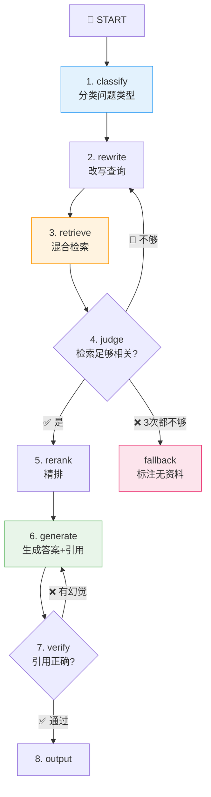

# P6: LangGraph 企业级 RAG（Day 61-64，4天）

> 🎯 **核心价值**：构建可观测、可恢复、可评测的 RAG 状态机 — 从 Demo 到生产
> ⏱️ 4 天 | 📊 难度 ⭐⭐⭐⭐

---

## 📋 你将学到什么

- ✅ LangGraph StateGraph 完整实现 — 8 节点 + 条件边 + 循环
- ✅ 每个节点的真实 Prompt 模板
- ✅ Checkpoint 持久化 + 断点恢复
- ✅ SSE 事件流推送每个阶段进度
- ✅ 失败恢复演示：检索不够→重写查询→重新检索

---

## 1️⃣ 环境搭建

```bash
pip install langgraph langchain langchain-openai chromadb sentence-transformers
```

---

## 2️⃣ RAG 状态机设计



---

## 3️⃣ 完整实现

```python
from typing import TypedDict, Annotated, Literal
from langgraph.graph import StateGraph, END
from langgraph.checkpoint.memory import MemorySaver
from langchain_openai import ChatOpenAI
from langchain_core.messages import HumanMessage, SystemMessage
import json

# --- State 定义 ---
class RAGState(TypedDict):
    query: str
    rewritten_queries: list[str]
    retrieved_docs: list[dict]
    relevance_scores: list[float]
    reranked_docs: list[dict]
    generated_answer: str
    citations: list[str]
    faithfulness_score: float
    retry_count: int
    max_retries: int
    error: str

llm = ChatOpenAI(model="gpt-4o-mini", temperature=0)

# --- 节点实现 ---

def classify_query(state: RAGState) -> RAGState:
    """判断问题类型"""
    prompt = f"""分析以下问题类型，只输出一个词：
    - simple: 简单闲聊、不需要检索
    - needs_retrieval: 需要查找资料才能回答
    - multi_hop: 需要综合多篇资料
    
    问题：{state['query']}
    类型："""
    result = llm.invoke(prompt).content.strip().lower()
    state["query_type"] = result
    return state

def rewrite_query(state: RAGState) -> RAGState:
    """改写查询 — 生成 3 个检索变体"""
    prompt = f"""将以下问题改写成 3 个适合检索的关键词变体，
    用 JSON 数组返回：
    问题：{state['query']}
    ["变体1", "变体2", "变体3"]"""
    
    result = llm.invoke(prompt).content
    # 提取 JSON 数组
    import re
    match = re.search(r'\[.*\]', result, re.DOTALL)
    if match:
        state["rewritten_queries"] = json.loads(match.group())
    else:
        state["rewritten_queries"] = [state["query"]]
    return state

def retrieve(state: RAGState) -> RAGState:
    """执行混合检索"""
    all_docs = []
    for q in state["rewritten_queries"]:
        docs = hybrid_searcher.search(q, top_k=5)
        all_docs.extend(docs)
    
    # 去重
    seen = set()
    unique = []
    for d in all_docs:
        if d["content"][:100] not in seen:
            seen.add(d["content"][:100])
            unique.append(d)
    
    state["retrieved_docs"] = unique[:10]
    return state

def judge_relevance(state: RAGState) -> Literal["rerank", "rewrite", "fallback"]:
    """判断检索质量"""
    prompt = f"""对以下检索结果打分(0-1)：
    问题：{state['query']}
    检索结果：{json.dumps([d['content'][:200] for d in state['retrieved_docs']], ensure_ascii=False)}
    
    只输出一个数字（0-1）："""
    
    score = float(llm.invoke(prompt).content.strip())
    state["retry_count"] = state.get("retry_count", 0)
    
    if score > 0.5:
        return "rerank"
    elif state["retry_count"] < state["max_retries"]:
        state["retry_count"] += 1
        return "rewrite"
    else:
        return "fallback"

def rerank(state: RAGState) -> RAGState:
    """Reranker 精排"""
    from sentence_transformers import CrossEncoder
    model = CrossEncoder("BAAI/bge-reranker-v2-m3")
    
    pairs = [[state["query"], d["content"]] for d in state["retrieved_docs"]]
    scores = model.predict(pairs)
    
    ranked = sorted(
        zip(state["retrieved_docs"], scores), key=lambda x: x[1], reverse=True
    )
    state["reranked_docs"] = [d for d, s in ranked[:5]]
    return state

def generate(state: RAGState) -> RAGState:
    """生成带引用的答案"""
    context = "\n\n".join(
        f"[来源{i+1}] {d['content']}" for i, d in enumerate(state["reranked_docs"])
    )
    prompt = f"""基于以下资料回答问题，必须标注引用来源。
    如果资料中没有答案，请明确说'该问题超出资料范围'。
    
    资料：
    {context}
    
    问题：{state['query']}
    回答："""
    
    state["generated_answer"] = llm.invoke(prompt).content
    state["citations"] = [d.get("source", f"来源{i+1}") for i, d in enumerate(state["reranked_docs"])]
    return state

def verify_citations(state: RAGState) -> Literal["output", "generate"]:
    """验证引用是否忠实"""
    prompt = f"""检查以下回答中的引用是否忠实于原文。输出 0-1 的分数：
    
    回答：{state['generated_answer']}
    原文：{json.dumps([d['content'][:300] for d in state['reranked_docs']], ensure_ascii=False)}
    
    分数："""
    score = float(llm.invoke(prompt).content.strip())
    state["faithfulness_score"] = score
    
    if score > 0.7:
        return "output"
    elif state.get("retry_count", 0) < state["max_retries"]:
        state["retry_count"] = state.get("retry_count", 0) + 1
        return "generate"
    return "output"  # 降级输出

def fallback(state: RAGState) -> RAGState:
    """检索失败时的兜底"""
    state["generated_answer"] = (
        "⚠️ 注意：以下回答基于模型自身知识，知识库中未找到相关文档。\n\n"
        + llm.invoke(f"回答（但标注基于自身知识）：{state['query']}").content
    )
    return state

# --- 组装 Graph ---
builder = StateGraph(RAGState)

builder.add_node("classify", classify_query)
builder.add_node("rewrite", rewrite_query)
builder.add_node("retrieve", retrieve)
builder.add_node("rerank", rerank)
builder.add_node("generate", generate)
builder.add_node("fallback", fallback)

builder.set_entry_point("classify")
builder.add_edge("classify", "rewrite")
builder.add_edge("rewrite", "retrieve")
builder.add_conditional_edges("retrieve", judge_relevance, {
    "rerank": "rerank", "rewrite": "rewrite", "fallback": "fallback",
})
builder.add_edge("rerank", "generate")
builder.add_conditional_edges("generate", verify_citations, {
    "output": END, "generate": "generate",
})
builder.add_edge("fallback", END)

# 编译（带 Checkpoint）
graph = builder.compile(checkpointer=MemorySaver())
```

---

## 4️⃣ SSE 事件流 + Checkpoint 恢复

```python
import asyncio

async def run_rag_with_sse(query: str, thread_id: str = "session-001"):
    """SSE 事件流 + Checkpoint 恢复"""
    config = {"configurable": {"thread_id": thread_id}}
    
    async for event in graph.astream_events(
        {"query": query, "max_retries": 3, "retry_count": 0},
        config=config,
        version="v2",
    ):
        kind = event["event"]
        if kind == "on_chain_start":
            print(f"🔵 [阶段开始] {event['name']}")
        elif kind == "on_chain_end":
            print(f"🟢 [阶段完成] {event['name']}")
        elif kind == "on_chat_model_stream":
            token = event["data"]["chunk"].content
            if token: print(token, end="")

# 恢复中断的执行
# graph.get_state(config)  # 查看当前状态
# graph.invoke(None, config)  # 从断点继续
```

---

## 🚨 翻车现场

| 现象 | 原因 | 解决 |
|:-----|:-----|:-----|
| Graph 节点无限循环 | 条件路由逻辑有 bug | `max_retries` 硬上限 |
| Checkpoint 不生效 | 忘传 `configurable` | 每次 invoke/stream 都传 config |
| 检索永远不够好 | relevance judge 太严格 | 降低阈值 0.5→0.3 |
| SSE 事件顺序乱 | astream_events v1 vs v2 差异 | 用 `version="v2"` |

---

## ✅ 产出物 Checklist

- [ ] `langgraph_rag_app/` 完整可运行
- [ ] 至少跑通一次"检索不够→改写→重新检索"的循环
- [ ] Checkpoint 恢复演示（模拟中途断开）
- [ ] SSE 事件流日志示例
