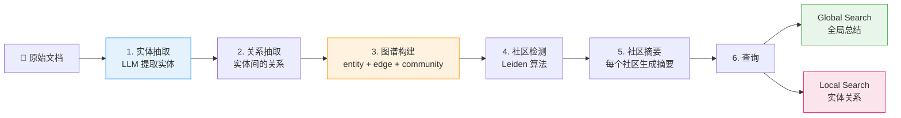

# P8: GraphRAG 知识图谱检索（Day 68-71，4天）

> 🎯 **核心价值**：突破传统 RAG 局限，处理全局/多跳/实体关系问题
> ⏱️ 4 天 | 📊 难度 ⭐⭐⭐

---

## 📋 你将学到什么

- ✅ GraphRAG 核心流程：实体抽取→关系抽取→图谱构建→社区检测→社区摘要
- ✅ Global Search：回答全局性/总结性问题（"这个数据集主要讲什么？"）
- ✅ Local Search：回答实体关系/多跳问题（"A 和 B 之间有什么联系？"）
- ✅ GraphRAG vs Vector RAG：各自适用场景 + 混合使用策略

---

## 1️⃣ 环境搭建

```bash
pip install graphrag未来版本  # 官方包名可能变化
# 或从源码安装
git clone https://github.com/microsoft/graphrag.git
cd graphrag
pip install -e .
```

---

## 2️⃣ GraphRAG 核心流程



---

## 3️⃣ GraphRAG 快速上手

```bash
# 1. 初始化项目
python -m graphrag.index --init --root ./ragtest

# 2. 把文档放到 ./ragtest/input/ 目录
cp your_documents/*.txt ./ragtest/input/

# 3. 配置 settings.yaml（设置 LLM API Key + 模型）
# settings.yaml:
#   llm:
#     model: gpt-4o-mini
#     api_key: ${OPENAI_API_KEY}

# 4. 构建索引（实体抽取→关系→图谱→社区摘要）
python -m graphrag.index --root ./ragtest

# 5. 查询
# Global Search — 回答全局问题
python -m graphrag.query --root ./ragtest --method global \
  --query "这个数据集的核心主题是什么？"

# Local Search — 回答实体关系
python -m graphrag.query --root ./ragtest --method local \
  --query "Transformer 和 Attention 之间有什么关系？"
```

---

## 4️⃣ 理解 GraphRAG 的数据产物

```python
# 索引后 ./ragtest/output/ 目录下的核心文件
outputs = {
    "entities.parquet":    "抽取的实体列表（名称/类型/描述）",
    "relationships.parquet": "实体间的关系（source/target/description）",
    "communities.parquet":   "社区分组（Leiden 算法结果）",
    "community_reports.parquet": "每个社区的 LLM 生成摘要",
    "text_units.parquet":   "原始文本单元",
    "documents.parquet":    "文档级信息",
}

import pandas as pd
entities = pd.read_parquet("./ragtest/output/entities.parquet")
print(f"抽取了 {len(entities)} 个实体")
print(entities[["name", "type", "description"]].head())

relationships = pd.read_parquet("./ragtest/output/relationships.parquet")
print(f"\n抽取了 {len(relationships)} 个关系")
print(relationships[["source", "target", "description"]].head())
```

---

## 5️⃣ GraphRAG vs Vector RAG 对比

```python
# 实验：同一组文档，两种检索方式对比

test_queries = [
    # 适合 Vector RAG 的
    {"query": "Transformer 的核心公式是什么？", "type": "factual"},
    {"query": "LoRA 的 rank 参数如何选择？", "type": "factual"},
    # 适合 GraphRAG 的
    {"query": "这个仓库整体涉及哪些技术主题？", "type": "global"},
    {"query": "Attention 和 KV Cache 和 PagedAttention 之间有什么关联？", "type": "multi_hop"},
    {"query": "项目的技术栈演进脉络是怎样的？", "type": "summary"},
]

# 对每个问题，分别用 Vector RAG 和 GraphRAG 查询
for q in test_queries:
    vec_answer = vector_rag.query(q["query"])
    graph_answer = graphrag_query(q["query"], method="local" if q["type"] == "multi_hop" else "global")
    print(f"\n{'='*60}")
    print(f"📝 {q['query'][:50]}... ({q['type']})")
    print(f"🔵 Vector RAG: {vec_answer[:200]}")
    print(f"🟢 GraphRAG:  {graph_answer[:200]}")
```

| 问题类型 | Vector RAG | GraphRAG | 推荐 |
|:--------|:---------|:--------|:--:|
| 事实问答（"什么是 X？"） | ✅ 精确 | ⚠️ 可能太泛 | Vector |
| 全局总结（"主要讲什么？"） | ❌ 片面 | ✅ 社区摘要覆盖全面 | GraphRAG |
| 多跳推理（"A 和 B 的关系？"） | ❌ 难以跨文档 | ✅ 图谱路径 | GraphRAG |
| 实体关系查询 | ⚠️ 靠关键词 | ✅ 图谱遍历 | GraphRAG |

---

## 6️⃣ GraphRAG 的成本与限制

```python
# 索引成本估算（用 GPT-4o-mini，1000 个文档块）
cost_estimate = {
    "实体抽取": "$0.50 (每块一次 LLM 调用)",
    "关系抽取": "$0.30 (实体对一次 LLM 调用)",
    "社区摘要": "$0.20 (每个社区一次 LLM 调用)",
    "总计": "~$1.00/1000 chunks",
}
print(json.dumps(cost_estimate, indent=2, ensure_ascii=False))
```

| 限制 | 说明 | 应对 |
|:-----|:-----|:-----|
| 💰 索引成本高 | 每 chunk 多次 LLM 调用 | 先用便宜模型（deepseek）做抽取 |
| ⏱️ 索引速度慢 | 实体+关系抽取是串行的 | 控制文档量，分批处理 |
| 🔄 更新困难 | 新增文档需重新构建图谱 | 增量索引（社区版暂不支持） |
| 📉 小数据集无力 | <100 个文档时社区检测无意义 | 小数据用 Vector RAG |

---

## 🚨 翻车现场

| 现象 | 原因 | 解决 |
|:-----|:-----|:-----|
| GraphRAG 索引用光 Token | 文档太大、chunk 太多 | 先选小数据集（<50 个文档） |
| Global Search 答案太泛 | 社区摘要不够细 | 调 settings.yaml 的 `max_cluster_size` |
| 抽取的实体全是错的 | LLM 用太差的模型 | 换 gpt-4o-mini，不要用更小的 |

---

## ✅ 产出物 Checklist

- [ ] 用 GraphRAG 构建至少一个索引（50+ 文档）
- [ ] Global Search + Local Search 各跑 3 个查询
- [ ] 同一组文档，Vector RAG vs GraphRAG 对比报告
- [ ] 记录索引时间 + Token 消耗 + 成本
