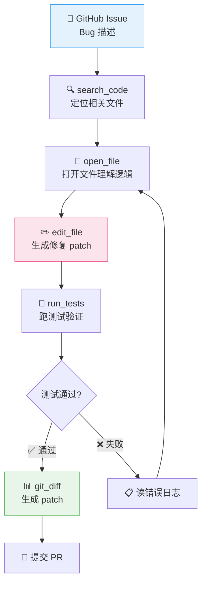

# P9: SWE-agent 代码修复 Agent（Day 72-75，4天）

> 🎯 **核心价值**：理解最接近生产力的 Agent 形态 — 自动读 Issue→搜代码→修改→测试→提交
> ⏱️ 4 天 | 📊 难度 ⭐⭐⭐

---

## 📋 你将学到什么

- ✅ SWE-agent 核心循环：读 Issue→搜代码→打开文件→修改→测试→反馈→重试
- ✅ 代码工具设计：search_code / open_file / edit_file / run_tests / git_diff
- ✅ mini-swe-agent 源码阅读（轻量实现，适合学习）
- ✅ 评估：resolve rate / patch minimality / regression test

---

## 1️⃣ 环境搭建

```bash
# SWE-agent 需要 Docker（代码沙箱）
pip install sweagent
# 或从源码安装学习版
git clone https://github.com/princeton-nlp/SWE-agent.git
cd SWE-agent
pip install -e .
```

### mini-swe-agent（轻量学习版）

```bash
# 一个简化的 SWE-agent，只有核心循环，适合阅读源码
git clone https://github.com/castorini/mini-swe-agent.git
cd mini-swe-agent
pip install -e .
```

---

## 2️⃣ SWE-agent 核心循环



---

## 3️⃣ mini-swe-agent 核心代码解读

```python
# mini-swe-agent 的核心 Agent 循环（简化）

from dataclasses import dataclass
from typing import Callable

@dataclass
class SWEAgentState:
    issue: str              # GitHub Issue 描述
    working_dir: str        # 代码仓库路径
    current_file: str = ""  # 当前打开的文件
    patch: str = ""         # 生成的 diff
    test_output: str = ""   # 最新测试输出
    iterations: int = 0
    max_iterations: int = 15

class MiniSWEAgent:
    def __init__(self, llm, tools: dict[str, Callable]):
        self.llm = llm
        self.tools = tools        # 内置工具集
        self.tool_names = list(tools.keys())
    
    def run(self, issue: str, repo_path: str) -> str:
        state = SWEAgentState(issue=issue, working_dir=repo_path)
        
        system_prompt = f"""你是一个代码修复 Agent。你的任务是根据 Issue 描述修复 bug。

工作目录：{repo_path}

可用工具：
- search_code(query) — 搜索代码
- open_file(path) — 打开文件查看内容
- edit_file(path, old, new) — 修改文件
- run_tests() — 运行测试
- git_diff() — 查看修改 diff

流程：
1. 先用 search_code 定位相关文件
2. 用 open_file 打开文件理解逻辑
3. 用 edit_file 做最小修改
4. 用 run_tests 验证
5. 如果测试失败，读错误→调整→重试
6. 测试通过后用 git_diff 输出 patch"""

        messages = [
            {"role": "system", "content": system_prompt},
            {"role": "user", "content": f"Issue:\n{issue}"},
        ]
        
        while state.iterations < state.max_iterations:
            response = self.llm.invoke(messages)
            action = self._parse_action(response)
            
            if action["type"] == "final_answer":
                state.patch = action["content"]
                return state.patch
            
            elif action["type"] == "tool_call":
                tool_name = action["tool"]
                tool_args = action["args"]
                
                if tool_name in self.tools:
                    result = self.tools[tool_name](state, **tool_args)
                else:
                    result = f"未知工具: {tool_name}。可用: {self.tool_names}"
                
                # 把执行结果追加到对话
                messages.append({"role": "assistant", "content": response})
                messages.append({"role": "user", "content": f"工具结果:\n{result}"})
            
            state.iterations += 1
        
        return "达到最大迭代次数，修复失败"
    
    def _parse_action(self, response: str) -> dict:
        """解析 Agent 的输出，提取动作"""
        import re
        
        # 匹配 <tool>name</tool><args>{...}</args>
        tool_match = re.search(
            r'<tool>(.*?)</tool>\s*<args>(.*?)</args>', 
            response, re.DOTALL
        )
        if tool_match:
            return {
                "type": "tool_call",
                "tool": tool_match.group(1).strip(),
                "args": json.loads(tool_match.group(2).strip()),
            }
        
        # 匹配 <final_answer>...</final_answer>
        final_match = re.search(
            r'<final_answer>(.*?)</final_answer>', 
            response, re.DOTALL
        )
        if final_match:
            return {"type": "final_answer", "content": final_match.group(1).strip()}
        
        return {"type": "unknown", "content": response}
```

---

## 4️⃣ 工具函数实现

```python
import subprocess, os

def search_code(state: SWEAgentState, query: str) -> str:
    """用 grep 搜索代码"""
    result = subprocess.run(
        ["grep", "-rn", "--include=*.py", query, state.working_dir],
        capture_output=True, text=True, timeout=10,
    )
    output = result.stdout[:3000]
    return output if output else f"未找到 '{query}' 的匹配项"

def open_file(state: SWEAgentState, path: str) -> str:
    """打开文件查看内容"""
    full_path = os.path.join(state.working_dir, path)
    if not os.path.exists(full_path):
        return f"文件不存在: {path}"
    
    with open(full_path, "r") as f:
        lines = f.readlines()
    
    # 返回带行号的内容
    state.current_file = path
    return "\n".join(f"{i+1:4d}| {line.rstrip()}" for i, line in enumerate(lines))

def edit_file(state: SWEAgentState, old_text: str, new_text: str) -> str:
    """修改文件：查找 old_text 替换为 new_text"""
    if not state.current_file:
        return "错误：没有打开的文件。请先 open_file"
    
    full_path = os.path.join(state.working_dir, state.current_file)
    with open(full_path, "r") as f:
        content = f.read()
    
    if old_text not in content:
        return f"错误：找不到要替换的文本。请检查 old_text 是否精确匹配。"
    
    new_content = content.replace(old_text, new_text, 1)
    with open(full_path, "w") as f:
        f.write(new_content)
    
    return f"✅ 已修改 {state.current_file}"

def run_tests(state: SWEAgentState) -> str:
    """运行 pytest"""
    result = subprocess.run(
        ["pytest", state.working_dir, "-x", "--tb=short"],
        capture_output=True, text=True, timeout=60,
    )
    state.test_output = result.stdout + result.stderr
    return state.test_output[:3000]

def git_diff(state: SWEAgentState) -> str:
    """查看当前 diff"""
    result = subprocess.run(
        ["git", "-C", state.working_dir, "diff"],
        capture_output=True, text=True, timeout=10,
    )
    state.patch = result.stdout
    return state.patch if state.patch else "没有修改"

# 工具注册
tools = {
    "search_code": search_code,
    "open_file": open_file,
    "edit_file": edit_file,
    "run_tests": run_tests,
    "git_diff": git_diff,
}
```

---

## 5️⃣ 评估指标

```python
def evaluate_patch(original_code: str, patched_code: str, issue_desc: str) -> dict:
    """评估一个 patch 的质量"""
    return {
        "resolve_rate": check_if_fixes_issue(patched_code, issue_desc),
        "patch_size": len(patched_code.split("\n")),
        "minimality": 1.0 if len(patched_code.split("\n")) < 20 else 0.5,
        "regression": run_regression_tests(patched_code),
        "lint_pass": check_lint(patched_code),
    }
```

---

## 🚨 翻车现场

| 现象 | 原因 | 解决 |
|:-----|:-----|:-----|
| Agent 修改不了文件 | edit_file 的 old_text 不精确匹配 | 先 open_file 确认精确文本 |
| 测试永远失败 | Agent 没有读错误日志 | 在 run_tests 后强制 read_output |
| 修改越来越大 | Agent 不断追加而非替换 | 限制 max_iterations=15 |
| search_code 找不到 | grep 搜索太简单 | 用多种关键词组合搜索 |

---

## ✅ 产出物 Checklist

- [ ] 搭建 mini-swe-agent 环境并跑通
- [ ] 至少手动模拟一次"Issue→搜索→修改→测试→diff"完整流程
- [ ] 成功修复 1 个已知 bug 的完整 trace 日志
- [ ] 失败案例分析：为什么某些 bug 修不了？
- [ ] 输出 SWE-agent 学习心得：核心循环/工具设计/评估方法
