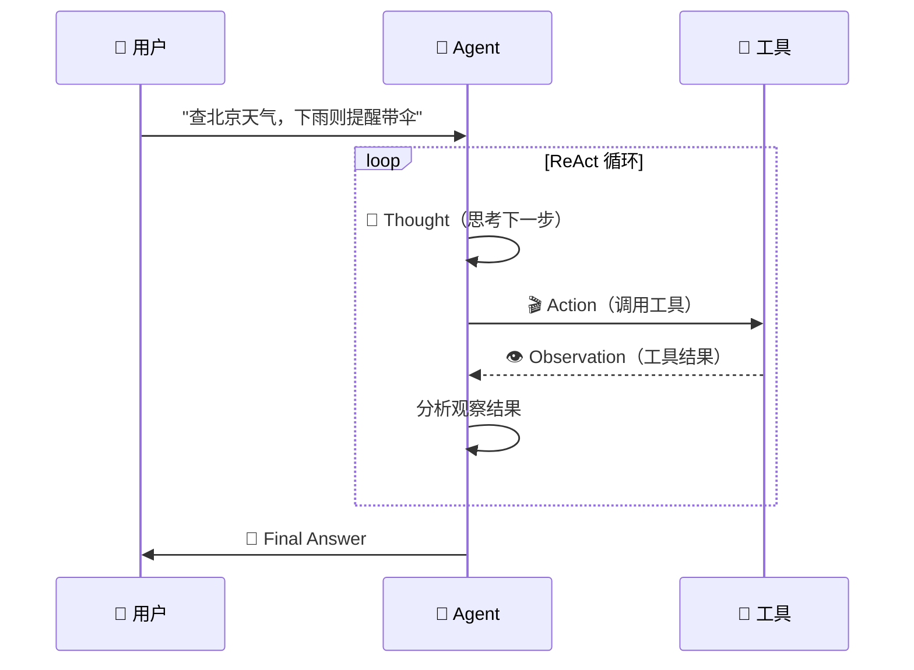

# 🤔 01 — ReAct Agent：思考-行动-观察循环

> 🎯 **目标**：实现完整的 ReAct Agent，3 个真实工具，能跑通查天气/读文件/多步推理。
> ⏱️ 预计时间：2 天

---

## 📋 ReAct 原理

```
传统 CoT: 思考 → 输出（可能幻觉，没有事实校验）
ReAct:    思考 → 行动 → 观察 → 思考 → 行动 → ... → 输出
                ↑ 调用工具    ↑ 工具返回结果
```

| 特性 | CoT | ReAct |
|------|-----|-------|
| 外部信息 | ❌ 全靠记忆 | ✅ 实时获取 |
| 事实校验 | ❌ | ✅ 观察步骤校验 |
| 错了能改 | ❌ | ✅ 观察不好可重试 |
| Token 消耗 | 低 | 高（多轮调用） |

---

## 1️⃣ ReAct 循环时序图



---

## 2️⃣ 完整 ReAct Agent 实现

```python
import re, json, asyncio, subprocess, time
from openai import OpenAI

client = OpenAI(api_key=os.getenv("OPENAI_API_KEY"))

SYSTEM_PROMPT = """你是一个 ReAct Agent。请按以下格式思考和行动：

当需要调用工具时：
<thought>你的思考过程</thought>
<action>
  <tool>工具名称</tool>
  <params>{"param1": "value1"}</params>
</action>

当任务完成时：
<thought>总结思考</thought>
<final_answer>最终答案</final_answer>

可用工具：
- search_web(query: str): 搜索网络信息，返回摘要
- read_file(path: str): 读取本地文件，返回内容
- execute_python(code: str): 执行 Python 代码，返回输出
"""

def parse_response(text: str) -> dict:
    """解析 Agent 输出：XML 优先 → 正则 fallback → JSON 兼容"""
    # XML 格式
    thought_m = re.search(r'<thought>(.*?)</thought>', text, re.DOTALL)
    action_m = re.search(r'<action>(.*?)</action>', text, re.DOTALL)
    final_m = re.search(r'<final_answer>(.*?)</final_answer>', text, re.DOTALL)

    if final_m:
        return {'type': 'final', 'thought': (thought_m.group(1).strip() if thought_m else ''), 'content': final_m.group(1).strip()}

    if action_m:
        tool_m = re.search(r'<tool>(.*?)</tool>', action_m.group(1), re.DOTALL)
        params_m = re.search(r'<params>(.*?)</params>', action_m.group(1), re.DOTALL)
        if tool_m:
            try:
                params = json.loads(params_m.group(1).strip() if params_m else '{}')
            except json.JSONDecodeError:
                params = {}
            return {'type': 'tool_call', 'thought': (thought_m.group(1).strip() if thought_m else ''), 'tool_name': tool_m.group(1).strip(), 'params': params}

    # JSON fallback
    try:
        data = json.loads(text)
        if 'final_answer' in data: return {'type': 'final', 'thought': '', 'content': data['final_answer']}
        if 'tool' in data: return {'type': 'tool_call', 'thought': '', 'tool_name': data['tool'], 'params': data.get('params', {})}
    except: pass

    return {'type': 'unknown', 'content': text}
```

---

## 3️⃣ 三个真实工具

```python
# 🔧 工具 1：网络搜索（DuckDuckGo）
import httpx
from bs4 import BeautifulSoup

async def search_web(query: str) -> str:
    """搜索网络并返回摘要"""
    async with httpx.AsyncClient(timeout=10) as c:
        resp = await c.get('https://html.duckduckgo.com/html/', params={'q': query})
        soup = BeautifulSoup(resp.text, 'html.parser')
        results = soup.select('.result__body')[:3]
        if not results:
            return f"未找到关于 '{query}' 的结果"
        return '\n'.join(f"- {r.get_text(strip=True)[:200]}" for r in results)

# 🔧 工具 2：读取本地文件
async def read_file(path: str) -> str:
    """读取文件内容"""
    try:
        with open(path, 'r', encoding='utf-8') as f:
            content = f.read()
        lines = content.count('\n') + 1
        return f"文件 {path} ({lines} 行):\n{content[:2000]}{'...(截断)' if len(content)>2000 else ''}"
    except FileNotFoundError: return f"❌ 文件不存在: {path}"
    except Exception as e: return f"❌ 读取失败: {e}"

# 🔧 工具 3：Python 代码沙箱执行
async def execute_python(code: str, timeout: int = 10) -> str:
    """安全执行 Python 代码"""
    try:
        result = subprocess.run(
            ['python3', '-c', code], capture_output=True, text=True, timeout=timeout,
        )
        output = result.stdout.strip()
        if result.stderr: output += f"\n[stderr]: {result.stderr.strip()[:500]}"
        return output if output else "(无输出)"
    except subprocess.TimeoutExpired: return f"⏰ 超时 ({timeout}s)"
    except Exception as e: return f"❌ 执行失败: {e}"

TOOLS = {
    'search_web': search_web,
    'read_file': read_file,
    'execute_python': execute_python,
}
```

---

## 4️⃣ Agent 主循环

```python
class ReactAgent:
    def __init__(self, max_iterations: int = 10):
        self.max_iterations = max_iterations
        self.history: list[dict] = []
        self.total_tokens = 0

    async def run(self, task: str) -> str:
        messages = [{"role": "system", "content": SYSTEM_PROMPT}, {"role": "user", "content": task}]

        for step in range(self.max_iterations):
            resp = client.chat.completions.create(model="gpt-4o-mini", messages=messages, temperature=0.3, max_tokens=1024)
            text = resp.choices[0].message.content
            self.total_tokens += resp.usage.total_tokens if resp.usage else 0

            parsed = parse_response(text)
            print(f"\n{'='*50}\n📍 Step {step+1}")
            print(f"💭 {parsed.get('thought', '')[:200]}")

            if parsed['type'] == 'final':
                print(f"✅ Final: {parsed['content'][:200]}")
                return parsed['content']

            elif parsed['type'] == 'tool_call':
                tool_name = parsed['tool_name']
                if tool_name not in TOOLS:
                    obs = f"未知工具: {tool_name}。可用: {list(TOOLS)}"
                else:
                    try:
                        result = await TOOLS[tool_name](**parsed['params'])
                        obs = str(result)
                    except Exception as e:
                        obs = f"工具执行错误: {e}"
                print(f"🔧 {tool_name}({parsed['params']})")
                print(f"👁️ {obs[:200]}")

                messages.append({"role": "assistant", "content": text})
                messages.append({"role": "user", "content": f"<observation>{obs}</observation>"})
            else:
                messages.append({"role": "user", "content": "请按 <thought><action> 或 <thought><final_answer> 格式回复。"})

        return "⚠️ 达到最大迭代次数，任务未完成。"

    def print_stats(self):
        print(f"📊 总 Token: {self.total_tokens} | 估算费用: ${self.total_tokens/1e6*0.15:.4f} (GPT-4o-mini)")
```

---

## 5️⃣ 三个跑通案例

```python
async def demo():
    agent = ReactAgent(max_iterations=10)

    # 案例 1：查天气
    print("\n" + "="*60)
    print("📌 案例 1: 查天气")
    await agent.run("查询北京今天的天气。如果下雨，提醒我带伞。")

    # 案例 2：读文件 + 总结
    print("\n" + "="*60)
    print("📌 案例 2: 读文件")
    await agent.run("读取 ../phase2_llm_internals/00_transformer.md，用三句话总结内容。")

    # 案例 3：多步推理
    print("\n" + "="*60)
    print("📌 案例 3: 多步推理")
    await agent.run("用 Python 计算 1 到 100 之间所有质数的和，然后解释结果。")

asyncio.run(demo())
```

---

## 6️⃣ Agent 调试与可观测性

### 死循环的 3 种原因 + 检测

| 原因 | 症状 | 检测 | 解决 |
|------|------|------|------|
| 工具结果不对 | 反复调同一工具 | 连续 3 次同 tool+同 params | 加 max_iterations=10 |
| 模型不理解格式 | 输出非 XML/JSON | 正则全 miss | 在 system prompt 最下方重申格式 |
| 任务太复杂 | 看起来在"转圈" | 无明显终止迹象 | 拆分成子任务 |

### Token 消耗统计

```python
# Agent 一次复杂任务可轻松消耗 5000-20000 token
print(f"📊 总 Token: {agent.total_tokens}")
print(f"💰 估算费用: ${agent.total_tokens / 1e6 * 0.15:.4f} (GPT-4o-mini)")
# 对比：一次简单问答通常只需 200-500 token
```

---

## 🚨 翻车现场

| 现象 | 原因 | 解决 |
|------|------|------|
| Agent 死循环 | max_iterations 太大或无终止条件 | 设 max_iterations=10 + stop_token 检测 |
| 工具输出太长撑爆上下文 | 文件太大、搜索结果太多 | 截断工具输出到 2000 字符 |
| parse 失败导致卡住 | 模型输出格式不稳定 | XML + 正则 + JSON 三保险 |
| search_web 超时 | 网络问题 | httpx timeout=10 + 返回友好错误 |

---

## ✅ 产出物 Checklist

- [ ] 实现 ReactAgent，3 个真实工具全部可调用
- [ ] 跑通 3 个案例（天气/文件/多步推理）
- [ ] 观察每次的 thought → action → observation 日志
- [ ] 统计 token 消耗，感受 Agent 的成本
