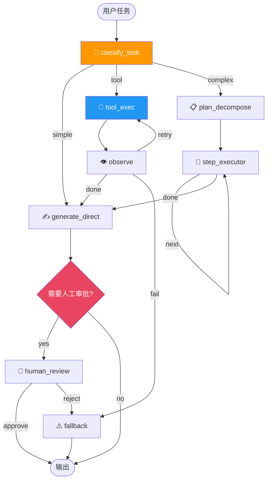

# 🔀 03 — LangGraph 多节点 Agent

> 🎯 **目标**：构建 7 节点真实实现的 Agent 状态机，含 Human-in-the-Loop、Memory、Checkpoint。
> ⏱️ 预计时间：3 天

---

## 📋 状态机全图



---

## 1️⃣ State + Agent 初始化

```python
from typing import TypedDict, Annotated
from langgraph.graph import StateGraph, END
from langgraph.checkpoint.memory import MemorySaver
from openai import OpenAI
import operator, json, asyncio, os

client = OpenAI(api_key=os.getenv("OPENAI_API_KEY"))

class AgentState(TypedDict):
    task: str
    task_type: str
    tool_calls: list[dict]
    tool_results: list[dict]
    plan: list[str]
    current_step: int
    final_answer: str
    needs_human: bool
    human_response: str
    messages: list[dict]
    iteration: int
```

---

## 2️⃣ 七个节点函数完整实现

```python
def classify_task(state: AgentState) -> AgentState:
    resp = client.chat.completions.create(model="gpt-4o-mini", temperature=0, max_tokens=20,
        messages=[{"role": "user", "content": f"判断任务类型（simple/tool/complex）：{state['task']}\n类型："}])
    state['task_type'] = resp.choices[0].message.content.strip()
    state['iteration'] = 0
    return state

def generate_direct(state: AgentState) -> AgentState:
    resp = client.chat.completions.create(model="gpt-4o-mini", temperature=0.3, max_tokens=512,
        messages=[{"role": "user", "content": state['task']}])
    state['final_answer'] = resp.choices[0].message.content
    return state

def tool_exec(state: AgentState) -> AgentState:
    """调用 02 的 ToolRegistry"""
    from tool_calling import registry
    # 让 LLM 决定调哪个工具
    resp = client.chat.completions.create(model="gpt-4o-mini", temperature=0, max_tokens=256,
        messages=[{"role": "user", "content": state['task']}],
        tools=registry.get_specs())
    msg = resp.choices[0].message
    if msg.tool_calls:
        state['tool_calls'] = [{'name': tc.function.name, 'args': json.loads(tc.function.arguments)} for tc in msg.tool_calls]
        # 同步执行（生产环境用 asyncio）
        results = []
        for tc in state['tool_calls']:
            r = asyncio.run(registry.execute(tc['name'], **tc['args']))
            results.append({'tool': tc['name'], 'result': r})
        state['tool_results'] = results
    return state

def observe(state: AgentState) -> AgentState:
    results_text = '\n'.join(f"{r['tool']}: {r['result'][:500]}" for r in state.get('tool_results', []))
    resp = client.chat.completions.create(model="gpt-4o-mini", temperature=0, max_tokens=100,
        messages=[{"role": "user", "content": f"工具执行结果如下。判断是否完成：done/retry/fail\n\n{results_text}\n\n状态："}])
    state['_obs_status'] = resp.choices[0].message.content.strip().lower()
    return state

def plan_decompose(state: AgentState) -> AgentState:
    resp = client.chat.completions.create(model="gpt-4o-mini", temperature=0.3, max_tokens=512,
        messages=[{"role": "user", "content": f"将以下任务拆分为子任务列表（每行一个）：\n{state['task']}\n\n子任务："}])
    state['plan'] = [l.strip('- ') for l in resp.choices[0].message.content.split('\n') if l.strip()]
    state['current_step'] = 0
    return state

def step_executor(state: AgentState) -> AgentState:
    if state['current_step'] < len(state['plan']):
        subtask = state['plan'][state['current_step']]
        resp = client.chat.completions.create(model="gpt-4o-mini", temperature=0.3, max_tokens=256,
            messages=[{"role": "user", "content": f"执行子任务：{subtask}\n（完整任务：{state['task']}）"}])
        state.setdefault('_step_results', []).append(resp.choices[0].message.content)
        state['current_step'] += 1
    return state

def human_review_node(state: AgentState) -> AgentState:
    """中断点：等待人工审批"""
    # LangGraph 的 interrupt_before 会在此暂停
    print(f"\n🛑 需要人工审批！\n任务: {state['task'][:200]}\n答案: {state.get('final_answer', '')[:200]}")
    print("输入 approve 或 reject:")
    state['human_response'] = input("> ").strip().lower()
    return state
```

---

## 3️⃣ Graph 组装 + Human-in-the-Loop

```python
builder = StateGraph(AgentState)

for name, fn in [('classify', classify_task), ('generate', generate_direct),
    ('tool_exec', tool_exec), ('observe', observe),
    ('plan_decompose', plan_decompose), ('step_executor', step_executor),
    ('human_review', human_review_node)]:
    builder.add_node(name, fn)

builder.set_entry_point("classify")
builder.add_conditional_edges("classify",
    lambda s: s['task_type'], {'simple': 'generate', 'tool': 'tool_exec', 'complex': 'plan_decompose'})
builder.add_edge("tool_exec", "observe")
builder.add_conditional_edges("observe",
    lambda s: s.get('_obs_status', 'done'), {'done': 'generate', 'retry': 'tool_exec', 'fail': 'generate'})
builder.add_conditional_edges("step_executor",
    lambda s: 'done' if s['current_step'] >= len(s['plan']) else 'step_executor',
    {'done': 'generate', 'step_executor': 'step_executor'})
builder.add_conditional_edges("generate",
    lambda s: 'yes' if s.get('needs_human') else 'no', {'yes': 'human_review', 'no': END})
builder.add_conditional_edges("human_review",
    lambda s: 'approve' if s['human_response'] == 'approve' else 'reject',
    {'approve': END, 'reject': 'generate'})

graph = builder.compile(checkpointer=MemorySaver(), interrupt_before=['human_review'])
```

---

## 4️⃣ Agent Memory 管理

```python
class AgentMemory:
    def __init__(self, max_short_term: int = 10):
        self.short_term: list[dict] = []  # 最近 N 轮对话
        self.long_term: list[str] = []    # 关键事实存储
        self.max = max_short_term

    def add(self, role: str, content: str):
        self.short_term.append({'role': role, 'content': content})
        if len(self.short_term) > self.max:
            # 对旧对话做摘要 → 存入 long_term
            summary = summarize(self.short_term[:5])
            self.long_term.append(summary)
            self.short_term = self.short_term[-self.max:]

    def get_context(self) -> str:
        recent = '\n'.join(f"{m['role']}: {m['content'][:200]}" for m in self.short_term[-5:])
        facts = '\n'.join(f"• {f}" for f in self.long_term[-5:])
        return f"# 关键记忆\n{facts}\n\n# 最近对话\n{recent}"

memory = AgentMemory(max_short_term=10)
```

---

## 5️⃣ Checkpoint 断点恢复演示

```python
config = {"configurable": {"thread_id": "agent-session-001"}}

# 第一次执行：卡在 human_review
try:
    result = graph.invoke({"task": "删除所有用户数据", "needs_human": True}, config)
except Exception:
    print("⏸️ 等待人工确认...进程崩溃模拟")

# 模拟进程重启 → 从 checkpoint 恢复
print("🔄 从 checkpoint 恢复...")
state = graph.get_state(config)
print(f"恢复时所在节点: {state.next}")

# 查看历史状态
for s in graph.get_state_history(config):
    print(f"  节点: {s.next}, 迭代: {s.values.get('iteration', '?')}")

# 继续执行
result = graph.invoke({"human_response": "approve"}, config)
print(f"✅ 审批通过: {result['final_answer'][:200]}")
```

---

## 🚨 翻车现场

| 现象 | 原因 | 解决 |
|------|------|------|
| 状态机卡住不继续 | conditional edge 路径没覆盖 | 确保每个 return 值都有对应边 |
| checkpoint 太大 | 存了整个 chat history | 只存必要字段 |
| HITL 暂停后忘了恢复 | langgraph 的 interrupt 机制 | 设置超时自动 reject |
| Memory 泄露 | 长期记忆无限增长 | 限制 max_long_term + TTL |

---

## ✅ 产出物 Checklist

- [ ] 7 个节点全部真实实现
- [ ] Human-in-the-Loop 中断→审批→继续跑通
- [ ] Checkpoint 断点恢复验证
- [ ] AgentMemory 短期+长期记忆工作
