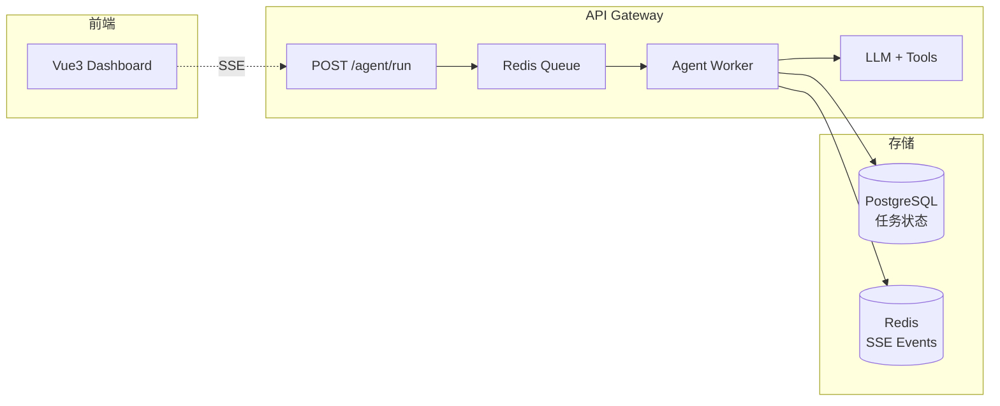

# 🚀 04 — Agent 服务化 API

> 🎯 **目标**：将 Agent 封装为生产级 API，含任务队列、持久化、SSE 实时推送、安全沙箱。
> ⏱️ 预计时间：2 天

---

## 📋 系统架构



---

## 1️⃣ FastAPI 完整项目结构

```python
# app/main.py
from fastapi import FastAPI, HTTPException
from fastapi.responses import StreamingResponse
import uuid, json, asyncio
from pydantic import BaseModel

app = FastAPI(title="🤖 Agent API", version="3.0.0")
tasks: dict[str, dict] = {}  # 生产环境用 Redis + PostgreSQL

class AgentRunRequest(BaseModel):
    task: str
    tools: list[str] = []
    max_iterations: int = 10

@app.post("/v1/agent/run")
async def submit_task(req: AgentRunRequest):
    task_id = uuid.uuid4().hex[:12]
    tasks[task_id] = {"id": task_id, "status": "pending", "task": req.task,
                       "result": None, "events": asyncio.Queue(), "created_at": time.time()}
    asyncio.create_task(_execute_agent(task_id, req))
    return {"task_id": task_id, "status": "pending"}

@app.get("/v1/agent/tasks/{task_id}")
async def get_task(task_id: str):
    t = tasks.get(task_id)
    if not t: raise HTTPException(404, "任务不存在")
    return {"task_id": t['id'], "status": t['status'], "result": t.get('result'), "error": t.get('error')}

@app.get("/v1/agent/tasks/{task_id}/events")
async def stream_events(task_id: str):
    t = tasks.get(task_id)
    if not t: raise HTTPException(404)
    async def gen():
        while True:
            event = await t['events'].get()
            yield f"data: {json.dumps(event)}\n\n"
            if event['type'] in ('task_complete', 'task_failed'): break
    return StreamingResponse(gen(), media_type="text/event-stream")
```

---

## 2️⃣ SSE 事件类型

| 事件 | 触发时机 | 前端展示 |
|------|---------|---------|
| `agent_start` | 任务开始 | "Agent 开始思考..." |
| `thought` | 每步思考 | 灰色引用块 |
| `tool_call_start` | 调用工具 | 🔧 工具名 + 参数卡片 |
| `tool_call_end` | 工具返回 | 结果折叠区 |
| `answer_token` | 流式输出 | token 逐字渲染 |
| `task_complete` | 完成 | ✅ 最终答案 |
| `task_failed` | 失败 | ❌ 错误信息 |

---

## 3️⃣ Agent 安全：沙箱 + 权限

```python
import subprocess, tempfile, os

class SafeExecutor:
    ALLOWED_PATHS = ['/tmp/agent_workspace/', './data/']

    @staticmethod
    def execute_python(code: str, timeout: int = 10) -> str:
        with tempfile.TemporaryDirectory() as tmpdir:
            os.chdir(tmpdir)
            try:
                r = subprocess.run(['python3', '-c', code], capture_output=True, text=True, timeout=timeout,
                    env={'PATH': os.environ.get('PATH', ''), 'HOME': tmpdir})
                return (r.stdout + r.stderr)[:2000]
            except subprocess.TimeoutExpired: return "⏰ 超时"

    @staticmethod
    def read_file(path: str) -> str:
        if not any(os.path.abspath(path).startswith(os.path.abspath(p)) for p in SafeExecutor.ALLOWED_PATHS):
            return "❌ 权限拒绝：不允许读取此路径"
        with open(path, 'r') as f: return f.read()[:3000]

# 工具调用白名单
ALLOWED_TOOLS = {'search_web', 'read_file', 'execute_python', 'query_database'}

def audit_log(user_id: str, tool: str, params: dict, result: str):
    print(f"[AUDIT] {time.time()} | {user_id} | {tool} | {json.dumps(params)} | {result[:100]}")
```

---

## ✅ 产出物 Checklist

- [ ] FastAPI Agent API 跑通（提交→轮询→SSE）
- [ ] 任务持久化到 PostgreSQL
- [ ] 审计日志记录每次工具调用
