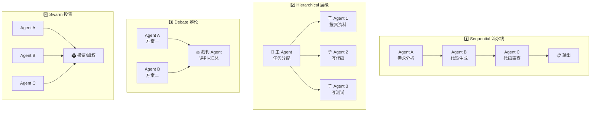

# 🤝 06 — 多 Agent 协作模式 + CrewAI 实战

> 🎯 **目标**：掌握 4 种多 Agent 模式，能用 CrewAI 搭建代码审查团队，了解 AutoGen。
> ⏱️ 预计时间：1 天

---

## 📋 四种多 Agent 模式



| 模式 | 适用场景 | Token 成本 | 典型框架 |
|:-----|:--------|:---------|:--------|
| Sequential | 流水线任务（需求→代码→审查→测试） | 中 | CrewAI, LangGraph |
| Hierarchical | 复杂任务分解（主 Agent 派活） | 高 | AutoGen, CrewAI |
| Debate | 需要多视角验证的方案评估 | 很高 | AutoGen |
| Swarm | 创意生成/多方案投票 | 最高 | AutoGen Swarm |

---

## 1️⃣ CrewAI 实战：代码审查团队

```bash
pip install crewai crewai-tools
```

```python
from crewai import Agent, Task, Crew, Process

# 如果没有 OpenAI Key，设置环境变量
# export OPENAI_API_KEY=sk-xxx

# --- 定义 4 个 Agent ---
security_agent = Agent(
    role="安全审计师",
    goal="审查代码中的安全漏洞：SQL 注入、XSS、密钥泄露、路径遍历",
    backstory="你是一位有 10 年经验的安全专家，曾在多家互联网公司负责代码安全审计。",
    allow_delegation=False,
    verbose=True,
)

style_agent = Agent(
    role="代码风格检查",
    goal="审查命名规范、函数长度、注释质量、代码结构",
    backstory="你是 Python 代码规范的制定者，对 PEP 8 了如指掌。",
    allow_delegation=False,
    verbose=True,
)

perf_agent = Agent(
    role="性能分析师",
    goal="发现性能瓶颈：O(n²) 循环、冗余 I/O、内存泄漏风险",
    backstory="你擅长算法复杂度分析和性能优化，曾经将一个 API 的响应时间从 3s 降到 200ms。",
    allow_delegation=False,
    verbose=True,
)

chief_agent = Agent(
    role="首席架构师",
    goal="汇总三个审查结果，给出一份结构化的代码审查报告",
    backstory="你是 15 年经验的架构师，看代码一眼就能判断质量。你的报告以客观、专业、可操作为标准。",
    allow_delegation=True,
    verbose=True,
)

# --- 定义任务 ---
task_security = Task(
    description="""
    审查以下代码的安全性，重点关注：
    1. SQL 注入风险
    2. 密钥/Access Token 是否硬编码
    3. 文件路径是否做了校验
    4. 用户输入是否做了过滤
    
    请列出所有发现的问题，按严重程度排序。
    """,
    expected_output="安全审查报告：按严重程度列出所有安全问题 + 修复建议",
    agent=security_agent,
)

task_style = Task(
    description="""
    审查代码风格，按 PEP 8 标准：
    1. 变量/函数/类命名是否规范
    2. 函数是否过长（>50 行需标注）
    3. 是否有必要的 docstring
    """,
    expected_output="代码风格审查报告",
    agent=style_agent,
)

task_perf = Task(
    description="""
    审查性能问题：
    1. 是否有 O(n²) 或更差的循环
    2. 是否有不必要的 I/O 操作
    3. 异常处理是否影响性能
    """,
    expected_output="性能分析报告",
    agent=perf_agent,
)

task_summary = Task(
    description="""
    汇总安全、风格、性能三份报告，输出最终 Code Review Report：
    
    格式：
    ## 🔴 严重问题（必须修复）
    ## 🟡 建议改进
    ## 🟢 做得好的地方
    ## 📊 总评分 (1-10)
    """,
    expected_output="格式化的最终代码审查报告",
    agent=chief_agent,
)

# --- 组装 Crew ---
crew = Crew(
    agents=[security_agent, style_agent, perf_agent, chief_agent],
    tasks=[task_security, task_style, task_perf, task_summary],
    process=Process.sequential,  # 顺序执行
    verbose=True,
)

# 读代码 + 运行
code = open("target_code.py").read()
result = crew.kickoff(inputs={"code": code})
print(result)
```

---

## 2️⃣ AutoGen（微软）简介

```bash
pip install pyautogen
```

```python
from autogen import AssistantAgent, UserProxyAgent, GroupChat, GroupChatManager

# 定义 Agent
planner = AssistantAgent("planner", llm_config={"config_list": [{"model": "gpt-4o"}]})
coder = AssistantAgent("coder", llm_config={"config_list": [{"model": "gpt-4o"}]})
reviewer = AssistantAgent("reviewer", llm_config={"config_list": [{"model": "gpt-4o"}]})
user_proxy = UserProxyAgent("user_proxy", code_execution_config={"work_dir": "coding"})

# 群聊模式
groupchat = GroupChat(
    agents=[user_proxy, planner, coder, reviewer],
    messages=[],
    max_round=12,
)
manager = GroupChatManager(groupchat=groupchat, llm_config={"config_list": [{"model": "gpt-4o"}]})

# 启动
user_proxy.initiate_chat(manager, message="写一个 Flask API，返回当前时间")
```

### CrewAI vs AutoGen

| 维度 | CrewAI | AutoGen |
|:-----|:------|:------|
| 学习曲线 | ⭐⭐ 简单 | ⭐⭐⭐⭐ 复杂 |
| 多 Agent 模式 | Sequential + Hierarchical | 全部 4 种 |
| 代码执行 | ❌ 不支持 | ✅ 内置 Docker 执行 |
| 社区生态 | 较小，快速成长 | 微软背书，企业级 |
| 适合 | 快速搭建多 Agent Demo | 企业级复杂 Agent 系统 |

---

## 3️⃣ 多 Agent 的性能陷阱

| 问题 | 现象 | 解决方案 |
|:-----|:-----|:--------|
| 💰 **Token 指数增长** | 3 Agent × 5 轮 = 数万 token | 设 `max_tokens` per agent + 总预算 |
| 🔄 **结论矛盾** | Agent A 说对，Agent B 说错 | 设裁判 Agent + 投票机制 |
| ♻️ **循环依赖** | Agent A 等 B，B 等 A | 设 `max_rounds=10` 硬上限 |
| ⏱️ **延迟叠加** | Sequential 模式总延迟 = 各 Agent 延迟之和 | 无依赖步骤并行执行 |

---

## ✅ 产出物 Checklist

- [ ] 跑通 CrewAI 代码审查 Demo（4 Agent 协作）
- [ ] 理解 4 种多 Agent 模式的适用场景和代价
- [ ] 了解 AutoGen 的存在，知道它和 CrewAI 的区别
- [ ] 输出多 Agent 对比笔记
