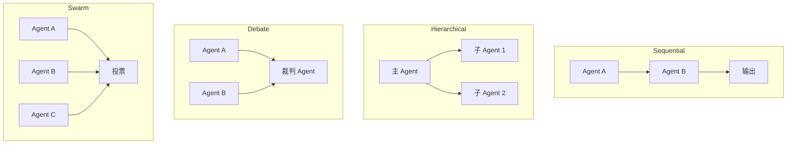

# 🤝 06 — 多 Agent 协作模式 + CrewAI 实战

> 🎯 **目标**：掌握 4 种多 Agent 模式，能用 CrewAI 搭建代码审查团队。
> ⏱️ 预计时间：1 天

---

## 📋 四种多 Agent 模式



| 模式 | 适用 | Token 成本 |
|------|------|-----------|
| Sequential | 流水线任务（写→审→改） | 中 |
| Hierarchical | 复杂任务分解 | 高 |
| Debate | 需要多视角验证 | 很高 |
| Swarm | 创意生成/多方案评估 | 最高 |

---

## CrewAI 实战：代码审查团队

```python
from crewai import Agent, Task, Crew, Process

# 定义 4 个 Agent
security_agent = Agent(role="安全审计师", goal="审查代码安全问题", backstory="10年安全经验", allow_delegation=False)
style_agent = Agent(role="代码风格检查", goal="审查命名规范和代码结构", backstory="Python 代码规范专家", allow_delegation=False)
perf_agent = Agent(role="性能分析师", goal="发现性能瓶颈", backstory="算法优化专家", allow_delegation=False)
chief_agent = Agent(role="首席架构师", goal="汇总审查意见+生成报告", backstory="15年架构经验", allow_delegation=True)

# 定义任务
tasks = [
    Task(description="审查代码安全性：SQL注入/XSS/密钥泄露", agent=security_agent),
    Task(description="审查代码风格：命名/注释/函数长度", agent=style_agent),
    Task(description="审查性能：算法复杂度/冗余循环", agent=perf_agent),
    Task(description="汇总三个审查结果，生成代码审查报告", agent=chief_agent),
]

crew = Crew(agents=[security_agent, style_agent, perf_agent, chief_agent], tasks=tasks, process=Process.sequential)
result = crew.kickoff(inputs={"code": open("app.py").read()})
print(result)
```

---

## 多 Agent 挑战

| 问题 | 解决 |
|------|------|
| Token 指数增长 | 限制每 Agent 的 max_tokens + 总步数 |
| Agent 结论矛盾 | 设裁判 Agent + 投票机制 |
| 循环依赖 | 设 max_rounds 硬上限 |

---

## ✅ 产出物 Checklist

- [ ] 跑通 CrewAI 代码审查 Demo
- [ ] 理解 4 种多 Agent 模式的适用场景
